# Global Use Case Diagram
## Phân quyền Actor tương tác với hệ thống OmniMer

Biểu đồ này thể hiện cái nhìn tổng quan về cách các nhóm người dùng (Actors) tương tác với 3 Phase tính năng cốt lõi của OmniMer.

```mermaid
graph TD
    %% Định nghĩa Actors
    ADMIN([Workspace Admin / HR])
    PM([Project Manager / Lead])
    TM([Team Member / Dev])
    EXEC([Executive / Sponsor])
    AI([OPAgent - AI Bot])
    CLIENT([Client / Customer])

    %% Phase 1
    subgraph Phase1["Phase 1: OmniProject & OmniChannel"]
        UC1["Cấu hình Board (Kanban/Scrum)"]
        UC2["Tương tác Unified Inbox (Zalo/Tele)"]
        UC3["1-Click tạo Task từ Chat"]
        UC4["Bóc tách NLP Text-to-Task"]
        UC5["Cập nhật Task (Status, Time)"]
    end

    %% Phase 2
    subgraph Phase2["Phase 2: Control & Analytics"]
        UC6["Tính điểm KPI Tự động"]
        UC7["Xem EVM / Burn-rate"]
        UC8["Xem RAG Risk Heatmap"]
        UC9["Đồng bộ HRM/Payroll"]
        UC10["Cảnh báo Quá tải / Bus Factor"]
    end

    %% Phase 3
    subgraph Phase3["Phase 3: Governance & Traceability"]
        UC11["Tạo Traceability Links"]
        UC12["Kiểm duyệt Handover Gates"]
        UC13["Phê duyệt Change Request (CCB)"]
    end

    %% Mapping Actors to Use Cases
    PM --> UC1
    PM --> UC3
    PM --> UC11
    PM --> UC12

    TM --> UC2
    TM --> UC5

    CLIENT --> UC2

    AI --> UC4
    AI --> UC10

    ADMIN --> UC6
    ADMIN --> UC9

    EXEC --> UC7
    EXEC --> UC8
    EXEC --> UC13
```

