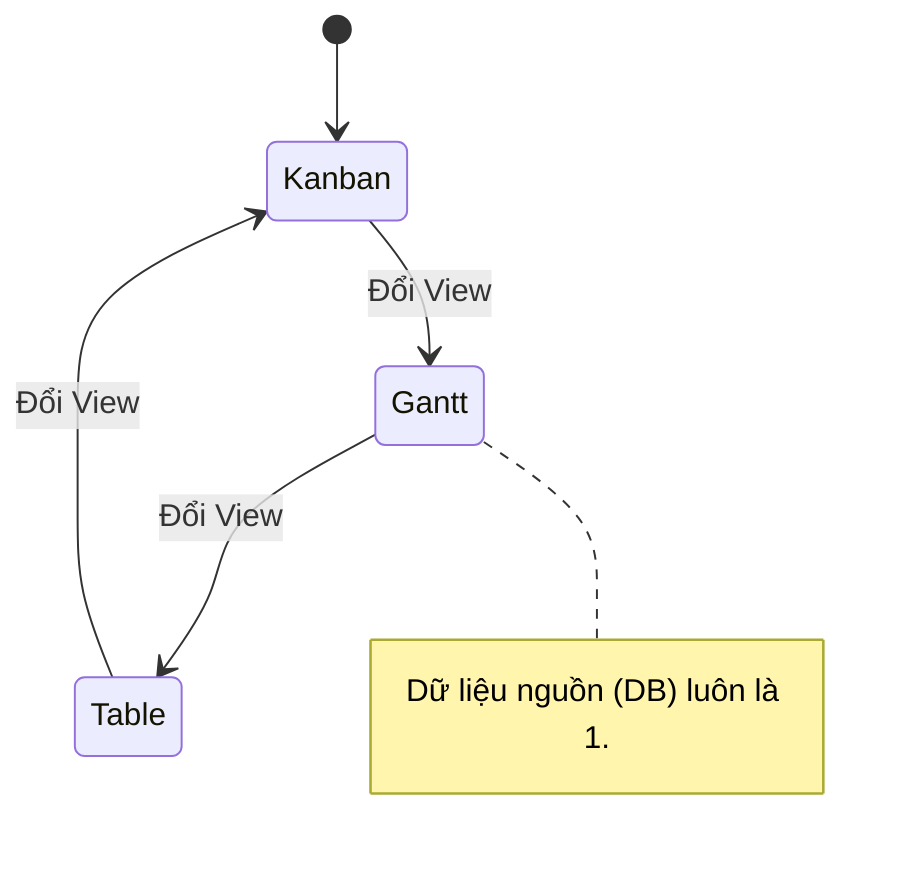
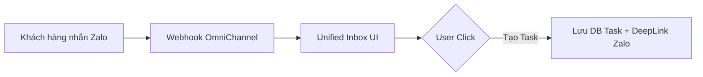
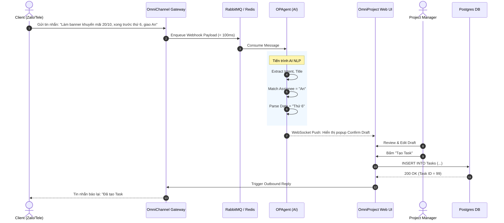

# Phase 1: OmniProject & OmniChannel


---

## Phần 1: FRD - OmniProject Core


**Mục tiêu:** Đặc tả kỹ thuật cho nhóm tính năng cốt lõi về quản lý dự án linh hoạt, hỗ trợ đa góc nhìn và lập lịch mạng lưới.

---

## 1. Feature: Multi-View Engine (FR-PRJ-001)

**Mô tả:** Hệ thống hỗ trợ xem một tập hợp các Task dưới 4 dạng (Kanban, Scrum, Gantt, Table) trên cùng một nguồn dữ liệu thật (Single Source of Truth).
**Priority:** P0 (Must-Have)

### 1.1 Data Contract (JSON Schema Example)

```jsonc
{
  "task_id": "uuid",
  "title": "string",
  "status_id": "uuid",
  "start_date": "ISO8601",
  "end_date": "ISO8601",
  "parent_id": "uuid | null",
  "assignee_id": "uuid"
}
```

### 1.2 Business Logic & Rules

* **BL-PRJ-001.1 (View Sync):** Thao tác cập nhật trạng thái ở Kanban (kéo thả) hoặc ngày tháng ở Gantt phải gọi API PATCH để update DB. Mọi View khác đang mở qua WebSocket phải nhận được event update để re-render ngay lập tức.
* **BL-PRJ-001.2 (Filtering):** Phải duy trì trạng thái Filter (người phụ trách, thẻ, độ ưu tiên) khi chuyển đổi giữa các View.

### 1.3 Edge Cases & Error Handling

* **EC-01:** Truy cập Gantt View nhưng Task không có `start_date` hoặc `end_date`.
  * *Xử lý:* Tự động xếp Task vào khu vực "Unscheduled Backlog" bên trái đồ thị, người dùng phải kéo thả vào Timeline để gán ngày.

---

## 2. Feature: Dynamic Workflows & WIP Limits (FR-PRJ-002)

**Mô tả:** Định nghĩa luồng trạng thái tùy chỉnh cho dự án và kiểm soát khối lượng công việc đang xử lý (Work In Progress).

### 2.1 Business Logic & Rules

* **BL-PRJ-002.1 (WIP Block):** Nếu cột "In Progress" có giới hạn WIP = 3, khi kéo Task thứ 4 vào, UI hiển thị màu Đỏ cảnh báo.
* **BL-PRJ-002.2 (Override Privilege):** Chỉ PM (Project Manager) mới có quyền xác nhận "Override WIP Limit" (Vượt rào). Nếu member kéo thả, hệ thống ném HTTP 403 Forbidden kèm message.

---

## 3. Feature: Dependency & Critical Path (FR-PRJ-003)

**Mô tả:** Liên kết các Task (Finish-to-Start) và tự động tính toán Đường găng.

### 3.1 Business Logic & Thuật toán

* **BL-PRJ-003.1 (Auto-Scheduling Ripple Effect):** Khi Task A (Tiền nhiệm) đổi `end_date` sang `T+X` ngày, mọi Task phụ thuộc trực tiếp (B, C) chưa hoàn thành đều phải cộng thêm `X` ngày vào `start_date` và `end_date`.
* **BL-PRJ-003.2 (Critical Path Algorithm CPM):** Hệ thống tính toán đường dẫn dài nhất qua mạng lưới dự án. Task thuộc đường găng là Task có khoảng thời gian dự trữ (Total Float) = 0.

### 3.2 Edge Cases & Error Handling

* **EC-02: Circular Dependency (Vòng lặp phụ thuộc).**
  * *Kịch bản:* User nối A -> B -> C -> A.
  * *Xử lý:* API ném lỗi HTTP 409 Conflict. Backend sử dụng thuật toán dò chu trình (Cycle detection) trên đồ thị có hướng (DAG) trước khi lưu DB.

---

## 4. Feature: Dynamic Custom Fields (FR-PRJ-004)

**Mô tả:** Hệ thống quản lý trường dữ liệu tùy biến cho từng Project.

### 4.1 Field Definition Schema

```jsonc
{
  "field_id": "uuid",
  "project_id": "uuid",
  "name": "Budget",
  "type": "CURRENCY",
  "validation_rules": {
    "min": 0,
    "required": true
  }
}
```

### 4.2 Business Logic & Rules

* **BL-PRJ-004.1 (Type Safety Enforcement):** Backend validate chặt chẽ `value` truyền lên dựa vào `type`. Nếu `type=CURRENCY`, `value` phải là Number; nếu sai ném lỗi HTTP 422 Unprocessable Entity.


---

## Phần 2: FRD - AI & OmniChannel

**Mục tiêu:** Đặc tả kỹ thuật cho hệ thống nhận tin nhắn đa kênh tập trung, tích hợp AI NLP để bóc tách thông tin và tự động hóa tác vụ.

---

## 1. Feature: Unified Inbox Gateway (FR-CHN-001)
**Mô tả:** Cổng tiếp nhận Webhook từ Telegram và Zalo OA, lưu vào hàng đợi và chuyển tới UI.

### 1.1 Data Contract (Inbound Webhook Payload normalization)
Hệ thống phải map JSON khác nhau từ Telegram/Zalo về một cấu trúc chuẩn chung:
```json
{
  "message_id": "string",
  "channel_type": "TELEGRAM | ZALO",
  "external_sender_id": "string",
  "sender_name": "string",
  "content": "string",
  "attachments": ["url1", "url2"],
  "received_at": "ISO8601"
}
```

### 1.2 Business Logic & Rules
*   **BL-CHN-001.1 (Message Queue):** Webhook endpoint chỉ làm nhiệm vụ parse và push vào RabbitMQ/Redis Streams, trả về `HTTP 200 OK` cho nền tảng thứ 3 trong vòng $< 100\text{ms}$ để tránh timeout.
*   **BL-CHN-001.2 (Idempotency):** Xử lý trùng lặp. Nếu Zalo gửi lại Webhook do nghẽn mạng (Retry), backend phải dựa vào `message_id` để bỏ qua, không hiển thị 2 lần trên Inbox.

---

## 2. Feature: 1-Click Message-to-Task (FR-CHN-002)
**Mô tả:** Chuyển đổi 1 tin nhắn khách hàng thành 1 thẻ Task trên OmniProject.

### 2.1 Edge Cases & Error Handling
*   **EC-01: User xóa tin nhắn gốc trên Telegram.**
    *   *Xử lý:* Task đã tạo trong hệ thống không bị xóa, nhưng deep link tham chiếu (Reference URL) có thể báo "Message deleted" khi click vào do cơ chế của Telegram.

---

## 3. Feature: OPAgent NLP Text/Voice-to-Task (FR-AGT-001)
**Mô tả:** Phân tích câu lệnh bằng LLM để tự điền dữ liệu.

### 3.1 AI Extraction Schema (Output từ LLM)
LLM (GPT-4 / Claude) phải trả về chuẩn JSON Schema sau qua Function Calling / Structured Output:
```json
{
  "task_title": "string",
  "description": "string (markdown)",
  "assignee_name_hint": "string | null",
  "deadline_iso": "ISO8601 | null",
  "extracted_subtasks": ["string", "string"]
}
```

### 3.2 Business Logic & Rules
*   **BL-AGT-001.1 (Human-in-the-Loop):** Không bao giờ INSERT trực tiếp JSON từ AI vào Table Task. Phải lưu vào một bảng tạm `draft_tasks` và push WebSocket tới User để xác nhận (Accept/Edit/Reject).
*   **BL-AGT-001.2 (Assignee Resolution):** AI chỉ trả về `assignee_name_hint` (ví dụ: "Lan"). Backend dùng thuật toán Fuzzy Search hoặc Vector DB để map "Lan" với `user_id` thật trong Project. Nếu trùng nhiều tên (Lan Anh, Ngọc Lan), hiển thị Dropdown cho PM chọn.

---

## 4. Feature: Proactive Health Monitor (FR-AGT-002)
**Mô tả:** AI tự động quét rủi ro dự án.

### 4.1 Business Logic & Thuật toán
*   **BL-AGT-002.1 (Risk Detection Rule):** Hệ thống chạy Cron Job mỗi 4 giờ quét toàn bộ Task `Status != Done`. Nếu `DueDate - CurrentDate < 48h` VÀ Task vẫn nằm ở cột đầu tiên (To Do / Backlog) $\rightarrow$ Đẩy cảnh báo qua Telegram DM cho Assignee.
*   **BL-AGT-002.2 (Standup Aggregation):** 18:00 hàng ngày, AI tóm tắt: "Hôm nay Team đã Done X tasks, Đang làm Y tasks, Bị Block Z tasks" và gửi vào Group Telegram của Project.


---

## Phần 3: User Stories & Acceptance Criteria

## Thực thi Dự án (OmniProject Core) & Trợ lý AI, Hợp nhất Giao tiếp (OPAgent & OmniChannel)

---

### 1. OmniProject: Multi-View & Workflow

#### US-PRJ-001: Multi-View Board Engine
**Là** Project Manager,
**Tôi muốn** xem cùng một dự án dưới dạng Kanban, Scrum (Sprint), Gantt, và Table,
**Để** tối ưu góc nhìn tùy thuộc vào ngữ cảnh công việc mà không làm sai lệch dữ liệu.



**Acceptance Criteria (Gherkin):**
```gherkin
Given tôi đang ở màn hình dự án "Marketing Q4"
When tôi chọn chuyển sang "Gantt View" từ thanh điều hướng
Then hệ thống phải tải đồ thị Gantt từ tập Task hiện tại trong dưới 1 giây
And nếu tôi thay đổi ngày kết thúc của Task A trên Gantt
Then khi quay lại "Kanban View", Task A cũng hiển thị ngày kết thúc mới
```

#### US-PRJ-002: Lập lịch & Đường găng (Dependency & Critical Path)
**Là** Project Manager,
**Tôi muốn** nối các task bằng liên kết Finish-to-Start trên Gantt Chart,
**Để** hệ thống tự động đẩy lùi lịch các task phía sau nếu task trước bị trễ và báo đỏ đường găng.

**Acceptance Criteria (Gherkin):**
```gherkin
Given Task B phụ thuộc vào Task A (Finish-to-Start)
When tôi kéo dài thời hạn Task A thêm 2 ngày
Then hệ thống tự động đẩy Ngày Bắt Đầu của Task B thêm 2 ngày
And các Task nằm trên đường găng (Critical Path) sẽ tự động sáng viền đỏ
```

---

### 2. OmniChannel & OPAgent: AI Workflow

#### US-CHN-001: Unified Inbox & 1-Click to Task
**Là** Team Member,
**Tôi muốn** nhận tin nhắn từ Zalo/Telegram tại Web App và chuyển thành Task với 1 click,
**Để** không sót yêu cầu khách hàng và không tốn công copy-paste.



**Acceptance Criteria (Gherkin):**
```gherkin
Given tôi đang xem tin nhắn phàn nàn của khách hàng trên kênh Zalo tại Unified Inbox
When tôi nhấn nút "Tạo Task từ tin nhắn này"
Then modal tạo Task bật lên, phần Description tự động điền nội dung tin nhắn
And sau khi lưu, task được tạo sẽ có 1 icon "Link" để click vào là nhảy về đúng đoạn chat Zalo đó
```

#### US-AGT-001: NLP Text-to-Task Extraction
**Là** Project Manager,
**Tôi muốn** gõ một câu lệnh tự nhiên (VD: "Giao Lan design banner trước thứ 6"),
**Để** OPAgent tự động tạo nháp Task với đầy đủ Assignee, Deadline, Title.

**Acceptance Criteria (Gherkin):**
```gherkin
Given tôi gõ "Giao Lan làm báo cáo SEO, deadline chiều thứ 6" vào thanh tạo task nhanh
When OPAgent (AI) xử lý xong
Then hệ thống hiện popup Confirm với các thông tin đã bóc tách:
   - Title: Làm báo cáo SEO
   - Assignee: Lan
   - Deadline: [Ngày thứ 6 tuần này lúc 17:00]
And tôi có thể chỉnh sửa lại trước khi nhấn "Tạo chính thức"
```


---

## Phần 4: Biểu đồ Trình tự (Sequence Diagram) - AI & OmniChannel

## Luồng xử lý bất đồng bộ phức tạp (Zalo/Tele -> OPAgent -> OmniProject)



