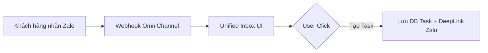

# Feature: 1-Click Message-to-Task (FR-CHN-002)

**Mô tả:** Chuyển đổi 1 tin nhắn khách hàng thành 1 thẻ Task trên OmniProject.

## 1. Đặc tả Kỹ thuật (FRD)

### 1.1 Edge Cases & Error Handling
*   **EC-01: User xóa tin nhắn gốc trên Telegram.**
    *   *Xử lý:* Task đã tạo trong hệ thống không bị xóa, nhưng deep link tham chiếu (Reference URL) có thể báo "Message deleted" khi click vào do cơ chế của Telegram.

---

## 2. Tiêu chí Chấp nhận (Acceptance Criteria)

**Là** Team Member,
**Tôi muốn** nhận tin nhắn từ Zalo/Telegram tại Web App và chuyển thành Task với 1 click,
**Để** không sót yêu cầu khách hàng và không tốn công copy-paste.



**Acceptance Criteria (Gherkin):**
```gherkin
Given tôi đang xem tin nhắn phàn nàn của khách hàng trên kênh Zalo tại Unified Inbox
When tôi nhấn nút "Tạo Task từ tin nhắn này"
Then modal tạo Task bật lên, phần Description tự động điền nội dung tin nhắn
And sau khi lưu, task được tạo sẽ có 1 icon "Link" để click vào là nhảy về đúng đoạn chat Zalo đó
```
