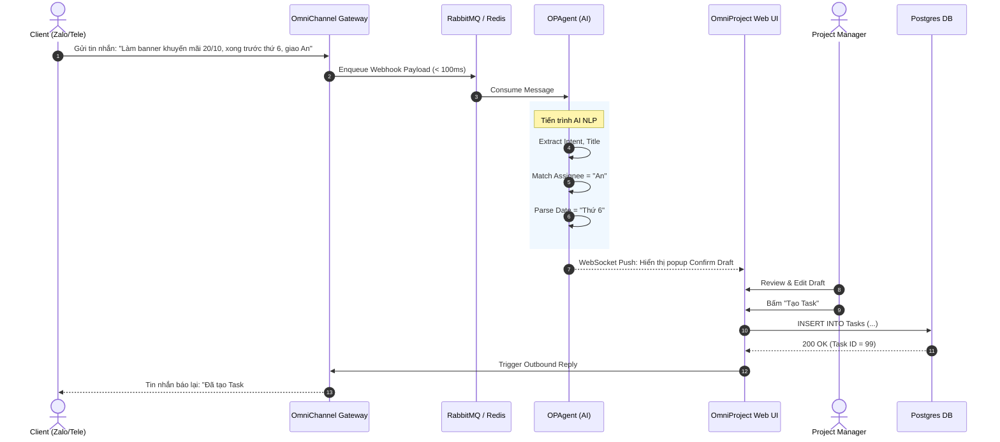

# Sequence Diagram: AI & OmniChannel (Phase 1)
## Luồng xử lý bất đồng bộ phức tạp (Zalo/Tele -> OPAgent -> OmniProject)

```mermaid
sequenceDiagram
    autonumber
    actor Client as Client (Zalo/Tele)
    participant Gateway as OmniChannel Gateway
    participant Queue as RabbitMQ / Redis
    participant Agent as OPAgent (AI)
    participant UI as OmniProject Web UI
    actor PM as Project Manager
    participant DB as Postgres DB

    Client->>Gateway: Gửi tin nhắn: "Làm banner khuyến mãi 20/10, xong trước thứ 6, giao An"
    Gateway->>Queue: Enqueue Webhook Payload (< 100ms)
    Queue->>Agent: Consume Message
    
    rect rgb(240, 248, 255)
        Note over Agent: Tiến trình AI NLP
        Agent->>Agent: Extract Intent, Title
        Agent->>Agent: Match Assignee = "An"
        Agent->>Agent: Parse Date = "Thứ 6"
    end
    
    Agent-->>UI: WebSocket Push: Hiển thị popup Confirm Draft
    PM->>UI: Review & Edit Draft
    PM->>UI: Bấm "Tạo Task"
    
    UI->>DB: INSERT INTO Tasks (...)
    DB-->>UI: 200 OK (Task ID = 99)
    
    UI->>Gateway: Trigger Outbound Reply
    Gateway-->>Client: Tin nhắn báo lại: "Đã tạo Task #99 thành công"
```
