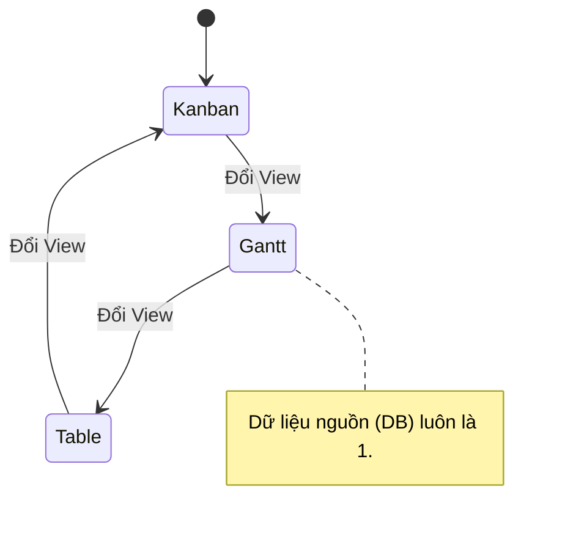

# Feature: Multi-View Engine (FR-PRJ-001)

**Mô tả:** Hệ thống hỗ trợ xem một tập hợp các Task dưới 4 dạng (Kanban, Scrum, Gantt, Table) trên cùng một nguồn dữ liệu thật (Single Source of Truth).
**Priority:** P0 (Must-Have)

## 1. Đặc tả Kỹ thuật (FRD)

### 1.1 Data Contract (JSON Schema Example)

```jsonc
{
  "task_id": "uuid",
  "title": "string",
  "status_id": "uuid",
  "start_date": "ISO8601",
  "end_date": "ISO8601",
  "due_date": "ISO8601",
  "parent_id": "uuid | null",
  "reporter_id": "uuid",
  "assignee_id": "uuid"
}
```

### 1.2 Business Logic & Rules

* **BL-PRJ-001.1 (View Sync):** Thao tác cập nhật trạng thái ở Kanban (kéo thả) hoặc ngày tháng ở Gantt phải gọi API PATCH để update DB. Mọi View khác đang mở qua WebSocket phải nhận được event update để re-render ngay lập tức.
* **BL-PRJ-001.2 (Filtering):** Phải duy trì trạng thái Filter (người phụ trách, thẻ, độ ưu tiên) khi chuyển đổi giữa các View.

### 1.3 Edge Cases & Error Handling

* **EC-01:** Truy cập Gantt View nhưng Task không có `start_date` hoặc `end_date`.
  * *Xử lý:* Tự động xếp Task vào khu vực "Unscheduled Backlog" bên trái đồ thị, người dùng phải kéo thả vào Timeline để gán ngày.

---

## 2. Tiêu chí Chấp nhận (Acceptance Criteria)

**Là** Project Manager,
**Tôi muốn** xem cùng một dự án dưới dạng Kanban, Scrum (Sprint), Gantt, và Table,
**Để** tối ưu góc nhìn tùy thuộc vào ngữ cảnh công việc mà không làm sai lệch dữ liệu.



**Acceptance Criteria (Gherkin):**
```gherkin
Given tôi đang ở màn hình dự án "Marketing Q4"
When tôi chọn chuyển sang "Gantt View" từ thanh điều hướng
Then hệ thống phải tải đồ thị Gantt từ tập Task hiện tại trong dưới 1 giây
And nếu tôi thay đổi ngày kết thúc của Task A trên Gantt
Then khi quay lại "Kanban View", Task A cũng hiển thị ngày kết thúc mới
```
