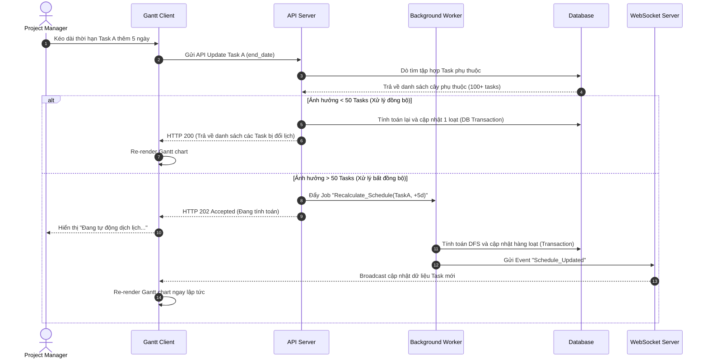

# Feature: Dependency & Critical Path (FR-PRJ-003)

**Mô tả:** Hệ thống cho phép thiết lập liên kết phụ thuộc giữa các Task (Dependencies), tự động lùi/tiến lịch (Auto-scheduling) dựa trên thời hạn của Task tiền nhiệm, và thuật toán tính toán đường găng (Critical Path).

## 1. Functional Requirements List

| FR ID | Requirement Description | Input | Output | Associated Business Rule | Priority |
|---|---|---|---|---|---|
| **FR-PRJ-003.1** | **Thiết lập Phụ thuộc (Dependencies):** Cho phép nối các Task theo 4 loại: FS (Finish-to-Start), SS (Start-to-Start), FF (Finish-to-Finish), SF (Start-to-Finish). Có thể thiết lập độ trễ (Lag days). | Kéo thả mũi tên nối trên Gantt hoặc chọn ở Task Modal | Lưu liên kết vào CSDL | BL-PRJ-003.1 | Must-have |
| **FR-PRJ-003.2** | **Chống Vòng lặp (Cycle Detection):** Ngăn chặn người dùng tạo vòng lặp phụ thuộc (A -> B -> C -> A). | Cố gắng nối vòng lặp | Báo lỗi UI, không cho tạo liên kết | EC-02 | Must-have |
| **FR-PRJ-003.3** | **Auto-Scheduling (Lan truyền):** Khi thay đổi ngày của Task tiền nhiệm, các Task hậu nhiệm liên quan tự động dịch chuyển tương ứng theo kiểu liên kết. | Thay đổi thời gian Task | Tự động thay đổi thời gian các Task liên quan | BL-PRJ-003.1, EC-03 | Must-have |
| **FR-PRJ-003.4** | **Tính toán Đường Găng (Critical Path):** Nút bật/tắt (Toggle) hiển thị đường găng trên Gantt Chart. Làm nổi bật các Task không có thời gian dự trữ (Total Float = 0). | Bật tính năng Critical Path | Làm sáng viền đỏ chuỗi Task dài nhất quyết định dự án | BL-PRJ-003.2 | Should-have |

## 2. Business Logic, Thuật toán & Edge Cases

* **BL-PRJ-003.1 (Auto-Scheduling Ripple Effect):** Khi Task A (Tiền nhiệm) đổi `end_date` sang `T+X` ngày, mọi Task phụ thuộc (B, C) chưa hoàn thành đều phải dịch chuyển ngày bắt đầu (và kết thúc) đi `X` ngày.
* **BL-PRJ-003.2 (Critical Path Algorithm CPM):** Hệ thống tính toán đường dẫn dài nhất qua mạng lưới dự án sử dụng Forward Pass (tính Earliest Start/Finish) và Backward Pass (tính Latest Start/Finish). Task thuộc đường găng có `Total Float = LS - ES = 0`.
* **EC-02 (Circular Dependency - Vòng lặp phụ thuộc):**
  * *Xử lý:* API ném lỗi HTTP 409 Conflict. Backend sử dụng thuật toán duyệt đồ thị (DFS) dò chu trình (Cycle detection) trên Directed Acyclic Graph (DAG) trước khi lưu DB.
* **EC-03 (Deep Recursion Auto-Scheduling Limit):** 
  * *Xử lý:* Tác vụ Auto-scheduling ảnh hưởng > 50 tasks phải được xử lý qua **Background Job (Celery/Redis)**. API phản hồi ngay lập tức `202 Accepted`. Khi job chạy xong, Backend push Event qua WebSocket để UI tự re-render.

## 3. Data Structure

### Entity: Task_Dependency
| Field | Data Type | Required | Constraints |
|---|---|---|---|
| `dependency_id` | UUID | Yes | Primary Key |
| `predecessor_id` | UUID | Yes | Foreign Key (Task tiền nhiệm) |
| `successor_id` | UUID | Yes | Foreign Key (Task hậu nhiệm) |
| `type` | Enum | Yes | `FS`, `SS`, `FF`, `SF` |
| `lag_days` | Integer | No | Độ trễ (VD: 2 ngày, hoặc -1 ngày) |

## 4. Sequence Diagram: Auto-Scheduling via Background Job



## 5. Tiêu chí Chấp nhận (Acceptance Criteria)

**Là** Project Manager,
**Tôi muốn** nối các task bằng liên kết Finish-to-Start trên Gantt Chart,
**Để** hệ thống tự động đẩy lùi lịch các task phía sau nếu task trước bị trễ và báo đỏ đường găng.

**Acceptance Criteria (Gherkin):**
```gherkin
Given Task B phụ thuộc vào Task A (Finish-to-Start)
When tôi kéo dài thời hạn Task A thêm 2 ngày
Then hệ thống tự động đẩy Ngày Bắt Đầu của Task B thêm 2 ngày (Auto-scheduling)
And các Task nằm trên đường găng (Critical Path) sẽ tự động sáng viền đỏ khi tôi bật tính năng xem Đường găng

Given Task B phụ thuộc vào Task A
When tôi thử nối mũi tên từ B ngược lại A
Then hệ thống báo lỗi "Phát hiện vòng lặp phụ thuộc" và từ chối hành động
```
