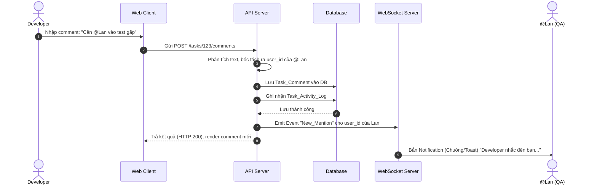

# Feature: Task Detail, Description & Collaboration (FR-PRJ-005)

**Mô tả:** Hệ thống quản lý và làm giàu nội dung chi tiết của một Task thông qua giao diện Task Modal/Drawer, bao gồm: Mô tả chi tiết (Markdown), bình luận trao đổi, đính kèm tài liệu, và lịch sử hoạt động (Activity Log).

## 1. Functional Requirements List

| FR ID | Requirement Description | Input | Output | Associated Business Rule | Priority |
|---|---|---|---|---|---|
| **FR-PRJ-005.1** | **Mô tả chi tiết (Rich Text / Markdown):** Hỗ trợ viết mô tả Task bằng định dạng Markdown (headings, lists, code blocks, bold/italic, tables). Hỗ trợ preview trực tiếp. | Nội dung Text từ Editor | Lưu trữ dạng text/markdown vào DB, render HTML trên UI | BL-PRJ-005.1 | Must-have |
| **FR-PRJ-005.2** | **Quản lý Đính kèm (Attachments):** Cho phép upload file (PDF, Image, Excel) trực tiếp vào Task. File được quản lý chung trong hệ thống Asset Governance. | File từ máy tính / Drag & Drop | Hiển thị danh sách file đính kèm với preview | BL-PRJ-005.2 | Must-have |
| **FR-PRJ-005.3** | **Bình luận & Tag (Mentions):** Hỗ trợ thảo luận đa chiều, người dùng có thể gõ `@username` để gọi tên người khác vào Task. | Nội dung comment có `@` | Sinh Notification, highlight người được tag | BL-PRJ-005.3 | Must-have |
| **FR-PRJ-005.4** | **Nhật ký hoạt động (Activity Log):** Tự động ghi lại toàn bộ lịch sử thay đổi của Task (VD: Ai đổi Status, đổi Assignee, đổi Deadline, thêm Subtask) kèm theo timestamp. | Các Event cập nhật Task | Danh sách Log hiển thị ở tab "History" trong Task | BL-PRJ-005.4 | Should-have |

## 2. Business Rules

| BR ID | Rule Description | Applies to FR |
|---|---|---|
| **BL-PRJ-005.1** | **Description Format:** Nội dung `description` bắt buộc lưu trữ dưới dạng thô (Markdown String) trong DB, không lưu HTML để đảm bảo an toàn (chống XSS) và dễ dàng parse qua các nền tảng khác (Mobile, API). | FR-PRJ-005.1 |
| **BL-PRJ-005.2** | **Attachment Storage (Presigned URL):** File đính kèm phải được upload trực tiếp từ Client lên Cloud Storage (S3/GCS) qua Pre-signed URL sinh ra từ Backend, giúp giảm tải băng thông cho máy chủ API. | FR-PRJ-005.2 |
| **BL-PRJ-005.3** | **Mention Notification:** Khi bình luận có `@username`, hệ thống sẽ bóc tách chuỗi và tạo Notification gửi qua WebSocket (In-app) và Email cho người được tag. | FR-PRJ-005.3 |
| **BL-PRJ-005.4** | **Audit Trail (Log Immutable):** Dữ liệu trong Activity Log (lịch sử đổi trạng thái, người phụ trách, v.v.) là dữ liệu Append-only (Chỉ thêm mới), không được phép sửa hay xóa. | FR-PRJ-005.4 |

## 3. Data Structure (Mở rộng cho Task Content)

### Entity: Task (Bổ sung so với FR-PRJ-001)
| Field | Data Type | Required | Constraints / Note |
|---|---|---|---|
| `description` | Text | No | Lưu trữ định dạng Markdown |
| `output_deliverable` | String/JSON | No | Liên kết với FR-PRJ-008 (Strict DoD Output) |
| `created_at` | Timestamp | Yes | Thời gian tạo Task |
| `updated_at` | Timestamp | Yes | Thời gian cập nhật cuối cùng |

### Entity: Task_Comment
| Field | Data Type | Required | Constraints |
|---|---|---|---|
| `comment_id` | UUID | Yes | Primary Key |
| `task_id` | UUID | Yes | Foreign Key |
| `user_id` | UUID | Yes | Người viết bình luận |
| `content` | Text | Yes | Chứa nội dung chữ và @mentions |
| `created_at` | Timestamp | Yes | |

### Entity: Task_Activity_Log
| Field | Data Type | Required | Constraints |
|---|---|---|---|
| `log_id` | UUID | Yes | Primary Key |
| `task_id` | UUID | Yes | Foreign Key |
| `actor_id` | UUID | Yes | Người thực hiện hành động |
| `action_type` | String | Yes | VD: `STATUS_CHANGED`, `ASSIGNEE_CHANGED`, `COMMENT_ADDED` |
| `old_value` | String/JSON | No | Giá trị cũ (VD: "To Do") |
| `new_value` | String/JSON | No | Giá trị mới (VD: "In Progress") |
| `created_at` | Timestamp | Yes | |

## 4. Sequence Diagram: Mention & Notification



## 5. Tiêu chí Chấp nhận (Acceptance Criteria)

**Là** Team Member,
**Tôi muốn** viết mô tả Task bằng Markdown, đính kèm file thiết kế, xem lại lịch sử hoạt động và bình luận `@mention` đồng nghiệp trực tiếp trong thẻ Task,
**Để** giữ mọi tài liệu, kết quả làm việc và lịch sử trao đổi ngữ cảnh tại một nơi duy nhất (Single Source of Truth).

**Acceptance Criteria (Gherkin):**
```gherkin
Given tôi đang xem chi tiết một Task (Task Modal)
When tôi cập nhật "Description" bằng các thẻ Markdown (In đậm, List) và nhấn Save
Then hệ thống lưu thành công và render ra văn bản định dạng HTML tương ứng

Given tôi đang ở tab "Comments" trong chi tiết Task
When tôi gõ "@Lan" vào ô bình luận và lưu lại
Then hệ thống sẽ gửi Notification (In-app và Email) đến tài khoản của Lan

Given tôi đang ở tab "Activity Log"
When có ai đó thay đổi Trạng thái của Task từ "Dev" sang "Test"
Then tôi sẽ nhìn thấy một dòng log mới ghi "User X đã thay đổi trạng thái thành Test vào lúc..."
```
