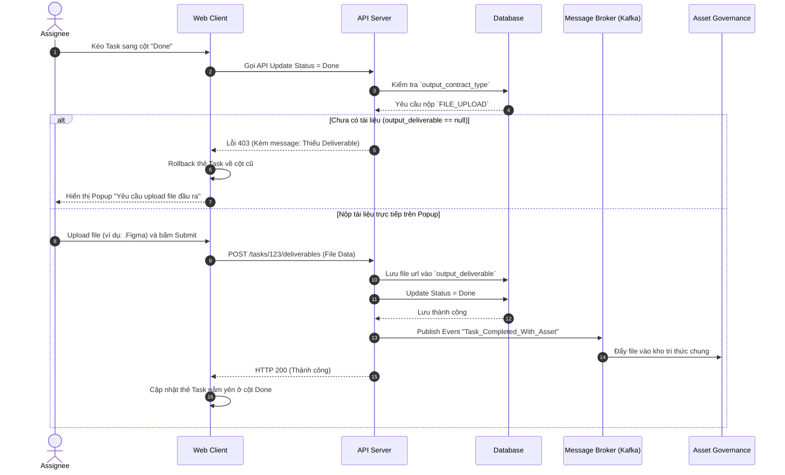

# Feature: Strict Definition of Done (DoD) & Output Contract (FR-PRJ-008)

**Mô tả:** Cơ chế chống "Vibe Code" (làm bừa, không có tài liệu bàn giao). Yêu cầu Task phải nộp đúng định dạng tài liệu đầu ra (Deliverable) trước khi được phép chuyển sang trạng thái "Done".
**Priority:** P1 (High)

## 1. Functional Requirements List

| FR ID | Requirement Description | Input | Output | Associated Business Rule | Priority |
|---|---|---|---|---|---|
| **FR-PRJ-008.1** | **Thiết lập Output Contract:** Khi tạo/sửa Task, Project Manager hoặc Reporter có thể chọn định dạng đầu ra bắt buộc (VD: File đính kèm, Link Figma, Link Pull Request). | Chọn loại Output Type từ Dropdown | Lưu config này vào Task | BL-PRJ-008.1 | Must-have |
| **FR-PRJ-008.2** | **Chặn hoàn thành (Done Blocker):** Ngăn chặn người dùng chuyển trạng thái Task sang `Done` nếu chưa cung cấp tài liệu đầu ra đúng định dạng đã yêu cầu. | Kéo Task vào cột Done | UI bật Popup yêu cầu nộp tài liệu / Chặn Kéo | BL-PRJ-008.2 | Must-have |
| **FR-PRJ-008.3** | **Tự động lưu trữ (Asset Sync):** Khi Task hoàn thành hợp lệ, tài liệu đầu ra được copy một bản (Event-driven) sang hệ thống Asset Governance (Kho tri thức) để bảo lưu dài hạn. | Event Task_Done | File/Link được đưa vào thư viện chung | BL-PRJ-008.3 | Should-have |

## 2. Business Logic & Rules

* **BL-PRJ-008.1 (Output Definition):** Khi thiết lập `output_contract_type != "NONE"`, hệ thống kích hoạt cơ chế "Khóa Trạng thái" (Status Lock) cho các cột có category là `DONE`.
* **BL-PRJ-008.2 (Done Blocker Validation):** Nếu `assignee_id` cố gắng chuyển Task sang cột `Done`, hệ thống kiểm tra trường `output_deliverable`. 
  * Nếu trống: Ném lỗi `HTTP 403` và hiển thị Popup "Submit Deliverables" trên UI.
  * Nếu là `URL_LINK`: Validate regex URL.
* **BL-PRJ-008.3 (Knowledge Base Sync):** Ngay sau khi Task được lưu trạng thái `Done` thành công, Message Broker (RabbitMQ/Kafka) sẽ bắt sự kiện và đẩy tài liệu sang phân hệ Asset Governance.
* **BL-PRJ-008.4 (Personal Space Exception — Tính năng liên quan: FR-PRJ-015):** Task thuộc **Personal Space** (`is_personal = true`) luôn có `output_contract_type = NONE` cố định và không thể thay đổi. Cơ chế Done Blocker bị vô hiệu hóa hoàn toàn cho Personal Space — người dùng cá nhân được phép chuyển Task sang Done mà không cần nộp deliverable. Điều này đảm bảo OmniProject không trở thành rào cản với người dùng cá nhân/to-do cơ bản.

## 3. Data Structure (Bổ sung cho Entity Task)

| Field | Data Type | Required | Constraints |
|---|---|---|---|
| `output_contract_type`| Enum | Yes | `NONE`, `URL_LINK`, `FILE_UPLOAD`, `MERGE_REQUEST`. Mặc định `NONE` |
| `output_deliverable` | String/JSON| No | Chứa URL thực tế hoặc danh sách Asset ID (Nếu upload file). Null nếu chưa nộp. |

## 4. Sequence Diagram: Submit Deliverable & Mark as Done



## 5. Tiêu chí Chấp nhận (Acceptance Criteria)

**Là** Project Manager,
**Tôi muốn** buộc nhân viên phải đính kèm link thiết kế / link PR code khi hoàn thành Task,
**Để** chống lại việc nhân viên click "Done" bừa bãi mà không lưu lại tài liệu bàn giao, gây khó khăn cho việc đào tạo nhân sự sau này.

**Acceptance Criteria (Gherkin):**
```gherkin
Given Task "Thiết kế Banner" có yêu cầu đầu ra là "FILE_UPLOAD"
When Nhân viên cố gắng kéo Task đó sang cột "Done" trên bảng Kanban
Then Hệ thống giữ Task ở lại vị trí cũ và hiển thị Popup "Yêu cầu nộp tài liệu đầu ra"

Given Popup "Yêu cầu nộp tài liệu đầu ra" đang hiển thị
When Nhân viên tải lên file .Figma thành công và nhấn Lưu
Then Hệ thống tự động chuyển Task sang cột "Done"
And File thiết kế được chuyển vào Kho Tri Thức (Asset Governance) của dự án
```
