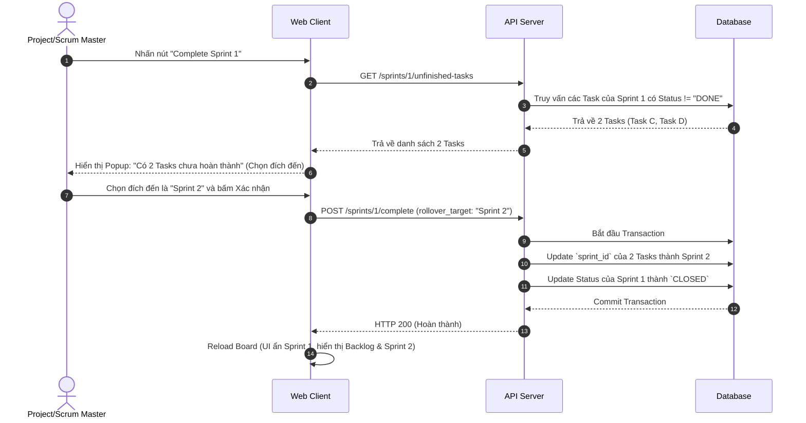

# Feature: Scrum & Sprint Management (FR-PRJ-009)

**Mô tả:** Hệ thống hỗ trợ quản lý vòng đời phát triển phần mềm theo mô hình Scrum (Agile), cho phép chia nhỏ dự án thành các vòng lặp (Sprint) có thời gian cố định, kèm theo các công cụ Planning và Review.

> **⚠️ Lưu ý quan trọng — Scrum/Sprint là tính năng TUY CHỌN (Optional):** Người dùng KHÔNG bắt buộc phải tạo Sprint để sử dụng các tính năng cốt lõi khác (Kanban, Gantt, Table, Custom Workflow). Sprint chỉ xuất hiện khi PM chủ động bật "Chế độ Scrum" cho dự án. Dự án ở chế độ Kanban thuần không bị ảnh hưởng bởi bất kỳ ràng buộc Sprint nào.

**Priority:** P1 (High)

## 1. Functional Requirements List

| FR ID | Requirement Description | Input | Output | Associated Business Rule | Priority |
|---|---|---|---|---|---|
| **FR-PRJ-009.1** | **Sprint Planning:** Cho phép tạo Sprint mới, định nghĩa mục tiêu (Goal) và khoảng thời gian (Start Date - End Date). | Tên, Mục tiêu, Ngày bắt đầu/kết thúc | Sprint mới được tạo ở trạng thái `PLANNED` | None | Must-have |
| **FR-PRJ-009.2** | **Kéo thả Task vào Sprint:** Kéo các Task từ Product Backlog vào các Sprint `PLANNED` hoặc `ACTIVE` để lên kế hoạch thực hiện. | Kéo thả Task / Sửa Sprint_ID | Task thuộc về Sprint | BL-PRJ-009.2 | Must-have |
| **FR-PRJ-009.3** | **Start Sprint:** Bắt đầu một Sprint. Hệ thống sẽ khóa các thay đổi lớn và bắt đầu tính toán báo cáo (Burndown Chart). | Nút "Start Sprint" | Sprint đổi trạng thái thành `ACTIVE` | BL-PRJ-009.1 | Must-have |
| **FR-PRJ-009.4** | **Complete Sprint & Rollover:** Đóng một Sprint khi hết thời gian. Xử lý các Task chưa hoàn thành bằng cách đẩy chúng về Backlog hoặc đẩy sang Sprint kế tiếp (Rollover). | Nút "Complete Sprint" | Sprint thành `CLOSED`, Task được chuyển đi | BL-PRJ-009.3, BL-PRJ-009.4 | Must-have |

## 2. Business Logic & Rules

* **BL-PRJ-009.1 (Active Sprint Constraint):** Tại một thời điểm trong một dự án, chỉ có tối đa **1 Sprint** được phép ở trạng thái `ACTIVE`. Nếu PM bấm "Start Sprint" khi đang có một Sprint khác `ACTIVE`, API trả về `HTTP 409 Conflict`.
* **BL-PRJ-009.2 (Task & Sprint Relationship):** Một Task chỉ có thể nằm trong 1 Sprint. Nếu kéo Task từ Backlog vào Sprint A, `sprint_id` của Task cập nhật thành ID của Sprint A.
* **BL-PRJ-009.3 (Closed Sprint Immutability):** Nếu Sprint chuyển sang trạng thái `CLOSED`, toàn bộ metadata của Sprint đó bị khóa. Không ai được phép kéo Task mới vào, hoặc chuyển Task từ ngoài vào một Sprint đã Closed.
* **BL-PRJ-009.4 (Unfinished Tasks Rollover):** Khi đóng một `ACTIVE` Sprint, hệ thống sẽ gom tất cả các Task có trạng thái khác `Done`, bật Popup hỏi PM: "Chuyển các task chưa xong này về Backlog, hay đẩy sang Sprint kế tiếp?".
* **BL-PRJ-009.5 (Scrum Mode — Optional Toggle):** Scrum Mode được bật/tắt ở cấp độ Project (Project Settings). Khi tắt:
  * Mỹc "Sprints" biến mất khỏi sidebar.
  * Kanban Board vẫn hoạt động bình thường với toàn bộ Backlog Tasks.
  * Trường `sprint_id` của Task bị ignore trong queries.
  * WIP Limits, Custom Workflow, Dependency vẫn hoạt động độc lập với Scrum Mode.

## 3. Data Structure

### Entity: Sprint
| Field | Data Type | Required | Constraints |
|---|---|---|---|
| `sprint_id` | UUID | Yes | Primary Key |
| `project_id`| UUID | Yes | Foreign Key |
| `name` | String | Yes | VD: "Sprint 1: Authentication" |
| `goal` | Text | No | Mục tiêu của Sprint |
| `start_date`| Timestamp| Yes | Ngày bắt đầu |
| `end_date` | Timestamp| Yes | Ngày kết thúc |
| `status` | Enum | Yes | `PLANNED`, `ACTIVE`, `CLOSED` |

*(Trong Schema của Task ở FR-PRJ-001 cần bổ sung thêm trường `sprint_id` kiểu UUID (Nullable) tham chiếu đến bảng Sprint).*

## 4. Sequence Diagram: Complete Sprint & Rollover



## 5. Tiêu chí Chấp nhận (Acceptance Criteria)

**Là** Scrum Master,
**Tôi muốn** gom các Task từ Backlog vào một Sprint và nhấn Start,
**Để** team tập trung giải quyết khối lượng công việc đó trong chu kỳ ngắn mà không bị phân tâm.

**Acceptance Criteria (Gherkin):**
```gherkin
Given Dự án đang có Sprint 1 ở trạng thái ACTIVE
When Tôi bấm "Start Sprint" cho Sprint 2
Then Hệ thống báo lỗi "Bạn phải hoàn thành Sprint 1 trước khi bắt đầu Sprint 2"

Given Tôi đang đóng Sprint 1 nhưng còn 2 Tasks chưa hoàn thành
When Tôi nhấn nút "Complete Sprint"
Then Popup xuất hiện yêu cầu tôi chọn nơi chứa 2 Tasks chưa hoàn thành này (Backlog hoặc New Sprint)
And Sau khi xác nhận Rollover sang Sprint 2, Sprint 1 chuyển sang CLOSED và không thể thay đổi nữa
And 2 Tasks đó xuất hiện trong danh sách của Sprint 2
```
