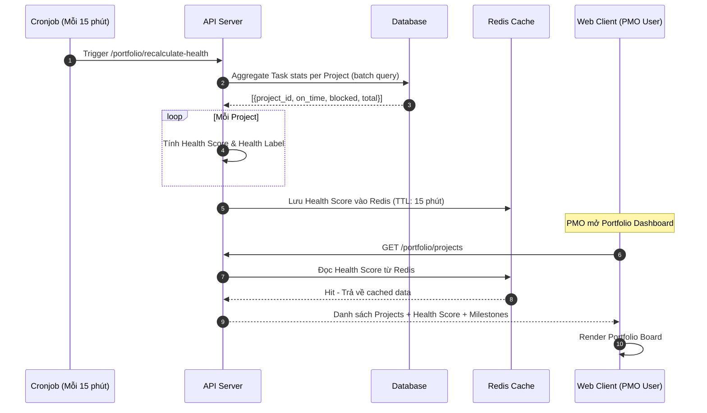

# Feature: Portfolio & Multi-Project Dashboard (FR-PRJ-010)

**Mô tả:** Cung cấp góc nhìn tổng thể ở cấp độ tổ chức (Organization Level), cho phép quản lý cấp cao (C-level, PMO, Program Manager) theo dõi đồng thời nhiều dự án trên một Dashboard duy nhất, phát hiện rủi ro xuyên dự án và phân bổ nguồn lực hiệu quả.
**Priority:** P1 (High)

---

## 1. Functional Requirements List

| FR ID | Requirement Description | Input | Output | Associated Business Rule | Priority |
|---|---|---|---|---|---|
| **FR-PRJ-010.1** | **Portfolio Board:** Hiển thị tất cả Projects mà user có quyền truy cập dưới dạng thẻ (Card) hoặc danh sách (List), kèm trạng thái tổng thể (On Track / At Risk / Off Track), % tiến độ và ngày deadline gần nhất. | User truy cập màn hình Portfolio | Danh sách Projects với Health Status | BL-PRJ-010.1 | Must-have |
| **FR-PRJ-010.2** | **Cross-Project Timeline (Program Gantt):** Hiển thị Gantt Chart cấp Portfolio, mỗi hàng là 1 Project, các mốc Sprint/Milestone hiển thị trên timeline chung. | User bật Program Gantt View | Gantt nhiều dự án xếp chồng | BL-PRJ-010.2 | Must-have |
| **FR-PRJ-010.3** | **Risk Radar tổng hợp:** Tổng hợp và hiển thị danh sách Tasks/Projects đang "At Risk" (quá hạn, blocked, hoặc gần deadline < 48h) trên toàn bộ portfolio. | Real-time via WebSocket | Feed cảnh báo theo thời gian thực | BL-PRJ-010.1 | Must-have |
| **FR-PRJ-010.4** | **Project Health Score:** Hệ thống tự động tính điểm sức khỏe (0–100) cho từng project dựa trên: % task đúng hạn, % task bị blocked, tốc độ hoàn thành. | Cronjob hoặc trigger khi Task update | Health Score lưu cache, hiển thị badge màu | BL-PRJ-010.3 | Should-have |
| **FR-PRJ-010.5** | **Milestone Tracking:** Cho phép tạo Milestone (mốc quan trọng) gắn vào Project, hiển thị trên Program Gantt và Portfolio card. | Tên Milestone, ngày, Project | Milestone được vẽ trên Gantt | None | Should-have |

---

## 2. Business Logic & Rules

* **BL-PRJ-010.1 (Health Status Classification):**
  * `On Track`: ≥ 80% tasks đúng hạn, 0 task Blocked quá 72h.
  * `At Risk`: 60–80% tasks đúng hạn, hoặc có task Blocked < 72h.
  * `Off Track`: < 60% tasks đúng hạn, hoặc có task Blocked > 72h, hoặc Project trễ so với End Date.
* **BL-PRJ-010.2 (Program Gantt Aggregation):** Mỗi Project hiển thị như 1 nhóm (Group Row) trên Gantt. Các Sprint/Milestone là sub-row. Không hiển thị Task cụ thể để tránh quá tải.
* **BL-PRJ-010.3 (Health Score Formula):**
  ```
  Health Score = (On_Time_Tasks / Total_Tasks) × 60
              + (1 - Blocked_Ratio) × 20
              + Velocity_Factor × 20
  ```
  Score ≥ 80: Xanh. Score 50–79: Vàng. Score < 50: Đỏ.
* **BL-PRJ-010.4 (Permission Scope):** User chỉ thấy Projects mà họ là thành viên (Member, PM, hoặc Admin). Admin của Workspace thấy toàn bộ.

---

## 3. Data Structure

### Entity: Portfolio_View (Computed — không lưu vào DB riêng)
Dữ liệu được tổng hợp (Aggregate) real-time hoặc cache từ bảng `Project`, `Task`, `Sprint`.

### Entity: Project (Bổ sung)
| Field | Data Type | Required | Constraints |
|---|---|---|---|
| `project_id` | UUID | Yes | Primary Key |
| `name` | String | Yes | Tên dự án |
| `status` | Enum | Yes | `ACTIVE`, `PAUSED`, `COMPLETED`, `ARCHIVED` |
| `health_score` | Integer | No | 0–100, cache tính tự động |
| `health_label` | Enum | No | `ON_TRACK`, `AT_RISK`, `OFF_TRACK` |
| `end_date` | Timestamp | No | Deadline dự án tổng thể |
| `color` | String | No | Hex color để phân biệt trên Program Gantt |

### Entity: Milestone
| Field | Data Type | Required | Constraints |
|---|---|---|---|
| `milestone_id` | UUID | Yes | Primary Key |
| `project_id` | UUID | Yes | Foreign Key |
| `name` | String | Yes | VD: "MVP Launch", "Design Freeze" |
| `due_date` | Timestamp | Yes | Ngày milestone |
| `status` | Enum | Yes | `UPCOMING`, `REACHED`, `MISSED` |

---

## 4. Sequence Diagram: Health Score Calculation & Portfolio Load



---

## 5. Tiêu chí Chấp nhận (Acceptance Criteria)

**Là** Program Manager (PMO),
**Tôi muốn** xem tất cả dự án đang chạy trên một màn hình duy nhất với trạng thái sức khỏe tổng thể,
**Để** phát hiện sớm rủi ro mà không cần phải lần lượt mở từng dự án.

**Acceptance Criteria (Gherkin):**
```gherkin
Given tôi đang ở màn hình Portfolio Dashboard
When hệ thống load xong
Then tôi thấy danh sách tất cả 5 Projects tôi tham gia
And mỗi Project hiển thị badge màu sắc: Xanh (On Track), Vàng (At Risk), Đỏ (Off Track)

Given Project "Marketing Q4" có 3/10 Tasks bị trễ và 1 Task bị Blocked hơn 72h
When hệ thống tính Health Score
Then Project đó hiển thị badge "Off Track" màu Đỏ

Given tôi bật chế độ "Program Gantt"
When màn hình load xong
Then mỗi Project hiển thị 1 hàng trên Gantt, các Sprint và Milestone được vẽ trên timeline chung
```
