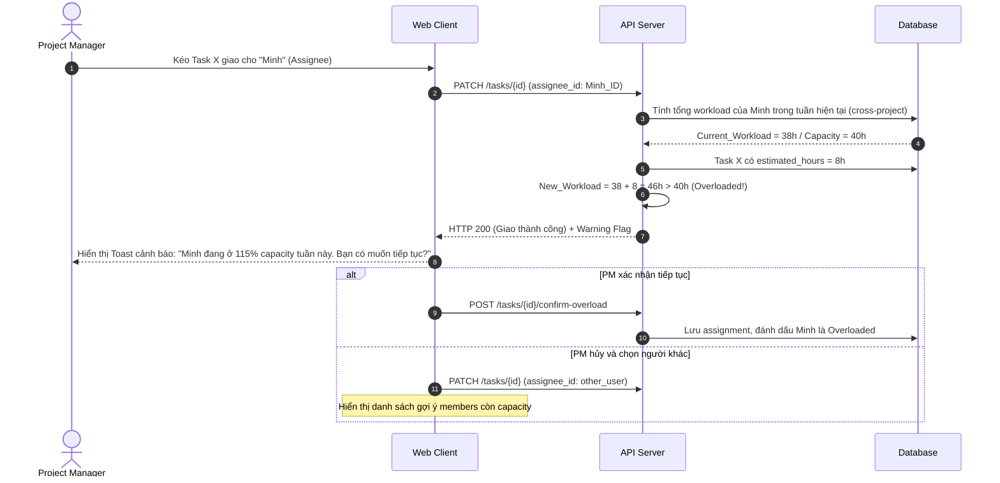

# Feature: Resource & Capacity Management (FR-PRJ-011)

**Mô tả:** Cung cấp tính năng theo dõi và cân bằng tải công việc (Workload) của từng thành viên trong dự án, giúp Project Manager phân bổ nguồn lực hợp lý, phát hiện thành viên đang overloaded hoặc underutilized, và dự báo capacity cho các sprint tiếp theo.
**Priority:** P1 (High)

---

## 1. Functional Requirements List

| FR ID | Requirement Description | Input | Output | Associated Business Rule | Priority |
|---|---|---|---|---|---|
| **FR-PRJ-011.1** | **Workload View:** Hiển thị tổng số giờ/số Task được giao cho mỗi thành viên trong một khoảng thời gian (tuần/sprint). Cho phép so sánh với capacity tối đa đã cấu hình (VD: 40h/tuần). | PM chọn khoảng thời gian & nhóm | Biểu đồ thanh Workload của mỗi người | BL-PRJ-011.1 | Must-have |
| **FR-PRJ-011.2** | **Availability Calendar:** Mỗi thành viên tự đăng ký thời gian nghỉ (Leave), giảm capacity (Partial). Hệ thống trừ ngày nghỉ vào tổng capacity khi PM lên kế hoạch. | Form đăng ký Leave | Ngày bị block trên Workload View | BL-PRJ-011.2 | Must-have |
| **FR-PRJ-011.3** | **Cảnh báo Overload:** Hệ thống tự động cảnh báo (badge đỏ) khi tổng workload của thành viên vượt quá 100% capacity trong bất kỳ tuần nào. | Trigger khi giao Task mới | Warning badge trên avatar thành viên | BL-PRJ-011.1 | Must-have |
| **FR-PRJ-011.4** | **Cross-Project Workload:** Tổng hợp workload của 1 thành viên xuyên suốt tất cả Projects họ tham gia (không chỉ 1 project). | API tổng hợp multi-project | Tổng workload thật sự | BL-PRJ-011.3 | Should-have |
| **FR-PRJ-011.5** | **Re-assign gợi ý:** Khi một thành viên overload, hệ thống gợi ý danh sách thành viên khác còn capacity để PM xem xét chuyển Task. | Task bị giao cho người overload | Danh sách gợi ý có available hours | BL-PRJ-011.1 | Should-have |

---

## 2. Business Logic & Rules

* **BL-PRJ-011.1 (Capacity Calculation):**
  ```
  Workload(%) = (Assigned_Task_Hours_In_Period / Max_Capacity_Hours_In_Period) × 100
  ```
  * Nếu Task không có `estimated_hours`, mặc định đếm là **1 điểm story** tương đương 4h.
  * `Max_Capacity_Hours_In_Period` = `daily_capacity_hours × working_days_in_period` (trừ ngày nghỉ đã đăng ký).
  * Ngưỡng cảnh báo:
    * ≤ 80%: Xanh (OK)
    * 80–100%: Vàng (Near full)
    * > 100%: Đỏ (Overloaded)

* **BL-PRJ-011.2 (Leave Immutability):** Một ngày Leave đã được PM xác nhận không thể bị ghi đè bởi việc giao Task mới. Hệ thống cảnh báo PM khi cố giao Task vào ngày đó.

* **BL-PRJ-011.3 (Cross-Project Scope):** Tổng workload phải tổng hợp từ **tất cả** Projects trong cùng Workspace, không phải chỉ Project đang xem. Đây là điểm khác biệt với các tool thông thường.

---

## 3. Data Structure

### Entity: Member_Capacity
| Field | Data Type | Required | Constraints |
|---|---|---|---|
| `capacity_id` | UUID | Yes | Primary Key |
| `user_id` | UUID | Yes | Foreign Key to User |
| `workspace_id` | UUID | Yes | Foreign Key |
| `daily_capacity_hours` | Float | Yes | Mặc định 8.0 giờ/ngày |
| `start_date` | Date | Yes | Hiệu lực từ ngày |

### Entity: Member_Leave
| Field | Data Type | Required | Constraints |
|---|---|---|---|
| `leave_id` | UUID | Yes | Primary Key |
| `user_id` | UUID | Yes | Foreign Key |
| `leave_date` | Date | Yes | Ngày nghỉ (1 ngày/lần) |
| `leave_type` | Enum | Yes | `FULL_DAY`, `HALF_DAY` |
| `approved_by` | UUID | No | PM/Admin đã duyệt |

### Entity: Task (Bổ sung)
| Field | Data Type | Required | Constraints |
|---|---|---|---|
| `estimated_hours` | Float | No | Số giờ ước tính hoàn thành |
| `actual_hours` | Float | No | Số giờ thực tế (từ Time Tracking) |

---

## 4. Sequence Diagram: Workload Check khi Giao Task



---

## 5. Tiêu chí Chấp nhận (Acceptance Criteria)

**Là** Project Manager,
**Tôi muốn** xem toàn bộ workload của từng thành viên theo tuần,
**Để** không vô tình giao việc cho người đang overload trong khi người khác lại rảnh.

**Acceptance Criteria (Gherkin):**
```gherkin
Given thành viên "Minh" có capacity 40h/tuần và đang được giao 38h công việc
When tôi giao thêm Task mới ước tính 8h cho Minh
Then hệ thống hiển thị cảnh báo "Minh sẽ ở mức 115% capacity"
And tôi được gợi ý danh sách 3 thành viên khác còn dưới 80% capacity

Given thành viên "Lan" đã đăng ký nghỉ phép ngày 20/09
When tôi cố giao Task có deadline ngày 20/09 cho Lan
Then hệ thống hiển thị cảnh báo "Lan có ngày nghỉ đã được duyệt vào ngày này"
```
