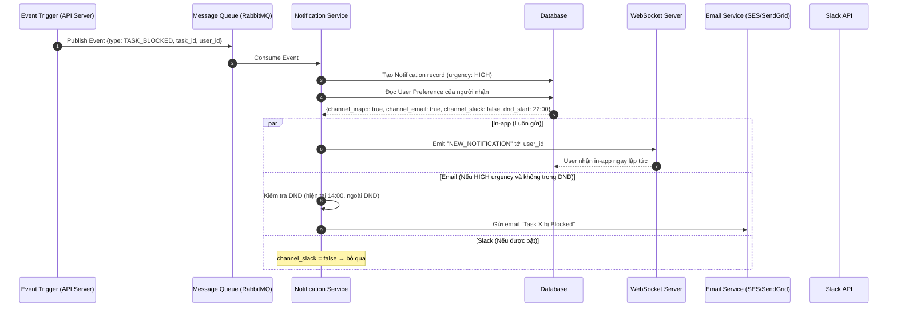

# Feature: Notification Center & Third-party Integration (FR-PRJ-013)

**Mô tả:** Cung cấp một trung tâm thông báo (Notification Hub) tập trung để quản lý tất cả alert từ các tính năng của OmniProject (Mention, Deadline, Blocked, Handoff...), đồng thời cho phép tích hợp gửi thông báo ra các kênh bên ngoài (Slack, Microsoft Teams, Email) theo preference của từng người dùng.
**Priority:** P1 (High)

---

## 1. Functional Requirements List

| FR ID | Requirement Description | Input | Output | Associated Business Rule | Priority |
|---|---|---|---|---|---|
| **FR-PRJ-013.1** | **Notification Inbox (In-app):** Hiển thị danh sách tất cả thông báo của user trong ứng dụng (Chuông 🔔), gồm: Mention, Task giao mới, Deadline sắp đến, Task bị Blocked, Sprint bắt đầu/kết thúc. Hỗ trợ đánh dấu đã đọc và xóa. | Các sự kiện từ toàn bộ FR | Feed thông báo theo thời gian thực | BL-PRJ-013.1 | Must-have |
| **FR-PRJ-013.2** | **Notification Preference:** Mỗi user tự cấu hình loại thông báo nào nhận qua kênh nào (In-app / Email / Slack / Teams). Hỗ trợ tắt hoàn toàn từng loại thông báo. | Form cài đặt thông báo | Lưu preference vào DB | BL-PRJ-013.2 | Must-have |
| **FR-PRJ-013.3** | **Email Digest:** Thay vì gửi email từng cái một, hệ thống gom (batch) các thông báo non-urgent trong ngày thành 1 email Digest (digest 8h sáng và 18h chiều). | Preference: Email Digest ON | Email tóm tắt | BL-PRJ-013.3 | Should-have |
| **FR-PRJ-013.4** | **Slack / Teams Webhook:** Cho phép PM cấu hình Webhook URL vào channel Slack/Teams để nhận thông báo cấp dự án (Task Blocked, Sprint bắt đầu, Risk Alert) tự động. | Webhook URL + sự kiện chọn | Message gửi vào Slack/Teams | BL-PRJ-013.4 | Should-have |
| **FR-PRJ-013.5** | **Do Not Disturb (DND):** User cài đặt khoảng giờ yên tĩnh (VD: 22:00–07:00). Trong khung giờ này, thông báo non-urgent được giữ lại và gửi sau. | Cài đặt giờ DND | Không gửi push notification ngoài giờ | BL-PRJ-013.5 | Should-have |

---

## 2. Business Logic & Rules

* **BL-PRJ-013.1 (Notification Types & Urgency):**

  | Event | Urgency | Kênh mặc định |
  |---|---|---|
  | `@mention` trong comment | High | In-app (ngay lập tức) + Email |
  | Task được giao | High | In-app + Email |
  | Deadline < 24h | High | In-app + Email |
  | Task Blocked | High | In-app (ngay lập tức) |
  | Sprint bắt đầu/kết thúc | Medium | In-app + Email Digest |
  | Comment mới (không có mention) | Low | In-app (badge count) |
  | Health Score dự án thay đổi | Medium | In-app + Email Digest |

* **BL-PRJ-013.2 (Preference Override):** User preference được ưu tiên tuyệt đối. Nếu user tắt Email cho loại "Deadline Alert", hệ thống không gửi email dù deadline < 24h. Chỉ có Admin mới được force-enable loại thông báo bắt buộc (VD: thông báo bảo mật tài khoản).

* **BL-PRJ-013.3 (Digest Batching):** Tại 8:00 và 18:00, cronjob thu thập tất cả notification có urgency `Low` hoặc `Medium` chưa gửi email, gom vào 1 email đơn. Nếu có notification urgency `High`, gửi email ngay lập tức (không chờ digest).

* **BL-PRJ-013.4 (Webhook Retry):** Nếu Slack/Teams webhook trả về lỗi (timeout hoặc 4xx/5xx), hệ thống retry tối đa 3 lần với Exponential Backoff (30s, 2m, 10m). Nếu vẫn fail, ghi log lỗi và bỏ qua.

* **BL-PRJ-013.5 (DND Scope):** DND chỉ áp dụng cho Push Notification (nếu có Mobile app trong tương lai) và Email. In-app notification vẫn ghi nhận vào Inbox nhưng không hiển thị toast popup.

---

## 3. Data Structure

### Entity: Notification
| Field | Data Type | Required | Constraints |
|---|---|---|---|
| `notification_id` | UUID | Yes | Primary Key |
| `user_id` | UUID | Yes | Người nhận |
| `event_type` | Enum | Yes | `MENTION`, `TASK_ASSIGNED`, `DEADLINE_APPROACHING`, `TASK_BLOCKED`, `SPRINT_STARTED`, `COMMENT_ADDED` |
| `urgency` | Enum | Yes | `HIGH`, `MEDIUM`, `LOW` |
| `title` | String | Yes | Tiêu đề ngắn |
| `body` | String | Yes | Nội dung chi tiết |
| `entity_type` | Enum | Yes | `TASK`, `SPRINT`, `PROJECT` |
| `entity_id` | UUID | Yes | ID của đối tượng liên quan |
| `is_read` | Boolean | Yes | Mặc định `false` |
| `created_at` | Timestamp | Yes | |

### Entity: User_Notification_Preference
| Field | Data Type | Required | Constraints |
|---|---|---|---|
| `pref_id` | UUID | Yes | Primary Key |
| `user_id` | UUID | Yes | Foreign Key |
| `event_type` | Enum | Yes | Loại thông báo |
| `channel_inapp` | Boolean | Yes | Mặc định `true` |
| `channel_email` | Boolean | Yes | Mặc định `true` |
| `channel_slack` | Boolean | Yes | Mặc định `false` |
| `channel_teams` | Boolean | Yes | Mặc định `false` |
| `dnd_start` | Time | No | VD: `22:00` |
| `dnd_end` | Time | No | VD: `07:00` |

### Entity: Project_Webhook
| Field | Data Type | Required | Constraints |
|---|---|---|---|
| `webhook_id` | UUID | Yes | Primary Key |
| `project_id` | UUID | Yes | Foreign Key |
| `provider` | Enum | Yes | `SLACK`, `TEAMS`, `GENERIC` |
| `webhook_url` | String | Yes | URL nhận event |
| `event_filter` | JSON | Yes | Danh sách event muốn nhận |
| `is_active` | Boolean | Yes | |

---

## 4. Sequence Diagram: Notification Fan-out (High Urgency)



---

## 5. Tiêu chí Chấp nhận (Acceptance Criteria)

**Là** Team Member,
**Tôi muốn** chọn kênh nhận thông báo riêng cho từng loại sự kiện,
**Để** không bị spam email với những cập nhật không quan trọng trong khi vẫn nhận được thông báo khẩn cấp ngay lập tức.

**Acceptance Criteria (Gherkin):**
```gherkin
Given tôi đã tắt Email cho loại "Comment mới" nhưng vẫn bật Email cho "Task được giao"
When có người comment vào Task của tôi (không mention tôi)
Then tôi nhận notification trong Inbox ứng dụng nhưng KHÔNG nhận email

When tôi được giao Task mới
Then tôi nhận email thông báo ngay lập tức

Given tôi đã cài DND từ 22:00 đến 07:00
When Task bị Blocked lúc 23:00
Then thông báo vẫn xuất hiện trong Inbox nhưng không gửi Email hay hiển thị Toast popup cho đến 07:00 sáng hôm sau

Given PM đã cài Slack Webhook cho channel "#dev-alerts"
When một Task trong dự án chuyển sang Blocked
Then Slack channel nhận được message tự động với thông tin Task và link trực tiếp
```
