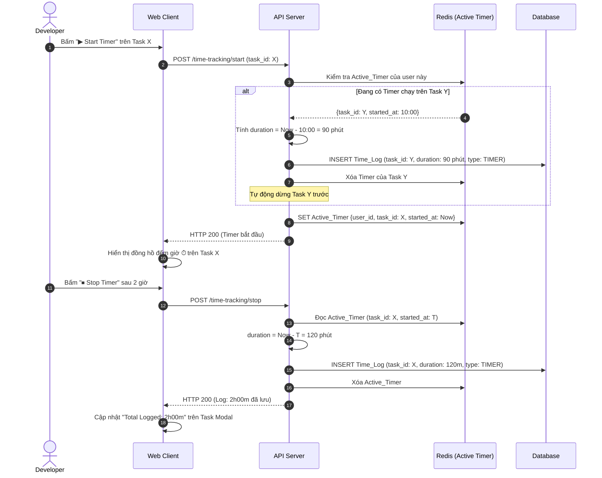

# Feature: Time Tracking (FR-PRJ-014)

**Mô tả:** Cho phép thành viên ghi lại thời gian thực tế làm việc trên từng Task (Time Log), hỗ trợ cả bấm giờ tự động (Timer) và nhập thủ công. Dữ liệu được dùng để phân tích hiệu suất (FR-PRJ-012), so sánh Estimate vs Actual, và tính toán chi phí nhân sự trong dự án.
**Priority:** P2 (Medium)

---

## 1. Functional Requirements List

| FR ID | Requirement Description | Input | Output | Associated Business Rule | Priority |
|---|---|---|---|---|---|
| **FR-PRJ-014.1** | **Bấm giờ (Timer):** Cung cấp nút Start/Stop Timer trên Task Modal. Khi bấm Start, hệ thống đếm thời gian real-time. Khi Stop, tự động tạo Time Log entry cho khoảng thời gian vừa làm. | Click Start / Stop | Time Log entry lưu vào DB | BL-PRJ-014.1 | Must-have |
| **FR-PRJ-014.2** | **Nhập thủ công (Manual Log):** Cho phép nhập thời gian đã làm (VD: 2h 30m) trực tiếp mà không cần dùng Timer. Hỗ trợ nhập cho ngày trong quá khứ (tối đa 30 ngày). | Form nhập giờ + ngày + mô tả | Time Log entry | BL-PRJ-014.2 | Must-have |
| **FR-PRJ-014.3** | **Xem tổng Logged Time:** Hiển thị trên Task Modal: tổng giờ đã log, so sánh với `estimated_hours` (% tiến độ dựa trên giờ). | Time Logs của Task | Progress bar Estimated vs Logged | BL-PRJ-014.3 | Must-have |
| **FR-PRJ-014.4** | **Timesheet View:** Màn hình tổng hợp thời gian làm việc của user trong tuần, nhóm theo ngày và dự án. Cho phép PM xem timesheet của toàn team. | Khoảng thời gian chọn | Bảng log theo ngày | BL-PRJ-014.4 | Should-have |
| **FR-PRJ-014.5** | **Time Report xuất khẩu:** Xuất Timesheet ra CSV/Excel để tính lương, invoice khách hàng. | Khoảng thời gian + user/project filter | File CSV/Excel | BL-PRJ-014.4 | Should-have |

---

## 2. Business Logic & Rules

* **BL-PRJ-014.1 (Active Timer Constraint):** Mỗi user chỉ được có **1 Timer đang chạy** tại một thời điểm. Nếu Start Timer trên Task B trong khi Task A đang chạy, hệ thống tự động dừng Timer Task A và tạo log, sau đó bắt đầu Task B.

* **BL-PRJ-014.2 (Manual Log Limit):** Không cho phép log thời gian vượt quá `24 giờ/ngày` cho 1 user. Nếu tổng log trong ngày vượt 24h, ném lỗi `HTTP 422`. Giới hạn nhập cho quá khứ là 30 ngày để tránh gian lận dữ liệu lịch sử.

* **BL-PRJ-014.3 (Estimate vs Actual):**
  * `Time_Progress(%) = (Total_Logged_Hours / estimated_hours) × 100`
  * Nếu `Time_Progress > 100%`, hiển thị badge "Over Estimate" màu vàng — cảnh báo nhưng không chặn.
  * Nếu `estimated_hours` = null, không hiển thị progress bar, chỉ hiển thị tổng giờ đã log.

* **BL-PRJ-014.4 (Timesheet Visibility):**
  * User chỉ thấy Timesheet của bản thân.
  * PM/Admin thấy Timesheet của toàn bộ thành viên trong Project.
  * Data cross-project trong Timesheet: Chỉ Admin Workspace mới thấy.

---

## 3. Data Structure

### Entity: Time_Log
| Field | Data Type | Required | Constraints |
|---|---|---|---|
| `log_id` | UUID | Yes | Primary Key |
| `task_id` | UUID | Yes | Foreign Key |
| `user_id` | UUID | Yes | Người thực hiện |
| `start_time` | Timestamp | Yes | Thời điểm bắt đầu |
| `end_time` | Timestamp | Yes | Thời điểm kết thúc |
| `duration_minutes` | Integer | Yes | Tính từ end - start (phút) |
| `description` | String | No | Mô tả đã làm gì trong khoảng giờ đó |
| `log_type` | Enum | Yes | `TIMER` hoặc `MANUAL` |
| `logged_date` | Date | Yes | Ngày công (dành cho nhập thủ công) |

### Entity: Active_Timer (Ephemeral — lưu trên Redis)
| Field | Data Type | Note |
|---|---|---|
| `user_id` | UUID | Key |
| `task_id` | UUID | Task đang được tính giờ |
| `started_at` | Timestamp | Thời điểm bấm Start |

---

## 4. Sequence Diagram: Start → Stop Timer



---

## 5. Tiêu chí Chấp nhận (Acceptance Criteria)

**Là** Developer,
**Tôi muốn** bấm giờ trực tiếp trên Task để ghi lại thời gian thực tế tôi đã làm,
**Để** PM và tôi có thể so sánh với estimate ban đầu và cải thiện khả năng ước tính cho các sprint sau.

**Acceptance Criteria (Gherkin):**
```gherkin
Given tôi đang xem chi tiết Task "Làm API Login"
When tôi nhấn "Start Timer"
Then đồng hồ đếm giờ hiển thị và đếm lên theo thời gian thực

When tôi nhấn "Stop Timer" sau 1h30m
Then hệ thống tự động lưu một Time Log: 1h 30m vào ngày hôm nay
And tổng giờ đã log của Task cập nhật lên 1h 30m

Given Task có Estimate = 4h, và tôi đã log tổng 5h
When tôi mở Task Modal
Then hệ thống hiển thị "125% of estimate" với badge màu vàng cảnh báo

Given tôi đang bấm Timer cho Task A
When tôi bấm Start Timer trên Task B
Then hệ thống tự động dừng Timer Task A, lưu log, và bắt đầu đếm cho Task B
```
