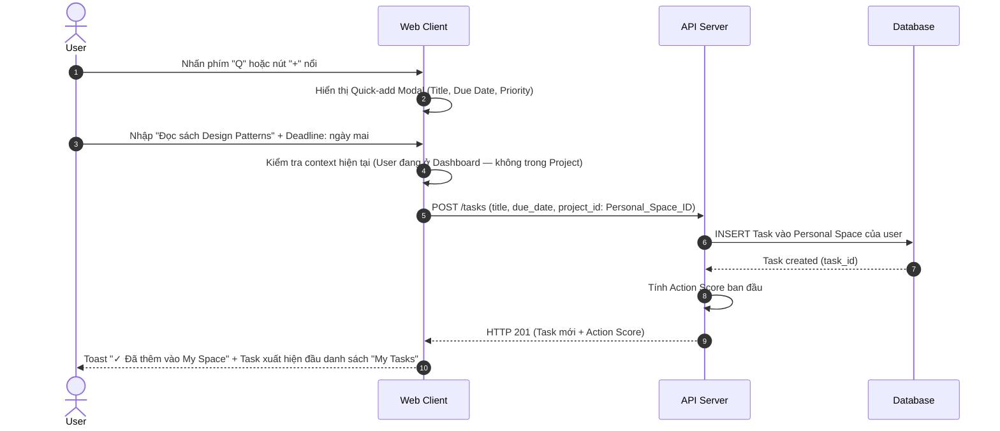

# Feature: Personal Space & My Tasks (FR-PRJ-015)

**Mô tả:** Cung cấp không gian làm việc cá nhân (Personal Space) — một "dự án riêng tư" mặc định được tạo tự động khi user đăng ký — nơi user có thể quản lý công việc cá nhân, ghi chú và to-do mà không cần thuộc về bất kỳ Project hay Team nào. Đây là tính năng cốt lõi giúp OmniProject phục vụ cả người dùng cá nhân.
**Priority:** P1 (High)

---

## 1. Functional Requirements List

| FR ID | Requirement Description | Input | Output | Associated Business Rule | Priority |
|---|---|---|---|---|---|
| **FR-PRJ-015.1** | **Personal Space tự động:** Khi user đăng ký tài khoản, hệ thống tự động tạo 1 Project đặc biệt "My Space" thuộc về user đó và chỉ mình user đó thấy. Không thể xóa Personal Space. | Event user registration | Personal Space Project được tạo | BL-PRJ-015.1 | Must-have |
| **FR-PRJ-015.2** | **My Tasks Dashboard:** Màn hình tập trung hiển thị TẤT CẢ các Task đang được giao cho user, xuyên suốt mọi Projects (bao gồm cả Personal Space), được nhóm theo: Hôm nay / Tuần này / Sau đó / Không có deadline. | User truy cập "My Tasks" | Danh sách Task phân nhóm | BL-PRJ-015.2 | Must-have |
| **FR-PRJ-015.3** | **Quick-add Task:** Cho phép user thêm Task nhanh từ bất kỳ màn hình nào bằng phím tắt `Q` hoặc nút `+` nổi (Floating Action Button), không cần mở Project. Task mới mặc định được thêm vào Personal Space. | Phím tắt Q / Nút + | Task được tạo trong Personal Space | BL-PRJ-015.3 | Must-have |
| **FR-PRJ-015.4** | **Private Tasks:** Cho phép đánh dấu Task là Private trong bất kỳ Project nào. Private Task chỉ hiển thị với chính user đó và Admin, ẩn với mọi thành viên khác kể cả PM. | Tích checkbox "Make Private" | Task ẩn khỏi mọi view của người khác | BL-PRJ-015.4 | Should-have |
| **FR-PRJ-015.5** | **"My Tasks" Smart Sort:** Tích hợp cơ chế Smart Prioritization (FR-PRJ-007) vào "My Tasks" để tự động sắp xếp task theo Action Score, kết hợp filter nhanh: Hôm nay / Sắp tới / Đã xong / Không có hạn. | Filter/Sort option | List được sắp xếp tối ưu | BL-PRJ-015.2 | Should-have |

---

## 2. Business Logic & Rules

* **BL-PRJ-015.1 (Personal Space Invariants):**
  * `is_personal = true` — không thể mời thành viên khác vào, không thể xóa, không thể chuyển thành Project thường.
  * Workflow mặc định: 3 cột đơn giản `Inbox → In Progress → Done`.
  * WIP Limit, Sprint, và Dependency không áp dụng cho Personal Space.
  * DoD (FR-PRJ-008) mặc định `output_contract_type = NONE` — không yêu cầu nộp deliverable.

* **BL-PRJ-015.2 (My Tasks Aggregation):** Query phải tổng hợp Tasks từ:
  1. Personal Space (task do mình tạo)
  2. Tất cả Projects trong Workspace mà `assignee_id = current_user`
  3. Tasks có `owner_id = current_user` (dù người khác đang làm)
  Nhóm hiển thị:
  * **Hôm nay:** `due_date = today`
  * **Tuần này:** `due_date` trong 7 ngày tới
  * **Sau đó:** `due_date > 7 ngày`
  * **Không có deadline:** `due_date IS NULL`

* **BL-PRJ-015.3 (Quick-add Context):**
  * Nếu user đang ở trong một Project cụ thể khi Quick-add, Task mới được tạo trong Project đó (không phải Personal Space).
  * Nếu đang ở màn hình ngoài Project (Dashboard, Portfolio), Task mới về Personal Space.

* **BL-PRJ-015.4 (Private Task Visibility):**
  * Private Task không xuất hiện trong Kanban/Gantt/Table của Project cho người khác.
  * Private Task không tham gia tính WIP Limit của cột (vô hình với logic team).
  * Chủ sở hữu vẫn thấy Task trong "My Tasks" của họ.

---

## 3. Data Structure

### Entity: Project (Bổ sung)
| Field | Data Type | Required | Constraints |
|---|---|---|---|
| `is_personal` | Boolean | Yes | Mặc định `false`. Chỉ `true` với Personal Space |
| `owner_user_id` | UUID | No | Chỉ có khi `is_personal = true` |

### Entity: Task (Bổ sung)
| Field | Data Type | Required | Constraints |
|---|---|---|---|
| `is_private` | Boolean | Yes | Mặc định `false` |

---

## 4. Sequence Diagram: Quick-add Task (Global)



---

## 5. Tiêu chí Chấp nhận (Acceptance Criteria)

**Là** người dùng cá nhân mới đăng ký,
**Tôi muốn** có ngay một không gian để quản lý việc cá nhân mà không cần tạo dự án,
**Để** tôi có thể dùng OmniProject như một to-do app thông thường ngay từ ngày đầu.

**Acceptance Criteria (Gherkin):**
```gherkin
Given tôi vừa đăng ký tài khoản lần đầu
When tôi đăng nhập vào hệ thống
Then tôi thấy một Space tên "My Space" đã có sẵn trong sidebar
And Space này có 3 cột mặc định: Inbox, In Progress, Done

Given tôi đang ở màn hình Portfolio (không trong project nào)
When tôi nhấn phím "Q"
Then Quick-add Modal xuất hiện
And sau khi tôi nhập title và Save, Task xuất hiện trong "My Space" và "My Tasks"

Given tôi là thành viên Project "Website Redesign"
When tôi tạo Task và check "Make Private"
Then Task đó xuất hiện trong danh sách của tôi nhưng ẩn hoàn toàn trên Kanban của team
```
