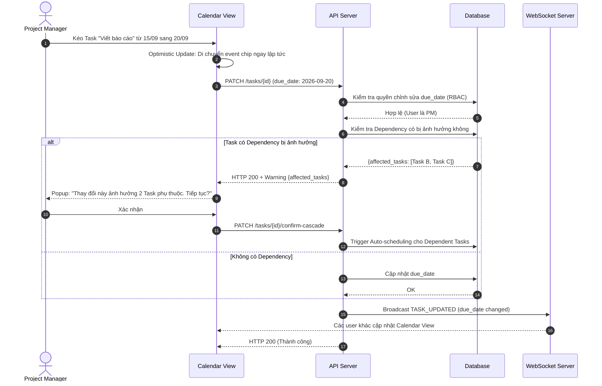

# Feature: Calendar View (FR-PRJ-016)

**Mô tả:** Bổ sung góc nhìn thứ 5 vào Multi-View Engine (bên cạnh Kanban, Gantt, Table, Scrum) — Calendar View hiển thị Tasks và Milestones theo lịch tháng/tuần/ngày. Đặc biệt hữu ích cho người dùng cá nhân quản lý deadline và PM lên lịch tổng thể. Calendar View chia sẻ cùng Single Source of Truth như các View khác.
**Priority:** P1 (High)

---

## 1. Functional Requirements List

| FR ID | Requirement Description | Input | Output | Associated Business Rule | Priority |
|---|---|---|---|---|---|
| **FR-PRJ-016.1** | **Calendar View Mode:** Thêm tab "Calendar" vào View Switcher (FR-PRJ-001). Hỗ trợ 3 chế độ hiển thị: **Month** (lịch tháng), **Week** (lịch tuần), **Day** (lịch ngày). | User chọn "Calendar" từ View Switcher | Render lịch với Task đặt trên ngày `due_date` | BL-PRJ-016.1 | Must-have |
| **FR-PRJ-016.2** | **Task trên Calendar:** Mỗi Task hiển thị dưới dạng "sự kiện" (Event chip) trên ngày `due_date`. Task kéo dài nhiều ngày (có `start_date` và `end_date`) hiển thị như event block trải dài. | Dữ liệu Task từ DB | Event chip trên Calendar | BL-PRJ-016.1 | Must-have |
| **FR-PRJ-016.3** | **Kéo thả Task trên Calendar:** Cho phép kéo Task từ ngày này sang ngày khác để thay đổi `due_date` (hoặc `end_date`). Tuân thủ RBAC giống Gantt View (FR-PRJ-000). | Kéo event chip sang ngày mới | Update `due_date` qua REST API | BL-PRJ-016.2 | Must-have |
| **FR-PRJ-016.4** | **Quick-create trên Calendar:** Click trực tiếp vào ô ngày để tạo Task mới với `due_date` mặc định là ngày được click. | Click ô ngày trống | Quick-add Modal với ngày được điền sẵn | BL-PRJ-016.3 | Should-have |
| **FR-PRJ-016.5** | **Cross-project Calendar:** Trong màn hình "My Tasks" + Calendar View, hiển thị Task từ TẤT CẢ Projects của user trên cùng 1 lịch, phân biệt màu theo Project. | User bật Calendar trong My Tasks | Tất cả deadline xuyên dự án trên 1 lịch | BL-PRJ-016.4 | Should-have |

---

## 2. Business Logic & Rules

* **BL-PRJ-016.1 (Calendar Data Mapping):**
  * Task có `due_date` nhưng không có `start_date/end_date`: Hiển thị là event 1 ngày tại `due_date`.
  * Task có `start_date` và `end_date`: Hiển thị block trải dài từ `start_date` đến `end_date`.
  * Task không có `due_date`, `start_date`, `end_date`: Không xuất hiện trên Calendar (cần báo user bằng "Unscheduled Tasks" section bên cạnh).
  * Milestone (FR-PRJ-010): Hiển thị dưới dạng hình thoi ◇ trên ngày milestone.

* **BL-PRJ-016.2 (Drag on Calendar = Update Due Date):**
  * Kéo task sang ngày mới → cập nhật `due_date`.
  * Nếu Task có Dependency (FR-PRJ-003), thay đổi ngày này kích hoạt Auto-scheduling warning ("Thay đổi này ảnh hưởng đến X task phụ thuộc. Tiếp tục?").
  * Tuân thủ RBAC: Member không thể kéo task của người khác (FR-PRJ-000).

* **BL-PRJ-016.3 (Quick-create from Calendar):** Task mới tạo từ Calendar mặc định thuộc Project đang được mở. Nếu đang xem "My Tasks Calendar" → tạo vào Personal Space.

* **BL-PRJ-016.4 (Color Coding):** Màu Event chip = màu Project (`color` field trong Project entity từ FR-PRJ-010). Fallback sang màu theo status category (`TODO` = xám, `IN_PROGRESS` = xanh, `DONE` = xanh lá, `BLOCKED` = đỏ).

---

## 3. Data Structure

Calendar View không cần entity mới. Sử dụng lại các trường từ Entity Task:
- `due_date` — vị trí hiển thị trên Calendar
- `start_date` — điểm bắt đầu cho event block dài ngày
- `end_date` — điểm kết thúc cho event block dài ngày
- `status_id` — màu sắc event chip
- `title` — nhãn hiển thị

**API Endpoint bổ sung (Time-window Pagination — kế thừa từ FR-PRJ-000):**
```
GET /projects/{id}/tasks?view=calendar&start_date=2026-09-01&end_date=2026-09-30
```
Trả về tất cả Task có `due_date`, `start_date`, hoặc `end_date` giao với khoảng thời gian query.

---

## 4. Sequence Diagram: Kéo Task sang ngày mới trên Calendar



---

## 5. Tiêu chí Chấp nhận (Acceptance Criteria)

**Là** người dùng cá nhân,
**Tôi muốn** xem tất cả deadline công việc của mình trên một lịch tháng,
**Để** lên kế hoạch thời gian cá nhân hiệu quả mà không bỏ sót deadline nào.

**Acceptance Criteria (Gherkin):**
```gherkin
Given tôi đang ở Project "Marketing Q4" trên Kanban View
When tôi click tab "Calendar"
Then hệ thống hiển thị lịch tháng với tất cả Task có due_date trong tháng hiện tại

Given Task "Gửi báo cáo" có due_date = 15/09
When tôi xem Calendar ở chế độ Month
Then tôi thấy event chip "Gửi báo cáo" trên ô ngày 15/09

When tôi kéo event chip đó sang ngày 20/09
Then due_date của Task cập nhật thành 20/09
And các View khác (Gantt, Table) cũng phản ánh thay đổi này ngay lập tức

Given tôi ở màn hình "My Tasks" với Calendar View
When tôi click vào ô ngày 25/09
Then Quick-add Modal xuất hiện với due_date = 25/09 điền sẵn
```
