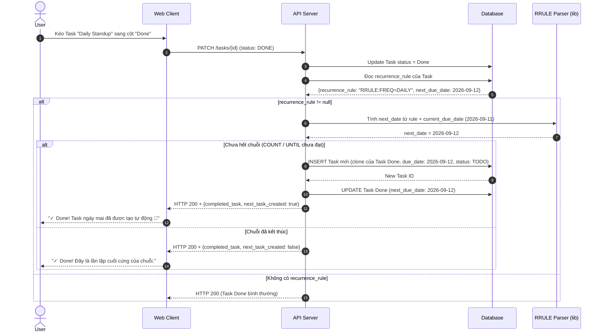

# Feature: Recurring Tasks (FR-PRJ-017)

**Mô tả:** Cho phép người dùng thiết lập Task lặp lại tự động theo lịch định kỳ (hằng ngày, hằng tuần, hằng tháng, hoặc tùy chỉnh theo ngày trong tuần). Khi Task hoàn thành, hệ thống tự động tạo instance Task tiếp theo theo lịch đã cấu hình. Hữu ích cho standup, weekly report, maintenance định kỳ, cả trong môi trường team lẫn cá nhân.
**Priority:** P2 (Medium)

---

## 1. Functional Requirements List

| FR ID | Requirement Description | Input | Output | Associated Business Rule | Priority |
|---|---|---|---|---|---|
| **FR-PRJ-017.1** | **Thiết lập Recurrence:** Khi tạo hoặc sửa Task, user có thể bật chế độ "Repeat" và cấu hình lịch lặp: Daily / Weekly (chọn ngày trong tuần) / Monthly (ngày cố định) / Custom (cron-style). | Form cấu hình Recurrence | Lưu `recurrence_rule` vào Task | BL-PRJ-017.1 | Must-have |
| **FR-PRJ-017.2** | **Tự động tạo Task mới khi Done:** Khi Task có recurrence được chuyển sang `DONE`, hệ thống tự động tạo instance Task mới cho chu kỳ tiếp theo, giữ nguyên: Title, Assignee, Custom Fields, DoD config. | Event Task_Done | Task mới xuất hiện trong Backlog/My Space | BL-PRJ-017.2 | Must-have |
| **FR-PRJ-017.3** | **Quản lý chuỗi (Series Management):** Cho phép user chỉnh sửa "Chỉ Task này" hoặc "Task này và tất cả Task sau" trong chuỗi. Tương tự mô hình của Google Calendar. | Form Edit + Option chọn scope | Cập nhật theo scope | BL-PRJ-017.3 | Should-have |
| **FR-PRJ-017.4** | **Dừng chuỗi (End Recurrence):** Cho phép đặt ngày kết thúc chuỗi lặp (`end_date`) hoặc số lần lặp tối đa (`max_occurrences`). Khi đến điều kiện kết thúc, không tạo thêm instance mới. | Cấu hình end condition | Chuỗi dừng tự động | BL-PRJ-017.1 | Should-have |

---

## 2. Business Logic & Rules

* **BL-PRJ-017.1 (Recurrence Rule Storage):** Lưu lịch lặp theo chuẩn **iCalendar RRULE** (RFC 5545) để tái sử dụng parser library thay vì tự phát minh format. Ví dụ:
  * Daily: `RRULE:FREQ=DAILY`
  * Every Monday & Wednesday: `RRULE:FREQ=WEEKLY;BYDAY=MO,WE`
  * Monthly ngày 1: `RRULE:FREQ=MONTHLY;BYMONTHDAY=1`
  * 10 lần rồi dừng: `RRULE:FREQ=WEEKLY;COUNT=10`
  * Đến ngày 31/12: `RRULE:FREQ=DAILY;UNTIL=20261231T235959Z`

* **BL-PRJ-017.2 (Next Occurrence Generation):**
  * Trigger: Khi `status_id` chuyển sang trạng thái có `category = DONE`.
  * Hệ thống dùng RRULE parser để tính `next_due_date` = ngày tiếp theo sau `current_due_date` theo rule.
  * Task mới được clone từ Task vừa Done: giữ `title`, `assignee_id`, `owner_id`, `project_id`, `sprint_id` (nếu Sprint đang ACTIVE), `custom_fields`, `output_contract_type`.
  * **Không clone:** `description`, `attachments`, `comments`, `subtasks`, `actual_hours` (reset về trạng thái mới).
  * Nếu chuỗi đã hết (vượt `max_occurrences` hoặc `UNTIL` date), không tạo instance mới.

* **BL-PRJ-017.3 (Series Edit Scope):**
  * "Chỉ Task này" → chỉ cập nhật instance hiện tại, không ảnh hưởng rule.
  * "Task này và tất cả sau" → cập nhật `recurrence_rule` từ instance hiện tại trở đi, tách chuỗi.
  * "Tất cả trong chuỗi" → cập nhật `recurrence_rule` gốc.

* **BL-PRJ-017.4 (UI Indicator):** Task thuộc chuỗi lặp hiển thị icon 🔄 trên thẻ Kanban và dòng Table để user nhận biết.

---

## 3. Data Structure

### Entity: Task (Bổ sung)
| Field | Data Type | Required | Constraints |
|---|---|---|---|
| `recurrence_rule` | String | No | iCalendar RRULE string. Null nếu không lặp |
| `recurrence_series_id` | UUID | No | Cùng ID cho tất cả instances trong 1 chuỗi |
| `occurrence_index` | Integer | No | Thứ tự trong chuỗi (1, 2, 3...) |
| `next_due_date` | Date | No | Ngày dự kiến của instance kế tiếp |

---

## 4. Sequence Diagram: Auto-generate Next Occurrence khi Task Done



---

## 5. Tiêu chí Chấp nhận (Acceptance Criteria)

**Là** Team Lead,
**Tôi muốn** tạo Task "Viết báo cáo tuần" lặp lại mỗi thứ Sáu,
**Để** không cần tạo thủ công mỗi tuần và đảm bảo không quên việc định kỳ.

**Acceptance Criteria (Gherkin):**
```gherkin
Given tôi tạo Task "Báo cáo tuần" với lịch lặp "Every Friday"
When tôi lưu Task
Then Task hiển thị icon 🔄 trên thẻ Kanban, due_date = thứ Sáu gần nhất

When tôi hoàn thành (Done) Task "Báo cáo tuần" vào thứ Sáu ngày 12/09
Then hệ thống tự động tạo Task "Báo cáo tuần" mới với due_date = 19/09 (thứ Sáu tuần sau)
And Task mới có cùng Assignee và Custom Fields như Task cũ
And Description và Comments KHÔNG được copy sang Task mới

Given chuỗi Task đã được cấu hình lặp lại 4 lần (COUNT=4)
When tôi hoàn thành instance thứ 4
Then hệ thống KHÔNG tạo thêm instance mới
And hiển thị thông báo "Đây là lần lặp cuối cùng của chuỗi"
```
