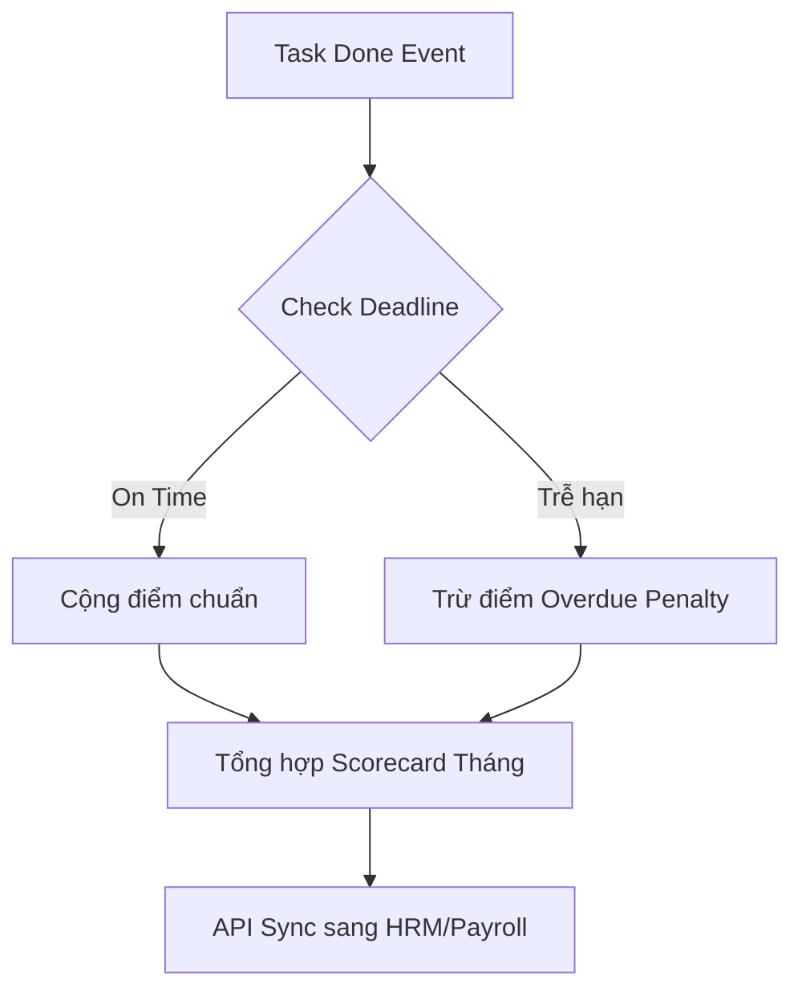
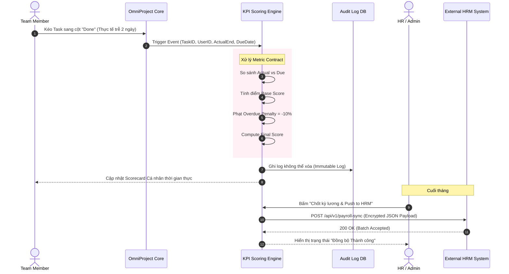

# Phase 2: Control & Analytics


---

## Phần 1: FRD - Control & Analytics

**Mục tiêu:** Đặc tả thuật toán tính điểm KPI chống gian lận, cảnh báo nguồn lực và kiểm soát sức khỏe dự án qua EVM.

---

## 1. Feature: Scoring Engine & HRM Sync (FR-KPI-001)
**Mô tả:** Công cụ tự động tính KPI cuối tháng không bị chi phối bởi cảm tính.

### 1.1 Thuật toán Tính điểm (Metric Contract Formula)
Điểm KPI của Task ($S_{task}$) được tính như sau:
*   $W_{size}$: Trọng số độ phức tạp (Dựa trên Story Points).
*   $C_{ontime}$: Hệ số đúng hạn ($1.0$ nếu đúng hạn, $-0.1$ mỗi ngày trễ, min là $0$).
*   $C_{quality}$: Hệ số chất lượng ($1.0$ nếu pass QA lần 1, $-0.2$ cho mỗi vòng reopen).

**Công thức:**  
$$S_{task} = W_{size} \times (0.6 \times C_{ontime} + 0.4 \times C_{quality})$$

### 1.2 Data Contract (Outbound HRM Sync Payload)
Dữ liệu đẩy sang HRM cuối tháng qua POST Request:
```json
{
  "cycle": "2026-09",
  "employee_id": "HRM-EMP-001",
  "total_score": 95.5,
  "grade": "A",
  "audit_hash": "sha256_hash_to_prevent_tampering"
}
```

### 1.3 Business Logic & Rules
*   **BL-KPI-001.1 (Immutable Log):** Điểm số đã chốt không thể sửa (kể cả Admin) trong Database bằng CRUD thông thường. Muốn điều chỉnh phải tạo `Adjustment_Request` (Ghi âm rõ lý do) để tạo ra bản ghi bù trừ (Offset Record).

---

## 2. Feature: Capacity & Bus Factor Alert (FR-RES-001)
**Mô tả:** Cảnh báo rủi ro về phân bổ nguồn lực.

### 2.1 Thuật toán
*   **Capacity Overload:**  
    $$\text{Workload} = \sum (\text{Story points of active tasks in Sprint})$$  
    Nếu $\text{Workload} > \text{Velocity\_Trung\_Bình\_3\_Sprint\_Gần\_Nhất} \times 1.1$ $\rightarrow$ Báo đỏ.
*   **Bus Factor:**  
    Nếu một Task yêu cầu Skill Tag "DevOps" mà Project chỉ có 1 thành viên sở hữu Skill này $\rightarrow$ Đánh dấu rủi ro `Bus Factor = 1`.

---

## 3. Feature: Financial EVM (FR-FIN-001)
**Mô tả:** Earned Value Management để đo lường hiệu quả chi phí dự án.

### 3.1 Business Logic & Công thức
Dữ liệu đầu vào:
- **BAC (Budget at Completion):** Ngân sách tổng.
- **PV (Planned Value):** Giá trị kế hoạch theo tiến độ thời gian.
- **EV (Earned Value):** Giá trị thực tế đạt được (Dựa trên số % task Done).
- **AC (Actual Cost):** Chi phí thực tế (Lương nhân sự $\times$ thời gian log time).

Các chỉ số tính toán Real-time:
*   **SPI (Schedule Performance Index) = EV / PV** ($< 1.0$ là Trễ tiến độ).
*   **CPI (Cost Performance Index) = EV / AC** ($< 1.0$ là Vượt ngân sách).
*   **EAC (Estimate at Completion) = BAC / CPI** (Dự báo số tiền cuối cùng sẽ tiêu tốn).

### 3.2 Edge Cases
*   **EC-01:** Nhân sự quên log timesheet dẫn đến AC thấp giả tạo (CPI cao ảo).
    *   *Xử lý:* Cảnh báo màu Vàng nếu "Logged hours < 80% Expected hours của Sprint".

---

## 4. Feature: Leadership RAG Heatmap (FR-ANA-001)
**Mô tả:** Bảng màu báo cáo Rủi ro tổng hợp cho Lãnh đạo.

### 4.1 Thuật toán RAG (Red-Amber-Green)
Tính điểm Composite Risk Score (CRS) từ 0-100:
*   SPI $< 0.8 \rightarrow$ +40 pts.
*   CPI $< 0.85 \rightarrow$ +40 pts.
*   Bus Factor = 1 phát sinh $\rightarrow$ +20 pts.

**Xếp loại màu:**
*   $\text{CRS} \ge 60$: **RED** (Nguy hiểm, Lãnh đạo phải can thiệp - Management by Exception).
*   $30 \le \text{CRS} < 60$: **AMBER** (Cảnh báo, PM tự xử lý).
*   $\text{CRS} < 30$: **GREEN** (An toàn).


---

## Phần 2: User Stories & Acceptance Criteria

## Kiểm soát Nguồn lực, KPI & Tài chính (Control & Analytics)

---

### 1. OmniKPI: Scoring & HRM Sync

#### US-KPI-001: Động cơ tính KPI tự động & Chống gian lận
**Là** HR Specialist,
**Tôi muốn** hệ thống tự động tính KPI cuối tháng dựa trên dữ liệu hoàn thành Task thực tế,
**Để** đảm bảo tính công bằng, loại bỏ cảm tính và thao túng điểm số (Anti-Gaming).



**Acceptance Criteria (Gherkin):**
```gherkin
Given một Developer hoàn thành Task trễ 2 ngày so với deadline
When hệ thống chạy batch tính điểm KPI tự động
Then hệ thống phải áp dụng công thức phạt Overdue Penalty làm giảm % điểm On-time
And không một ai (kể cả Admin) được phép sửa trực tiếp con số điểm này trên Database mà không để lại Audit Log
```

#### US-KPI-002: Xuất dữ liệu KPI sang HRM (Outbound Sync)
**Là** HR Manager,
**Tôi muốn** nhấn nút "Chốt kỳ lương",
**Để** hệ thống tự động đẩy dữ liệu điểm năng suất của toàn bộ nhân sự sang phần mềm HRM/Payroll qua API.

**Acceptance Criteria (Gherkin):**
```gherkin
Given kỳ đánh giá tháng 9 đã được cấp quản lý Approve
When tôi nhấn nút "Sync to HRM"
Then hệ thống gửi payload mã hóa (AES-256) chứa danh sách UserID và Final Score sang Endpoint của HRM
And hiển thị trạng thái "Thành công" nếu HRM trả về HTTP 200
```

---

### 2. Resource & Financial Control (EVM)

#### US-RES-001: Cảnh báo Quá tải & Bus Factor
**Là** Resource Manager,
**Tôi muốn** hệ thống cảnh báo khi 1 người bị giao việc vượt quá 100% capacity hoặc là điểm nghẽn duy nhất (Bus Factor = 1),
**Để** có kế hoạch san sẻ nguồn lực hoặc tuyển mới.

**Acceptance Criteria (Gherkin):**
```gherkin
Given Developer A đang có tổng lượng Story Points trong Sprint chiếm 95% thời gian
When tôi assign thêm 1 task lớn cho A
Then hệ thống hiện cảnh báo đỏ "Cảnh báo Overload: Nhân sự này sẽ vượt 120% capacity"
And nếu A là người duy nhất có skill "DevOps", hệ thống cảnh báo màu vàng "Bus Factor = 1"
```

#### US-FIN-001: Earned Value Management (EVM) Dashboard
**Là** Portfolio Manager / CEO,
**Tôi muốn** xem biểu đồ Burn Rate và các chỉ số SPI/CPI của dự án,
**Để** biết dự án đang "đốt tiền" đúng kế hoạch hay đang bị thâm hụt ngân sách.

**Acceptance Criteria (Gherkin):**
```gherkin
Given dự án đang diễn ra và chi phí thực tế (Actual Cost) cao hơn Giá trị thu được (Earned Value)
When tôi mở tab "Financial EVM"
Then chỉ số CPI (Cost Performance Index) sẽ hiển thị $< 1.0$ (Màu đỏ)
And biểu đồ đường Burn Rate hiển thị đường thực tế cắt vọt lên trên đường kế hoạch (Baseline)
```


---

## Phần 3: Biểu đồ Trình tự (Sequence Diagram) - KPI & HRM Sync

## Luồng Tính điểm KPI tự động chống gian lận & Xuất báo cáo HRM



