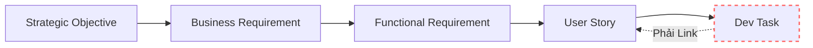
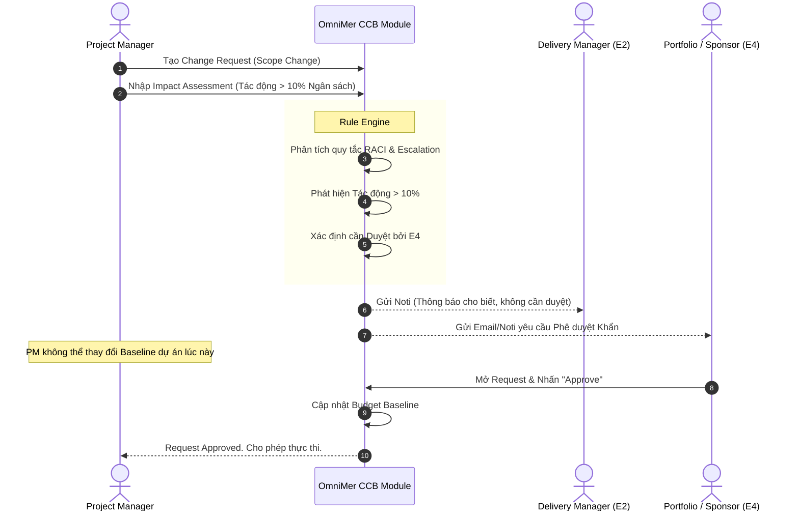

# Phase 3: Governance & Traceability


---

## Phần 1: FRD - Governance & Traceability

**Mục tiêu:** Đặc tả kỹ thuật cho hệ thống truy vết vạn vật, cổng kiểm soát chất lượng và quy trình phê duyệt thay đổi nhằm kiểm soát chuẩn mực Doanh nghiệp.

---

## 1. Feature: End-to-End Traceability Engine (FR-TRC-001)
**Mô tả:** Cơ chế ép buộc liên kết mọi thành phần mã nguồn và công việc với mục tiêu kinh doanh (Chống Vibe Coding).

### 1.1 Business Logic & Rules
*   **BL-TRC-001.1 (Orphan Block Rule):** API `POST /tasks` phải kiểm tra mảng `linked_requirements`. Nếu trống, API ném lỗi `HTTP 400 Bad Request: Orphan tasks are not permitted`.
*   **BL-TRC-001.2 (Traceability Tree Generator):** Hệ thống có khả năng xuất đồ thị JSON hoặc hiển thị UI cây liên kết:  
    `Strategic Objective` $\rightarrow$ `Business Requirement (BR)` $\rightarrow$ `Functional Requirement (FR)` $\rightarrow$ `User Story` $\rightarrow$ `Dev Task` $\rightarrow$ `Git Commit Hash` (nếu tích hợp GitLab/GitHub).

### 1.2 Edge Cases & Error Handling
*   **EC-01:** Một Business Requirement bị Xóa / Đóng.
    *   *Xử lý:* Hệ thống cảnh báo Cascade. Các Task đang mở (Status != Done) link với BR này sẽ bị đánh cờ "Invalidated" (Đỏ) để PM quyết định hủy task hay link sang BR khác.

---

## 2. Feature: Mandatory Handover Gates (FR-GOV-001)
**Mô tả:** Cổng kiểm soát vòng đời dự án. Chặn chuyển Phase nếu tài liệu không đạt chuẩn.

### 2.1 Cấu trúc Checklist (Gate Criteria)
Dữ liệu lưu trữ các Gate (G0 $\rightarrow$ G6) cho mỗi dự án:
```json
{
  "project_id": "uuid",
  "gate_level": "G4_EXECUTION_TO_HANDOVER",
  "mandatory_documents": [
    { "doc_code": "DOC-ERD", "status": "UPLOADED", "file_url": "link", "approved_by": "Tech Lead" },
    { "doc_code": "DOC-USER_MANUAL", "status": "PENDING", "file_url": null, "approved_by": null }
  ]
}
```

### 2.2 Business Logic & Rules
*   **BL-GOV-001.1 (Gate Lock):** Khi PM bấm nút "Chuyển Phase dự án sang Đóng gói", Backend kiểm tra bảng Gate Criteria. Nếu bất kỳ `mandatory_documents` nào có `status == PENDING`, ném HTTP 403 (Gate Validation Failed).
*   **BL-GOV-001.2 (Approval Authority):** File ERD phải do Role `Tech Lead` hoặc `Architect` tick "Approved". Nếu PM tự tick, hệ thống ném lỗi Unauthorized Role.

---

## 3. Feature: Change Control Board - CCB (FR-GOV-002)
**Mô tả:** Quy trình phê duyệt sự cố hoặc thay đổi phạm vi dự án để chống Scope Creep.

### 3.1 Data Contract (Change Request Payload)
```json
{
  "cr_id": "uuid",
  "project_id": "uuid",
  "requested_by": "uuid",
  "description": "Thêm tính năng Chat AI vào app",
  "impact_budget_percent": 15,
  "impact_schedule_days": 10,
  "status": "PENDING_E4_APPROVAL",
  "current_escalation_level": "E4_PORTFOLIO_BOARD"
}
```

### 3.2 Business Logic & Thuật toán Leo thang (Escalation RACI)
Quy tắc tự động tính toán cấp phê duyệt dựa trên `impact_budget_percent`:
*   **Impact $< 5\%$:** Level E1 (Team Lead tự duyệt).
*   **Impact $5\% - 10\%$:** Level E2 (Project Manager duyệt).
*   **Impact $10\% - 20\%$:** Level E3 (Delivery Director duyệt).
*   **Impact $> 20\%$:** Level E4 (Portfolio Board / Sponsor duyệt).

*   **BL-GOV-002.1 (Baseline Freeze):** Chừng nào Change Request (CR) chưa được Status = `APPROVED`, Budget Baseline và Schedule Baseline của dự án (dùng để tính EVM) sẽ không bị thay đổi.
*   **BL-GOV-002.2 (Re-Baselining):** Ngay khi CR ở mức E4 được Approve, hệ thống tự động lưu trữ Version cũ của Baseline (để truy vết lịch sử) và cập nhật Baseline mới, SPI/CPI sẽ tự động nhảy theo công thức mới.


---

## Phần 2: User Stories & Acceptance Criteria

## Quản trị Chiến lược & Nền tảng (Governance & Traceability)

---

### 1. End-to-End Traceability & Chống Vibe Coding

#### US-TRC-001: Bắt buộc liên kết Task (Anti-Orphan Task)
**Là** Project Manager,
**Tôi muốn** hệ thống ép buộc mọi Task tạo ra phải được liên kết (link) với một Business Requirement (BR) hoặc Objective,
**Để** ngăn chặn team code lan man (Vibe Coding) làm lãng phí nguồn lực vào các tính năng không mang lại giá trị.



**Acceptance Criteria (Gherkin):**
```gherkin
Given tôi đang tạo một Dev Task mới trên bảng Scrum
When tôi cố gắng lưu Task mà không chọn "Parent Objective/User Story"
Then hệ thống chặn lại và báo lỗi "Task không được mồ côi (Orphan Task). Hãy liên kết với một Yêu cầu Nghiệp vụ."
```

---

### 2. Mandatory Handover Gates

#### US-GOV-001: Cổng kiểm soát Bàn giao tự động (Handover Gates)
**Là** Quality Assurance (QA) / PM,
**Tôi muốn** hệ thống khóa chức năng "Đóng Phase dự án" nếu chưa upload đủ 18 tài liệu bắt buộc,
**Để** đảm bảo văn hóa làm tài liệu và người sau vào maintain không bị "mù thông tin".

**Acceptance Criteria (Gherkin):**
```gherkin
Given dự án đã code xong toàn bộ tính năng và tôi muốn bấm nút "Release to Production"
When tôi bấm nút "Release"
Then hệ thống kiểm tra Checklist Handover (API Docs, ERD, User Manual, v.v.)
And nếu mục "ERD" chưa được tick và đính kèm link tài liệu, hệ thống chặn việc Release và báo lỗi "Gate Failed: Thiếu tài liệu ERD"
```

---

### 3. Change Control Board (CCB)

#### US-GOV-002: Phê duyệt Thay đổi (Scope Creep Prevention)
**Là** Project Sponsor,
**Tôi muốn** mọi yêu cầu thay đổi phạm vi lớn (Impact > 10% budget) phải đi qua luồng duyệt CCB,
**Để** chi phí dự án không bị đội lên không kiểm soát.

**Acceptance Criteria (Gherkin):**
```gherkin
Given khách hàng yêu cầu thêm tính năng làm tăng thời gian dự án thêm 15%
When PM điền form "Change Request" và nhập Mức độ Tác động (Impact) = High
Then hệ thống tự động khóa trạng thái Request ở mức "Pending E3 Approval"
And gửi thông báo đến Project Sponsor / CCB Member để phê duyệt
And PM không thể tự ý chuyển Request này sang trạng thái "Approved"
```


---

## Phần 3: Biểu đồ Trình tự (Sequence Diagram) - Change Control Board

## Luồng Phê duyệt Thay đổi để chống Scope Creep



