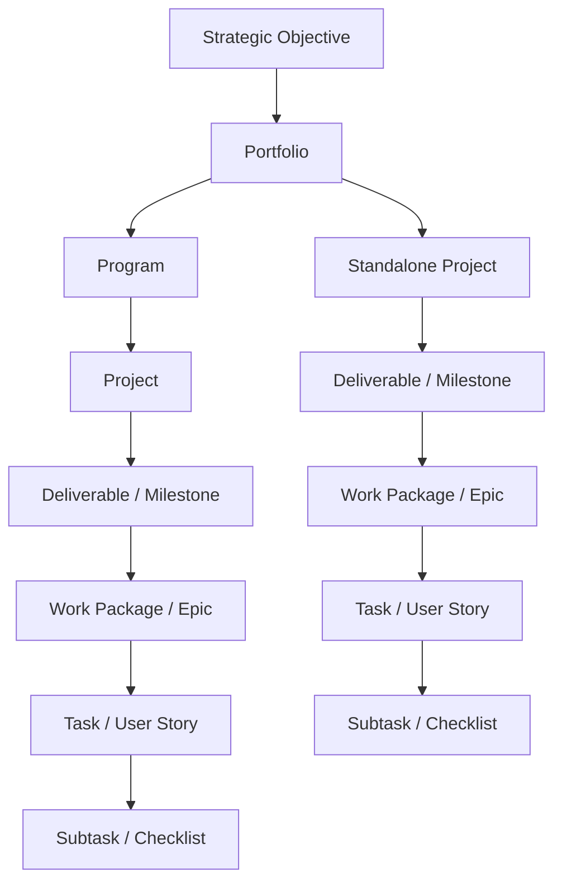
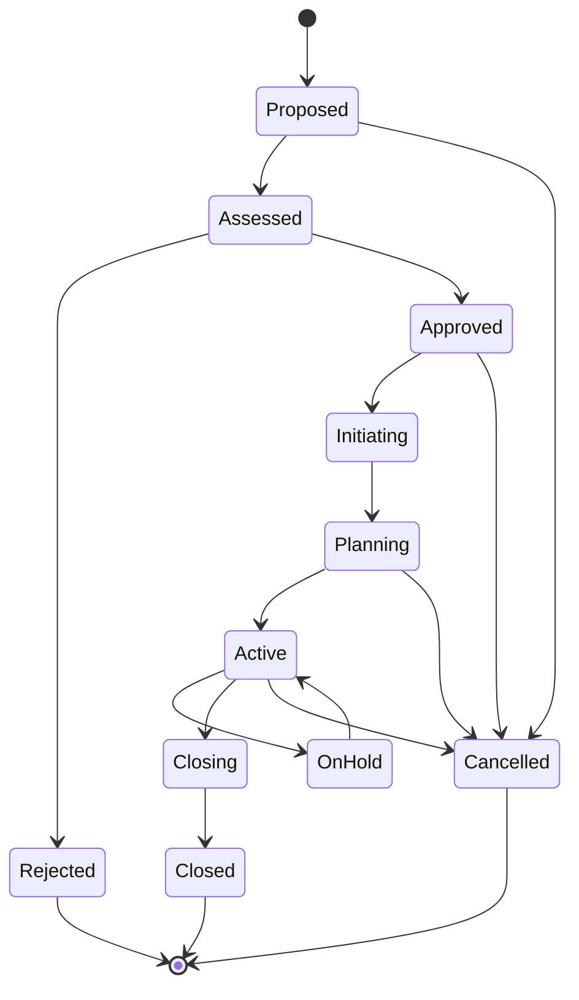
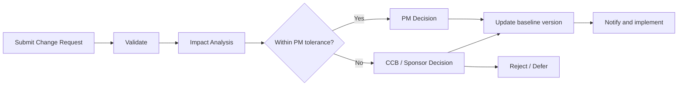

# OmniMer Project Management Operating Model

> **Purpose:** Standardize how an initiative transitions from proposal to benefit realization, independent of whether project teams use Scrum, Kanban, Waterfall, or Hybrid.  
> **Scope:** Portfolio, program, project, work package, and task within OmniProject.  
> **Status:** Baseline Draft  
> **Version:** 1.0.0  
> **Date:** 2026-09-08

---

## 1. Document Positioning

This document serves as the operational backbone, connecting the following documents:

- `project_management_model.md`: reference framework catalog.
- `project_management_scope_levels.md`: management scope by level.
- `project_governance_raci.md`: roles, decision rights, and escalation policies.
- `project_metrics.md`: metrics overview and foundational knowledge.
- `project_metric_dictionary.md`: data contracts and metric formulas used in the system.
- `project_management_traceability.md`: goal, requirement, process, metric, and test traceability.
- `project_risk_issue_management.md`: risk identification, RAG dashboard, issue resolution, and escalation integration.
- `project_resource_capacity_management.md`: capacity planning, resource allocation, conflict detection, and bus factor analysis.
- `project_change_management.md`: change request workflow, CCB, impact assessment, and scope creep prevention.
- `project_financial_cost_management.md`: cost estimation, budget baseline, EVM integration, and vendor management.
- `project_communication_reporting_handover.md`: communication matrix, reporting standards, handover documentation policy, and anti-vibe-coding enforcement.

In case of conflict, the operating rules in this document and approved metric contracts take higher precedence over general reference content.

---

## 2. Operating Principles

1. **Single Source of Truth:** All Kanban, Scrum, Gantt, and Table views share the same project/task entity.
2. **Roles Distinct from System Permissions:** Organizational titles do not automatically grant access permissions; permissions are granted at the workspace and project levels.
3. **Baseline Before Control:** Variance or overdue accountability shall not be calculated without an approved baseline.
4. **Forecast Before Reporting:** Status must reflect expected future outcomes, not merely record past events.
5. **Management by Exception:** Higher authority levels only intervene when tolerances are breached or forecasted to be breached.
6. **Immutable History:** All baseline changes, scores, due dates, and approvals must have versions and audit events.
7. **Human-in-the-Loop:** AI only suggests; humans retain final responsibility for confirming tasks, critical changes, and end-of-period KPIs.
8. **No Misuse of Proxies:** Story points and velocity only support forecasting for the same team, and shall not be used for individual performance ranking or cross-team comparison.
9. **Outcome Before Output:** Completing deliverables does not equate to achieving business benefits; benefits must be measured post-handover.
10. **Controlled Tailoring:** Inapplicable artifacts may be omitted, but the justification and approver must be documented.

---

## 3. Managed Object Structure

### 3.1 Structural Rules

- A project must have exactly one primary `Sponsor` and one primary `Project Manager`.
- A project can belong to a program or stand independently within the portfolio.
- Each deliverable must trace to at least one scope item and acceptance criterion.
- A task must belong to a project; tasks used for KPIs must have an owner, baseline due date, completion rule, and evidence.
- One individual may hold multiple roles, but rights and responsibilities remain distinctly recorded in RACI.

---

## 4. Standard Lifecycle and States

| State | Meaning | Entry Condition | Exit Condition |
| :--- | :--- | :--- | :--- |
| `Proposed` | New idea or need | Has requester and problem statement | Sufficient minimal data for assessment |
| `Assessed` | Assessing value, cost, risk, and capacity | Valid intake | Approve/reject decision |
| `Approved` | Granted authority to initiate | Has decision record and funding envelope | Sponsor/PM assigned |
| `Initiating` | Establishing charter and governance | Approved project | Gate G2 approved |
| `Planning` | Building baseline scope, schedule, cost, quality, and resources | Valid charter | Gate G3 approved |
| `Active` | Execution and control | Approved baseline | Handover, hold, or cancel |
| `OnHold` | Controlled temporary pause | Has reason, owner, and review date | Resume or cancel |
| `Closing` | Acceptance, handover, and financial settlement | Main deliverables completed | Closure checklist approved |
| `Closed` | Formal closure | Gate G5 approved | Benefit review remaining only |
| `Rejected` | Investment denied | Has rejection reason | Can create a new proposal |
| `Cancelled` | Terminated prior to completion | Has decision, impact, and transition plan | Settle remaining obligations |

### 4.1 State Transition Rules

- Changing a project status is a privileged action and must record `actor`, `timestamp`, `from`, `to`, `reason`, and `approval_id`.
- Direct transition from `Proposed` to `Active` is prohibited.
- `OnHold` mandatory requires a next review date and an assigned owner.
- `Closed` and `Cancelled` are immutable states; re-opening requires a new project or an authorized change approval.

---

## 5. Stage Gates

| Gate | Decision | Minimum Dossier / Artifacts | Approver |
| :--- | :--- | :--- | :--- |
| **G0 — Intake** | Bring into assessment? | Problem statement, requester, urgency, expected value | Portfolio Manager or delegate |
| **G1 — Investment** | Approve, reject, defer, or request-more-info? | Business case, rough order of magnitude, preliminary risk, capacity check | Portfolio Board / Sponsor based on threshold |
| **G2 — Initiation** | Sufficient conditions for detailed planning? | Charter, Sponsor, PM, stakeholder map, governance profile | Sponsor |
| **G3 — Baseline** | Authorized to start execution? | Scope/WBS, schedule, budget, quality plan, RAID, resource, and communication plan | Sponsor; Portfolio Board if exceeding threshold |
| **G4 — Acceptance** | Deliverable accepted / released? | Test evidence, UAT/sign-off, defect waiver, release/handover plan | Business Owner / Product Owner |
| **G5 — Closure** | Close the project? | Acceptance, financial closure, open-item transfer, lessons learned, archive | Sponsor |
| **G6 — Benefits** | Are benefits realized and what action is needed? | Benefit measurements vs. business case | Business Owner / Portfolio Board |

Stage gates can be executed asynchronously on OmniProject, but decisions are valid only when fully approved with required approvers and evidence according to the governance profile.

---

## 6. Methodology Selection and Tailoring

| Condition | Preferred Methodology | Mandatory Controls |
| :--- | :--- | :--- |
| Rapidly changing needs, stable product team, frequent increment delivery | Scrum | Product goal, backlog, sprint goal, DoD, review, and retrospective |
| Continuous request stream, prioritized changes, hard to timebox | Kanban | Clear workflow, WIP limit, class of service, flow metrics |
| Stable scope, sequential dependencies, contractual/regulatory sign-off required | Waterfall | Phase gate, baseline, change control, verification plan |
| Fixed milestones combined with iterative discovery/delivery | Hybrid | Milestone governance at project level; Scrum/Kanban at team level |

### 6.1 Tailoring Profile

Each project stores a `Governance Profile` comprising:

- Methodology and rationale for selection.
- Applicable or waived gates.
- Mandatory artifacts.
- Tolerances for scope, time, cost, quality, risk, and benefits.
- Reporting cadence.
- Approval matrix.
- Metric set and version.
- Retention/audit policy.

Waiver of gates or artifacts must document the approver, rationale, and validity period.

---

## 7. Core Control Workflows

### 7.1 Intake from Chat or AI

1. Receive message and preserve original source message ID.
2. AI extracts draft task along with per-field confidence score.
3. Authorized user confirms or edits the draft.
4. System creates task and links evidence back to the source message.
5. If assignee, deadline, or project is missing, task enters `Needs Triage`; it is not automatically moved to execution.

### 7.2 Scope and Change Management

Change Request minimum required fields: rationale, value, affected scope, schedule/cost/resource/risk/quality impact, options, recommendation, approver, and effective baseline version.

### 7.3 RAID Log

- **Risk:** Future event; has probability, impact, exposure, response, trigger, and owner.
- **Assumption:** Condition presumed true for planning; has validation date and owner.
- **Issue:** Event that has occurred; has severity, containment, resolution owner, and SLA.
- **Dependency:** Input/output constraint; has provider, consumer, needed-by date, and status.

When a Risk converts to an Issue, source traceability must be maintained; creating a detached record that loses history is prohibited.

### 7.4 Decision Log

All decisions affecting baseline, architecture, acceptance, KPI, or access rights must record:

- Decision ID and effective date.
- Context, considered options, and final decision.
- Decision owner and approver.
- Consequences, follow-up actions, and affected artifacts.

### 7.5 Quality and Acceptance

- Definition of Ready checks if a task has sufficient information before commitment.
- Definition of Done is an internal team condition for task completion.
- Acceptance Criteria are conditions for Business Owner / Product Owner acceptance of deliverables.
- `Done` does not replace UAT or formal sign-off when required by governance profile.
- Defect waivers must specify severity, residual risk, expiration, and approver.

### 7.6 Closure and Benefit Review

Closure is complete only when:

- Deliverable is accepted or approved exceptions exist.
- Open obligations are handed over to an assigned owner.
- Contracts, invoices, and budgets are reconciled.
- Temporary access and integration secrets are revoked/rotated.
- Lessons learned and archiving are completed.
- Benefit owner, metric, baseline, and review date are confirmed.

---

## 8. Governance Cadence

| Cadence | Focus / Content | Output |
| :--- | :--- | :--- |
| Continuous | Task flow, WIP, blockers, events, and alerts | Updated board / event log |
| Daily | Delivery coordination; not for executive reporting | Next actions, blocker owners |
| Weekly | Milestone forecasts, RAID, dependencies, decisions, and changes | Weekly project health |
| Per Sprint / Release | Planning, review, acceptance, retrospective | Increment and improvement actions |
| Monthly | Cost, capacity, resources, benefits, and metric quality | Program / portfolio review |
| Quarterly | Portfolio priority, funding, strategic alignment | Continue, pivot, hold, or stop |
| Post-implementation | Benefit realization against business case | Benefit review record |

---

## 9. Minimum Artifacts

| Artifact | Level | Default Owner | Mandatory Threshold / Condition |
| :--- | :--- | :--- | :--- |
| Business Case | Portfolio / Project | Business Owner | Prior to G1 |
| Project Charter | Project | Project Manager | Prior to G2 |
| Governance Profile | Project | Project Manager / PMO | Prior to G2 |
| Scope/WBS & Baseline | Project | Project Manager | Prior to G3 |
| RAID Log | Project / Program | Project Manager | From Initiating to Closed |
| Change Log | Project | Project Manager | When baseline exists |
| Decision Log | All levels | Decision Owner | Upon major decision |
| Quality/Acceptance Plan | Project | QA Lead / Business Owner | Prior to G3 |
| Status & Forecast | Project / Program | Project / Program Manager | According to cadence |
| Closure Report | Project | Project Manager | Prior to G5 |
| Benefit Review | Portfolio / Program | Business Owner | At G6 |

---

## 10. Project Health and Exceptions

Project health must not be inferred from a single metric. The system evaluates at minimum:

- Schedule / forecast.
- Cost / funding.
- Scope / change.
- Quality / acceptance.
- Risk / issue / dependency.
- Resource / capacity.
- Stakeholder / value / benefit.

### 10.1 RAG Status

- **Green:** Within tolerance without breach trend.
- **Amber:** Currently within tolerance, but forecasted at risk of breach; requires corrective action.
- **Red:** Breached or forecasted to breach tolerance; requires escalation.
- **Gray:** Insufficient data or missing baseline; must not default to Green.

PM must provide forecast, root cause, impact, options, and recommendations when status is Amber/Red.

---

## 11. Mandatory Events and Audit

Minimum required events:

- `project.proposed`, `project.approved`, `project.state_changed`.
- `baseline.created`, `baseline.approved`, `baseline.superseded`.
- `task.committed`, `task.completed`, `task.reopened`.
- `risk.threshold_breached`, `issue.escalated`, `dependency.missed`.
- `change.submitted`, `change.decided`.
- `deliverable.accepted`, `project.closed`, `benefit.reviewed`.
- `metric.calculated`, `metric.overridden`, `score.approved`, `score.exported`.

Each event includes `event_id`, `workspace_id`, `entity_id`, `actor_id`, `occurred_at`, `source`, `correlation_id`, `schema_version`, and before/after payload for critical changes.

---

## 12. Deployment Readiness Conditions

The operating model is deemed deployment-ready when:

1. Governance profile has an owner and is approved by Sponsor.
2. Lifecycle / state transitions are configured and permission-tested.
3. Stage gates have artifact checklists and approvers assigned.
4. RACI and escalation policies are published.
5. Metric set has a version and data owner assigned.
6. Audit events cannot be modified by business users.
7. At least one pilot project completes from G0 through G6.
