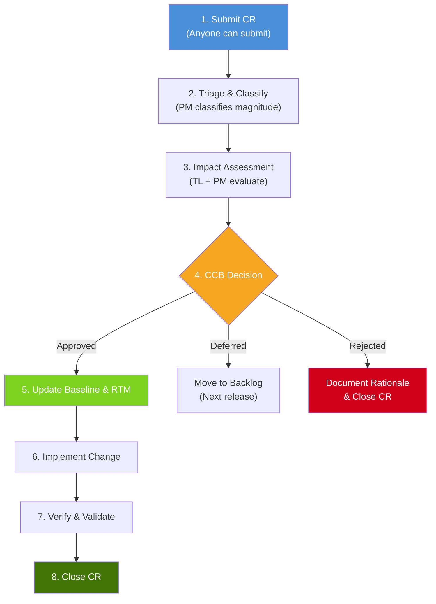
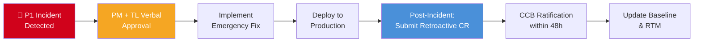

# Project Change Management & Change Control Board

> **Purpose:** Establish a standardized change control process to prevent unmanaged scope creep, ensure every change is assessed for impact on schedule, cost, quality, and traceability, and define clear approval authorities based on change magnitude.  
> **Applies alongside:** `project_management_operating_model.md` (baseline & gates), `project_governance_raci.md` (decision rights), `project_management_traceability.md` (RTM impact)  
> **Status:** Baseline Draft  
> **Version:** 1.0.0  
> **Date:** 2026-09-09

---

## 1. Change Control Principles

1. **No Silent Changes:** Every modification to baselined scope, schedule, cost, or quality targets must be recorded as a formal Change Request (CR). Editing a document, backlog item, or configuration without a CR is a governance violation.
2. **Baseline Before Control:** Change control is only meaningful when a baseline exists. No CR is required for items still in draft/pre-baseline state (before G2 approval per Operating Model).
3. **Impact Before Decision:** No CR shall be approved or rejected without a completed Impact Assessment. Approving on gut feeling creates hidden technical debt and schedule risk.
4. **Proportional Authority:** Small changes are approved quickly by the PM. Large changes require Sponsor or Portfolio Board review. The threshold is explicit, not subjective.
5. **Traceability Continuity:** When a CR is approved, all affected downstream artifacts (Requirements, User Stories, Test Cases, Metrics in RTM) must be updated before the CR is marked as "Implemented."
6. **Emergency Changes Are Still Changes:** Production emergencies may use a fast-track process, but the paperwork must be completed within 48 hours post-deployment. No permanent "emergency" exceptions.
7. **Reversibility Preference:** When feasible, prefer changes that can be rolled back (feature flags, configuration changes) over irreversible changes (database schema migrations, API contract breaks).

---

## 2. Change Request Classification

Every CR is classified by its magnitude to determine the appropriate approval authority and assessment depth.

| Classification | Definition | Examples | Approval Authority | Assessment Depth |
| :--- | :--- | :--- | :--- | :--- |
| **Cosmetic** | Visual/text-only changes with zero functional, schedule, or cost impact | Fixing a typo in UI label, adjusting padding, correcting a tooltip | Team Lead (TL) | Quick review, no formal IA |
| **Minor** | Small functional changes within current sprint capacity and budget (< 5% impact) | Adding a filter option, changing a validation rule, adding a report column | Project Manager (PM) | Light Impact Assessment (1-page) |
| **Major** | Significant changes affecting schedule, cost, or scope (5–15% impact) | Adding a new module, changing integration partner, major UI redesign | Project Sponsor (SP) | Full Impact Assessment |
| **Critical** | Fundamental changes affecting project viability, contracts, or architecture (> 15% impact) | Changing tech stack, pivoting product direction, renegotiating contract deadline | Portfolio Board (PB) | Full Impact Assessment + Business Case Update |

---

## 3. Change Request Workflow

### 3.1 Workflow Step Details

| Step | Activity | Responsible | Output | SLA |
| :--- | :--- | :--- | :--- | :--- |
| **1. Submit** | Requester describes the desired change, business justification, and urgency | Any stakeholder | CR record with unique ID | — |
| **2. Triage** | PM reviews CR, assigns classification (Cosmetic/Minor/Major/Critical), and routes accordingly | PM | CR classified and assigned | ≤ 1 business day |
| **3. Impact Assessment** | Technical Lead and PM evaluate impact on schedule, cost, quality, scope, risk, and RTM traceability | TL + PM (+ QA for quality impact) | Impact Assessment document | ≤ 2 days (Minor), ≤ 5 days (Major/Critical) |
| **4. CCB Decision** | Change Control Board reviews IA and decides: Approve, Defer, or Reject | CCB (composition per classification) | Decision record with rationale |  Next scheduled CCB meeting, or ad-hoc for Critical |
| **5. Update Baseline** | Update affected baselines: Schedule, Budget, Scope, RTM.csv, affected documents | PM + BA | Updated baseline artifacts | ≤ 2 business days post-approval |
| **6. Implement** | Development team executes the approved change | TL + Team | Code/deliverable changes | Per sprint planning |
| **7. Verify** | QA validates the change meets acceptance criteria; PM verifies baseline updates are complete | QA + PM | Verification evidence | Per test cycle |
| **8. Close** | CR is formally closed; change log updated | PM | Closed CR record | ≤ 1 business day post-verification |

---

## 4. Change Control Board (CCB)

### 4.1 CCB Composition by Classification

| Classification | CCB Composition | Quorum |
| :--- | :--- | :--- |
| **Cosmetic** | Team Lead (TL) — no formal CCB required | TL sign-off |
| **Minor** | PM + TL | Both must concur |
| **Major** | Project Sponsor + PM + TL + QA Lead | Sponsor + PM + 1 other |
| **Critical** | Portfolio Board + Sponsor + PM + TL + FIN (Finance) | Portfolio Board chair + Sponsor + PM |

### 4.2 CCB Meeting Cadence

| Type | Frequency | Purpose |
| :--- | :--- | :--- |
| **Standing CCB** | Bi-weekly (aligned with Sprint Review) | Review all pending Minor and Major CRs accumulated since last meeting |
| **Ad-hoc CCB** | On demand | Called for Critical CRs or Emergency Changes that cannot wait for the standing meeting |

### 4.3 CCB Decision Options

| Decision | Meaning | Next Step |
| :--- | :--- | :--- |
| **Approved** | Change is accepted. Proceed to baseline update and implementation. | Update baseline → Implement → Verify → Close |
| **Approved with Conditions** | Change is accepted but with constraints (e.g., "only if delivered within current sprint," "only Opex, no Capex"). | Document conditions → Proceed with constraints |
| **Deferred** | Change has merit but is not a priority for the current release/phase. Moved to backlog. | Add to product backlog with target release version |
| **Rejected** | Change is declined. Document rationale clearly for audit trail. | Close CR with rejection rationale |
| **Request More Information** | Assessment is insufficient for a decision. Request additional analysis. | Requester/PM provides additional data → Re-submit |

---

## 5. Impact Assessment Template

Every Minor, Major, and Critical CR requires a formal Impact Assessment (IA).

### 5.1 Impact Assessment Form

| Section | Content |
| :--- | :--- |
| **CR-ID** | `CR-{Project}-{NNN}` (e.g., `CR-OKP-042`) |
| **CR Title** | Short descriptive title |
| **Requested By** | Name and role of the requester |
| **Date Submitted** | YYYY-MM-DD |
| **Classification** | Cosmetic / Minor / Major / Critical |
| **Business Justification** | Why this change is needed. What problem does it solve or what opportunity does it capture? |

### 5.2 Impact Dimensions

| Dimension | Current Baseline | Impact of CR | Delta | Severity |
| :--- | :--- | :--- | :--- | :---: |
| **Schedule** | Delivery: 2026-11-15 | +2 weeks for new module | +14 days | 🟡 |
| **Cost** | Budget: $150,000 | +$12,000 (additional dev hours) | +8% | 🟡 |
| **Scope** | 24 User Stories | +3 new User Stories | +12.5% | 🔴 |
| **Quality** | 95% test coverage target | Unchanged | 0% | 🟢 |
| **Risk** | Composite Score: 35 (AMBER) | New dependency adds risk | +10 points | 🟡 |
| **Resources** | Team of 5 fully allocated | Need 0.5 FTE QA for 2 sprints | Capacity conflict | 🟡 |

### 5.3 Traceability Impact

| Artifact | Affected? | Details |
| :--- | :---: | :--- |
| **BRD** | ☐ Yes / ☑ No | — |
| **FRD/SRS** | ☑ Yes | Add FR-047, FR-048, FR-049 |
| **User Stories** | ☑ Yes | Add US-112, US-113, US-114 |
| **Test Cases** | ☑ Yes | Add TC-201 through TC-208 |
| **RTM.csv** | ☑ Yes | 3 new rows linking FR→US→TC |
| **Architecture Document** | ☐ Yes / ☑ No | — |
| **API Documentation** | ☑ Yes | 2 new endpoints |
| **Metric Dictionary** | ☐ Yes / ☑ No | — |
| **Budget Baseline** | ☑ Yes | Re-baseline required |
| **Schedule Baseline** | ☑ Yes | Re-baseline required |

---

## 6. Approval Authority Matrix

Clear, unambiguous thresholds for who approves what:

| Impact Level | Schedule Impact | Cost Impact | Scope Impact | Approval Authority |
| :--- | :--- | :--- | :--- | :--- |
| **Cosmetic** | 0 days | $0 | 0 stories | Team Lead (TL) |
| **Minor** | ≤ 3 days | < 5% budget | ≤ 2 stories | Project Manager (PM) |
| **Major** | 3–15 days | 5–15% budget | 3–10 stories | Project Sponsor (SP) |
| **Critical** | > 15 days | > 15% budget | > 10 stories or architectural change | Portfolio Board (PB) |

> [!IMPORTANT]
> If a CR impacts multiple dimensions at different levels, the **highest classification wins**. For example: if schedule impact is Minor but cost impact is Major, the CR is classified as Major.

---

## 7. Emergency Change Process

For P1/S1 production incidents requiring immediate code or configuration changes that cannot wait for the standard CCB process.

### Emergency Change Rules

1. Verbal approval from PM + TL is sufficient to proceed immediately.
2. The fix must be deployed with standard CI/CD pipeline (no manual production changes without audit trail).
3. A formal CR must be submitted within **24 hours** of the emergency deployment.
4. The CCB must ratify the emergency change within **48 hours**. If the CCB rejects the change, a rollback plan must be executed.
5. Post-incident review (PIR) is mandatory within **5 business days** for all emergency changes.

---

## 8. Change Log

All CRs are tracked in a centralized Change Log:

| CR-ID | Date | Requester | Title | Classification | Decision | Approver | Implementation Sprint | Status |
| :--- | :--- | :--- | :--- | :---: | :---: | :--- | :---: | :---: |
| CR-OKP-001 | 2026-09-01 | PO | Add export to PDF | Minor | ✅ Approved | PM | Sprint 13 | Closed |
| CR-OKP-002 | 2026-09-03 | Client | New payment method | Major | ✅ Approved | Sponsor | Sprint 14-15 | In Progress |
| CR-OKP-003 | 2026-09-05 | Dev | Upgrade to Node 22 | Minor | ⏸️ Deferred | PM | v2.1 Backlog | Deferred |
| CR-OKP-004 | 2026-09-07 | QA | Remove legacy API v1 | Critical | 🔍 Under Review | — | — | Pending CCB |

---

## 9. Scope Creep Prevention Metrics

Track change control effectiveness using these indicators (linked to [Metric Dictionary](file:///Users/macbookair/Downloads/omnimer_team/docs/business_logic/6-project_metric_dictionary.md)):

| Metric | Formula | Target | Warning Threshold |
| :--- | :--- | :---: | :---: |
| **Scope Creep Rate** | $\frac{\text{Approved CRs (scope-increasing)}}{\text{Original Baseline Scope}} \times 100\%$ | < 10% | > 15% |
| **CR Approval Cycle Time** | Average days from CR submission to CCB decision | ≤ 5 days (Minor), ≤ 10 days (Major) | > 2× target |
| **CR Rejection Rate** | $\frac{\text{Rejected CRs}}{\text{Total CRs Submitted}} \times 100\%$ | 20–40% (healthy filtering) | < 10% (rubber-stamping) or > 60% (over-restrictive) |
| **Emergency Change Rate** | $\frac{\text{Emergency CRs}}{\text{Total CRs}} \times 100\%$ | < 5% | > 10% |
| **Baseline Re-Baseline Count** | Number of formal baseline updates per phase | ≤ 2 per phase | > 3 per phase |

---

## 10. Integration with Project Ecosystem

| Document | Integration Point |
| :--- | :--- |
| [Operating Model](file:///Users/macbookair/Downloads/omnimer_team/docs/business_logic/1-project_management_operating_model.md) | CRs are reviewed at gate reviews (G3, G4). Baseline updates require gate-level re-approval for Major/Critical CRs. |
| [RACI & Governance](file:///Users/macbookair/Downloads/omnimer_team/docs/business_logic/4-project_governance_raci.md) | CCB composition maps to governance roles (PB, SP, PM, TL). Decision rights follow the governance hierarchy. |
| [Traceability](file:///Users/macbookair/Downloads/omnimer_team/docs/business_logic/7-project_management_traceability.md) | Every approved CR must update the RTM.csv with new/modified linkages (FR→US→TC→MET). |
| [Risk Management](file:///Users/macbookair/Downloads/omnimer_team/docs/business_logic/8-project_risk_issue_management.md) | Major/Critical CRs may introduce new risks → update Risk Register. Emergency CRs often originate from materialized risks. |
| [Resource Management](file:///Users/macbookair/Downloads/omnimer_team/docs/business_logic/9-project_resource_capacity_management.md) | CRs that add scope may require additional resource allocation → check capacity before approval. |
| [Financial Management](file:///Users/macbookair/Downloads/omnimer_team/docs/business_logic/11-project_financial_cost_management.md) | CRs with cost impact require budget re-baseline and may trigger EAC recalculation. |

---
