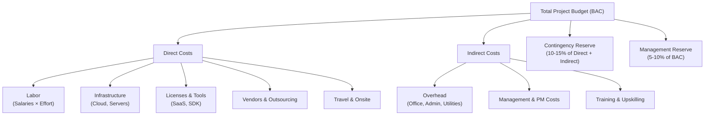
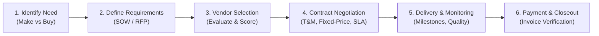

# Project Financial & Cost Management

> **Purpose:** Establish the financial foundation for project budgeting, cost estimation, expenditure tracking, and vendor management — providing the baseline data that feeds the CPI, ROI, and CV metrics defined in `project_metrics.md`.  
> **Applies alongside:** `project_management_operating_model.md` (budget baseline at G2/G3), `project_metrics.md` (EVM formulas), `project_metric_dictionary.md` (metric contracts)  
> **Status:** Baseline Draft  
> **Version:** 1.0.0  
> **Date:** 2026-09-09

---

## 1. Financial Governance Principles

1. **Budget Baseline Before Spending:** No project expenditure is authorized until a budget baseline is approved at Gate G2 (Plan Baselined) per the [Operating Model](file:///Users/macbookair/Downloads/omnimer_team/docs/business_logic/1-project_management_operating_model.md). Pre-G2 spending requires explicit Sponsor pre-authorization.
2. **No Retroactive Approvals:** Expenses incurred without prior budget allocation cannot be approved after the fact. They must be reported as exceptions to the Portfolio Board.
3. **Transparency:** All project financial data (budget, actuals, forecast) is visible to PM, Sponsor, PMO, and Finance. No shadow budgets.
4. **Forecast-Driven, Not History-Driven:** Financial reports must include Estimate at Completion (EAC) projections, not only historical spend. Leadership needs to know where the project *will end*, not just where it *has been*.
5. **Separation of Estimation and Approval:** The person estimating cost shall not be the sole approver of the same budget. Cost estimation is a collaborative exercise validated by at least two independent perspectives.
6. **Contingency Is Not Bonus Budget:** Contingency and Management Reserve exist to absorb identified and unknown risks, respectively. They are not available for scope expansion.
7. **Capex/Opex Classification at Source:** Every line item must be classified as Capital Expenditure or Operational Expenditure at the time of budgeting, not retroactively during financial audits.

---

## 2. Cost Estimation Methods

Three complementary methods are used depending on project maturity and available data:

### 2.1 Estimation Methods Comparison

| Method | When to Use | Accuracy | Speed | Data Required |
| :--- | :--- | :---: | :---: | :--- |
| **Top-Down (Analogous)** | Early stages (G0–G1), high-level feasibility | ±25–50% | Fast | Historical data from similar past projects |
| **Bottom-Up (Detailed)** | Planning stage (G1–G2), detailed budgeting | ±5–15% | Slow | WBS with task-level estimates from team |
| **Parametric** | Any stage with statistical models available | ±10–25% | Medium | Historical data + statistical model (e.g., cost per function point, cost per API endpoint) |

### 2.2 Top-Down (Analogous) Estimation

Uses historical data from similar completed projects as a baseline, adjusted for known differences.

$$\text{Estimate}_{\text{new}} = \text{Actual Cost}_{\text{reference}} \times \frac{\text{Scope}_{\text{new}}}{\text{Scope}_{\text{reference}}} \times AF$$

Where $AF$ = Adjustment Factor accounting for complexity, technology, and team experience differences (typically 0.8 – 1.5).

**Use Case:** Gate G0/G1 — quick ballpark to determine if the project is financially viable before committing to detailed planning.

### 2.3 Bottom-Up (Detailed) Estimation

Builds the total cost from individual Work Breakdown Structure (WBS) elements:

$$\text{Total Project Cost} = \sum_{k=1}^{N} \left( \text{Effort}_{k} \times \text{Rate}_{k} \right) + C_{\text{infra}} + C_{\text{license}} + C_{\text{vendor}} + C_{\text{travel}} + C_{\text{other}}$$

Where:

| Symbol | Definition |
| :--- | :--- |
| $\text{Effort}_k$ | Estimated person-hours for WBS element $k$ |
| $\text{Rate}_k$ | Blended hourly cost rate for the assigned role (salary + benefits + overhead) |
| $C_{\text{infra}}$ | Infrastructure costs (cloud hosting, servers, networking) |
| $C_{\text{license}}$ | Software license and subscription costs |
| $C_{\text{vendor}}$ | Third-party vendor and outsourcing costs |
| $C_{\text{travel}}$ | Travel and onsite costs |
| $C_{\text{other}}$ | Training, certification, miscellaneous costs |

**Use Case:** Gate G2 — the definitive budget baseline for project execution.

### 2.4 Parametric Estimation

Uses statistical relationships between historical data and project variables:

$$\text{Estimate} = \text{Unit Cost} \times \text{Number of Units} \times CF$$

**Common Parametric Models:**

| Domain | Unit | Typical Unit Cost Range (Reference) |
| :--- | :--- | :--- |
| Backend API | Per endpoint | $800 – $3,000 |
| Frontend UI | Per screen/page | $1,200 – $5,000 |
| Mobile Feature | Per user story | $2,000 – $8,000 |
| Data Pipeline | Per integration | $3,000 – $15,000 |
| QA Automation | Per test case | $200 – $800 |

Where $CF$ = Complexity Factor (Simple = 0.7, Medium = 1.0, Complex = 1.5, Very Complex = 2.0).

> [!NOTE]
> Parametric costs above are reference ranges only. Each organization must calibrate unit costs based on their own historical data and labor rates.

---

## 3. Budget Baseline

### 3.1 Budget Structure



### 3.2 Budget Component Definitions

| Component | Definition | Typical % of Total | Managed By |
| :--- | :--- | :---: | :--- |
| **Direct Labor** | Salaries, benefits, and overhead burden for team members working on project tasks | 50–70% | PM |
| **Infrastructure** | Cloud hosting (AWS/GCP/Azure), servers, networking, storage, monitoring tools | 10–20% | TL / DevOps |
| **Licenses & Tools** | Software licenses, SaaS subscriptions, development tools, testing platforms | 5–10% | TL / PM |
| **Vendors & Outsourcing** | Third-party development, consulting, specialized services | 0–25% (varies) | PM / Procurement |
| **Overhead** | Office space, utilities, administrative support (allocated proportionally) | 5–15% | Finance |
| **Contingency Reserve** | Budget set aside for **identified risks** that may materialize | 10–15% of base cost | PM (with Sponsor approval to use) |
| **Management Reserve** | Budget set aside for **unknown unknowns** — risks not yet identified | 5–10% of BAC | Sponsor / Portfolio Board only |

### 3.3 Budget Baseline Approval

| Gate | Financial Artifact | Accuracy | Approver |
| :--- | :--- | :---: | :--- |
| **G0 – Idea Screen** | ROM (Rough Order of Magnitude) | ±50% | Portfolio Board (go/no-go) |
| **G1 – Charter Approved** | Preliminary Budget (Top-down) | ±25% | Sponsor |
| **G2 – Plan Baselined** | **Definitive Budget Baseline (BAC)** | ±10–15% | Sponsor + Finance |
| **G3+ – Execution** | Re-baseline only via approved CR | Per CR delta | Per [Change Management](file:///Users/macbookair/Downloads/omnimer_team/docs/business_logic/10-project_change_management.md) |

> [!IMPORTANT]
> The **Budget at Completion (BAC)** approved at G2 becomes the financial baseline for all Earned Value calculations. Any modification to BAC requires a formal Change Request and re-baseline.

---

## 4. Earned Value Management (EVM) Integration

The following EVM metrics connect this financial framework to the formulas in [project_metrics.md](file:///Users/macbookair/Downloads/omnimer_team/docs/business_logic/5-project_metrics.md):

### 4.1 Core EVM Terminology

| Term | Symbol | Definition | Source |
| :--- | :--- | :--- | :--- |
| **Budget at Completion** | BAC | Total approved budget baseline | This document (G2 approval) |
| **Planned Value** | PV | Budgeted cost of work *scheduled* to date | Schedule baseline × cost rates |
| **Earned Value** | EV | Budgeted cost of work *actually completed* to date | % completion × BAC per WBS element |
| **Actual Cost** | AC | Actual expenditure to date | Finance / accounting system |

### 4.2 Derived Indicators

| Indicator | Formula | Good | Warning | Critical |
| :--- | :--- | :---: | :---: | :---: |
| **Cost Variance (CV)** | $EV - AC$ | $CV \ge 0$ | $-5\% \le CV < 0$ | $CV < -5\%$ of BAC |
| **Cost Performance Index (CPI)** | $\frac{EV}{AC}$ | $CPI \ge 1.0$ | $0.9 \le CPI < 1.0$ | $CPI < 0.9$ |
| **Estimate at Completion (EAC)** | $\frac{BAC}{CPI}$ | $EAC \le BAC$ | $BAC < EAC \le BAC \times 1.1$ | $EAC > BAC \times 1.1$ |
| **Estimate to Complete (ETC)** | $EAC - AC$ | — | — | — |
| **Variance at Completion (VAC)** | $BAC - EAC$ | $VAC \ge 0$ | $-5\% \le VAC < 0$ | $VAC < -5\%$ |
| **To-Complete Performance Index (TCPI)** | $\frac{BAC - EV}{BAC - AC}$ | $TCPI \le 1.0$ | $1.0 < TCPI \le 1.1$ | $TCPI > 1.1$ |

> [!TIP]
> **Quick reading guide:** CPI < 1.0 means "for every $1 spent, we're getting less than $1 of value." If CPI = 0.85, the project is 15% over budget relative to progress. TCPI > 1.0 means the team needs to be *more* efficient than planned for the remainder to stay within budget.

### 4.3 EVM Dashboard Example

| Period | PV | EV | AC | SPI | CPI | EAC | VAC | Status |
| :--- | ---: | ---: | ---: | :---: | :---: | ---: | ---: | :---: |
| Month 1 | $30,000 | $28,000 | $27,000 | 0.93 | 1.04 | $144,231 | $5,769 | 🟢 |
| Month 2 | $65,000 | $58,000 | $62,000 | 0.89 | 0.94 | $159,574 | −$9,574 | 🟡 |
| Month 3 | $100,000 | $85,000 | $95,000 | 0.85 | 0.89 | $168,539 | −$18,539 | 🔴 |

---

## 5. Burn Rate & Cash Flow Tracking

### 5.1 Burn Rate

$$\text{Burn Rate}_{\text{monthly}} = \frac{\text{AC to Date}}{\text{Number of Elapsed Months}}$$

$$\text{Months Remaining at Current Burn} = \frac{\text{Remaining Budget (BAC - AC)}}{\text{Burn Rate}_{\text{monthly}}}$$

### 5.2 Budget Burn-Down Chart

Track planned spend vs actual spend over time. The chart should show:

```
Budget ($)
│
│ ╲  Planned Burn (S-curve)
│  ╲
│   ╲───── Actual Burn
│    ╲
│     ╲
│──────╲──────────── BAC Line
│       ╲
└────────────────────── Time
        G2    G3    G4   G5  G6
```

- **Actual above Planned** = spending faster than planned (potential overrun)
- **Actual below Planned** = under-spending (may indicate delayed work, not savings)

---

## 6. Vendor & Procurement Management

### 6.1 Procurement Lifecycle



### 6.2 Contract Types

| Contract Type | Risk Distribution | When to Use | Budget Predictability |
| :--- | :--- | :--- | :---: |
| **Fixed-Price (Lump Sum)** | Vendor bears cost risk | Well-defined scope with clear deliverables | 🟢 High |
| **Time & Materials (T&M)** | Client bears cost risk | Scope is evolving or exploratory; R&D work | 🔴 Low |
| **T&M with Cap** | Shared risk | Partially defined scope; cap protects budget ceiling | 🟡 Medium |
| **Cost-Plus** | Client bears cost risk + guaranteed margin | Government contracts, cost-reimbursable research | 🔴 Low |

### 6.3 Vendor Performance Monitoring

| KPI | Target | Measurement |
| :--- | :---: | :--- |
| On-Time Delivery Rate | ≥ 95% | % of milestones delivered on or before agreed date |
| Quality Acceptance Rate | ≥ 90% | % of deliverables accepted on first review |
| SLA Compliance | ≥ 99% | Uptime, response time, resolution time per SLA terms |
| Invoice Accuracy | 100% | No disputed invoices; all charges match contract terms |

---

## 7. Capex vs Opex Classification

Every financial line item must be classified for accounting and tax purposes:

| Category | **Capex (Capital Expenditure)** | **Opex (Operational Expenditure)** |
| :--- | :--- | :--- |
| **Definition** | One-time investment creating a long-term asset | Recurring cost for day-to-day operations |
| **Examples** | Perpetual software license, custom platform development, server hardware purchase | SaaS subscription (monthly/annual), cloud hosting (pay-as-you-go), maintenance contracts |
| **Accounting Treatment** | Capitalized on balance sheet; amortized over useful life | Expensed in the period incurred |
| **Budget Impact** | Front-loaded cash requirement | Spread evenly over time |
| **Tax Implication** | Depreciation/amortization deductions over years | Full deduction in current year |

> [!NOTE]
> Cloud infrastructure (AWS, GCP, Azure) is typically Opex. Custom software development may be Capex if it creates a capitalized asset per company accounting policy. Consult Finance for project-specific classification.

---

## 8. Financial Reporting Cadence

| Report | Frequency | Audience | Content |
| :--- | :--- | :--- | :--- |
| **Burn Rate Dashboard** | Weekly | PM, TL | Weekly AC vs PV, burn rate trend |
| **EVM Status Report** | Bi-weekly / Per Sprint | PM, Sponsor | SPI, CPI, CV, SV, EAC, VAC |
| **Budget Variance Report** | Monthly | Sponsor, Finance, PMO | Detailed cost breakdown by category, variance analysis, forecast |
| **Financial Forecast (EAC)** | Monthly | Sponsor, Portfolio Board | EAC projection, TCPI, recommended corrective actions |
| **Vendor Payment Report** | Monthly | PM, Finance | Invoices received, approved, paid; outstanding obligations |
| **Quarter-End Financial Review** | Quarterly | Portfolio Board, Finance | Portfolio-level budget health, ROI tracking, Capex/Opex actuals vs plan |

---

## 9. Integration with Project Ecosystem

| Document | Integration Point |
| :--- | :--- |
| [Operating Model](file:///Users/macbookair/Downloads/omnimer_team/docs/business_logic/1-project_management_operating_model.md) | Budget baseline approved at G2. EVM reporting starts at G3. Financial closure at G6. |
| [Metrics](file:///Users/macbookair/Downloads/omnimer_team/docs/business_logic/5-project_metrics.md) | CPI, ROI, CV formulas reference the PV/EV/AC data sourced from this framework. |
| [Metric Dictionary](file:///Users/macbookair/Downloads/omnimer_team/docs/business_logic/6-project_metric_dictionary.md) | Financial metrics follow the same metric contract format (formula, source, direction, owner). |
| [Change Management](file:///Users/macbookair/Downloads/omnimer_team/docs/business_logic/10-project_change_management.md) | CRs with cost impact trigger budget re-baseline. BAC changes only via approved CR. |
| [Resource Management](file:///Users/macbookair/Downloads/omnimer_team/docs/business_logic/9-project_resource_capacity_management.md) | Labor cost = Allocation% × Rate × Duration. Capacity changes affect Direct Labor budget. |
| [Risk Management](file:///Users/macbookair/Downloads/omnimer_team/docs/business_logic/8-project_risk_issue_management.md) | Contingency Reserve drawn to fund risk mitigations. Financial risk category feeds Risk Register. |

---
