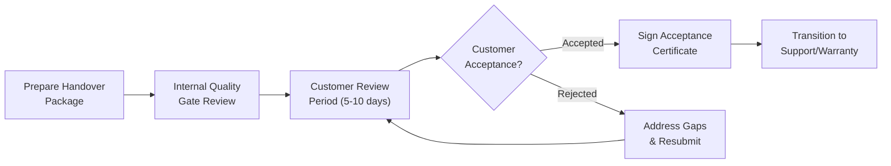

# Project Communication, Reporting & Handover Documentation

> **Purpose:** Define communication channels, meeting cadence, reporting standards with RAG status, and — critically — a **mandatory handover documentation policy** that ensures no project is ever handed over with "just the source code." This document enforces documentation discipline to prevent irresponsible development, protect knowledge continuity, and guarantee smooth onboarding for new team members and customer handover.  
> **Applies alongside:** All business logic documents in this suite  
> **Status:** Baseline Draft  
> **Version:** 1.0.0  
> **Date:** 2026-09-09

---

## 1. Communication & Documentation Principles

1. **No Undocumented Decisions:** Every architectural choice, scope change, and business rule decision must be recorded in writing. Verbal agreements that are not documented do not exist for governance purposes.
2. **Write for the Stranger:** All documentation must be written as if the reader has zero context about the project. If a new developer cannot understand the system's business logic from the documentation alone (without reading source code), the documentation has failed.
3. **Documentation Is Not Optional:** Documentation is a first-class deliverable, not an afterthought. It is tracked, reviewed, and accepted at gate reviews with the same rigor as code.
4. **Source Code Is Not Documentation:** Code explains *how* something works. Documentation explains *why* it exists, *what business problem* it solves, *what decisions* were made, and *what alternatives* were rejected. Handing over source code without documentation is a governance failure.
5. **Continuous, Not Batch:** Documentation is maintained alongside development — not crammed in the last sprint before handover. Stale documentation is worse than no documentation because it creates false confidence.
6. **Single Source of Truth:** Each piece of information has exactly one authoritative location. Duplication creates drift. Cross-reference instead of copy-paste.
7. **Accessible, Not Buried:** Documentation must be stored in the project's shared repository (not in personal drives, local machines, or email attachments) and organized in a navigable structure.

---

## 2. Meeting Cadence Matrix

### 2.1 Standard Meeting Schedule

| Meeting | Frequency | Duration | Participants | Purpose | Output |
| :--- | :--- | :---: | :--- | :--- | :--- |
| **Daily Standup** | Daily | 15 min | Team Members, SM/PM | Sync progress, identify blockers, flag risks | Updated task board; blocker escalation if needed |
| **Sprint Planning** | Per Sprint (Day 1) | 2–4 hours | PM, PO, TL, Team | Commit sprint scope based on capacity | Sprint Backlog with committed stories |
| **Sprint Review / Demo** | Per Sprint (Last Day) | 1–2 hours | PM, PO, TL, Team, Stakeholders | Demonstrate completed increment; collect feedback | Accepted/rejected stories; feedback log |
| **Sprint Retrospective** | Per Sprint (Last Day) | 1–1.5 hours | PM/SM, TL, Team | Inspect process; identify improvements | Action items for next sprint |
| **Weekly Sync** | Weekly | 30–60 min | PM, TL, PO | Project health review: RAG status, risks, blockers, CR status | Weekly Status Report |
| **Bi-Weekly CCB** | Every 2 weeks | 1 hour | CCB members (per [Change Mgmt](file:///Users/macbookair/Downloads/omnimer_team/docs/business_logic/10-project_change_management.md)) | Review pending Change Requests | CR decisions (Approve/Defer/Reject) |
| **Monthly Steering Committee** | Monthly | 1–2 hours | Sponsor, PM, PMO, Finance | Executive project health review; budget/schedule variance; strategic decisions | Steering Committee Minutes; escalation decisions |
| **Quarterly Strategy Review** | Quarterly | 2–4 hours | Portfolio Board, Sponsors, PMO | Portfolio health; resource rebalancing; project prioritization | Portfolio decisions; budget reallocation |

### 2.2 Meeting Hygiene Rules

1. Every meeting must have a published **agenda** at least 24 hours in advance.
2. Every meeting must produce **written minutes or action items** within 24 hours post-meeting.
3. Meetings without a clear output requirement should be converted to **async updates** (Slack/email).
4. No meeting may exceed its timebox without explicit participant consent.
5. **Meeting recordings** are recommended for Sprint Reviews, Knowledge Transfer sessions, and Steering Committees.

---

## 3. Reporting Matrix

### 3.1 Report Types & Distribution

| Report | Frequency | Author | Primary Audience | Secondary Audience | Format |
| :--- | :--- | :--- | :--- | :--- | :--- |
| **Daily Status Update** | Daily | Team Members | PM, SM | TL | Task board update (Kanban/Jira) |
| **Weekly Status Report** | Weekly | PM | Sponsor, PMO | Stakeholders | 1-page summary + RAG dashboard |
| **Sprint Report** | Per Sprint | PM/SM | PO, Sponsor | PMO | Sprint metrics (velocity, burndown, quality) |
| **Monthly Executive Dashboard** | Monthly | PMO / PM | Steering Committee, C-Suite | Finance, HR | Multi-project RAG overview + EVM + risks |
| **Budget Variance Report** | Monthly | PM + Finance | Sponsor, Finance | PMO | Detailed cost analysis (see [Financial Mgmt](file:///Users/macbookair/Downloads/omnimer_team/docs/business_logic/11-project_financial_cost_management.md)) |
| **Risk Dashboard** | Weekly | PM | Sponsor, PMO | Steering Committee | RAG heatmap (see [Risk Mgmt](file:///Users/macbookair/Downloads/omnimer_team/docs/business_logic/8-project_risk_issue_management.md)) |
| **Resource Heatmap** | Weekly | PM / Resource Mgr | PMO, Sponsors | HR | Utilization dashboard (see [Resource Mgmt](file:///Users/macbookair/Downloads/omnimer_team/docs/business_logic/9-project_resource_capacity_management.md)) |
| **Release Notes** | Per Release | TL + QA | PO, Stakeholders, End Users | Support Team | Changelog, known issues, upgrade instructions |
| **Gate Review Package** | Per Gate | PM | Gate Reviewers | PMO | All gate artifacts per [Operating Model](file:///Users/macbookair/Downloads/omnimer_team/docs/business_logic/1-project_management_operating_model.md) |

### 3.2 Weekly Status Report Template

```
┌─────────────────────────────────────────────────────────────────┐
│  WEEKLY STATUS REPORT — [Project Name] — Week [NN]              │
├─────────────────────────────────────────────────────────────────┤
│  Overall RAG:  🟢 / 🟡 / 🔴                                     │
│  Schedule RAG: 🟢 / 🟡 / 🔴    (SPI: X.XX)                      │
│  Budget RAG:   🟢 / 🟡 / 🔴    (CPI: X.XX)                      │
│  Quality RAG:  🟢 / 🟡 / 🔴    (Defect Escape: X%)              │
│  Risk RAG:     🟢 / 🟡 / 🔴    (Composite Score: XX)             │
├─────────────────────────────────────────────────────────────────┤
│  Key Accomplishments This Week:                                  │
│  • [Achievement 1]                                               │
│  • [Achievement 2]                                               │
├─────────────────────────────────────────────────────────────────┤
│  Planned for Next Week:                                          │
│  • [Plan 1]                                                      │
│  • [Plan 2]                                                      │
├─────────────────────────────────────────────────────────────────┤
│  Blockers / Escalations:                                         │
│  • [Blocker 1] — Owner: [Name] — Target: [Date]                 │
├─────────────────────────────────────────────────────────────────┤
│  Pending Decisions:                                              │
│  • [Decision needed] — Deadline: [Date]                          │
└─────────────────────────────────────────────────────────────────┘
```

---

## 4. RAG Status Definitions

### 4.1 Standardized RAG Criteria

All reports across the project ecosystem must use these consistent RAG definitions:

| RAG | Status | Schedule Criteria | Budget Criteria | Quality Criteria | Risk Criteria |
| :---: | :--- | :--- | :--- | :--- | :--- |
| 🟢 | **Green** — On Track | SPI ≥ 0.95 | CPI ≥ 0.95 | Defect Escape ≤ 3% | Composite Score ≤ 30 |
| 🟡 | **Amber** — At Risk | 0.85 ≤ SPI < 0.95 | 0.85 ≤ CPI < 0.95 | 3% < Defect Escape ≤ 8% | 30 < Score ≤ 60 |
| 🔴 | **Red** — Critical | SPI < 0.85 | CPI < 0.85 | Defect Escape > 8% | Score > 60 |

### 4.2 RAG Override Rules

1. **Any single dimension RED → Overall RAG is RED.** A project cannot be "overall GREEN" if it is RED on budget.
2. **Two or more dimensions AMBER → Overall RAG is AMBER** (even if other dimensions are GREEN).
3. **Manual override** by PM is permitted but must include written justification and Sponsor acknowledgment.

### 4.3 Overall RAG Determination

$$\text{Overall RAG} = \begin{cases} \text{RED} & \text{if any dimension is RED} \\ \text{AMBER} & \text{if } \ge 2 \text{ dimensions are AMBER} \\ \text{GREEN} & \text{otherwise} \end{cases}$$

---

## 5. Handover Documentation Policy

> [!CAUTION]
> **This is the most critical section of this document.** The handover documentation policy exists to prevent the following anti-patterns that destroy project continuity, waste company resources, and create operational risk:
> 
> 1. **"Source code only" handover** — New developers receive a repository with no documentation, forcing them to reverse-engineer business logic from code, wasting weeks of ramp-up time.
> 2. **"Vibe coding" without business understanding** — Developers implement features based on assumptions and UI patterns instead of reading business requirements, leading to missed edge cases, incorrect logic, and bugs that only surface in production.
> 3. **"Tribal knowledge" dependency** — Critical business rules and architectural decisions live only in the heads of specific team members, creating single points of failure and making handover impossible when those people leave.
> 4. **"It works on my machine" syndrome** — No deployment guide, no environment setup documentation, no configuration management — new developers or operations teams cannot reproduce the running system.

### 5.1 Mandatory Documentation Artifacts

The following documentation artifacts are **REQUIRED** for every project. No handover — whether internal (to a new team member), external (to a client), or operational (to a support team) — may be accepted without these artifacts being complete and up-to-date.

| # | Artifact | Description | Owner | When Created | When Updated |
| :---: | :--- | :--- | :--- | :--- | :--- |
| 1 | **Business Requirements Document (BRD)** | Problem statement, business objectives, stakeholders, constraints, success criteria | BA / PO | G0–G1 | Per scope change (via CR) |
| 2 | **Functional Requirements Document (FRD/SRS)** | Detailed functional and non-functional requirements, user stories, acceptance criteria | BA / PO | G1–G2 | Per baseline change |
| 3 | **System Architecture Document (SAD)** | High-level architecture, technology stack, component diagram, integration points, data flow | TL / Architect | G1–G2 | Per architectural change |
| 4 | **Architecture Decision Records (ADR)** | Log of significant architectural decisions: context, options considered, decision, consequences | TL / Architect | Continuous | When new decisions are made |
| 5 | **Database Schema & ERD** | Entity-Relationship Diagram, table definitions, indexes, constraints, migration history | TL / DBA | G2 | Per schema change |
| 6 | **API Documentation** | OpenAPI/Swagger specs for all endpoints; request/response schemas; authentication; error codes | TL / Dev | G2 | Per API change |
| 7 | **Environment Setup Guide** | Step-by-step instructions to set up dev/staging/prod environments from scratch. Must be tested by a person who did NOT write the guide. | TL / DevOps | G2 | Per infra change |
| 8 | **Deployment & CI/CD Guide** | Pipeline configuration, deployment steps, rollback procedures, environment variables, secrets management | DevOps / TL | G2 | Per pipeline change |
| 9 | **Configuration Management Guide** | All configurable parameters, their defaults, valid ranges, and where they are set (env vars, config files, DB) | TL | G2 | Per config change |
| 10 | **User Manual / User Guide** | End-user documentation for all features, with screenshots and workflows | BA / PO / Tech Writer | Pre-G4 | Per release |
| 11 | **Admin & Operations Guide** | System monitoring, log locations, common troubleshooting, backup/restore procedures, alerting setup | DevOps / TL | Pre-G4 | Per operational change |
| 12 | **Test Strategy & Test Cases** | Testing approach, test plan, test case inventory, automation coverage report | QA Lead | G2 | Per release |
| 13 | **Release Notes** | Per-version changelog: new features, bug fixes, known issues, breaking changes, upgrade instructions | TL / QA | Per Release | — |
| 14 | **Known Issues & Technical Debt Register** | Documented list of known bugs, workarounds, and deferred technical debt with justification | TL / PM | Continuous | Continuous |
| 15 | **Business Logic Documentation** | This entire document suite (docs 1–12) | PMO / BA | G0+ | Continuous |
| 16 | **Onboarding Runbook** | Day-by-day guide for new team members (see Section 6) | PM / TL | G2 | Quarterly or on team change |
| 17 | **Knowledge Transfer (KT) Session Recordings** | Video recordings of formal KT sessions covering architecture, business logic, and operations | PM / TL | Pre-handover | — |
| 18 | **Access & Credential Handover Sheet** | Encrypted document listing all system accesses, service accounts, API keys (with rotation schedule) | WA / DevOps | Pre-handover | Per access change |

### 5.2 Documentation Quality Gate

> [!WARNING]
> **Gate Rule:** A handover is NOT accepted if ANY mandatory artifact is missing or fails the quality checklist below. Exceptions require written approval from the Project Sponsor with a documented remediation timeline (maximum 30 calendar days).

**Quality Checklist for Each Artifact:**

| # | Quality Criterion | Verification Method |
| :---: | :--- | :--- |
| 1 | **Exists** — The document has been created and is stored in the project repository | File existence check |
| 2 | **Current** — Last updated within 30 days or since the last relevant change | Metadata/version check |
| 3 | **Complete** — All required sections are filled; no "[TODO]" or "[TBD]" placeholders | Manual review |
| 4 | **Accurate** — Content matches the current state of the system (not an outdated version) | Cross-reference with code/system |
| 5 | **Understandable** — A person with relevant domain knowledge but NO project history can follow the document | Independent reader test |
| 6 | **Accessible** — Stored in the shared project repository, not in personal drives or local machines | Location check |
| 7 | **Versioned** — Has version history and change log | Version metadata check |

### 5.3 Documentation Compliance Tracking

Documentation completeness is tracked as a project health metric:

$$\text{Documentation Completeness} = \frac{\text{Number of Artifacts Passing Quality Gate}}{\text{Total Mandatory Artifacts (18)}} \times 100\%$$

| Score | Status | Action |
| :---: | :---: | :--- |
| 100% | 🟢 Ready for Handover | Proceed with handover |
| 80–99% | 🟡 Conditional | Handover may proceed with documented remediation plan (Sponsor approval required) |
| < 80% | 🔴 Not Ready | Handover blocked. PM must present remediation plan to Steering Committee. |

---

## 6. Onboarding Runbook for New Team Members

### 6.1 Onboarding Schedule

> [!IMPORTANT]
> Every new team member must follow this structured onboarding path. The goal: within 10 working days, a new developer should understand the business domain, system architecture, development workflow, and be able to contribute independently to small tasks.

| Day | Activity | Responsible | Output / Checkpoint |
| :---: | :--- | :--- | :--- |
| **Day 1** | Welcome; account provisioning; tool setup (IDE, VPN, Git, Jira/ClickUp, Slack) | WA / PM | All accounts active; dev environment accessible |
| **Day 1** | Read: BRD, Vision & Scope Document | New Member | Can articulate the business problem and project objectives |
| **Day 2** | Read: FRD/SRS — understand functional requirements and user stories | New Member | Can explain 3 key user flows without looking at code |
| **Day 2** | Read: System Architecture Document + ERD | New Member | Can draw the system component diagram from memory |
| **Day 3** | Codebase walkthrough with mentor (recorded session) | TL / Mentor | Understands repo structure, build process, key modules |
| **Day 3** | Read: Environment Setup Guide — set up local development environment | New Member | Local environment running; can build and run tests |
| **Day 4–5** | Paired task: work on a small, well-defined ticket with buddy (pair programming) | Buddy / TL | First commit merged; familiar with PR process and CI pipeline |
| **Day 5** | Read: Business Logic Documentation (this suite, focus on docs 1, 4, 8) | New Member | Understands governance, RACI, and risk process |
| **Day 6–8** | First independent task (small scope, clear acceptance criteria) | PM assigns | Task completed and reviewed |
| **Day 8–10** | Read: API Documentation, Deployment Guide, Admin Guide | New Member | Can explain deployment pipeline and API structure |
| **Day 10** | **Onboarding Retrospective** — assess readiness, identify remaining knowledge gaps | PM + TL + New Member | Ramp-up assessment; additional training plan if needed |

### 6.2 Mentor Assignment

- Every new team member is assigned a **mentor** (senior team member) for their first 30 days.
- The mentor is responsible for answering questions, conducting code walkthroughs, and reviewing the new member's first 5 pull requests in detail.
- Mentorship time (estimated 2–4 hours/week) must be accounted for in the mentor's [capacity allocation](file:///Users/macbookair/Downloads/omnimer_team/docs/business_logic/9-project_resource_capacity_management.md).

---

## 7. Knowledge Transfer (KT) Sessions

### 7.1 KT Session Requirements

When handover occurs (team member departing, project phase transition, client handover), formal Knowledge Transfer sessions are mandatory.

| Requirement | Detail |
| :--- | :--- |
| **Minimum Sessions** | 3 sessions minimum for internal handover; 5 sessions minimum for client handover |
| **Duration** | 1–2 hours per session |
| **Recording** | Mandatory. All KT sessions must be video-recorded and stored in the project repository. |
| **Agenda** | Published 48 hours before each session |
| **Q&A Log** | All questions asked during KT must be logged with answers. Unanswered questions must have an owner and deadline. |
| **Attendees** | All receiving team members must attend. Absences must be rescheduled. |
| **Sign-Off** | Both the outgoing and incoming parties must sign off that KT is complete. Disputes are escalated to PM/Sponsor. |

### 7.2 KT Topic Coverage

| Session | Topic | Key Content |
| :---: | :--- | :--- |
| 1 | **Business Domain & Requirements** | BRD walkthrough, key business rules, edge cases, stakeholder expectations |
| 2 | **System Architecture & Design Decisions** | Architecture diagram, technology choices (with ADR reasoning), integration points, data flow |
| 3 | **Codebase & Development Workflow** | Repository structure, coding standards, branching strategy, CI/CD pipeline, PR review process |
| 4 | **Operations & Deployment** | Environment setup, deployment procedures, monitoring, alerting, troubleshooting playbook |
| 5 | **Known Issues & Handover Specifics** | Technical debt register, active bugs, in-progress work, pending decisions, contact list |

---

## 8. Anti-Vibe-Coding Policy

> [!CAUTION]
> **"Vibe coding"** refers to the practice of implementing features based on intuition, pattern matching from UI mockups, or copying code structures from similar features — without actually reading and understanding the business requirements (BRD/FRD), acceptance criteria, and system constraints.
>
> Vibe coding is a serious project risk because:
> - It misses **edge cases** that are documented in requirements but not visible in mockups.
> - It creates **incorrect business logic** that passes superficial QA but fails in production with real data.
> - It generates **undocumented behavior** — when the vibe coder leaves, nobody knows *why* the code works the way it does.
> - It **compounds over time** — each vibe-coded feature becomes a foundation for the next, creating layers of assumptions that diverge further from actual requirements.

### 8.1 Mandatory Pre-Coding Checklist

Before any developer begins implementation on a User Story or Task, they must complete this checklist. The Scrum Master or Team Lead is responsible for spot-checking compliance.

| # | Checklist Item | Evidence |
| :---: | :--- | :--- |
| 1 | **Read the User Story** with all acceptance criteria | Developer can verbally explain what the feature does and does not do |
| 2 | **Read the linked FRD/SRS section** for detailed requirements | Developer can identify which FR/NFR IDs this story implements |
| 3 | **Read the linked BRD section** for business context | Developer can explain *why* this feature exists and what business problem it solves |
| 4 | **Review the ERD/Schema** for affected data entities | Developer can identify which tables/collections are read/written |
| 5 | **Review the API contract** (if applicable) | Developer can confirm request/response schemas match |
| 6 | **Identify edge cases** from acceptance criteria and business rules | Developer has a written list of edge cases to test |
| 7 | **Ask clarifying questions** if anything is ambiguous | Questions are logged in the ticket comments (not just verbal) |

### 8.2 Enforcement Mechanisms

| Mechanism | How It Works |
| :--- | :--- |
| **PR Review Gate** | Pull requests must include a link to the User Story and reference the FR/NFR IDs being implemented. PRs without traceability links are returned for revision. |
| **Definition of Ready (DoR)** | No story enters a sprint unless it has: acceptance criteria, linked FR/NFR, linked test cases, and a reviewed ERD impact note. |
| **Random Spot Checks** | TL or SM randomly asks a developer to explain the business context of the story they are working on. Inability to explain triggers a coaching conversation. |
| **KPI Integration** | "Task Reopen/Rejection Rate" in the [Personnel KPI](file:///Users/macbookair/Downloads/omnimer_team/docs/business_logic/5-project_metrics.md) framework captures the downstream effect of vibe coding — features rejected in QA or UAT due to incorrect logic. |
| **Retrospective Topic** | If a sprint has > 2 stories rejected in QA for "logic mismatch with requirements," it must be raised as a retrospective topic with a corrective action. |

### 8.3 Documentation-in-Code Standards

Even within the codebase itself, developers must maintain documentation discipline:

| Standard | Requirement |
| :--- | :--- |
| **File Headers** | Every source file must include `name` and `description` in a header comment |
| **Function Documentation** | Public functions must document: parameters, return types, and business logic rationale (not just *what* the code does, but *why*) |
| **Business Rule Comments** | Any code that implements a specific business rule must reference the BR/FR ID: `// Implements FR-023: Discount cannot exceed 50% of order total` |
| **Decision Comments** | Non-obvious code decisions must include a brief rationale: `// Using eager loading here because the average order has 2-3 items (see ADR-015)` |
| **TODO/FIXME Tags** | Must include: author, date, and linked ticket: `// TODO(nguyen.a, 2026-09-09, JIRA-456): Refactor to support multi-currency` |

---

## 9. Customer Handover Package

When delivering a project to a client, the following package is assembled and formally handed over:

### 9.1 Customer Handover Checklist

| # | Document | Format | Responsibility |
| :---: | :--- | :--- | :--- |
| 1 | **User Manual** | PDF / Web portal | BA / Tech Writer |
| 2 | **Admin Guide** | PDF / Confluence | TL / DevOps |
| 3 | **API Documentation** | OpenAPI/Swagger portal | TL / Dev |
| 4 | **Deployment Guide** | PDF / Markdown | DevOps |
| 5 | **Configuration Guide** | Markdown | TL |
| 6 | **Release Notes (all versions)** | Markdown / PDF | TL / QA |
| 7 | **Training Materials** | Slides + Video recordings | BA / PM |
| 8 | **Support Escalation Matrix** | PDF | PM |
| 9 | **SLA Document** | Contract format | PM / Legal |
| 10 | **Warranty & Support Terms** | Contract format | PM / Legal |
| 11 | **Source Code Repository Access** (if contractual) | Git repository | WA / TL |
| 12 | **Data Migration Report** (if applicable) | PDF | TL / DBA |

### 9.2 Customer Acceptance Process



---

## 10. Stakeholder Communication Plan

### 10.1 Communication Matrix

| Stakeholder Group | Information Needs | Communication Channel | Frequency | Responsible |
| :--- | :--- | :--- | :--- | :--- |
| **Portfolio Board / C-Suite** | Portfolio health, budget status, strategic risks | Monthly Executive Dashboard + Quarterly Review | Monthly / Quarterly | PMO / PM |
| **Project Sponsor** | Project RAG status, key decisions, escalations | Weekly Status Report + ad-hoc email | Weekly | PM |
| **Product Owner** | Sprint progress, feature status, backlog priorities | Sprint Review + Daily Standup | Per Sprint + Daily | SM / PM |
| **Development Team** | Sprint goals, technical decisions, blockers | Daily Standup + Sprint Planning + Retro | Daily / Per Sprint | SM / TL |
| **QA Team** | Test scope, defect status, release readiness | Sprint Planning + Release meetings | Per Sprint / Release | QA Lead / PM |
| **Client / End Users** | Feature updates, release schedule, known issues | Release Notes + Newsletters + Training | Per Release | PM / BA |
| **Finance** | Budget status, invoices, forecast | Monthly Budget Report | Monthly | PM / Finance |
| **HR** | Team performance data, retention metrics | Quarterly HR sync | Quarterly | PM / HR |
| **External Vendors** | Deliverable expectations, SLA compliance | Vendor Sync meetings | Bi-weekly / Monthly | PM / Procurement |

### 10.2 Escalation Communication Protocol

When issues escalate per the [E1–E4 ladder](file:///Users/macbookair/Downloads/omnimer_team/docs/business_logic/4-project_governance_raci.md), communication follows this protocol:

| Escalation Level | Communication Method | Response SLA | Audience |
| :--- | :--- | :---: | :--- |
| **E1** (Team-level) | Slack/Teams message or standup flag | Same day | TL + PM |
| **E2** (PM-level) | Email + ticket update + phone call if P1 | ≤ 24 hours | PM + Sponsor |
| **E3** (Sponsor-level) | Formal escalation email with impact brief | ≤ 48 hours | Sponsor + PMO |
| **E4** (Portfolio/Emergency) | Emergency meeting + formal memo | ≤ 4 hours | Portfolio Board + all relevant stakeholders |

---

## 11. Integration with Project Ecosystem

| Document | Integration Point |
| :--- | :--- |
| [Operating Model](file:///Users/macbookair/Downloads/omnimer_team/docs/business_logic/1-project_management_operating_model.md) | Meeting cadence aligns with sprint/gate cadence. Handover documentation is a gate artifact at G4/G5/G6. |
| [RACI & Governance](file:///Users/macbookair/Downloads/omnimer_team/docs/business_logic/4-project_governance_raci.md) | Escalation communication protocol maps to E1–E4. Stakeholder matrix maps to governance roles. |
| [Metrics](file:///Users/macbookair/Downloads/omnimer_team/docs/business_logic/5-project_metrics.md) | Documentation Completeness is a project health metric. RAG status feeds Weekly/Monthly reports. |
| [Traceability](file:///Users/macbookair/Downloads/omnimer_team/docs/business_logic/7-project_management_traceability.md) | Anti-vibe-coding policy enforces traceability from code → US → FR → BRD via PR review gates. |
| [Risk Management](file:///Users/macbookair/Downloads/omnimer_team/docs/business_logic/8-project_risk_issue_management.md) | Risk Dashboard is a standard report in the Reporting Matrix. RAG definitions are shared. |
| [Resource Management](file:///Users/macbookair/Downloads/omnimer_team/docs/business_logic/9-project_resource_capacity_management.md) | Onboarding Runbook is a prerequisite for new member capacity planning. Mentor time is allocated in capacity. |
| [Change Management](file:///Users/macbookair/Downloads/omnimer_team/docs/business_logic/10-project_change_management.md) | CCB meeting is in the Meeting Cadence Matrix. CR decisions are tracked in reports. |
| [Financial Management](file:///Users/macbookair/Downloads/omnimer_team/docs/business_logic/11-project_financial_cost_management.md) | Budget reports follow the Reporting Matrix cadence. Financial RAG uses shared definitions. |

---
