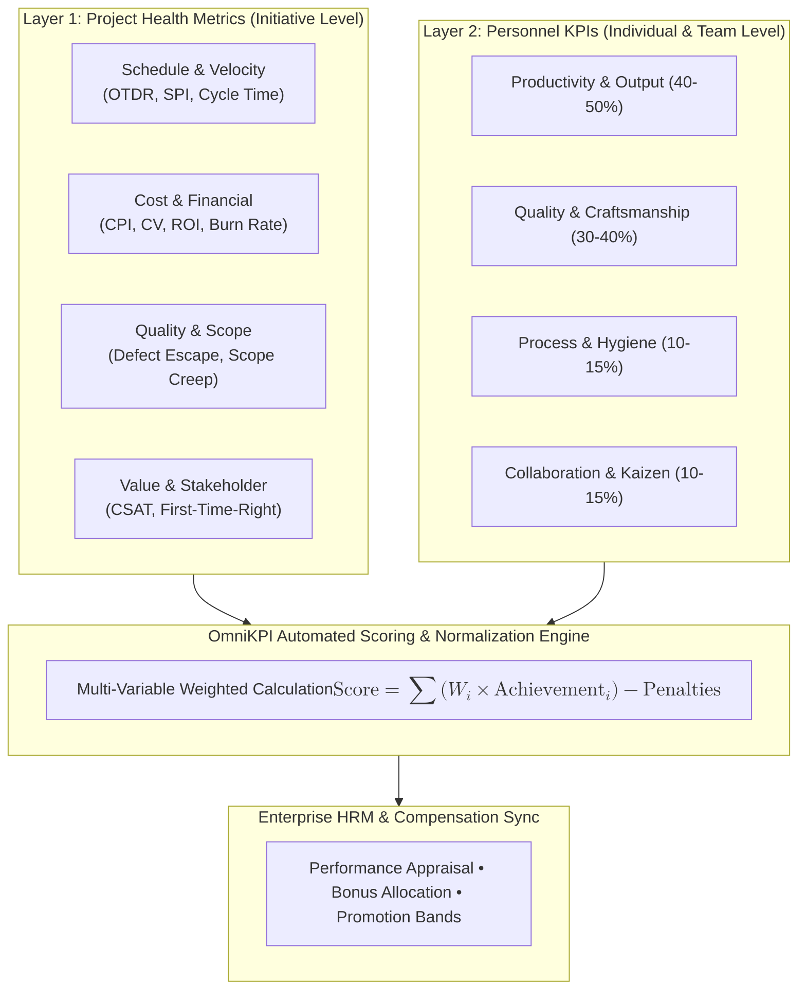
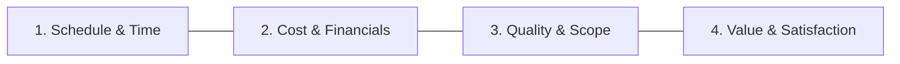
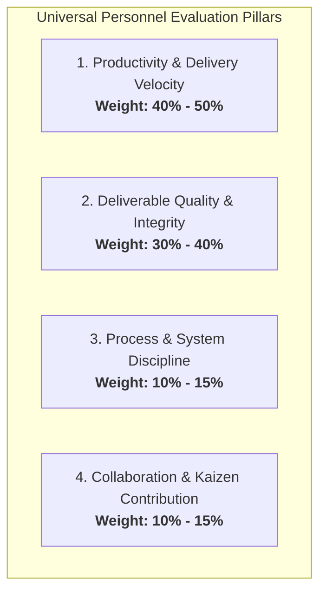
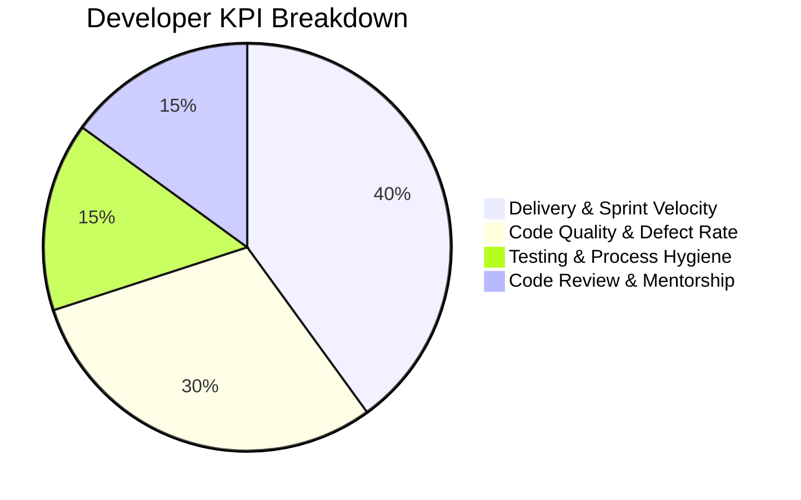
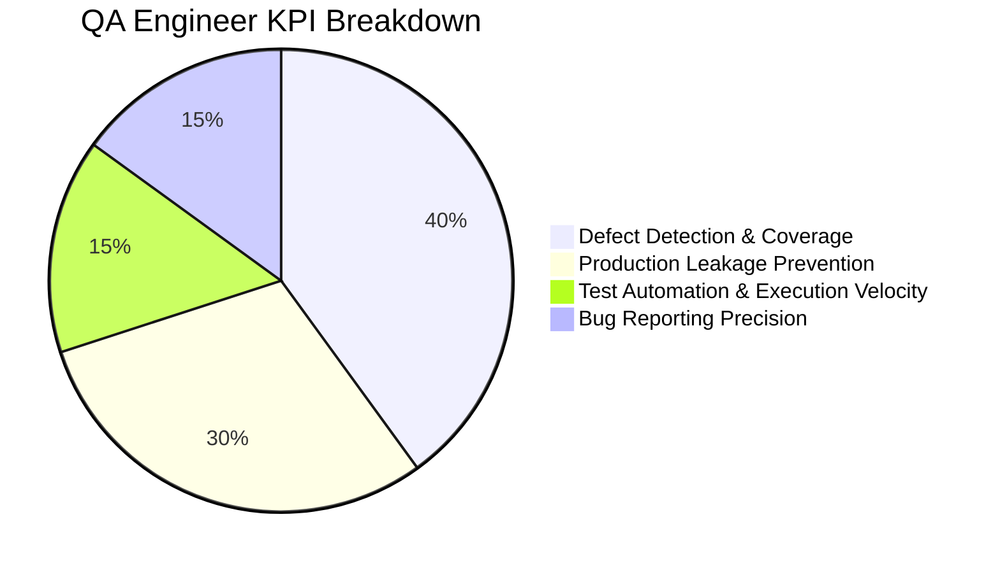
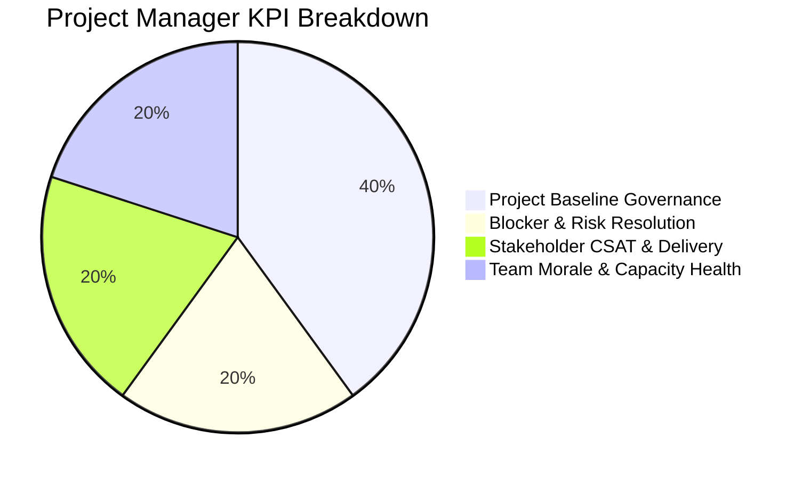
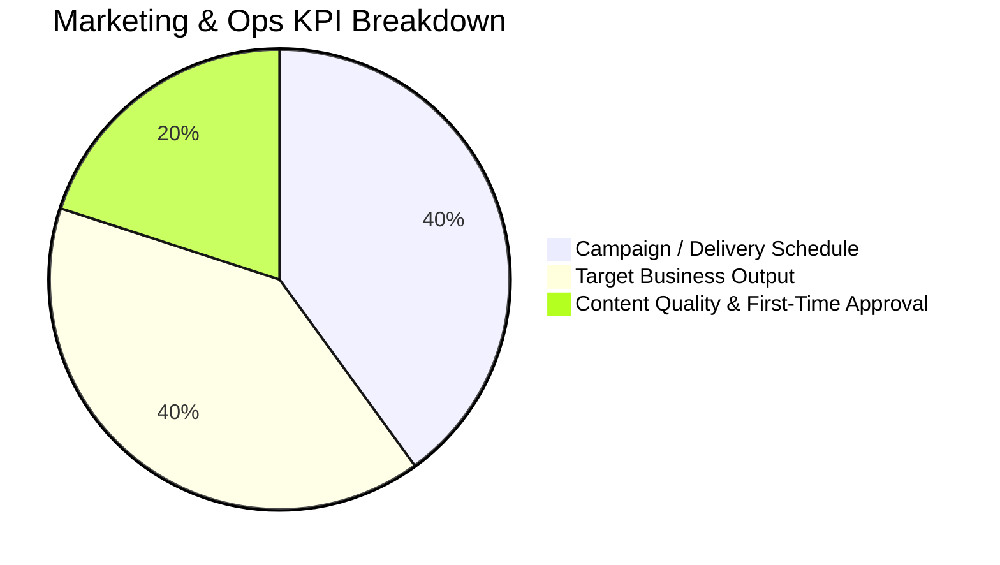
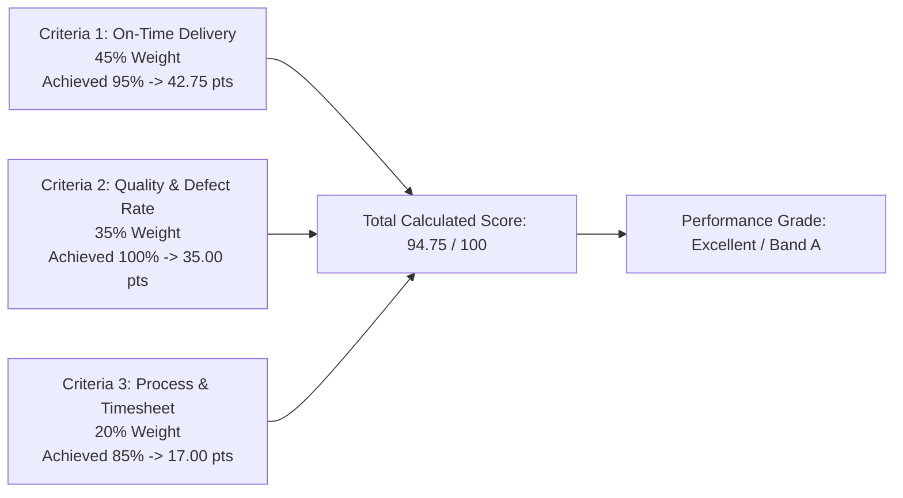

# Comprehensive Project Metrics & Personnel KPI Evaluation Framework

> [!NOTE]
> This framework provides an end-to-end measurement architecture for modern engineering and operations organizations. It is bifurcated into two synchronized engines: **Project Health & Delivery Metrics** (evaluating system/initiative performance) and **Personnel Performance KPIs** (evaluating individual and team contributions), designed for automated scoring in the **OmniKPI** and **HRM** ecosystems.

> [!WARNING]
> Đây là tài liệu tham khảo khái niệm. Công thức, cohort, chiều tốt/xấu, trọng số và quyền sử dụng trong production phải lấy từ metric contract đã phê duyệt trong `project_metric_dictionary.md`. Điểm tự động không được chuyển thẳng sang lương thưởng trước review, calibration, approval và cơ chế dispute.

---

## Executive Architecture: Dual-Layer Performance Engine

---

## Table of Contents

- [Part 1: Project Health & Delivery Metrics](#part-1-project-health--delivery-metrics)
  - [1. Schedule & Velocity Metrics](#1-schedule--velocity-metrics)
  - [2. Cost & Financial Performance Metrics](#2-cost--financial-performance-metrics)
  - [3. Quality, Scope & Reliability Metrics](#3-quality-scope--reliability-metrics)
  - [4. Value & Stakeholder Satisfaction Metrics](#4-value--stakeholder-satisfaction-metrics)
- [Part 2: Multi-Dimensional Personnel KPI Framework](#part-2-multi-dimensional-personnel-kpi-framework)
  - [1. The 4 Universal Evaluation Pillars](#1-the-4-universal-evaluation-pillars)
  - [2. Role-Specific KPI Blueprints](#2-role-specific-kpi-blueprints)
    - [A. Software Engineers / Developers](#a-software-engineers--developers)
    - [B. QA / Test Engineers](#b-qa--test-engineers)
    - [C. Project Managers / Scrum Masters / Team Leads](#c-project-managers--scrum-masters--team-leads)
    - [D. Cross-Functional & Non-Technical Roles (Marketing / Ops)](#d-cross-functional--non-technical-roles-marketing--ops)
- [Part 3: Automated KPI Scoring Engine (OmniKPI & HRM Architecture)](#part-3-automated-kpi-scoring-engine-omnikpi--hrm-architecture)
  - [1. Mathematical Formulation & Weighting](#1-mathematical-formulation--weighting)
  - [2. End-to-End Calculation Example](#2-end-to-end-calculation-example)
  - [3. Performance Grading & Appraisal Tiering](#3-performance-grading--appraisal-tiering)
- [Summary Reference Matrix](#summary-reference-matrix)

---

## Part 1: Project Health & Delivery Metrics

Project health is evaluated across four core pillars: **Schedule, Cost, Quality/Scope, and Value Delivery**.

### 1. Schedule & Velocity Metrics

#### A. On-Time Delivery Rate (OTDR)
Measures the proportion of milestones, work packages, or tasks delivered on or before the committed baseline due date.

$$\text{OTDR} = \left( \frac{\text{Number of Tasks/Milestones Completed On-Time}}{\text{Total Committed Tasks/Milestones}} \right) \times 100\%$$

* **Target Benchmark:** $\ge 90\%$ for healthy delivery pipelines.

#### B. Schedule Performance Index (SPI - PMI / EVM Standard)
Measures the efficiency of time utilization by comparing the value of work completed against the scheduled plan.

$$\text{SPI} = \frac{\text{Earned Value (EV)}}{\text{Planned Value (PV)}}$$

| SPI Value | Health Status | Operational Interpretation |
| :--- | :--- | :--- |
| $\text{SPI} > 1.0$ | **Ahead of Schedule** | Delivery velocity exceeds original baseline. |
| $\text{SPI} = 1.0$ | **On Track** | Progress perfectly matches planned schedule. |
| $\text{SPI} < 1.0$ | **Behind Schedule** | Project is experiencing schedule slippage; corrective action required. |

#### C. Agile Velocity & Cycle Time
* **Sprint Velocity:** Total Story Points or user stories completed and validated against the *Definition of Done (DoD)* within a single Sprint iteration.
* **Cycle Time:** The elapsed time from when an engineer starts active work on a task (`In Progress`) to when it passes verification (`Done`).
* **Lead Time:** Total time elapsed from initial task creation/request in the backlog to final customer delivery.

---

### 2. Cost & Financial Performance Metrics

#### A. Cost Variance (CV)
Measures the financial surplus or deficit of project execution relative to earned progress.

$$\text{CV} = \text{Earned Value (EV)} - \text{Actual Cost (AC)}$$

* $\text{CV} \ge 0$: Under budget or operating within financial expectations.
* $\text{CV} < 0$: Cost overrun (project is spending more than budgeted for the delivered output).

#### B. Cost Performance Index (CPI)
Measures the cost efficiency of budgeted resources.

$$\text{CPI} = \frac{\text{Earned Value (EV)}}{\text{Actual Cost (AC)}}$$

* $\text{CPI} \ge 1.0$: Healthy financial efficiency (earning $\$1.00+$ of value for every $\$1.00$ spent).
* $\text{CPI} < 1.0$: Inefficient capital consumption (earning less than $\$1.00$ of value per dollar spent).

#### C. Return on Investment (ROI)
Measures the net financial return generated by the initiative relative to its total expenditure.

$$\text{ROI} = \left( \frac{\text{Net Project Profit / Value Generated}}{\text{Total Project Investment Cost}} \right) \times 100\%$$

---

### 3. Quality, Scope & Reliability Metrics

#### A. Scope Creep Rate
Quantifies unauthorized or unplanned growth in project scope after the baseline requirements were frozen.

$$\text{Scope Creep Rate} = \left( \frac{\text{Unplanned Requirements / Tasks Added Post-Baseline}}{\text{Initial Committed Scope Baseline}} \right) \times 100\%$$

* **Target Threshold:** $< 10\%$ over the planned project lifecycle.

#### B. Defect Density
Measures code and build quality by normalizing discovered bugs against the scale of the deliverables (e.g., Kilo-Lines of Code - KLOC, number of features, or UI screens).

$$\text{Defect Density} = \frac{\text{Total Discovered Bugs / Defects}}{\text{Deliverable Size (KLOC / Features / Endpoints)}}$$

#### C. Defect Escape Rate (Defect Leakage)
Measures the effectiveness of the Quality Assurance pipeline by tracking bugs discovered in production by end-users versus those caught internally.

$$\text{Defect Escape Rate} = \left( \frac{\text{Defects Discovered in Production}}{\text{Total Defects Discovered (Internal QA + Production)}} \right) \times 100\%$$

* **Target Benchmark:** $< 2\% - 3\%$ for enterprise-grade releases.

#### D. Rework Rate
The percentage of total effort or engineering hours expended on correcting previously "completed" deliverables due to specification flaws or defects.

$$\text{Rework Rate} = \left( \frac{\text{Hours Spent on Rework and Bug Fixing}}{\text{Total Project Engineering Hours}} \right) \times 100\%$$

---

### 4. Value & Stakeholder Satisfaction Metrics

* **Customer / Stakeholder Satisfaction Score (CSAT):** Quantitative assessment collected via post-milestone surveys on a 1-to-5 scale.
* **First-Time-Right (FTR) Rate:** The percentage of deliverables, modules, or features accepted during initial formal verification without requiring major revisions.
* **Net Promoter Score (NPS):** Gauges stakeholder and client loyalty and likelihood of recommendation.

---

## Part 2: Multi-Dimensional Personnel KPI Framework

To eliminate bias and balance individual evaluation, personnel scorecards combine **Quantitative Output**, **Craftsmanship & Quality**, **Operational Discipline**, and **Collaborative Contribution**.

### 1. The 4 Universal Evaluation Pillars

| Evaluation Pillar | Target Weight | Measurement Objective | Core Indicators |
| :--- | :--- | :--- | :--- |
| **1. Productivity & Delivery** | **40% – 50%** | Capacity to deliver committed work on time | - On-Time Delivery Rate (OTDR) - Commitment-to-Delivery Ratio - Task Throughput / Story Points |
| **2. Work Quality & Accuracy** | **30% – 40%** | Technical precision and reliability of deliverables | - Defect Rate per Task - Task Reopen / Rejection Rate - First-Time Approval Rate |
| **3. Process & System Hygiene** | **10% – 15%** | Compliance with workflows and documentation standards | - Daily Task Status / Timesheet updates - Coding / SOP compliance - Architecture Documentation updates |
| **4. Collaboration & Kaizen** | **10% – 15%** | Team support, peer reviews, and continuous improvement | - 360° Peer Review score - Blocker removal assistance - Process optimization initiatives |

---

### 2. Role-Specific KPI Blueprints

#### A. Software Engineers / Developers

1. **Delivery Velocity & Sprint Commitment (40%):**
   * Achieve $\ge 90\%$ on-time completion for committed sprint tasks / user stories.
2. **Code Quality & Defect Control (30%):**
   * Defect rate $\le 0.4$ bugs per feature/task in QA testing.
   * Zero critical regressions or security vulnerabilities introduced into production.
   * Pull Request (PR) first-pass acceptance rate $\ge 80\%$.
3. **Automated Testing & Workflow Hygiene (15%):**
   * Maintain unit test code coverage $\ge 75\%$ on new modules.
   * Real-time daily task state and timesheet compliance ($\ge 95\%$).
4. **Code Review & Collaborative Support (15%):**
   * Complete assigned peer PR reviews within 24 hours.
   * Active participation in technical unblocking and architectural documentation.

---

#### B. QA / Test Engineers

1. **Defect Detection Capability & Test Coverage (40%):**
   * Identify and log $\ge 95\%$ of functional, edge-case, and performance bugs prior to UAT/Production release.
   * Comprehensive Test Case coverage mapping $100\%$ of PRD acceptance criteria.
2. **Production Leakage Prevention (30%):**
   * Maintain Defect Escape Rate to production $< 2\%$.
3. **Execution Velocity & Automation Cadence (15%):**
   * Complete test cycles on schedule within the active sprint window.
   * Expand automated regression test suites according to quarterly targets.
4. **Bug Reporting Precision & Reproducibility (15%):**
   * High bug clarity score: complete steps to reproduce, logs, network traces, and environmental specs with $< 5\%$ rejected as non-reproducible.

---

#### C. Project Managers / Scrum Masters / Team Leads

1. **Project Baseline & Variance Governance (40%):**
   * Maintain $\text{SPI} \ge 0.95$ and $\text{CPI} \ge 0.95$ across all managed milestones.
   * Achieve $100\%$ on-time delivery for contractual client release dates.
2. **Blocker & Risk Resolution Speed (20%):**
   * Average Blocker Resolution Time $\le 24$ hours.
   * Zero unmitigated high-impact risks that lead to project halts.
3. **Stakeholder & Client Satisfaction (20%):**
   * Maintain Stakeholder CSAT score $\ge 4.2 / 5.0$ or Client NPS $\ge 50$.
4. **Team Morale & Capacity Health (20%):**
   * Team workload balancing: zero chronic team burnout ($< 10\%$ overtime).
   * Voluntary team retention rate $\ge 90\%$.

---

#### D. Cross-Functional & Non-Technical Roles (Marketing / Ops)

1. **Campaign & Milestone Schedule (40%):**
   * $100\%$ on-time execution of marketing campaigns, content calendars, or operational roadmaps.
2. **Target Business Output (40%):**
   * Attainment of defined business metrics (e.g., Qualified Leads, Organic Reach, Conversion Rates, Target Cost-Per-Acquisition - CPA).
3. **Deliverable Quality & First-Time Approval (20%):**
   * $\ge 85\%$ of creative/strategic assets approved on the first review with $\le 1$ minor revision round.

---

## Part 3: Automated KPI Scoring Engine (OmniKPI & HRM Architecture)

The **OmniKPI** engine calculates individual and team performance scores dynamically from work management events.

### 1. Mathematical Formulation & Weighting

$$\text{Final KPI Score} = \sum_{i=1}^{n} \left( \min\left(\frac{\text{Actual Result}_i}{\text{Target Metric}_i}, \text{Cap}\right) \times W_i \right) - P_{\text{overdue}} + B_{\text{initiative}}$$

Where:
* $W_i$: Normalized weight assigned to metric $i$ ($\sum W_i = 100\%$).
* $\text{Actual}_i / \text{Target}_i$: Performance achievement ratio.
* $\text{Cap}$: Maximum overachievement ceiling (typically $1.10 - 1.20$ to prevent score distortion).
* $P_{\text{overdue}}$: Weighted deduction penalty for unexcused milestone delays.
* $B_{\text{initiative}}$: Discretionary bonus points for exceptional innovation or leadership.

---

### 2. End-to-End Calculation Example

Consider a Senior Software Engineer evaluated over a monthly sprint cycle with a $100$-point scorecard:

#### Detailed Computation Table:

| Metric Criterion | Target Metric | Actual Result | Achievement Ratio | Weight ($W_i$) | Calculated Score |
| :--- | :--- | :--- | :--- | :--- | :--- |
| **1. On-Time Task Delivery** | $100\%$ | $95\%$ | $0.95$ | $45\%$ | $0.95 \times 45 = \mathbf{42.75}$ |
| **2. Zero-Defect Code Quality** | $\le 0.4$ bugs/task | $0.0$ bugs | $1.00$ (Flawless) | $35\%$ | $1.00 \times 35 = \mathbf{35.00}$ |
| **3. Daily Workflow Hygiene** | $100\%$ daily logs | $85\%$ on-time | $0.85$ | $20\%$ | $0.85 \times 20 = \mathbf{17.00}$ |
| **Total Monthly Score** | — | — | — | **100%** | **94.75 / 100** |

---

### 3. Performance Grading & Appraisal Tiering

Automated synchronization with enterprise HRM systems translates normalized KPI scores into performance bands and compensation multipliers:

| Score Band | Performance Tier | Evaluation Descriptor | Compensation / Bonus Impact |
| :--- | :--- | :--- | :--- |
| **$95.0 - 100+$** | **Tier A+ (Outstanding)** | Far exceeds expectations; strategic driver | $120\% - 150\%$ Performance Bonus; Fast-track Promotion |
| **$85.0 - 94.9$** | **Tier A (Exceeds Expectations)** | Consistently exceeds standard targets | $100\% - 115\%$ Performance Bonus; Standard Salary Increment |
| **$70.0 - 84.9$** | **Tier B (Meets Expectations)** | Reliable contributor; meets baseline SLA | $85\% - 100\%$ Performance Bonus; Baseline Eligibility |
| **$55.0 - 69.9$** | **Tier C (Needs Improvement)** | Sub-optimal performance; frequent delays | $0\% - 50\%$ Bonus; Performance Improvement Plan (PIP) |
| **$< 55.0$** | **Tier D (Unsatisfactory)** | Critical delivery failures or quality breaches | Reassignment / Immediate Formal Review |

---

## Summary Reference Matrix

| Metric Category | Level | Primary Metrics | Primary Stakeholder | Review Cadence |
| :--- | :--- | :--- | :--- | :--- |
| **Schedule & Delivery** | Project | OTDR, SPI, Cycle Time, Velocity | Project Manager / Scrum Master | Weekly / Per Sprint |
| **Cost & Financials** | Project / Program | CPI, Cost Variance (CV), ROI, Burn Rate | Program Manager / Delivery Director | Monthly / Per Milestone |
| **Quality & Scope** | Project / Technical | Defect Escape Rate, Defect Density, Scope Creep | QA Lead / Tech Lead | Per Release / Continuous |
| **Stakeholder & Value** | Organization | CSAT, NPS, First-Time-Right Rate | Product Owner / Account Director | Post-Handoff / Quarterly |
| **Personnel Performance** | Individual / Squad | 4-Pillar Scorecard, Scoring Engine Output | Department Head / HR Manager | Monthly / Quarterly |

---
