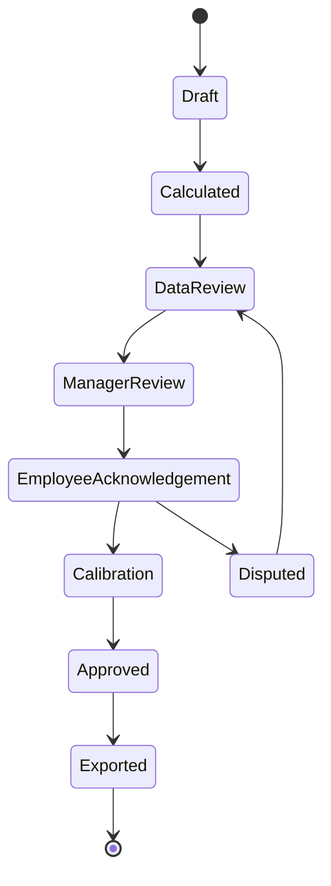

# OmniMer Project & People Metric Dictionary

> **Purpose:** Define data contracts, formulas, and governance for metrics used within OmniProject / OmniKPI.  
> **Distinction:** `project_metrics.md` is a foundational knowledge document; this document serves as the versioned, authoritative source definition for implementation.  
> **Status:** Baseline Draft  
> **Version:** 1.0.0  
> **Date:** 2026-09-08

---

## 1. Measurement Principles

1. Project health metrics and people evaluation metrics are two separate sets.
2. Scoring shall not be derived from data with insufficient quality or lacking an approved baseline.
3. Each metric has a specific purpose; reuse for compensation or rewards is prohibited unless explicitly approved.
4. Story points, velocity, commit counts, lines of code, or online hours shall not be used for individual performance ranking.
5. Metrics must have designated cohorts and measurement windows; defect/release or task records from different cycles shall not be mixed.
6. Changes to due dates, scope, weights, or targets require creating a new version; modifying history is prohibited.
7. Automated scores serve only as evaluation inputs; final scores require review, calibration, and approval.
8. `Missing/Not Applicable` is distinct from `0`; missing data shall not be substituted with zero.
9. All overrides require an actor, reason, evidence, delta, and approver.
10. Default benchmarks are for initialization only; targets must be based on project type and historical data.

---

## 2. Metric Contract

Every metric must contain a complete set of fields:

| Field | Mandatory | Meaning |
| :--- | :---: | :--- |
| `metric_id` | Yes | Stable ID, e.g., `PM-SCH-001` |
| `version` | Yes | Semantic version of the definition |
| `name` | Yes | Unique, unambiguous name |
| `purpose` | Yes | Decision supported by the metric |
| `entity_level` | Yes | Portfolio, program, project, team, or individual |
| `owner` | Yes | Business owner |
| `data_owner` | Yes | Accountable for data source and data quality |
| `direction` | Yes | `HIGHER`, `LOWER`, `TARGET_RANGE`, `BOOLEAN`, `INFORMATIONAL` |
| `unit` | Yes | %, days, hours, VND, points, or count |
| `formula` | Yes | Numerator, denominator, and rounding rules |
| `eligible_population` | Yes | Which records are included or excluded |
| `cohort_key` | When required | Release / sprint / project / cycle linking numerator and denominator |
| `event_time` | Yes | Business timestamp used for period assignment |
| `window` | Yes | Daily, rolling 30d, sprint, month, release, etc. |
| `source` | Yes | Source event / table / API |
| `refresh` | Yes | Near-real-time, daily, cycle-close, etc. |
| `baseline/target` | When scoring | Approved comparison benchmark |
| `cap` | When scoring | Achievement ceiling |
| `missing_data_rule` | Yes | `EXCLUDE`, `BLOCK_SCORE`, `NOT_APPLICABLE` |
| `minimum_sample` | When percentage/rate | Minimum sample size required to display or score |
| `effective_from/to` | Yes | Validity range of the version |
| `approved_by` | Yes | Approver of the metric definition |
| `allowed_uses` | Yes | Health, forecast, coaching, appraisal, compensation |

Metrics missing a complete contract shall not be included in production scorecards.

---

## 3. Achievement Normalization

Let:

- \(A_i\): actual of metric \(i\).
- \(T_i\): target of metric \(i\).
- \(C_i\): cap, default per policy and capped at 1.20 if using a 120 scale.
- \(r_i\): achievement ratio.

### 3.1 Higher is Better

Applies to OTDR, acceptance rate, valid coverage:

$$r_i = \min\left(\frac{A_i}{T_i}, C_i\right), \quad T_i > 0$$

### 3.2 Lower is Better

Applies to defect rate, cycle time, overtime, rework:

$$
r_i =
\begin{cases}
C_i, & A_i = 0 \land T_i > 0 \\
\min\left(\frac{T_i}{A_i}, C_i\right), & A_i > 0
\end{cases}
$$

Metrics with a target of 0 must use dedicated rules based on severity or boolean; division by zero is prohibited.

### 3.3 Target Range

If optimal performance falls within \([L_i, U_i]\):

- \(r_i = 1\) when \(L_i \le A_i \le U_i\).
- Outside the range, the metric contract must define decay function and floor.
- Do not infer good/bad direction without explicit rules.

### 3.4 Informational

Metrics used for diagnosis/forecasting but not converted into scores, e.g., velocity and raw throughput.

---

## 4. Score Aggregation

Only aggregate `eligible` metrics in cycle:

$$
\text{Base Score}
=
100 \times
\frac{\sum_{i \in E}(w_i \times r_i)}
{\sum_{i \in E}w_i}
$$

$$
\text{Final Score}
=
\operatorname{clamp}
\left(
\text{Base Score} - \text{Approved Penalties} + \text{Approved Bonuses},
0,
120
\right)
$$

### 4.1 Weight Rules

- Weights of an approved metric set must sum to exactly 100%.
- If a metric is `NOT_APPLICABLE`, the system normalizes remaining weights only if policy allows.
- If a metric is `BLOCK_SCORE`, cycle is in `Data Incomplete` state; no score is issued.
- Modifying weights after cycle start is prohibited, unless a new metric-set version is approved.

### 4.2 Penalty and Bonus Rules

- No double-counting: an event that reduced a metric score shall not be penalized a second time unless policy specifies.
- Penalties apply only to controllable behaviors with verified evidence.
- External dependencies, approved leave, approved scope changes, and system outages must have exclusion rules.
- Discretionary bonuses require calibration and are bounded by policy.

---

## 5. Business Outcome Metric Catalog

### BIZ-AUTO-001 — Confirmed Chat-to-Task Latency

- **Objective:** `OB-01`.
- **Direction:** `LOWER`.
- **Start event:** `channel.message_ingested`.
- **End event:** `task.confirmed` with matching `correlation_id`.
- **Aggregation:** P50 and P95; targets applied to P95 must be explicitly stated.
- **Exclude:** Non-actionable messages, duplicates, and user-cancelled drafts; excluded counts must remain visible.

### BIZ-CAP-001 — Actionable Request Capture Rate

- **Objective:** `OB-02`.
- **Direction:** `HIGHER`.
- **Formula:** `Actionable messages linked to task/decision/acknowledgement within SLA / actionable messages in audited cohort × 100%`.
- **Source of truth:** Reconciled channel-message cohort; using task database alone as denominator is prohibited.
- **Control:** "Actionable" criteria and sampling/review methodology must be approved; report both false positives and false negatives.

### BIZ-EFF-001 — PM Administrative Time Reduction

- **Objective:** `OB-03`.
- **Direction:** `HIGHER`.
- **Formula:** `(Baseline admin hours - post-implementation admin hours) / baseline admin hours × 100%`.
- **Method:** Time study across matching roles, project types, seasonality, and pre/post observation windows.
- **Control:** Inferences based on click counts or message counts are prohibited; requires representative sampling.

### BIZ-KPI-001 — KPI Calculation Reconciliation Accuracy

- **Objective:** `OB-04`.
- **Direction:** `HIGHER`.
- **Formula:** `Valid calculation scenarios matching expected result within tolerance / total valid scenarios × 100%`.
- **Source:** Versioned golden dataset and independent recomputation.
- **Control:** Separately monitor audit completeness, override rate, and dispute rate; calculation accuracy does not prove fairness.

### BIZ-HRM-001 — Approved-to-Accepted Export Latency

- **Objective:** `OB-05`.
- **Direction:** `LOWER`.
- **Start event:** `score_cycle.approved`.
- **End event:** HRM returns business acknowledgement for corresponding batch.
- **Aggregation:** P50/P95 by integration and batch size.
- **Control:** Network acknowledgement does not mean payroll has applied the scores; requires reconciliation status.

### BIZ-HRM-002 — HRM Export Success Rate

- **Objective:** `OB-05`.
- **Direction:** `HIGHER`.
- **Formula:** `Approved batches accepted and reconciled by HRM / approved batches due for export × 100%`.
- **Control:** Retries use identical idempotency key; counting retries as new batches is prohibited.

---

## 6. Project Health Metric Catalog

### PM-SCH-001 — On-Time Milestone Delivery Rate

- **Purpose:** Monitor milestone commitment reliability.
- **Level:** Project / Program.
- **Direction:** `HIGHER`.
- **Formula:**

$$
\text{OTDR}
=
\frac{\text{Eligible milestones completed on or before baseline due date}}
{\text{Total eligible milestones due in period}}
\times 100\%
$$

- **Eligible:** Milestones with approved baseline prior to period freeze.
- **Exclude:** Cancelled scope, approved rebaselines effective before due date.
- **Event time:** Acceptance / completion timestamp.
- **Minimum sample:** Display count alongside percentage; comparing projects with undersized samples is prohibited.
- **Allowed uses:** Health, forecast, portfolio review; attributing sole responsibility to PM is prohibited.

### PM-SCH-002 — Schedule Performance Index

- **Purpose:** Measure schedule efficiency via EVM.
- **Level:** Project / Program.
- **Direction:** `HIGHER`, but primarily used as `INFORMATIONAL` for forecasting.
- **Formula:** \(\text{SPI} = EV / PV\), where \(PV > 0\).
- **Source:** Time-phased approved baseline and EV method.
- **Missing rule:** `BLOCK_SCORE` if reliable EV/PV data is unavailable.
- **Note:** SPI near project end loses predictive value; must evaluate alongside forecast finish variance.

### PM-SCH-003 — Cycle Time

- **Purpose:** Track flow efficiency.
- **Level:** Team / Project.
- **Direction:** `LOWER`.
- **Formula:** `Done timestamp - first In Progress timestamp`.
- **Aggregation:** Median and P85; relying solely on average is prohibited.
- **Cohort:** Workflow class + task type + completed window.
- **Allowed uses:** Process improvement / forecasting; individual scoring prohibited.

### PM-SCH-004 — Forecast Finish Variance

- **Purpose:** Early warning for schedule delay.
- **Direction:** `TARGET_RANGE` around 0 or `LOWER` with absolute variance per policy.
- **Formula:** `Current forecast finish - approved baseline finish`.
- **Unit:** Calendar days or working days, explicitly declared.

### PM-COST-001 — Cost Performance Index

- **Purpose:** Measure cost efficiency via EVM.
- **Direction:** `HIGHER`.
- **Formula:** \(\text{CPI} = EV / AC\), where \(AC > 0\).
- **Source:** EV ledger and reconciled actual cost.
- **Missing rule:** `BLOCK_SCORE` if AC or EV period is unclosed.

### PM-COST-002 — Estimate at Completion Variance

- **Purpose:** Forecast budget overruns.
- **Direction:** `LOWER`.
- **Formula:** \((EAC - BAC) / BAC \times 100\%\), where \(BAC > 0\).
- **Interpretation:** Positive values indicate forecasted overrun; negative indicates under budget.

### PM-SCOPE-001 — Unapproved Scope Addition Rate

- **Purpose:** Measure true scope creep, excluding approved changes.
- **Direction:** `LOWER`.
- **Formula:**

$$
\frac{\text{Scope items added post-baseline without approved CR}}
{\text{Baseline scope items at period start}}
\times 100\%
$$

- **Rule:** Scope items must use identical units; mixing requirements, tasks, and story points is prohibited.

### PM-QUAL-001 — Defect Escape Rate

- **Purpose:** Measure defects escaping quality gates.
- **Direction:** `LOWER`.
- **Formula:**

$$
\frac{\text{Production defects belonging to release cohort}}
{\text{Pre-release + production defects belonging to same release cohort}}
\times 100\%
$$

- **Cohort:** Release / version; fixed observation window.
- **Rule:** Severity, duplicate, and invalid defects must be normalized.

### PM-QUAL-002 — Rework Effort Rate

- **Purpose:** Determine rework effort due to defects or requirement errors.
- **Direction:** `LOWER`.
- **Formula:** `Approved rework hours / eligible delivery hours × 100%`.
- **Rule:** Planned iterations/discovery shall not be counted as rework.

### PM-DEP-001 — Dependency Commitment Reliability

- **Purpose:** Measure reliability of dependency providers.
- **Direction:** `HIGHER`.
- **Formula:** `Dependencies delivered by needed-by date / dependencies due × 100%`.
- **Cohort:** Project / program + review period.
- **Evidence:** Dependency owner, consumer, needed-by date, and fulfillment event.

### PM-RISK-001 — High-Risk Response Compliance

- **Purpose:** Track overdue risk responses.
- **Direction:** `HIGHER`.
- **Formula:** `High/Critical risk actions completed by response due / due actions × 100%`.
- **Allowed uses:** Governance health; substituting for residual risk exposure is prohibited.

### PM-VALUE-001 — First-Time Acceptance Rate

- **Purpose:** Measure deliverables accepted by business on first submission.
- **Direction:** `HIGHER`.
- **Formula:** `Deliverables accepted without major rework / deliverables submitted × 100%`.
- **Rule:** `Major rework` must have severity rules in acceptance plan.

### PM-VALUE-002 — Benefit Realization Rate

- **Purpose:** Measure achieved outcome vs business case.
- **Direction:** `HIGHER` or metric-specific.
- **Formula:** `Actual verified benefit / planned benefit × 100%`.
- **Owner:** Business Owner, not PM post-closure.
- **Window:** Per benefit plan, typically post-implementation.

### PM-DATA-001 — Required Telemetry Completeness

- **Purpose:** Verify sufficient data reliability prior to health/score calculation.
- **Direction:** `HIGHER`.
- **Formula:** `Eligible records with required fields/events / total eligible records × 100%`.
- **Rule:** Achieving data completeness does not prove data correctness; requires separate anomaly controls.

---

## 7. People Metric Catalog

People metrics are activated only after approval of purpose by HR, Legal/Privacy, and employee representatives (where applicable).

### PEO-DEL-001 — Commitment Reliability

- **Direction:** `HIGHER`.
- **Formula:** `Accepted commitments completed by approved due date / eligible accepted commitments × 100%`.
- **Required controls:** Freeze time, approved change/leave/dependency exclusions, minimum sample size.
- **Prohibited:** Raw task volume or raw story points.

### PEO-QUAL-001 — First-Pass Quality Rate

- **Direction:** `HIGHER`.
- **Formula:** `Eligible deliverables accepted without material reopen / submitted deliverables × 100%`.
- **Required controls:** Matching deliverable types, severity calibration, reviewer calibration.

### PEO-HYG-001 — Required Workflow Evidence Compliance

- **Direction:** `HIGHER`.
- **Formula:** `Required updates/evidence completed per policy / required updates × 100%`.
- **Limits:** Low weight; turning timesheets or status updates into primary productivity metrics is prohibited.

### PEO-COL-001 — Structured Collaboration Contribution

- **Direction:** `TARGET_RANGE` or approved rubric.
- **Source:** Evidence-tagged contribution + calibrated review.
- **Rule:** Raw comment or PR review counts are prohibited; mitigate popularity bias and retaliation.

### 7.1 Prohibited Metrics for Direct Performance Appraisal

- Individual story points or velocity.
- Lines of code, commit count, or online time.
- Raw message count or meeting attendance.
- Defects without reviewed attribution/root cause.
- Client satisfaction without account/context control.
- Metrics with sample sizes below the minimum threshold.

---

## 8. Cycle and Approval States

| State | HRM Export Allowed? | Rules |
| :--- | :---: | :--- |
| `Draft` | No | Metric set / cycle not locked |
| `Calculated` | No | Machine output, unverified data |
| `DataReview` | No | Checking missing / anomaly / cohort |
| `ManagerReview` | No | Comments and proposed adjustments |
| `EmployeeAcknowledgement` | No | Employee reviews evidence and provides feedback |
| `Disputed` | No | Dispute resolution in progress |
| `Calibration` | No | Checking consistency across team / managers |
| `Approved` | Yes | Approved by HR / authority |
| `Exported` | Already Exported | Manifest, checksum, and response stored |

---

## 9. Data Quality Controls

Prior to calculation or issuance:

- Check duplicate events and idempotency keys.
- Validate timestamps / timezones and late-arriving events.
- Lock cohort and baseline version.
- Detect due dates, weights, or scopes modified near completion.
- Detect abnormal task splitting or merging.
- Detect reviewer concentration and rating drift.
- Reconcile source events with aggregates.
- Assign data quality status: `Valid`, `Incomplete`, `Anomalous`, `Excluded`.

Metrics marked `Incomplete` or `Anomalous` shall not automatically translate into low scores.

---

## 10. Anti-Gaming and Fairness

1. Display outcomes, quality, and context together; optimizing a single metric is prohibited.
2. Individual leaderboards shall not be public by default.
3. Allow evaluated individuals to view source data and submit disputes.
4. Track differential impacts across roles, teams, and locations where legally permitted.
5. Retroactive application of metric versions to closed cycles is prohibited.
6. All manual adjustments must be bounded and justified with reason.
7. Compensation policies lie outside the scoring engine; OmniKPI exports only approved scores and provenance.

---

## 11. Metric Versioning and Change Management

Metric changes must pass through:

1. Change proposal detailing problem statement and purpose.
2. Impact analysis using historical data / sample calculations.
3. Review by Metric Owner, Data Owner, HR/PMO, and Privacy/Security where appropriate.
4. Approval along with `effective_from` date.
5. Parallel run or backtesting prior to production deployment.
6. Notification to affected personnel.
7. Closed cycle results shall not be modified; corrections must use adjustment records.

---

## 12. Production-Readiness Conditions

A metric is approved for scoring only when:

- Contract is complete and formally approved.
- Test cases cover happy path, boundary, zero, missing, duplicate, and late events.
- Minimum sample size and exclusion policies are established.
- Backtesting validates formula accuracy.
- Dashboards display numerator, denominator, target, version, and data freshness.
- An owner is designated to handle disputes.
- Retention rules, access controls, and audit logs are established.
