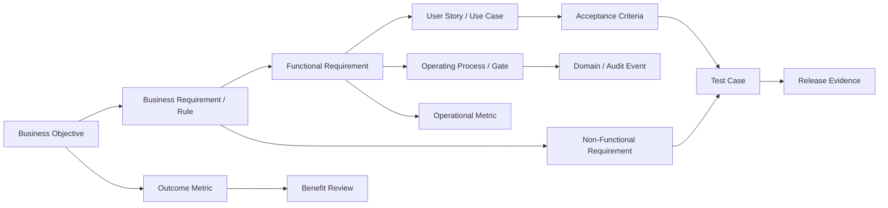
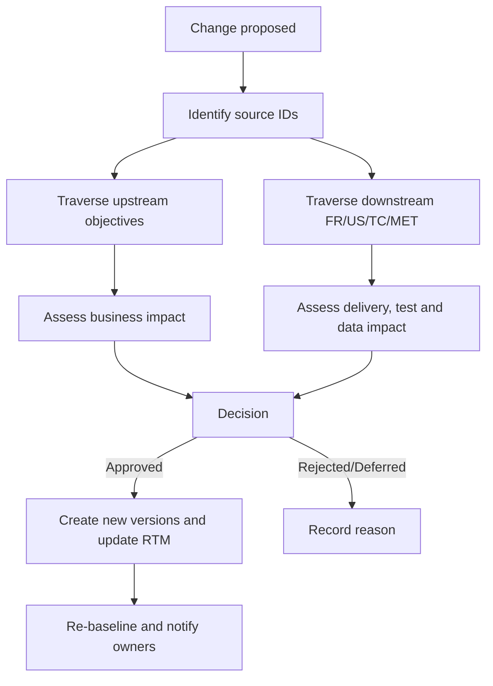

# Project Management Document Map & Traceability Model

> **Purpose:** Define single sources of truth, IDs, linkages, and change control across business objectives, requirements, workflows, metrics, and testing.  
> **Data RTM:** `../requirements/RTM.csv`  
> **Status:** Baseline Draft  
> **Version:** 1.0.0  
> **Date:** 2026-09-08

---

## 1. Document Map

| Document | Role | Source of Truth For | Proposed Owner | Review Cadence |
| :--- | :--- | :--- | :--- | :--- |
| `requirements/BRD.md` | Business intent | Problem, objective, benefit, stakeholder, constraint | Business Owner / BA | Upon strategy/scope change |
| `requirements/VISION_AND_SCOPE.md` | Product boundary | In-scope, out-of-scope, release boundary | Product Owner / BA | Per release |
| `requirements/REQUIREMENTS_ANALYSIS_FRD.md` | System requirements | FR, NFR, BR, user story, acceptance criteria | Product Owner / BA | Per baseline |
| `business_logic/project_management_model.md` | Reference catalog | Framework concepts | PMO | Every 6–12 months |
| `business_logic/project_management_scope_levels.md` | Management levels | Scope of project/program/portfolio | PMO | Every 6–12 months |
| `business_logic/project_management_operating_model.md` | Operating model | Lifecycle, gate, workflow, artifact, cadence | PMO / Delivery Governance | Per policy release |
| `business_logic/project_governance_raci.md` | Governance | RACI, decision rights, tolerance, escalation | Sponsor / PMO | Per policy release |
| `business_logic/project_metrics.md` | Metric reference | Overview of metrics and framework explanations | PMO / HR Analytics | Every 6–12 months |
| `business_logic/project_metric_dictionary.md` | Metric contract | Formula, cohort, source, direction, approval | Metric Owner / Data Owner | Per metric version |
| `business_logic/project_management_traceability.md` | Traceability policy | IDs, linkages, gaps, and change impact | BA / PMO | Per baseline |
| `business_logic/project_risk_issue_management.md` | Risk & Issue management | Risk register, RAG dashboard, issue lifecycle, escalation mapping | PM / PMO | Weekly / Per gate |
| `business_logic/project_resource_capacity_management.md` | Resource management | Capacity planning, allocation matrix, conflict detection, bus factor | PM / Resource Manager | Per sprint / Quarterly |
| `business_logic/project_change_management.md` | Change control | CR workflow, CCB, impact assessment, approval authority, scope creep prevention | PM / PMO | Per CR / Per gate |
| `business_logic/project_financial_cost_management.md` | Financial management | Cost estimation, budget baseline, EVM, vendor management, Capex/Opex | PM / Finance | Monthly / Per gate |
| `business_logic/project_communication_reporting_handover.md` | Communication & Handover | Meeting cadence, reporting matrix, RAG standards, handover documentation, onboarding, anti-vibe-coding | PM / PMO | Per policy release |
| `requirements/RTM.csv` | Traceability data | OBJ → FR/NFR → US → TC → MET relations | BA / QA | Continuous |

### 1.1 Priority Order in Conflict Resolution

1. Approved laws / regulations and contracts.
2. Effective decision records / change requests.
3. Baselined BRD / Vision & Scope.
4. Baselined FRD / SRS.
5. Effective Operating Model, Governance, and Metric Contracts.
6. Reference catalog.

Conflicts shall not be resolved by silently editing a document; a change record must be created and affected artifacts updated.

---

## 2. Traceability Chain

### 2.1 Mandatory Traceability Links

- Every Objective has at least one outcome metric and one owner.
- Every FR traces to an Objective / Business Requirement and at least one User Story / Use Case.
- Every NFR has at least one Test Case.
- Every Acceptance Criterion has a Test Case or automated check.
- Every metric has source event / data and the requirement / decision utilizing it.
- Every stage gate has an evidence artifact and an approver.
- Every release item traces backwards to a source requirement.

---

## 3. ID Naming Conventions

| Type | Format | Example |
| :--- | :--- | :--- |
| Business Objective | `OB-NNN` | `OB-001` |
| Business Requirement | `BR-{DOMAIN}-NNN` | `BR-KPI-001` |
| Functional Requirement | `FR-{DOMAIN}-NNN` | `FR-PROJ-002` |
| Non-Functional Requirement | `NFR-NNN` | `NFR-009` |
| User Story | `US-NNN` | `US-006` |
| Acceptance Criterion | `AC-{US}-NN` | `AC-US006-01` |
| Test Case | `TC-{DOMAIN}-NNN` | `TC-KPI-001` |
| Process | `PROC-{DOMAIN}-NNN` | `PROC-CHG-001` |
| Metric | Per metric dictionary | `PM-SCH-001` |
| Risk | `RSK-NNN` | `RSK-003` |
| Change Request | `CR-YYYY-NNNN` | `CR-2026-0001` |
| Decision | `DEC-YYYY-NNNN` | `DEC-2026-0001` |
| Gate Decision | `GD-{PROJECT}-{GATE}-{SEQ}` | `GD-OMNI-G3-001` |

IDs shall not be reused. Retired artifacts retain their ID and transition to `Retired/Rejected` status.

---

## 4. States and Baselining

### 4.1 Requirement States

`Draft → In Review → Approved → Implemented → Verified → Released → Retired`

Exception branches:

- `Draft/In Review → Rejected`
- `Approved onwards → Superseded`
- `Approved onwards → Deferred`

### 4.2 Baseline Rules

- Baselines include an ID, version, approval date, and approver.
- Post-baseline changes must proceed through a Change Request.
- RTM linkages reference stable IDs and versions when required.
- Deleting rows to hide gaps is prohibited; use `Status`, `Gap`, and `Notes`.
- Release sign-off requires all Must-Have items to be in `Verified` status or have an approved waiver.

---

## 5. Current Business Objective Traceability

| Objective | Related Capability / FR | Outcome Verification Metric | Owner | Status |
| :--- | :--- | :--- | :--- | :--- |
| `OB-01` Chat-to-task under 30s | `FR-CHAN-004`, `FR-AI-001`, `FR-AI-002` | `BIZ-AUTO-001` | Product Owner | Contract drafted; requires baseline and testing |
| `OB-02` Zero missed requests | `FR-CHAN-001`, `FR-CHAN-002`, `FR-CHAN-004` | `BIZ-CAP-001` | Channel Product Owner | Contract drafted; requires "actionable" approval and sampling |
| `OB-03` 50% PM overhead reduction | `FR-AI-004`, `FR-AI-005` | `BIZ-EFF-001` | Business Owner | Contract drafted; requires time-study baseline |
| `OB-04` Automated and verifiable KPI calculation | `FR-KPI-001`, `FR-KPI-002`, `FR-KPI-003`, `NFR-009` | `BIZ-KPI-001` + audit/dispute metrics | HR / Metric Owner | Contract drafted; fairness controls not baselined |
| `OB-05` HRM sync under 5 minutes | `FR-KPI-004`, `FR-KPI-005` | `BIZ-HRM-001`, `BIZ-HRM-002` | HR Integration Owner | Contract drafted; requires retry/idempotency testing |

### 5.1 Necessary Adjustments for Objectives

- `OB-02` with an absolute target of 0% missing requests requires defining the denominator and reconciliation source; otherwise, unperceived requests cannot be proven.
- `OB-04` should not claim "eliminating subjectivity/bias" solely through automation. Measure calculation accuracy, data provenance, override/dispute, and fairness controls instead.
- `OB-05` timing starts when the score cycle enters `Approved` state, not when the final task is completed.

---

## 6. Gap Register from Current Baseline

### 6.1 Referenced but Undefined Business Rules

In `REQUIREMENTS_ANALYSIS_FRD.md`, the following IDs are referenced by FRs but missing from the BR Catalog:

- `BR-PROJ-05`
- `BR-CHAN-02`
- `BR-CHAN-03`
- `BR-AI-03`
- `BR-AI-04`
- `BR-KPI-02`
- `BR-KPI-03`
- `BR-HRM-02`

These IDs must be added or substituted with valid BRs prior to approving the next baseline.

### 6.2 FRs Lacking Direct User Stories

- `FR-PROJ-001`, `FR-PROJ-003`, `FR-PROJ-006`
- `FR-CHAN-001`, `FR-CHAN-002`, `FR-CHAN-003`
- `FR-AI-003`
- `FR-KPI-003`

A single User Story may cover multiple FRs, but the RTM must explicitly record the link rather than inferring it.

### 6.3 Test Traceability Gaps

- Test Case IDs are missing in the baseline.
- Acceptance Criteria reside inside User Stories without being separated into `AC-*` items.
- `NFR-001` through `NFR-010` lack performance / security / compatibility test mapping.
- Negative-path test cases are missing for HRM retries, duplicate webhooks, partial batches, and permission failures.
- Metric calculation test cases are missing for zero, missing data, lower-is-better, cohort mismatch, and retroactive baseline changes.

### 6.4 Governance Gaps

- Specific owners / approvers have not been assigned per BR / FR / NFR.
- Effective version for scoring policy is missing.
- Roles `PM / Team Lead / Scrum Master` are merged within user classes; role capabilities must be separated.
- Waiver and exception traceability are missing.

---

## 7. Definition of Traceability Complete

A requirement is considered trace-complete when:

1. Has ID, version, status, priority, and owner.
2. Has source objective / business need.
3. Has downstream design / process or implementation item.
4. Has verifiable Acceptance Criteria.
5. Has Test Cases and latest test results.
6. Has a release / baseline containing the requirement.
7. Has metric or evidence verifying outcome if it is a business objective.
8. Contains no links pointing to non-existent IDs.

---

## 8. Change Impact Workflow

Change impact assessment must evaluate at minimum:

- Scope / release.
- Schedule / cost / resource.
- Security / privacy / compliance.
- Data schema / event / metric.
- User Story / Acceptance Criteria / Test Case.
- Training, operations, and external integrations.

---

## 9. Traceability Quality Checks

Run prior to each baseline / release:

- Orphan Objective: missing FR / metric.
- Orphan FR: missing source or User Story / Test Case.
- Orphan Test: does not point to a requirement.
- Broken ID: links to a non-existent ID.
- Version mismatch: implementation / test uses outdated requirement version.
- Missing owner / priority / status.
- Must-Have items not `Verified`.
- Expired waiver or missing approver.
- Metric using un-deployed source event.
- Objective achieving output but lacking benefit evidence.

---

## 10. Maintenance Responsibilities

- **BA / Product Owner:** Objectives, BRs, FRs, User Stories, and RTM links.
- **QA Lead:** ACs, Test Cases, results, and waiver links.
- **PM:** Baselines, releases, changes, and gate links.
- **Data / Metric Owner:** Metric contracts and source data links.
- **Tech Lead:** Implementation items and version links.
- **PMO:** Audits completeness and exception management.

The RTM is a living document; delaying updates until the end of the project is prohibited.
