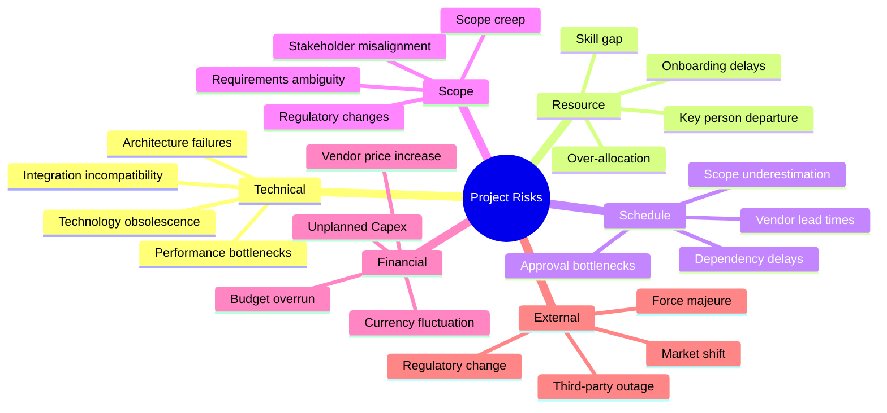
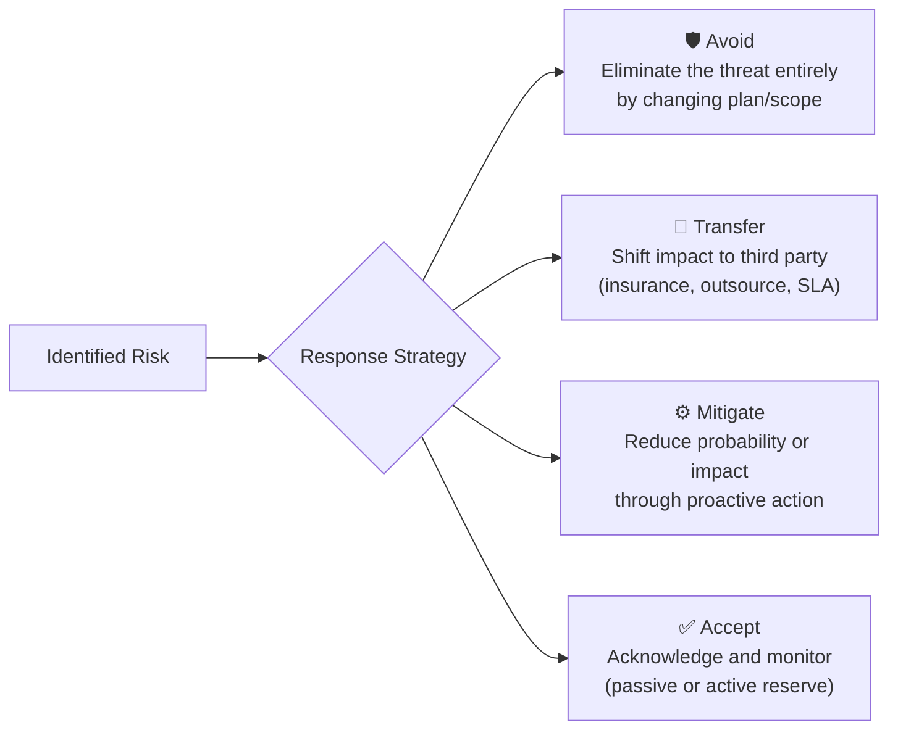
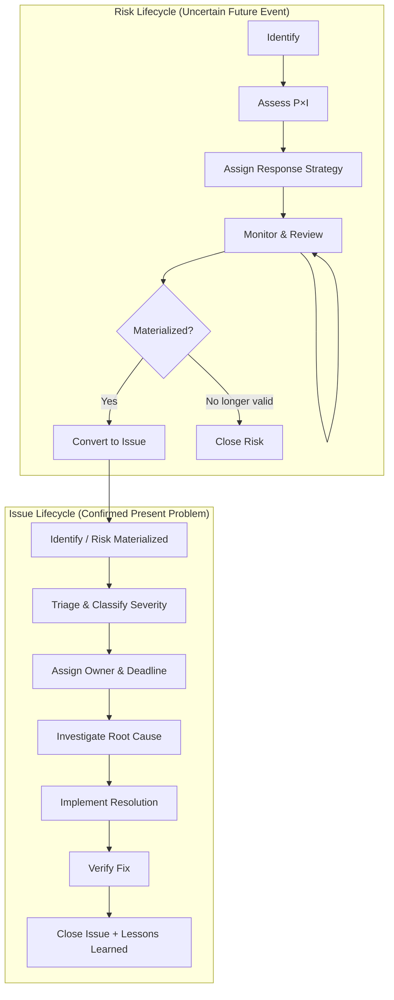

# Project Risk & Issue Management

> **Purpose:** Provide a visual-first, actionable framework for identifying, assessing, and responding to project risks and issues — designed so leadership can confirm status at a single glance without drowning in spreadsheets.  
> **Applies alongside:** `project_governance_raci.md` (escalation E1–E4), `project_management_operating_model.md` (gates G0–G6)  
> **Status:** Baseline Draft  
> **Version:** 1.0.0  
> **Date:** 2026-09-09

---

## 1. Risk Governance Principles

1. **Proactive, Not Reactive:** Risks must be identified and scored *before* they materialize into issues. A risk that was never logged is a governance failure.
2. **Visual-First Reporting:** The default view for any stakeholder above Project Manager level is the **RAG Heatmap**, not the detailed Risk Register. Detail is drill-down, not default.
3. **Single Owner, Single Deadline:** Every risk and every issue has exactly one owner and one target resolution date. Shared ownership means nobody owns it.
4. **Living Document:** The Risk Register and Issue Log are updated at every Sprint Review / Weekly Sync — not only at gate reviews.
5. **Escalation Integration:** Risk escalation follows the E1–E4 escalation ladder defined in `project_governance_raci.md`. A RED risk automatically triggers E2 or above.
6. **No Stale Risks:** Any risk without an update in 14 calendar days is auto-flagged as `REVIEW_OVERDUE` and escalated to the PM's supervisor.
7. **Separation of Risk and Issue:** A Risk is an uncertain event that *may* occur. An Issue is a confirmed problem that *has* occurred. They have separate tracking workflows.

---

## 2. Risk Taxonomy

Risks are classified into six categories to ensure comprehensive coverage during identification sessions.

---

## 3. Visual Risk Dashboard (RAG Heatmap)

> [!IMPORTANT]
> This is the **primary view** for leadership. Managers should be able to confirm project risk health in under 10 seconds from this dashboard — no clicking, no drilling, no scrolling through tables.

### 3.1 Dashboard Layout

The dashboard presents one row per project/module, with a single **Composite Risk Score** and a color-coded **RAG status**.

| Project / Module | Composite Risk Score | RAG | Top Risk | Owner | Trend |
| :--- | :---: | :---: | :--- | :--- | :---: |
| OmniProject Core | 22 | 🟢 | Tech debt accumulation | TL-Alpha | ↔ Stable |
| OmniKPI Engine | 48 | 🟡 | Data pipeline latency | TL-Beta | ↗ Rising |
| Mobile App v2 | 71 | 🔴 | Key developer resignation | PM-Charlie | ↗ Rising |
| Payment Integration | 35 | 🟡 | Vendor API breaking change | TL-Delta | ↘ Declining |

### 3.2 RAG Threshold Definitions

| RAG Status | Score Range | Meaning | Required Action |
| :--- | :---: | :--- | :--- |
| 🟢 **GREEN** | 0 – 30 | Under control. All identified risks have active mitigations and acceptable residual levels. | Continue monitoring. Report in Weekly Sync. |
| 🟡 **AMBER** | 31 – 60 | Heightened attention. One or more risks approaching tolerance thresholds. Mitigation in progress but not yet confirmed effective. | PM escalates to Sponsor at next Weekly Sync (E1→E2). Mitigation plan due within 5 business days. |
| 🔴 **RED** | 61 – 100 | Critical exposure. Immediate intervention required. Risk materialization is probable or has partially occurred. | Immediate escalation to Sponsor/Portfolio Board (E2→E3/E4). War-room session within 24 hours. |

### 3.3 Trend Indicators

| Indicator | Meaning |
| :--- | :--- |
| ↗ **Rising** | Score increased since last review period |
| ↔ **Stable** | Score unchanged (±5 points) |
| ↘ **Declining** | Score decreased since last review period |

### 3.4 Composite Risk Score Formula

The Composite Risk Score aggregates all active risks for a project/module into a single 0–100 number:

$$\text{Composite Risk Score} = \frac{\displaystyle\sum_{i=1}^{n} \left( P_i \times I_i \times W_i \right)}{\text{Max Possible Score}} \times 100$$

Where:

| Symbol | Definition | Scale |
| :--- | :--- | :--- |
| $P_i$ | Probability of risk $i$ occurring | 1 (Rare) – 5 (Almost Certain) |
| $I_i$ | Impact if risk $i$ materializes | 1 (Negligible) – 5 (Catastrophic) |
| $W_i$ | Category weight of risk $i$ (see taxonomy) | 0.5 – 1.5 (default 1.0) |
| $n$ | Number of active (non-closed) risks | — |
| Max Possible Score | $n \times 5 \times 5 \times 1.5$ (worst case) | — |

> [!TIP]
> **For quick mental math:** If you have 4 risks and the composite score is 45, the project is solidly AMBER. If the top risk alone would score 20+ out of 25, that single risk is the driver — focus mitigation there.

---

## 4. Risk Assessment Matrix (Drill-Down Layer)

> [!NOTE]
> This matrix is the **detail layer** — accessed when a manager wants to understand *why* a project is AMBER or RED. It is NOT the default reporting view.

### 4.1 Probability × Impact Grid (5×5)

|  | **1 – Negligible** | **2 – Minor** | **3 – Moderate** | **4 – Major** | **5 – Catastrophic** |
| :--- | :---: | :---: | :---: | :---: | :---: |
| **5 – Almost Certain** | 🟡 5 | 🟡 10 | 🔴 15 | 🔴 20 | 🔴 25 |
| **4 – Likely** | 🟢 4 | 🟡 8 | 🟡 12 | 🔴 16 | 🔴 20 |
| **3 – Possible** | 🟢 3 | 🟡 6 | 🟡 9 | 🟡 12 | 🔴 15 |
| **2 – Unlikely** | 🟢 2 | 🟢 4 | 🟡 6 | 🟡 8 | 🟡 10 |
| **1 – Rare** | 🟢 1 | 🟢 2 | 🟢 3 | 🟢 4 | 🟡 5 |

### 4.2 Probability Scale

| Score | Label | Guideline |
| :---: | :--- | :--- |
| 1 | Rare | < 10% chance of occurrence within project timeline |
| 2 | Unlikely | 10–30% chance |
| 3 | Possible | 30–50% chance |
| 4 | Likely | 50–80% chance |
| 5 | Almost Certain | > 80% chance |

### 4.3 Impact Scale

| Score | Label | Schedule Impact | Cost Impact | Quality Impact |
| :---: | :--- | :--- | :--- | :--- |
| 1 | Negligible | < 1 day delay | < 2% budget | Cosmetic only |
| 2 | Minor | 1–3 days delay | 2–5% budget | Minor rework, no user impact |
| 3 | Moderate | 3–10 days delay | 5–10% budget | Feature degradation, workaround exists |
| 4 | Major | 10–30 days delay | 10–25% budget | Critical feature unavailable |
| 5 | Catastrophic | > 30 days delay or project cancellation | > 25% budget | Data loss, security breach, regulatory violation |

---

## 5. Risk Response Strategies

Every identified risk must have an assigned response strategy:

| Strategy | When to Use | Example | Owner Responsibility |
| :--- | :--- | :--- | :--- |
| **Avoid** | Risk is unacceptable and can be eliminated by scope/approach change | Remove risky third-party dependency by building in-house | Document scope change via CR (doc 10) |
| **Transfer** | Impact can be shifted via contract, insurance, or outsourcing | Include penalty clause in vendor SLA for outage SLA breach | Ensure contract/legal review |
| **Mitigate** | Most common — reduce probability or impact through planned actions | Add automated regression tests to prevent production defects | Execute mitigation, track residual risk |
| **Accept (Active)** | Risk is low or cost of mitigation exceeds potential loss; set aside contingency | Allocate 10% budget contingency for currency fluctuation | Monitor trigger conditions |
| **Accept (Passive)** | Risk is negligible; no action warranted | Minor UI inconsistency in admin panel | Log and revisit if conditions change |

---

## 6. Risk vs Issue: Distinct Tracking Workflows

> [!WARNING]
> Do NOT conflate risks and issues. A Risk is an uncertain future event. An Issue is a confirmed present problem. Mixing them in one log causes stale entries and incorrect dashboards.

### 6.1 Lifecycle Comparison

### 6.2 Issue Severity Classification

| Severity | Label | Definition | Target Resolution Time |
| :---: | :--- | :--- | :--- |
| **S1** | Critical | Production down, data loss, security breach, revenue-impacting | ≤ 4 hours (war-room) |
| **S2** | High | Major feature broken, no workaround, significant user impact | ≤ 24 hours |
| **S3** | Medium | Feature degraded, workaround exists, moderate user impact | ≤ 5 business days |
| **S4** | Low | Minor inconvenience, cosmetic, has easy workaround | Next sprint / planned release |

---

## 7. Risk Register Template

Each project maintains a living Risk Register with the following columns:

| Field | Description | Example |
| :--- | :--- | :--- |
| **RISK-ID** | Unique identifier: `RISK-{Project}-{NNN}` | `RISK-OKP-001` |
| **Date Identified** | When the risk was first logged | 2026-09-01 |
| **Category** | Taxonomy category | Technical |
| **Description** | Clear, specific description of the uncertain event | "Payment gateway vendor may deprecate v2 API before our migration completes" |
| **Probability (P)** | 1–5 score | 3 |
| **Impact (I)** | 1–5 score | 4 |
| **Risk Score (P×I)** | Calculated | 12 (AMBER) |
| **RAG** | Color status derived from score | 🟡 |
| **Response Strategy** | Avoid / Transfer / Mitigate / Accept | Mitigate |
| **Mitigation Actions** | Specific actions to reduce P or I | "Begin v3 API migration in Sprint 12; maintain v2 fallback" |
| **Owner** | Single accountable person | TL-Delta |
| **Target Date** | Deadline for mitigation completion | 2026-10-15 |
| **Residual Risk** | Expected P×I after mitigation | 6 (GREEN) |
| **Status** | Open / In Mitigation / Monitoring / Closed / Materialized | In Mitigation |
| **Last Reviewed** | Date of most recent review | 2026-09-08 |
| **Trend** | ↗ Rising / ↔ Stable / ↘ Declining | ↘ Declining |

---

## 8. Issue Log Template

| Field | Description | Example |
| :--- | :--- | :--- |
| **ISSUE-ID** | Unique identifier: `ISSUE-{Project}-{NNN}` | `ISSUE-MOB-003` |
| **Date Identified** | When the issue was confirmed | 2026-09-05 |
| **Source** | How it was discovered (Risk materialization, QA, Production, User report) | Risk RISK-MOB-007 materialized |
| **Severity** | S1 / S2 / S3 / S4 | S2 |
| **Description** | Clear description of the confirmed problem | "Push notification service returns 503 for 15% of users after iOS 19 update" |
| **Root Cause** | Identified root cause (may be "Under Investigation") | Deprecated APNs certificate format |
| **Resolution Plan** | Specific fix actions | "Regenerate certificate with new format; deploy hotfix v2.3.1" |
| **Owner** | Single accountable person | TL-Alpha |
| **Target Resolution** | Deadline | 2026-09-07 |
| **Actual Resolution** | When actually resolved | 2026-09-06 |
| **Status** | Open / In Progress / Resolved / Verified / Closed | Closed |
| **Lessons Learned** | What to prevent recurrence | "Add certificate expiry monitoring to OpsGenie; add to Sprint 0 checklist" |

---

## 9. Integration with Existing Governance

### 9.1 Escalation Mapping

Risk RAG status maps directly to the escalation ladder defined in [project_governance_raci.md](file:///Users/macbookair/Downloads/omnimer_team/docs/business_logic/4-project_governance_raci.md):

| RAG | Escalation Level | Action |
| :--- | :--- | :--- |
| 🟢 GREEN | **E0** (No escalation) | PM monitors; reported in Weekly Sync |
| 🟡 AMBER | **E1 → E2** | PM raises to Sponsor at Weekly Sync; mitigation plan within 5 days |
| 🔴 RED | **E2 → E3/E4** | Immediate escalation to Sponsor/Portfolio Board; war-room within 24h |
| 🔴 RED + S1 Issue | **E4** (Emergency) | Portfolio Board / Steering Committee emergency session |

### 9.2 Gate Integration

Risk review is mandatory at every gate in the [Operating Model](file:///Users/macbookair/Downloads/omnimer_team/docs/business_logic/1-project_management_operating_model.md):

| Gate | Risk Activity |
| :--- | :--- |
| **G0 – Idea Screen** | Initial risk brainstorm (high-level only) |
| **G1 – Charter Approved** | First formal Risk Register draft |
| **G2 – Plan Baselined** | Full Risk Register with P×I scores and response strategies |
| **G3 – Execution Checkpoint** | Risk Register review; update scores; add newly identified risks |
| **G4 – Delivery Accepted** | Residual risk assessment; handover risks to operations team |
| **G5 – Benefits Review** | Post-implementation risk retrospective |
| **G6 – Closure** | Archive Risk Register; publish lessons learned |

### 9.3 Risk Review Cadence

| Forum | Frequency | Risk Activities |
| :--- | :--- | :--- |
| Daily Standup | Daily | Flag new risks/issues verbally; update in system same day |
| Sprint Review / Weekly Sync | Weekly | Review RAG Dashboard; update Risk Register; escalate AMBER/RED |
| Monthly Steering Committee | Monthly | Review portfolio-level Risk Heatmap; approve cross-project mitigations |
| Gate Review | Per gate | Full Risk Register audit; sign-off required for gate passage |

---
