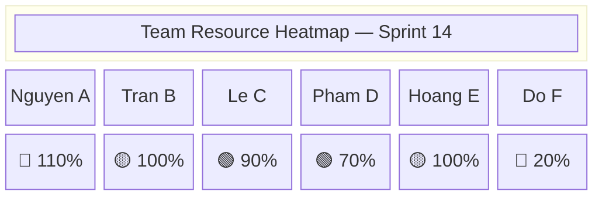

# Project Resource & Capacity Management

> **Purpose:** Provide capacity planning formulas, resource allocation tracking, and conflict detection to help leadership know *in advance* whether teams are overloaded, under-utilized, or cross-allocated across competing projects.  
> **Applies alongside:** `project_management_operating_model.md` (sprint/phase planning), `project_metrics.md` (velocity baselines), `project_governance_raci.md` (role definitions)  
> **Status:** Baseline Draft  
> **Version:** 1.0.0  
> **Date:** 2026-09-09

---

## 1. Resource Management Principles

1. **Capacity-First Planning:** No sprint or phase commitment shall be made without first calculating the team's available capacity. Commitment without capacity data is a scheduling fiction.
2. **No Over-Allocation by Default:** A single individual's total allocation across all projects must not exceed 100%. Exceptions require explicit PM approval with documented justification and a burnout risk acknowledgment.
3. **Historical Velocity as Baseline:** Sprint capacity estimates must be anchored to the team's trailing 3-sprint average velocity — not aspirational targets or management wishes.
4. **Transparency of Utilization:** Resource allocation data is visible to all Project Managers and above. No "hidden" allocations to side projects.
5. **Bus Factor Awareness:** Any module or function with a Bus Factor of 1 (only one person understands it) must be flagged as a resource risk in the [Risk Register](file:///Users/macbookair/Downloads/omnimer_team/docs/business_logic/8-project_risk_issue_management.md).
6. **Ramp-Up Realism:** New team members do not operate at full capacity on day one. Capacity planning must account for onboarding ramp-up curves.
7. **Forecast Before Firefight:** Capacity conflicts must be detected and resolved during Sprint Planning — not discovered mid-sprint when deadlines are already at risk.

---

## 2. Capacity Planning

### 2.1 Available Capacity Formula

The foundation of all capacity planning is calculating **how many productive hours a team actually has** after accounting for real-world deductions.

$$\text{Available Hours}_{\text{person}} = D_{\text{work}} \times H_{\text{day}} \times F_{\text{focus}} - (H_{\text{PTO}} + H_{\text{holiday}} + H_{\text{meetings}} + H_{\text{support}})$$

| Symbol | Definition | Typical Value |
| :--- | :--- | :--- |
| $D_{\text{work}}$ | Working days in the sprint/phase | 10 days (2-week sprint) |
| $H_{\text{day}}$ | Contractual hours per day | 8 hours |
| $F_{\text{focus}}$ | Focus factor — fraction of time on project work (excludes admin, emails, context-switching) | 0.75 – 0.85 |
| $H_{\text{PTO}}$ | Hours consumed by planned PTO / sick leave | Varies per person |
| $H_{\text{holiday}}$ | Hours consumed by public holidays in the period | Check regional calendar |
| $H_{\text{meetings}}$ | Hours consumed by recurring meetings (standup, retro, 1:1, all-hands) | ~5–8 hours/sprint |
| $H_{\text{support}}$ | Hours reserved for production support duty, on-call rotation | Varies by role |

**Example Calculation (2-week Sprint, 1 Developer):**

| Item | Calculation | Hours |
| :--- | :--- | :--- |
| Gross hours | 10 days × 8 hours | 80.0 |
| Focus factor (0.80) | 80 × 0.80 | 64.0 |
| PTO (1 day) | −8.0 | −8.0 |
| Public holiday (1 day) | −8.0 | −8.0 |
| Meetings | −6.0 | −6.0 |
| Support duty | −4.0 | −4.0 |
| **Available Hours** | — | **38.0** |

### 2.2 Sprint Capacity Model (Story Points)

For Agile teams using Story Points:

$$\text{Sprint Capacity}_{\text{team}} (SP) = \sum_{j=1}^{m} \left( V_{\text{avg},j} \times \frac{\text{Available Days}_j}{\text{Standard Sprint Days}} \right)$$

Where:

| Symbol | Definition |
| :--- | :--- |
| $m$ | Number of team members |
| $V_{\text{avg},j}$ | Trailing 3-sprint average velocity for person $j$ |
| Available Days$_j$ | Person $j$'s available working days this sprint (after PTO, holidays) |
| Standard Sprint Days | Normal sprint length (e.g., 10 days) |

> [!TIP]
> **Rule of thumb:** If a team's trailing velocity is 40 SP/sprint with all 5 members present, but 2 members have 1 day off each, the adjusted capacity is approximately: $40 \times \frac{(5 \times 10 - 2)}{5 \times 10} = 40 \times 0.96 = 38.4 \text{ SP}$

### 2.3 Phase Capacity Model (Waterfall / Hybrid)

For phase-based planning using effort-hours:

$$\text{Phase Capacity}_{\text{team}} (\text{hours}) = \sum_{j=1}^{m} \text{Available Hours}_j \times \text{Allocation\%}_j$$

Where Allocation% is the fraction of person $j$'s time dedicated to this specific project (e.g., 0.5 for 50% allocation).

---

## 3. Resource Allocation Matrix

### 3.1 Cross-Project Allocation View

This matrix provides a single view of who is allocated where, enabling instant detection of over-allocation and under-utilization.

| Team Member | Role | Project A (%) | Project B (%) | Support (%) | **Total (%)** | **Status** |
| :--- | :--- | :---: | :---: | :---: | :---: | :---: |
| Nguyen Van A | Senior Dev | 80% | 30% | — | **110%** | 🔴 Over |
| Tran Thi B | Full-Stack Dev | 60% | 40% | — | **100%** | 🟡 Full |
| Le Van C | QA Engineer | 50% | 30% | 10% | **90%** | 🟢 OK |
| Pham Thi D | DevOps | 40% | — | 30% | **70%** | 🟢 OK |
| Hoang Van E | Junior Dev | 100% | — | — | **100%** | 🟡 Full |
| Do Thi F | BA/PO | 20% | — | — | **20%** | 🔵 Under |

### 3.2 Allocation Status Definitions

| Status | Utilization Rate | Color | Meaning | Action |
| :--- | :---: | :---: | :--- | :--- |
| **Over-Allocated** | > 100% | 🔴 | Burnout risk. Schedule conflicts guaranteed. Quality will suffer. | **Mandatory rebalancing.** PM must redistribute within 2 business days. |
| **Fully Utilized** | 85% – 100% | 🟡 | Healthy high utilization. No buffer for unplanned work. | Monitor closely. Flag if unplanned requests arrive. |
| **Available** | 60% – 84% | 🟢 | Productive with buffer for ad-hoc needs and learning. | Optimal state for most team members. |
| **Under-Utilized** | < 60% | 🔵 | Bench risk. May indicate poor planning or skill mismatch. | Review: assign to project work, training, or internal tooling. |

---

## 4. Conflict Detection Rules

### 4.1 Automated Conflict Alerts

The system shall generate alerts when any of the following conditions are detected:

| Rule ID | Condition | Severity | Alert Target |
| :--- | :--- | :---: | :--- |
| **RC-01** | Any individual's total allocation > 100% | 🔴 Critical | PM + Resource Manager |
| **RC-02** | Any individual's total allocation > 80% on a single project classified as high-risk (RED in Risk Dashboard) | 🟡 Warning | PM + Sponsor |
| **RC-03** | Any individual allocated to 3+ concurrent projects | 🟡 Warning | PM + Resource Manager |
| **RC-04** | Any individual's allocation increases by > 20% within a single sprint without prior approval | 🟡 Warning | PM |
| **RC-05** | Bus Factor = 1 on any critical-path module (only one person assigned) | 🔴 Critical | PM + TL |
| **RC-06** | Team's total sprint commitment exceeds 90% of calculated Sprint Capacity | 🟡 Warning | SM / PM |
| **RC-07** | New team member assigned > 70% capacity within their first 2 sprints (ramp-up violation) | 🟡 Warning | PM + TL |

### 4.2 Conflict Resolution Priority

When resource conflicts are detected, resolve using this priority order:

1. **Business-critical deadline** takes priority (contractual, regulatory, revenue-impacting).
2. **Project RAG status:** RED project gets priority over AMBER; AMBER over GREEN.
3. **Seniority of requester** (Portfolio Board > Sponsor > PM).
4. **First-come-first-served** (earlier approved allocation wins).
5. If still unresolved → escalate to Portfolio Board / Resource Committee.

---

## 5. Resource Heatmap (Visual Dashboard)

> [!IMPORTANT]
> Like the Risk Dashboard, the Resource Heatmap is designed for leadership to scan team health at a glance.

### 5.1 Team-Level Heatmap

### 5.2 Project-Level Capacity Summary

| Project | Team Size | Sprint Capacity (SP) | Committed (SP) | Load % | Status |
| :--- | :---: | :---: | :---: | :---: | :---: |
| OmniProject Core | 5 | 38 | 35 | 92% | 🟡 Near Capacity |
| OmniKPI Engine | 3 | 22 | 18 | 82% | 🟢 Healthy |
| Mobile App v2 | 4 | 30 | 33 | 110% | 🔴 Over-Committed |
| Payment Integration | 2 | 14 | 10 | 71% | 🟢 Healthy |

---

## 6. Skill Matrix & Bus Factor Analysis

### 6.1 Skill Matrix

The Skill Matrix maps team members to critical knowledge domains, identifying single points of failure.

| Knowledge Domain | Nguyen A | Tran B | Le C | Pham D | Hoang E | **Bus Factor** |
| :--- | :---: | :---: | :---: | :---: | :---: | :---: |
| Payment Gateway Integration | ⬛ Expert | — | — | — | — | 🔴 **1** |
| CI/CD Pipeline | — | ⬜ Basic | — | ⬛ Expert | — | 🔴 **1** |
| Flutter Mobile | ⬛ Expert | 🔲 Intermediate | — | — | ⬜ Basic | 🟡 **2** |
| Backend API (NestJS) | ⬛ Expert | ⬛ Expert | — | — | 🔲 Intermediate | 🟢 **3** |
| Database Administration | — | 🔲 Intermediate | — | ⬛ Expert | — | 🟡 **2** |
| QA Automation | — | — | ⬛ Expert | — | — | 🔴 **1** |

### 6.2 Bus Factor Thresholds

| Bus Factor | Status | Required Action |
| :---: | :---: | :--- |
| **1** | 🔴 Critical | Immediate knowledge transfer required. Pair programming mandatory. Document all tribal knowledge. Flag as resource risk in Risk Register. |
| **2** | 🟡 Acceptable | Schedule cross-training within next quarter. Ensure documentation is up to date. |
| **≥ 3** | 🟢 Healthy | No immediate action. Continue standard knowledge sharing. |

---

## 7. Onboarding Ramp-Up Model

New team members do not reach full productivity immediately. Capacity planning must account for this reality.

### 7.1 Standard Ramp-Up Curve

| Sprint | Expected Productivity | Rationale |
| :---: | :---: | :--- |
| Sprint 1 | **30%** | Environment setup, codebase orientation, reading documentation, first small tasks |
| Sprint 2 | **50%** | First meaningful contributions, still learning domain and team norms |
| Sprint 3 | **70%** | Competent on most tasks, occasional questions on complex areas |
| Sprint 4 | **85%** | Near full productivity, handling most tasks independently |
| Sprint 5+ | **95–100%** | Full team member, contributing to code reviews and mentoring |

### 7.2 Ramp-Up Capacity Formula

$$\text{New Member Capacity}_{\text{sprint}} = \text{Full Capacity} \times R_{\text{sprint}}$$

Where $R_{\text{sprint}}$ is the ramp-up factor from the table above (0.30, 0.50, 0.70, 0.85, 0.95+).

> [!WARNING]
> Assigning a new team member > 70% of full capacity in their first 2 sprints (Conflict Rule RC-07) indicates unrealistic planning and will trigger a system alert.

### 7.3 Onboarding Prerequisites

Before a new member can be planned into sprint capacity, the following must be completed:

| Day | Milestone | Responsible |
| :---: | :--- | :--- |
| Day 1 | Account provisioning, environment access, tooling setup | WA (Workspace Admin) |
| Day 1–2 | Read BRD, FRD, and Architecture Document per [Handover Policy](file:///Users/macbookair/Downloads/omnimer_team/docs/business_logic/12-project_communication_reporting_handover.md) | New Member |
| Day 2–3 | Codebase walkthrough with assigned mentor | TL / Mentor |
| Day 3–5 | First paired task (pair programming with senior) | TL / Buddy |
| Day 5–10 | First independent task (small, well-defined scope) | PM assigns |
| End of Sprint 1 | Onboarding retrospective — assess ramp-up progress | PM + TL + New Member |

---

## 8. Capacity Planning Cadence

| Activity | When | Who | Output |
| :--- | :--- | :--- | :--- |
| **Sprint Capacity Calculation** | Sprint Planning (Day 1) | SM / PM | Available SP/hours for the sprint |
| **Resource Allocation Update** | Sprint Planning (Day 1) | PM / Resource Manager | Updated Allocation Matrix |
| **Conflict Detection Review** | Sprint Planning (Day 1) | PM | Resolved conflicts or escalations |
| **Resource Heatmap Review** | Weekly Sync | PM + Leadership | Utilization status across projects |
| **Skill Matrix Update** | Quarterly | TL + HR | Updated Bus Factor analysis |
| **Capacity Forecast (Next Quarter)** | Monthly Steering | PM + PMO | Forward-looking resource demand vs supply |

---

## 9. Integration with Project Ecosystem

| Document | Integration Point |
| :--- | :--- |
| [Operating Model](file:///Users/macbookair/Downloads/omnimer_team/docs/business_logic/1-project_management_operating_model.md) | Sprint Capacity feeds into Sprint Planning gate; Phase Capacity feeds into G2 baseline |
| [RACI & Governance](file:///Users/macbookair/Downloads/omnimer_team/docs/business_logic/4-project_governance_raci.md) | Role definitions determine who is allocated; conflict escalation uses E1–E4 ladder |
| [Metrics](file:///Users/macbookair/Downloads/omnimer_team/docs/business_logic/5-project_metrics.md) | Velocity baselines feed Sprint Capacity Model; Utilization Rate feeds Personnel KPI |
| [Metric Dictionary](file:///Users/macbookair/Downloads/omnimer_team/docs/business_logic/6-project_metric_dictionary.md) | Utilization Rate and Capacity metrics follow metric contract standards |
| [Risk Management](file:///Users/macbookair/Downloads/omnimer_team/docs/business_logic/8-project_risk_issue_management.md) | Bus Factor = 1 → flagged as Resource Risk; Over-allocation → flagged as Schedule Risk |
| [Communication & Handover](file:///Users/macbookair/Downloads/omnimer_team/docs/business_logic/12-project_communication_reporting_handover.md) | Onboarding Runbook prerequisite for new member capacity planning |

---
