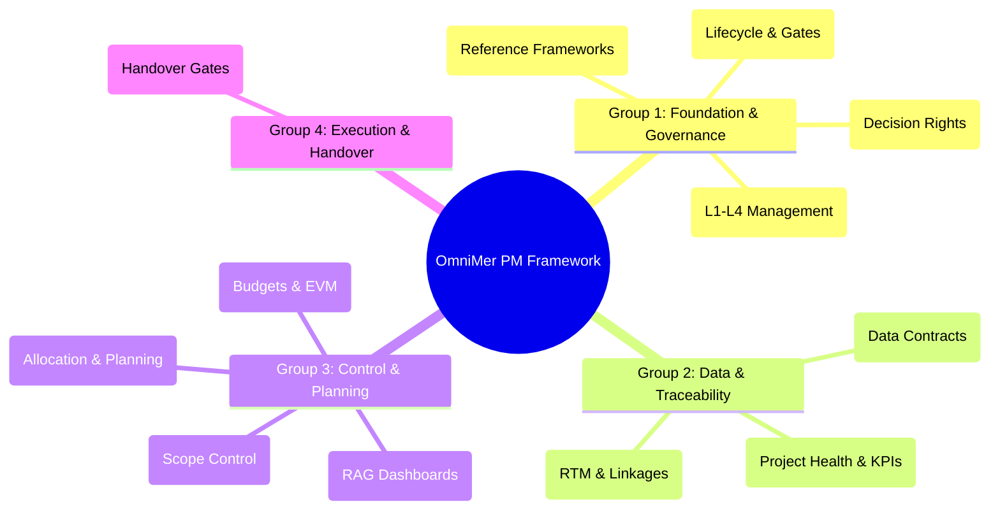

# OmniMer Business Logic Ecosystem Overview

> **Purpose:** This document provides a high-level, birds-eye view of the OmniMer Project Management Framework, which consists of 12 core business logic documents. Read this first to understand the system architecture before diving into specific mechanics.  
> **Status:** Baseline Draft  
> **Last Updated:** 2026-09-09

---

## 1. Core Operating Philosophy

The OmniMer ecosystem is designed on immutable, enterprise-grade principles:

1. **Anti-Vibe-Coding & Mandatory Handover:** Developers are forbidden from writing code based on intuition or UI assumptions without understanding the business rules. Handing over a project with "just the source code" is strictly prohibited; documentation is a first-class deliverable.
2. **Transparency & Anti-Gaming:** Raw metrics (e.g., story points, commit counts) cannot be misused to stack-rank individuals. Every KPI is governed by a strict, mathematical "Metric Contract."
3. **Management by Exception & Visual-First:** Leadership should not drown in spreadsheets. The system uses RAG (Red-Amber-Green) Heatmaps for risk, resource, and health reporting. Senior management only intervenes when tolerances are breached.
4. **End-to-End Traceability:** Every line of code and every test case must trace back to a specific business objective. Silent changes are not tolerated.

---

## 2. The 12-Document Ecosystem Map

The business logic suite is categorized into 4 interconnected groups:

---

## 3. Document Summaries

### Group 1: Foundation & Governance
* **[1-project_management_operating_model.md](./1-project_management_operating_model.md):** The heart of the system. Defines the project lifecycle through phase gates (G0 - G6) and universal operating rules.
* **[2-project_management_model.md](./2-project_management_model.md):** Educational reference for Agile, Scrum, Waterfall, Kanban, OKR, KPI, etc. Contains no hard operational rules.
* **[3-project_management_scope_levels.md](./3-project_management_scope_levels.md):** Defines the 4 layers of management: L1 (Task), L2 (Project), L3 (Program), L4 (Portfolio).
* **[4-project_governance_raci.md](./4-project_governance_raci.md):** The RACI matrix. Dictates exactly who has decision authority and defines the 4-tier escalation paths (E1 - E4).

### Group 2: Data & Traceability
* **[5-project_metrics.md](./5-project_metrics.md):** The overall measurement architecture, split into Project Health (Schedule/Cost/Quality) and Personnel KPIs (Output/Quality/Hygiene).
* **[6-project_metric_dictionary.md](./6-project_metric_dictionary.md):** The "Metric Contracts." Locks down the exact mathematical formulas to prevent data manipulation and gaming.
* **[7-project_management_traceability.md](./7-project_management_traceability.md):** The Requirements Traceability Matrix (RTM) rules. Enforces the chain: Objective → BR → FR → User Story → Test Case.

### Group 3: Control & Planning
* **[8-project_risk_issue_management.md](./8-project_risk_issue_management.md):** Visual risk management via RAG Heatmaps and a single Composite Score. Clearly separates future Risks from current Issues.
* **[9-project_resource_capacity_management.md](./9-project_resource_capacity_management.md):** Formulas for calculating capacity before sprints. Prevents burnout and detects conflicts when a resource is allocated > 100%. Tracks Bus Factor.
* **[10-project_change_management.md](./10-project_change_management.md):** Defends against Scope Creep. All changes require an Impact Assessment and Change Control Board (CCB) approval based on magnitude.
* **[11-project_financial_cost_management.md](./11-project_financial_cost_management.md):** Budget baselining, cost estimation methods, and Earned Value Management (EVM) to track cash burn rates.

### Group 4: Execution & Handover
* **[12-project_communication_reporting_handover.md](./12-project_communication_reporting_handover.md):** The strictest document. Enforces the "Anti-Vibe-Coding Policy," defines meeting cadences, and mandates an **18-artifact checklist** before any system handover or new member onboarding can occur.

---

## 4. How to Use This Framework

- **For CEOs / Portfolio Managers:** Focus on documents 1, 3, 4, 8, and 11 to understand how to govern cash flow, strategic risks, and milestone approvals without micro-managing.
- **For Project Managers / Scrum Masters:** Read all 12 documents. This is your daily operational bible.
- **For Developers / QA Engineers:** Documents 7 and 12 are mandatory reading to understand traceability rules and why "vibe coding" is banned. Documents 5 and 6 explain exactly how your performance is evaluated.
