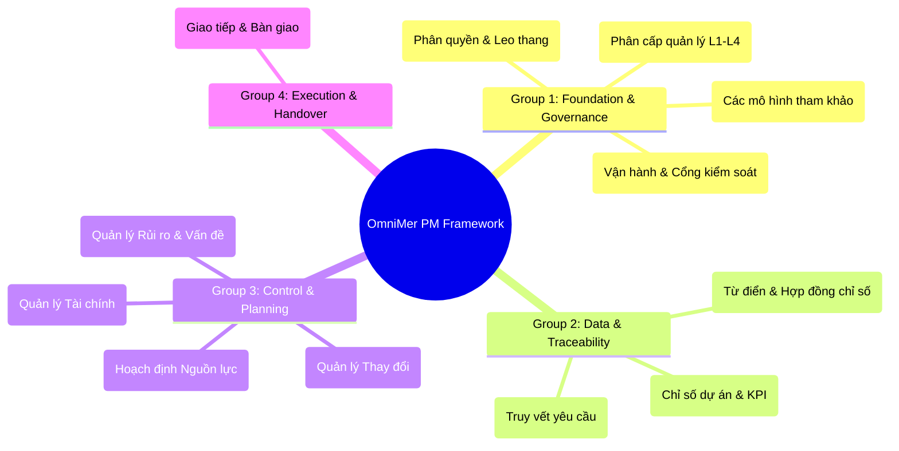

# Tổng Quan Hệ Sinh Thái Nghiệp Vụ OmniMer (OmniMer Business Logic Overview)

> **Mục đích:** Tài liệu này cung cấp bức tranh toàn cảnh về bộ khung quản trị dự án OmniMer (OmniMer Project Management Framework), bao gồm 12 tài liệu nghiệp vụ cốt lõi. Đọc tài liệu này trước để hiểu tư duy hệ thống trước khi đi sâu vào chi tiết.  
> **Trạng thái:** Baseline Draft  
> **Ngày cập nhật:** 2026-09-09

---

## 1. Triết Lý Vận Hành Cốt Lõi (Core Philosophy)

Hệ sinh thái OmniMer được thiết kế dựa trên các nguyên tắc bất di bất dịch mang tiêu chuẩn doanh nghiệp lớn (Enterprise-grade):

1. **Chống "Vibe Coding" & Ép buộc Bàn giao (Anti-Vibe-Coding & Mandatory Handover):** Lập trình viên không được phép code theo cảm tính hoặc phỏng đoán từ giao diện. Bắt buộc phải đọc hiểu nghiệp vụ. Việc bàn giao dự án mà "chỉ có source code" bị nghiêm cấm; tài liệu là một phần của sản phẩm.
2. **Minh bạch & Chống gian lận (Transparency & Anti-Gaming):** Dữ liệu đánh giá KPI (Story points, commit count) không được phép dùng sai mục đích để xếp hạng cá nhân. Mọi chỉ số đều có hợp đồng công thức (Metric Contract) rõ ràng.
3. **Quản trị bằng Ngoại lệ & Trực quan hóa (Management by Exception & Visual-First):** Lãnh đạo không xem những bảng số vô hồn. Hệ thống sử dụng RAG Heatmap (Red-Amber-Green) để báo cáo rủi ro, nguồn lực và tiến độ. Cấp trên chỉ can thiệp khi chỉ số vượt ngưỡng an toàn (Tolerance).
4. **Truy vết vạn vật (End-to-End Traceability):** Mọi dòng code, mọi test case đều phải truy vết ngược về một mục tiêu kinh doanh cụ thể. Không có thay đổi ngầm (Silent changes).

---

## 2. Bản Đồ Hệ Sinh Thái 12 Tài Liệu (The 12-Document Map)

Bộ nghiệp vụ được chia thành 4 nhóm chính, liên kết chặt chẽ với nhau:

---

## 3. Tóm Tắt Chức Năng Từng Tài Liệu

### Nhóm 1: Nền tảng & Quản trị (Foundation & Governance)
* **[1-project_management_operating_model.md](./1-project_management_operating_model.md):** Trái tim của hệ thống. Định nghĩa vòng đời dự án qua các cổng kiểm soát (Gates G0 - G6) và nguyên tắc vận hành chung.
* **[2-project_management_model.md](./2-project_management_model.md):** Tài liệu giáo dục/tham khảo về Agile, Scrum, Waterfall, Kanban, OKR, KPI. Không chứa quy trình cứng.
* **[3-project_management_scope_levels.md](./3-project_management_scope_levels.md):** Định nghĩa 4 cấp độ quản lý: L1 (Task), L2 (Project), L3 (Program), L4 (Portfolio). Mỗi cấp có đối tượng và góc nhìn riêng.
* **[4-project_governance_raci.md](./4-project_governance_raci.md):** Ma trận quyền hạn RACI. Định nghĩa rõ ai có quyền quyết định và 4 cấp độ leo thang xử lý sự cố (Escalation E1 - E4).

### Nhóm 2: Dữ liệu & Truy vết (Data & Traceability)
* **[5-project_metrics.md](./5-project_metrics.md):** Kiến trúc đo lường tổng thể, chia làm 2 nhánh: Sức khỏe dự án (Schedule, Cost, Quality) và KPI Nhân sự (Năng suất, Chất lượng, Kỷ luật).
* **[6-project_metric_dictionary.md](./6-project_metric_dictionary.md):** Nơi chứa "Hợp đồng chỉ số" (Metric Contracts). Khóa chặt công thức toán học để hệ thống code theo, ngăn chặn việc thao túng số liệu.
* **[7-project_management_traceability.md](./7-project_management_traceability.md):** Ma trận truy vết (RTM). Yêu cầu mọi dòng code phải liên kết theo chuỗi: Objective → BR → FR → User Story → Test Case.

### Nhóm 3: Kiểm soát & Lập kế hoạch (Control & Planning)
* **[8-project_risk_issue_management.md](./8-project_risk_issue_management.md):** Quản lý rủi ro trực quan (RAG Heatmap) bằng 1 con số tổng hợp (Composite Score). Phân biệt rạch ròi giữa Risk (chưa xảy ra) và Issue (đã xảy ra).
* **[9-project_resource_capacity_management.md](./9-project_resource_capacity_management.md):** Công thức tính Capacity trước mỗi Sprint. Chống vắt kiệt sức lao động, cảnh báo xung đột (Conflict) khi 1 dev làm >100% capacity hoặc là điểm nghẽn (Bus Factor = 1).
* **[10-project_change_management.md](./10-project_change_management.md):** Chống Scope Creep. Mọi thay đổi phải qua đánh giá tác động và duyệt bởi CCB (Change Control Board) tùy theo mức độ ảnh hưởng (Minor/Major/Critical).
* **[11-project_financial_cost_management.md](./11-project_financial_cost_management.md):** Lập ngân sách (Budget Baseline), EVM (Earned Value Management) để theo dõi tốc độ đốt tiền (Burn rate) và phân loại Capex/Opex.

### Nhóm 4: Thực thi & Bàn giao (Execution & Handover)
* **[12-project_communication_reporting_handover.md](./12-project_communication_reporting_handover.md):** Tài liệu khắc nghiệt nhất, định nghĩa "Anti-Vibe-Coding Policy", nhịp độ họp hành, và bộ **18 tài liệu bắt buộc phải có** (Checklist) trước khi bàn giao hệ thống hoặc onboard người mới.

---

## 4. Hướng Dẫn Sử Dụng (How to Use)

- **Nếu bạn là CEO / Portfolio Manager:** Đọc tài liệu 1, 3, 4, 8, 11 để nắm cách kiểm soát dòng tiền, tiến độ và rủi ro ở tầm nhìn chiến lược.
- **Nếu bạn là Project Manager / Scrum Master:** Đọc toàn bộ 12 tài liệu. Đây là "kinh thánh" vận hành hàng ngày của bạn.
- **Nếu bạn là Developer / QA:** Bắt buộc đọc tài liệu 7, 12 để hiểu quy tắc làm việc, chống vibe-coding và viết tài liệu chuyển giao đúng chuẩn. Đọc tài liệu 5, 6 để biết mình được đánh giá KPI như thế nào.
