# Comprehensive Guide to Project Management, Performance, and Productivity Frameworks

> [!NOTE]
> This reference guide provides a structured overview of industry-standard frameworks for project management, organizational performance, and personal productivity.

---

## Table of Contents

- [Part 1: Project & Process Management (Team & Organization)](#part-1-project--process-management-team--organization)
  - [1. Kanban](#1-kanban)
  - [2. Scrum (Agile)](#2-scrum-agile)
  - [3. Waterfall](#3-waterfall)
  - [4. Lean Management](#4-lean-management)
  - [5. Six Sigma](#5-six-sigma)
  - [6. PRINCE2](#6-prince2)
- [Part 2: Goal & Performance Management (Enterprise & Strategy)](#part-2-goal--performance-management-enterprise--strategy)
  - [1. OKR (Objectives and Key Results)](#1-okr-objectives-and-key-results)
  - [2. KPI (Key Performance Indicator)](#2-kpi-key-performance-indicator)
  - [3. BSC (Balanced Scorecard)](#3-bsc-balanced-scorecard)
  - [4. MBO (Management by Objectives)](#4-mbo-management-by-objectives)
- [Part 3: Productivity & Time Management (Individual)](#part-3-productivity--time-management-individual)
  - [1. GTD (Getting Things Done)](#1-gtd-getting-things-done)
  - [2. Eisenhower Matrix](#2-eisenhower-matrix)
  - [3. Timeboxing & Pomodoro Technique](#3-timeboxing--pomodoro-technique)
  - [4. Eat That Frog](#4-eat-that-frog)
- [Summary & Framework Comparison Matrix](#summary--framework-comparison-matrix)

---

## Part 1: Project & Process Management (Team & Organization)

### 1. Kanban

* **Overview:** A visual workflow management method originating from Toyota’s Production System (TPS). It optimizes value delivery and identifies real-time operational bottlenecks.
* **Core Characteristics:**
  * **Visual Workflow:** Visualizes progress using a Kanban Board with standard columns: `To-Do → In Progress → Done`.
  * **Work in Progress (WIP) Limits:** Enforces maximum task capacity per stage to prevent cognitive overload and system congestion.
  * **Pull System:** New tasks are pulled into active stages only when current capacity frees up.
  * **Flow Optimization:** Focuses on reducing **Cycle Time** (time spent working on a task) and **Lead Time** (total time from request to completion).

* **Ideal Use Cases:**
  * Operational maintenance, IT support, and DevOps helpdesks.
  * Product engineering teams handling continuous, unpredictable request streams.
  * Marketing and HR departments managing recurring operational tasks.

---

### 2. Scrum (Agile)

* **Overview:** An iterative and incremental framework within the Agile philosophy that breaks project execution into short, fixed-length cycles (Sprints) to regularly deliver usable product increments.
* **Core Characteristics:**
  * **Timeboxed Sprints:** Short development cycles typically lasting between 1 to 4 weeks.
  * **3 Core Roles:**
    * **Product Owner:** Defines product vision, prioritizes the backlog, and owns ROI.
    * **Scrum Master:** Facilitates the process, removes blockers, and guards Scrum principles.
    * **Development Team:** Cross-functional, self-organizing group responsible for delivery.
  * **3 Primary Artifacts:** Product Backlog, Sprint Backlog, and Product Increment (meeting the *Definition of Done*).
  * **High Adaptability:** Embraces changing requirements at the start of each Sprint cycle.

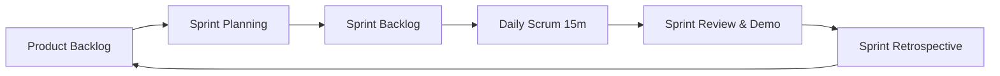

* **Ideal Use Cases:**
  * Software development, mobile app development, and digital platform builds.
  * R&D and innovative product initiatives where requirements evolve rapidly based on market feedback.

---

### 3. Waterfall

* **Overview:** A classic linear and sequential project management framework where development flows downward through distinct phases like a waterfall. A phase cannot begin until its predecessor is fully completed and approved.
* **Core Characteristics:**
  * **Strict Phase Gates:** Require 100% formal sign-off before proceeding to the next stage.
  * **Front-loaded Documentation:** Heavy reliance on up-front specification documents (PRD, SRS, Architectural Designs).
  * **High Cost of Change:** Modifications late in the development cycle incur significant financial and schedule penalties.
  * **Late Validation:** End-users interact with the working system near the end of the project lifecycle.

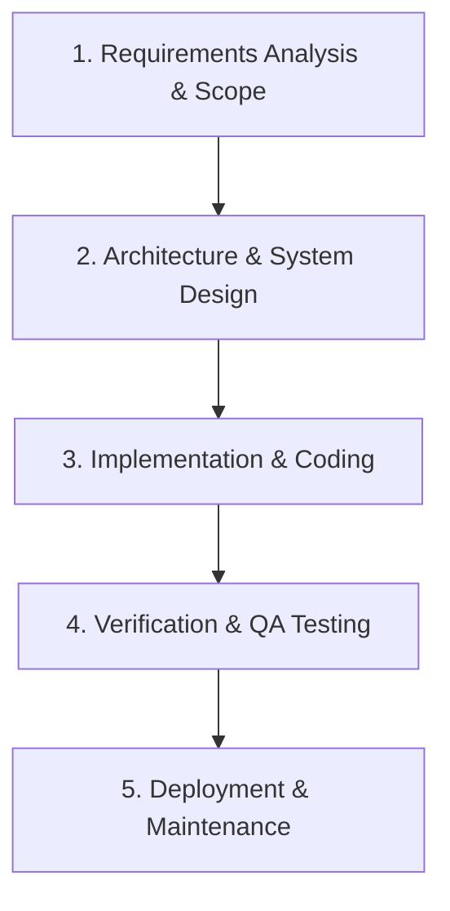

* **Ideal Use Cases:**
  * Civil construction, infrastructure, heavy manufacturing, and embedded systems engineering.
  * Government, banking, and healthcare projects subject to rigid regulatory requirements and fixed contracts.

---

### 4. Lean Management

* **Overview:** A business methodology focused on maximizing customer value while eliminating all forms of waste (*Muda*) across the enterprise value chain.
* **Core Characteristics:**
  * **Elimination of 8 Wastes:** Overproduction, Waiting, Transport, Overprocessing, Inventory, Motion, Defects, and Unutilized Human Talent.
  * **Just-in-Time (JIT):** Producing only what is needed, when it is needed, in the exact quantity required.
  * **Kaizen:** Enterprise-wide culture of continuous, incremental improvement.

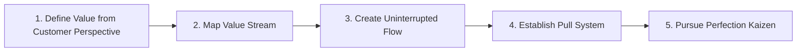

* **Ideal Use Cases:**
  * Manufacturing assembly lines, warehousing, and supply chain logistics.
  * Process optimization in banking, administrative workflows, and healthcare services.

---

### 5. Six Sigma

* **Overview:** A disciplined, statistics-driven quality management methodology designed to minimize process variation and achieve near-zero defect rates (Six Sigma standard target: $\le 3.4$ Defects Per Million Opportunities - DPMO).
* **Core Characteristics:**
  * **Data-Driven Decision Making:** Relies on quantitative, empirical statistical analysis.
  * **Martial Arts Belt Hierarchy:** Certified roles including Yellow Belts, Green Belts, Black Belts, and Master Black Belts.
  * **Root Cause Elimination:** Focuses on process stability and eliminating the root causes of variation.

#### The DMAIC Cycle

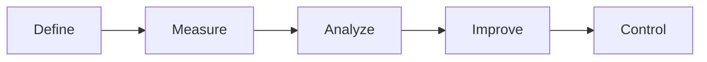

1. **Define:** Identify the business problem, project goals, and Critical-to-Quality (CTQ) customer requirements.
2. **Measure:** Collect baseline performance data on the current process.
3. **Analyze:** Apply statistical tools (Fishbone diagrams, Regression, ANOVA) to isolate root causes of defects.
4. **Improve:** Design, test, and implement targeted solutions to eradicate root causes.
5. **Control:** Implement monitoring controls (Control Charts, SOPs) to sustain quality gains long-term.

* **Ideal Use Cases:**
  * High-precision manufacturing (Semiconductors, Aerospace, Medical Devices, Automotive).
  * High-volume financial transaction processing requiring near-absolute accuracy.

---

### 6. PRINCE2 (Projects IN Controlled Environments)

* **Overview:** A highly structured project management framework developed by the UK Government, emphasizing explicit governance, stage-by-stage control, and continuous business justification.
* **Core Characteristics:**
  * **Continued Business Justification:** Projects must continuously justify commercial viability; if viability drops, the project is terminated immediately.
  * **Management by Tolerance:** Explicit thresholds set across 6 performance targets (Cost, Time, Quality, Scope, Risk, Benefits).
  * **Management by Exception:** Senior boards intervene only when defined stage tolerances are breached or forecasted to be breached.

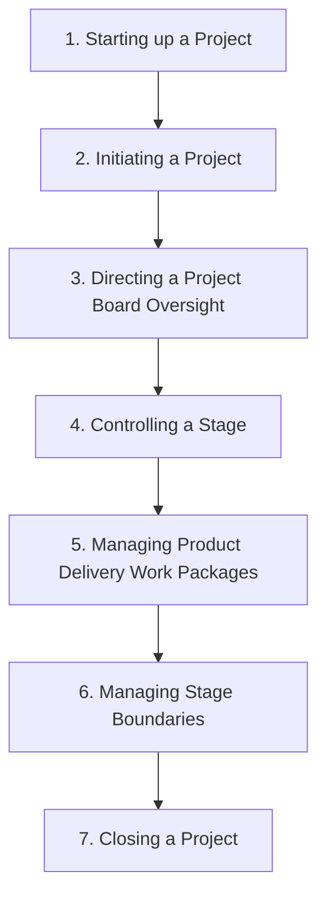

* **Ideal Use Cases:**
  * Public sector infrastructure projects and mega-scale corporate transformations.
  * Multi-vendor consortium initiatives requiring strict legal accountability and risk management.

---

## Part 2: Goal & Performance Management (Enterprise & Strategy)

### 1. OKR (Objectives and Key Results)

* **Overview:** An agile goal-setting framework that aligns corporate strategy with departmental and individual execution to foster focus, transparency, and breakthrough innovation.
* **Core Characteristics:**
  * **Objective (Qualitative & Inspiring):** Answers *"What do we want to accomplish?"* — Ambitious, action-oriented, and memorable.
  * **Key Results (Quantitative & Measurable):** Answers *"How do we track success?"* — 3 to 5 quantitative metrics per Objective.
  * **Decoupled from Compensation:** Encourages stretch goals (*Moonshots*). Achieving 70–80% target completion is considered outstanding performance.
  * **Short Cadence:** Typically established on a quarterly cycle backed by weekly check-ins.

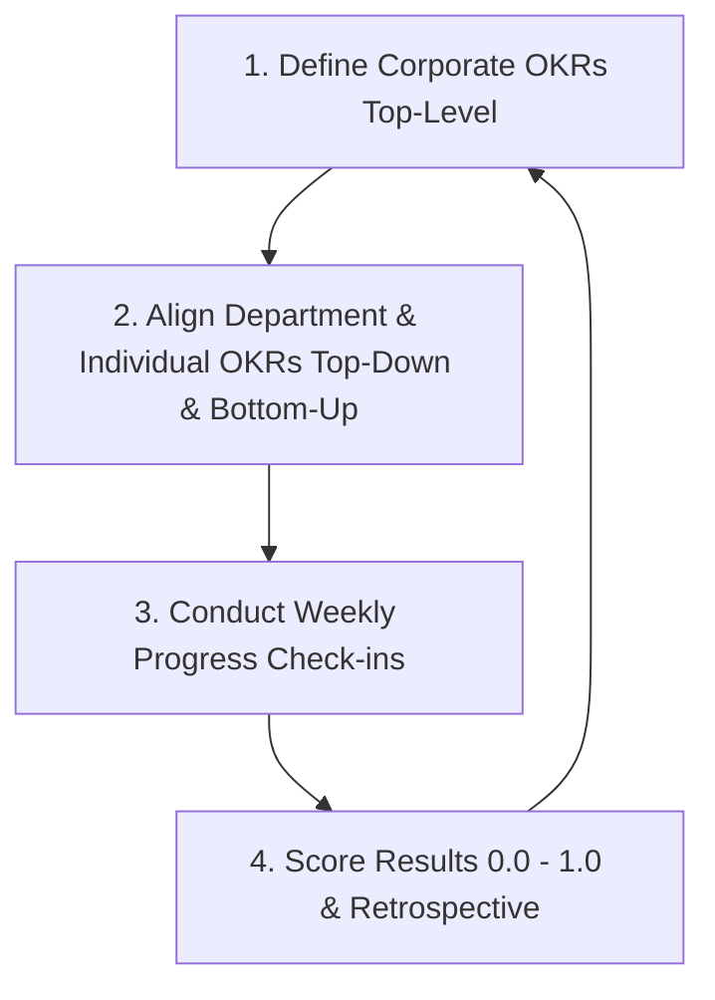

* **Ideal Use Cases:**
  * High-growth tech companies, startups, and agile enterprises.
  * Innovation projects, new product discovery, and strategic corporate turnarounds.

---

### 2. KPI (Key Performance Indicator)

* **Overview:** A quantitative measurement system used to evaluate the ongoing performance and efficiency of an individual, department, or organization against predefined operational standards.
* **Core Characteristics:**
  * **100% Quantifiable Metrics:** Tracks revenue, conversion rates, customer acquisition cost (CAC), uptime, and response latency.
  * **SMART Alignment:** Metrics adhere strictly to **S**pecific, **M**easurable, **A**chievable, **R**elevant, and **T**ime-bound criteria.
  * **Tied to Performance & Compensation:** Directly influences annual appraisals, compensation, bonuses, and career progression.
  * **Reflects Business as Usual (BAU):** Measures baseline operational health and stability.

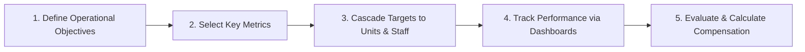

* **Ideal Use Cases:**
  * Sales, Customer Support, Supply Chain, Logistics, and Plant Operations.
  * Mature businesses with standardized, repeatable operational processes.

---

### 3. BSC (Balanced Scorecard)

* **Overview:** A strategic management framework that translates an organization's high-level vision and strategy into actionable targets across four balanced operational perspectives.
* **Core Characteristics:**
  * **4 Balanced Perspectives:**
    1. **Financial:** Profitability, revenue growth, ROE, cash flow.
    2. **Customer:** Retention rate, market share, Net Promoter Score (NPS).
    3. **Internal Business Processes:** Operational efficiency, quality control, innovation cycles.
    4. **Learning & Growth:** Workforce capabilities, culture, technology infrastructure.
  * **Strategy Mapping:** Visualizes cause-and-effect relationships (*Skilled Personnel → Optimized Processes → Satisfied Customers → Superior Financial Results*).

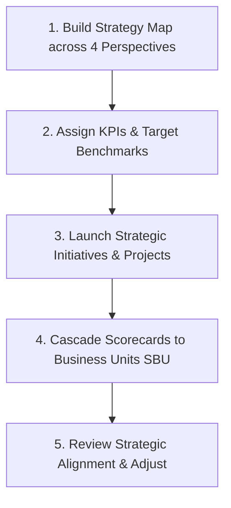

* **Ideal Use Cases:**
  * C-suite executives and Boards of Directors in medium-to-large enterprises.
  * Organizations executing multi-year strategic turnarounds or enterprise restructurings (3–5 year strategic horizons).

---

### 4. MBO (Management by Objectives)

* **Overview:** A classic management methodology formulated by Peter Drucker that aligns enterprise goals with employee performance through collaborative goal setting.
* **Core Characteristics:**
  * **Mutual Agreement:** Objectives are negotiated collaboratively between manager and employee rather than imposed top-down.
  * **Autonomy & Empowerment:** Employees maintain freedom over their execution methodology to reach agreed outcomes.
  * **Outcome-Based Evaluation:** Evaluates final output and results rather than micromanaging daily activities.

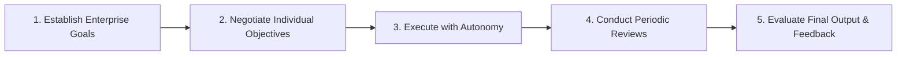

* **Ideal Use Cases:**
  * Executive management, Knowledge Workers, R&D researchers, and management consultants.
  * Work environments that emphasize personal accountability, initiative, and professional independence.

---

## Part 3: Productivity & Time Management (Individual)

### 1. GTD (Getting Things Done)

* **Overview:** A personal workflow management framework created by David Allen based on a core axiom: *"Your mind is for having ideas, not holding them."*
* **Core Characteristics:**
  * **External System Trust:** Offloads 100% of tasks, ideas, and obligations into an organized external capture system.
  * **The 2-Minute Rule:** If an incoming action takes under 2 minutes, perform it immediately.
  * **Weekly Review:** Conducts a comprehensive weekly review to keep system contexts clean and actionable.

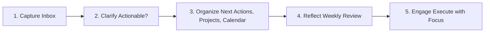

#### The Clarify Decision Logic
* **Is it actionable?**
  * **No:** Send to Trash, Reference Archive, or `Someday/Maybe` list.
  * **Yes:** 
    * Takes $<2$ mins? $\rightarrow$ **Do it immediately**.
    * Delegates to others? $\rightarrow$ Move to **`Waiting For`**.
    * Requires multiple steps? $\rightarrow$ Create a **`Project`**.
    * Specific date/time bound? $\rightarrow$ Add to **`Calendar`** or **`Next Actions`**.

* **Ideal Use Cases:**
  * Leaders, founders, project managers, and knowledge workers handling high-volume, multi-channel inputs (emails, meetings, requests).

---

### 2. Eisenhower Matrix

* **Overview:** A decision-making framework attributed to U.S. President Dwight D. Eisenhower that categorizes tasks based on **Urgency** and **Importance**.
* **Core Characteristics:**
  * **4-Quadrant Prioritization Grid:**
    * **Q1 (Urgent & Important) — DO:** Crises, immediate deadlines, critical outages.
    * **Q2 (Not Urgent but Important) — DECIDE:** Strategic planning, skill building, health, relationship cultivation.
    * **Q3 (Urgent but Not Important) — DELEGATE:** Interruptions, unvetted meeting invites, minor requests.
    * **Q4 (Not Urgent & Not Important) — DELETE:** Mindless web browsing, time-wasting habits.
  * **Core Objective:** Minimize Q1 crises, maximize time spent in Q2 strategic activities, delegate Q3, and eliminate Q4.

| | **Urgent** | **Not Urgent** |
| :--- | :--- | :--- |
| **Important** | **Q1: DO** *(Execute Immediately)* | **Q2: DECIDE** *(Schedule Time Block)* |
| **Not Important** | **Q3: DELEGATE** *(Automate / Reassign)* | **Q4: DELETE** *(Eliminate / Decline)* |

* **Ideal Use Cases:**
  * Daily task prioritization and workload planning.
  * Professionals caught in reactive "firefighting" mode who struggle to advance long-term strategic goals.

---

### 3. Timeboxing & Pomodoro Technique

* **Overview:** Time management methods that constrain execution within dedicated, fixed windows to combat Parkinson’s Law (*"Work expands so as to fill the time available for its completion"*).
* **Core Characteristics:**
  * **Timeboxing:** Allocating a fixed block of time (e.g., 09:00 - 10:30) on a calendar exclusively for a single task. Once time expires, work halts for evaluation or context switching.
  * **Pomodoro Technique:** Dividing work into 25-minute high-focus sprints (1 Pomodoro), followed by a 5-minute short break. A longer break (15–30 mins) is taken after completing 4 Pomodoros.
  * **Single-Tasking:** Eliminates context switching to achieve deep work states.

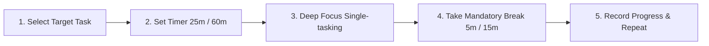

* **Ideal Use Cases:**
  * High-cognition tasks: Programming, technical writing, system architecture design, data analysis.
  * Overcoming procrastination and digital distractions.

---

### 4. Eat That Frog

* **Overview:** A personal energy and task management method popularized by Brian Tracy based on Mark Twain’s adage: *"If it's your job to eat a frog, it's best to do it first thing in the morning."*
* **Core Characteristics:**
  * **The "Frog":** Represents the single most important, complex, and impactful task—which is also the task you are most tempted to procrastinate on.
  * **Peak Cognitive Energy:** Leverages high morning willpower and mental clarity.
  * **Psychological Momentum:** Completing the hardest task first releases dopamine and relieves pressure for the remainder of the workday.

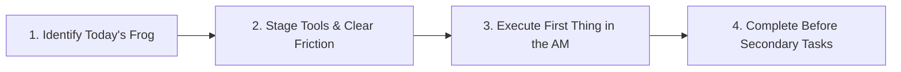

* **Ideal Use Cases:**
  * Solving hard technical problems, drafting complex proposals, or making high-stakes business decisions.
  * Professionals prone to "productive procrastination" (doing minor easy tasks to avoid major hard tasks).

---

## Summary & Framework Comparison Matrix

| Framework | Category / Focus | Core Philosophy | Flexibility | Key Deliverable / Output |
| :--- | :--- | :--- | :--- | :--- |
| **Kanban** | Team / Operations | Visualize workflow & limit WIP | Very High | Continuous smooth flow; reduced cycle time |
| **Scrum** | Team / Product | Iterative Sprints & self-organization | High | Potentially shippable product increment per Sprint |
| **Waterfall** | Project / Enterprise | Sequential phase control & documentation | Low | Fully completed system delivered against initial scope |
| **Lean** | Enterprise / Process | Eliminate waste (*Muda*) & continuous flow | Medium | Value stream optimization; cost reduction |
| **Six Sigma** | Quality / Process | Statistical variation reduction ($\le 3.4$ DPMO) | Low | Standardized quality; near-zero defect rate |
| **PRINCE2** | Governance / Project | Stage control & business justification | Medium | Controlled project delivery adhering to business case |
| **OKR** | Corporate / Strategy | Ambitious stretch goals & alignment | Very High | Accelerated strategic growth & departmental alignment |
| **KPI** | Department / Operations | Quantifiable performance measurement | Medium | Sustained operational efficiency (Business As Usual) |
| **BSC** | Executive / Strategy | Balance across 4 strategic perspectives | Medium | Balanced long-term strategy execution (3–5 years) |
| **MBO** | Management / Individual | Mutual goal negotiation & autonomy | High | Achievement of agreed individual performance outcomes |
| **GTD** | Individual Productivity | External memory system & 2-minute rule | Very High | Reduced cognitive load; clean, actionable task lists |
| **Eisenhower** | Individual Decision | Classify by Urgency vs. Importance | Very High | High Q2 focus; elimination of low-value tasks |
| **Timeboxing / Pomodoro** | Individual Focus | Constrain work into fixed time slots | High | Deep Work; prevention of Parkinson's Law bloat |
| **Eat That Frog** | Individual Energy | Tackle hardest task first thing in the morning | Very High | High morning momentum; completion of core priorities |

---
