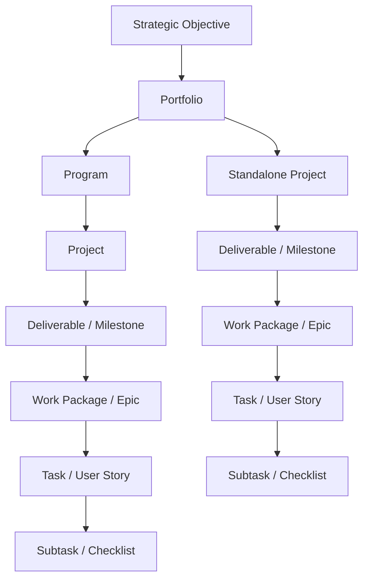
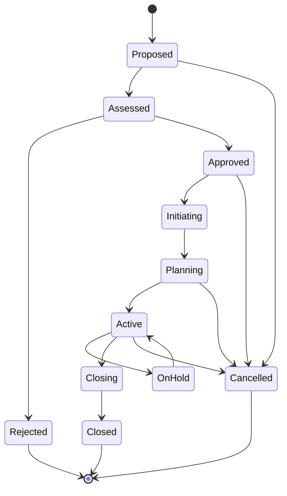
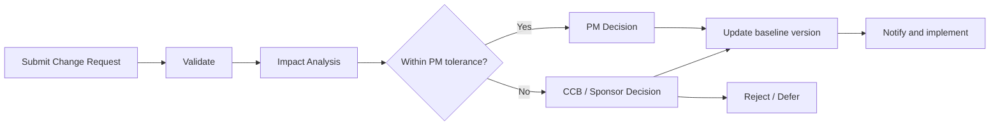

# OmniMer Project Management Operating Model

> **Mục đích:** Chuẩn hóa cách một sáng kiến đi từ đề xuất đến hiện thực hóa lợi ích, độc lập với việc đội dự án dùng Scrum, Kanban, Waterfall hay Hybrid.  
> **Phạm vi:** Portfolio, program, project, work package và task trong OmniProject.  
> **Trạng thái:** Baseline Draft  
> **Phiên bản:** 1.0.0  
> **Ngày:** 2026-09-08

---

## 1. Vị trí của tài liệu

Tài liệu này là xương sống vận hành, kết nối các tài liệu:

- `project_management_model.md`: danh mục framework tham chiếu.
- `project_management_scope_levels.md`: phạm vi quản lý theo cấp.
- `project_governance_raci.md`: vai trò, quyền quyết định và escalation.
- `project_metrics.md`: kiến thức tổng quan về chỉ số.
- `project_metric_dictionary.md`: hợp đồng dữ liệu và công thức chỉ số dùng trong hệ thống.
- `project_management_traceability.md`: truy vết mục tiêu, yêu cầu, quy trình, chỉ số và test.

Nếu có xung đột, quy tắc vận hành trong tài liệu này và metric contract đã được phê duyệt có ưu tiên cao hơn nội dung tham khảo tổng quan.

---

## 2. Nguyên tắc vận hành

1. **Một nguồn dữ liệu:** Mọi view Kanban, Scrum, Gantt và Table dùng cùng project/task entity.
2. **Vai trò khác quyền hệ thống:** Chức danh tổ chức không tự động cấp quyền truy cập; quyền được cấp theo workspace và project.
3. **Baseline trước kiểm soát:** Không tính variance hoặc trách nhiệm trễ hạn nếu chưa có baseline được phê duyệt.
4. **Dự báo trước báo cáo:** Trạng thái phải phản ánh kết quả dự kiến, không chỉ ghi nhận việc đã xảy ra.
5. **Quản lý bằng ngoại lệ:** Cấp cao hơn chỉ can thiệp khi tolerance bị vượt hoặc dự báo sẽ bị vượt.
6. **Không sửa lịch sử:** Mọi thay đổi baseline, score, due date và phê duyệt phải có version và audit event.
7. **Human-in-the-loop:** AI chỉ đề xuất; con người chịu trách nhiệm xác nhận task, thay đổi quan trọng và KPI cuối kỳ.
8. **Không dùng proxy sai mục đích:** Story point và velocity chỉ hỗ trợ forecast của cùng một team, không dùng xếp hạng cá nhân hoặc so sánh chéo team.
9. **Outcome trước output:** Hoàn thành deliverable chưa đồng nghĩa đạt lợi ích kinh doanh; benefit phải được đo sau bàn giao.
10. **Tailoring có kiểm soát:** Có thể lược bỏ artifact không phù hợp, nhưng phải ghi lý do và người phê duyệt.

---

## 3. Cấu trúc đối tượng quản lý

### 3.1 Quy tắc cấu trúc

- Project phải có đúng một `Sponsor` và một `Project Manager` chịu trách nhiệm chính.
- Project có thể thuộc một program hoặc đứng độc lập trong portfolio.
- Mỗi deliverable phải truy vết đến ít nhất một scope item và acceptance criterion.
- Task phải thuộc một project; task dùng cho KPI phải có owner, baseline due date, completion rule và evidence.
- Một người có thể kiêm nhiều vai trò, nhưng quyền và trách nhiệm vẫn được ghi tách biệt trong RACI.

---

## 4. Lifecycle và trạng thái chuẩn

| Trạng thái | Ý nghĩa | Điều kiện vào | Điều kiện ra |
| :--- | :--- | :--- | :--- |
| `Proposed` | Ý tưởng hoặc nhu cầu mới | Có requester và problem statement | Đủ dữ liệu tối thiểu để đánh giá |
| `Assessed` | Đang đánh giá giá trị, chi phí, rủi ro và năng lực | Intake hợp lệ | Quyết định approve/reject |
| `Approved` | Được cấp thẩm quyền cho phép khởi tạo | Có decision record và funding envelope | Sponsor/PM được chỉ định |
| `Initiating` | Xác lập charter và governance | Project đã approved | Gate G2 được duyệt |
| `Planning` | Xây baseline scope, schedule, cost, quality và resource | Charter hợp lệ | Gate G3 được duyệt |
| `Active` | Thực thi và kiểm soát | Baseline được phê duyệt | Bàn giao, hold hoặc cancel |
| `OnHold` | Tạm dừng có kiểm soát | Có lý do, owner và review date | Resume hoặc cancel |
| `Closing` | Nghiệm thu, bàn giao và kết toán | Deliverable chính đã hoàn tất | Closure checklist được duyệt |
| `Closed` | Đóng chính thức | Gate G5 được duyệt | Chỉ còn benefit review |
| `Rejected` | Không được đầu tư | Có lý do từ chối | Có thể tạo proposal mới |
| `Cancelled` | Dừng trước khi hoàn thành | Có quyết định, impact và transition plan | Đóng nghĩa vụ còn lại |

### 4.1 Quy tắc chuyển trạng thái

- Chuyển trạng thái project là privileged action và phải ghi `actor`, `timestamp`, `from`, `to`, `reason`, `approval_id`.
- Không chuyển thẳng từ `Proposed` sang `Active`.
- `OnHold` bắt buộc có ngày review tiếp theo và người chịu trách nhiệm.
- `Closed` và `Cancelled` là trạng thái bất biến; mở lại bằng project mới hoặc change được cấp có thẩm quyền phê duyệt.

---

## 5. Stage gate

| Gate | Quyết định | Hồ sơ tối thiểu | Người phê duyệt |
| :--- | :--- | :--- | :--- |
| **G0 — Intake** | Có đưa vào đánh giá không? | Problem statement, requester, urgency, expected value | Portfolio Manager hoặc người được ủy quyền |
| **G1 — Investment** | Approve, reject, defer hay request-more-info? | Business case, rough order of magnitude, risk sơ bộ, capacity check | Portfolio Board / Sponsor theo ngưỡng |
| **G2 — Initiation** | Có đủ điều kiện lập kế hoạch chi tiết? | Charter, Sponsor, PM, stakeholder map, governance profile | Sponsor |
| **G3 — Baseline** | Có được bắt đầu thực thi? | Scope/WBS, schedule, budget, quality plan, RAID, resource và communication plan | Sponsor; Portfolio Board nếu vượt ngưỡng |
| **G4 — Acceptance** | Deliverable có được chấp nhận/release? | Test evidence, UAT/sign-off, defect waiver, release/handover plan | Business Owner / Product Owner |
| **G5 — Closure** | Có đóng project không? | Acceptance, financial closure, open-item transfer, lessons learned, archive | Sponsor |
| **G6 — Benefits** | Lợi ích có đạt không và cần hành động gì? | Benefit measurements so với business case | Business Owner / Portfolio Board |

Gate có thể thực hiện bất đồng bộ trên OmniProject, nhưng quyết định chỉ hợp lệ khi đủ approver và evidence theo governance profile.

---

## 6. Chọn và tailoring phương pháp

| Điều kiện | Phương pháp ưu tiên | Kiểm soát bắt buộc |
| :--- | :--- | :--- |
| Nhu cầu thay đổi nhanh, có product team ổn định, giao increment thường xuyên | Scrum | Product goal, backlog, sprint goal, DoD, review và retrospective |
| Luồng yêu cầu liên tục, ưu tiên thay đổi, khó timebox | Kanban | Workflow rõ, WIP limit, class of service, flow metrics |
| Scope ổn định, phụ thuộc tuần tự, hợp đồng/regulation yêu cầu sign-off | Waterfall | Phase gate, baseline, change control, verification plan |
| Vừa có milestone cố định vừa có discovery/delivery lặp | Hybrid | Milestone governance ở project level; Scrum/Kanban ở team level |

### 6.1 Tailoring profile

Mỗi project lưu một `Governance Profile` gồm:

- Methodology và lý do lựa chọn.
- Gate áp dụng hoặc được miễn.
- Artifact bắt buộc.
- Tolerance về scope, time, cost, quality, risk và benefit.
- Cadence báo cáo.
- Approval matrix.
- Metric set và phiên bản.
- Retention/audit policy.

Việc miễn gate hoặc artifact phải có approver, lý do và thời hạn hiệu lực.

---

## 7. Các workflow kiểm soát cốt lõi

### 7.1 Intake từ chat hoặc AI

1. Nhận message và giữ nguyên source message ID.
2. AI trích xuất draft task cùng confidence theo field.
3. Người có quyền xác nhận hoặc sửa draft.
4. Hệ thống tạo task và liên kết evidence về message nguồn.
5. Nếu thiếu assignee, deadline hoặc project, task vào `Needs Triage`; không tự đưa vào execution.

### 7.2 Quản lý scope và change

Change Request tối thiểu có: lý do, value, affected scope, schedule/cost/resource/risk/quality impact, options, recommendation, approver và effective baseline version.

### 7.3 RAID

- **Risk:** Sự kiện chưa xảy ra; có probability, impact, exposure, response, trigger và owner.
- **Assumption:** Điều được xem là đúng để lập kế hoạch; có validation date và owner.
- **Issue:** Sự kiện đã xảy ra; có severity, containment, resolution owner và SLA.
- **Dependency:** Ràng buộc đầu vào/đầu ra; có provider, consumer, needed-by date và status.

Risk trở thành Issue phải giữ liên kết nguồn; không tạo bản ghi rời làm mất lịch sử.

### 7.4 Quyết định

Mọi quyết định ảnh hưởng baseline, architecture, acceptance, KPI hoặc quyền truy cập phải có:

- Decision ID và ngày hiệu lực.
- Bối cảnh, lựa chọn đã cân nhắc và quyết định.
- Decision owner và approver.
- Hệ quả, action follow-up và artifact bị ảnh hưởng.

### 7.5 Quality và acceptance

- Definition of Ready kiểm tra task có đủ thông tin trước khi cam kết.
- Definition of Done là điều kiện nội bộ để hoàn tất công việc.
- Acceptance Criteria là điều kiện Business Owner/Product Owner chấp nhận deliverable.
- `Done` không thay thế UAT hoặc formal sign-off khi governance profile yêu cầu.
- Waiver cho defect phải nêu severity, residual risk, expiry và approver.

### 7.6 Closure và benefit review

Closure chỉ hoàn tất khi:

- Deliverable được chấp nhận hoặc có ngoại lệ được duyệt.
- Nghĩa vụ mở được chuyển giao có owner.
- Hợp đồng, invoice và budget được đối soát.
- Access tạm thời và integration secret được thu hồi/luân chuyển.
- Lessons learned và archive hoàn tất.
- Benefit owner, metric, baseline và ngày review được xác nhận.

---

## 8. Nhịp quản trị

| Cadence | Nội dung | Đầu ra |
| :--- | :--- | :--- |
| Liên tục | Task flow, WIP, blocker, event và alert | Board/event log cập nhật |
| Hằng ngày | Delivery coordination; không dùng làm báo cáo cấp trên | Next action, blocker owner |
| Hằng tuần | Forecast milestone, RAID, dependency, decision và change | Weekly project health |
| Mỗi sprint/release | Planning, review, acceptance, retrospective | Increment và improvement action |
| Hằng tháng | Cost, capacity, resource, benefit và metric quality | Program/portfolio review |
| Hằng quý | Portfolio priority, funding, strategic alignment | Continue, pivot, hold hoặc stop |
| Sau triển khai | Benefit realization theo business case | Benefit review record |

---

## 9. Artifact tối thiểu

| Artifact | Cấp | Owner mặc định | Điều kiện bắt buộc |
| :--- | :--- | :--- | :--- |
| Business Case | Portfolio/Project | Business Owner | Trước G1 |
| Project Charter | Project | Project Manager | Trước G2 |
| Governance Profile | Project | Project Manager / PMO | Trước G2 |
| Scope/WBS và baseline | Project | Project Manager | Trước G3 |
| RAID Log | Project/Program | Project Manager | Từ Initiating đến Closed |
| Change Log | Project | Project Manager | Khi baseline tồn tại |
| Decision Log | Mọi cấp | Decision Owner | Khi có quyết định trọng yếu |
| Quality/Acceptance Plan | Project | QA Lead / Business Owner | Trước G3 |
| Status & Forecast | Project/Program | Project/Program Manager | Theo cadence |
| Closure Report | Project | Project Manager | Trước G5 |
| Benefit Review | Portfolio/Program | Business Owner | Tại G6 |

---

## 10. Project health và ngoại lệ

Project health không được suy ra từ một chỉ số duy nhất. Hệ thống đánh giá tối thiểu:

- Schedule/forecast.
- Cost/funding.
- Scope/change.
- Quality/acceptance.
- Risk/issue/dependency.
- Resource/capacity.
- Stakeholder/value/benefit.

### 10.1 RAG status

- **Green:** Trong tolerance và chưa có xu hướng vượt.
- **Amber:** Đang trong tolerance nhưng dự báo có nguy cơ vượt; cần corrective action.
- **Red:** Đã vượt hoặc dự báo chắc chắn vượt tolerance; phải escalation.
- **Gray:** Thiếu dữ liệu hoặc baseline; không được mặc định là Green.

PM phải cung cấp forecast, nguyên nhân, tác động, lựa chọn và đề xuất khi status là Amber/Red.

---

## 11. Sự kiện và audit bắt buộc

Các sự kiện tối thiểu:

- `project.proposed`, `project.approved`, `project.state_changed`.
- `baseline.created`, `baseline.approved`, `baseline.superseded`.
- `task.committed`, `task.completed`, `task.reopened`.
- `risk.threshold_breached`, `issue.escalated`, `dependency.missed`.
- `change.submitted`, `change.decided`.
- `deliverable.accepted`, `project.closed`, `benefit.reviewed`.
- `metric.calculated`, `metric.overridden`, `score.approved`, `score.exported`.

Mỗi event có `event_id`, `workspace_id`, `entity_id`, `actor_id`, `occurred_at`, `source`, `correlation_id`, `schema_version` và payload trước/sau đối với thay đổi quan trọng.

---

## 12. Điều kiện sẵn sàng triển khai

Operating model được xem là triển khai được khi:

1. Governance profile có owner và được Sponsor duyệt.
2. Lifecycle/state transition được cấu hình và kiểm thử quyền.
3. Gate có artifact checklist cùng approver.
4. RACI và escalation policy được công bố.
5. Metric set có version và data owner.
6. Audit event không thể bị sửa bởi người dùng nghiệp vụ.
7. Có ít nhất một pilot project hoàn thành từ G0 đến G6.

---
