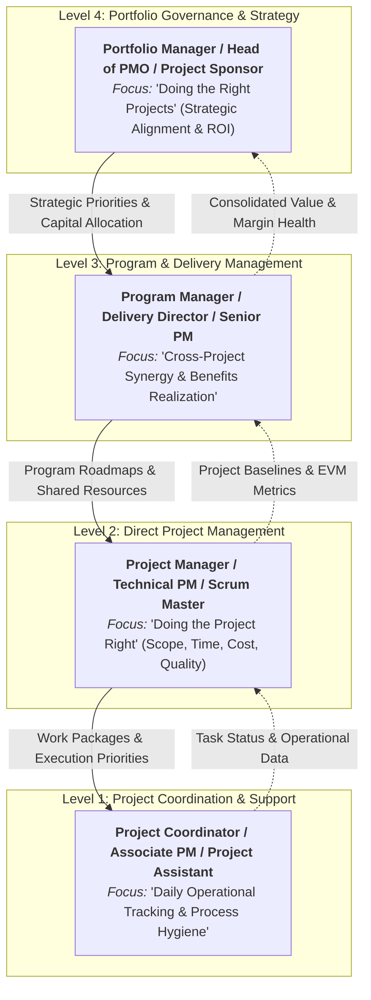
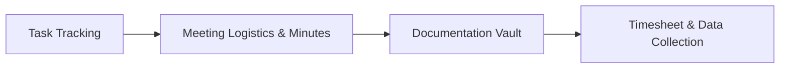
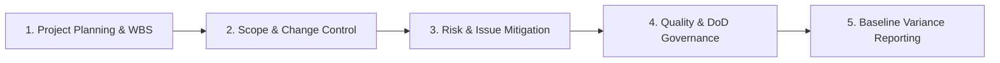
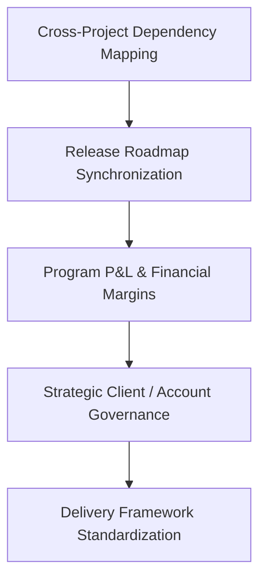
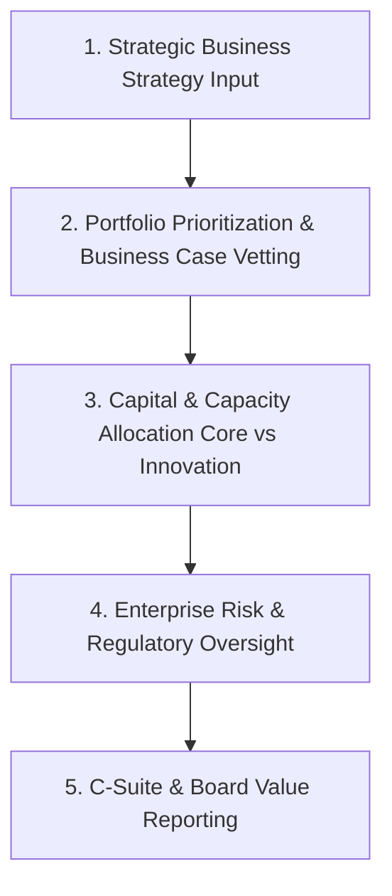

# Hierarchical Framework of Project Management Scope & Governance Levels

> [!NOTE]
> In modern organizational management (aligned with international standards such as PMI/PMBOK, PRINCE2, and Agile/Scaled Agile Frameworks), project management responsibilities are partitioned across distinct operational and strategic tiers—from micro-level daily task coordination to macro-level enterprise portfolio governance.

---

## Executive Architecture: The 4-Tier Hierarchy



---

## Table of Contents

- [Level 1: Project Coordination (Operational & Administrative Support)](#level-1-project-coordination-operational--administrative-support)
- [Level 2: Direct Project Management (Tactical & Single-Project Execution)](#level-2-direct-project-management-tactical--single-project-execution)
- [Level 3: Program & Delivery Management (Cross-Project Synergy & Benefits Realization)](#level-3-program--delivery-management-cross-project-synergy--benefits-realization)
- [Level 4: Portfolio Management & Strategic PMO (Enterprise Governance & Capital Allocation)](#level-4-portfolio-management--strategic-pmo-enterprise-governance--capital-allocation)
- [Comprehensive Cross-Level Comparison Matrix](#comprehensive-cross-level-comparison-matrix)
- [Organizational Scaling & Adoption Model](#organizational-scaling--adoption-model)

---

## Level 1: Project Coordination (Operational & Administrative Support)

**Standard Roles:** Project Coordinator, Associate Project Manager (APM), Project Administrator, Agile Team Facilitator.

> **Primary Focus:** Operational tracking, administrative execution, meeting logistics, and maintaining day-to-day data integrity across project management systems.



### Key Responsibilities & Workflows

1. **Task & Schedule Tracking (Execution Hygiene):**
   * Continuously updates task states (`To-Do`, `In Progress`, `In Review`, `Done`) across management platforms (Jira, OmniProject, Asana, Trello).
   * Tracks individual developer/team member deadlines and triggers early notification alerts when deliverables are at risk of delay.

2. **Meeting Logistics & Action-Item Management:**
   * Organizes and schedules recurring operational ceremonies (Daily Standups, Sprint Planning, Backlog Refinements, Sprint Reviews).
   * Records structured **Meeting Minutes (MoM)**, extracts explicit action items with assigned owners and due dates, and distributes them to stakeholders.

3. **Project Documentation & Asset Governance:**
   * Archives and organizes technical specifications, architecture diagrams, handoff acceptance records, statements of work (SOWs), and vendor invoices into standardized folder hierarchies.
   * Maintains standard operating procedures (SOPs), onboarding runbooks, and project wiki pages for incoming personnel.

4. **Operational Data Collection & Timesheet Auditing:**
   * Aggregates team timesheets and logged billable hours against assigned work packages.
   * Compiles initial operational data used for resource cost accounting, client billing, and capacity utilization analysis.

### Tooling, Artifacts & Metrics
* **Key Artifacts:** Task Boards, Meeting Minutes, Action Item Logs, Timesheet Reports, Team Onboarding Guides.
* **Core KPIs:** Task update frequency, timesheet compliance rate ($>98\%$), documentation accuracy, turnaround time for meeting action item distribution ($<2$ hours).

---

## Level 2: Direct Project Management (Tactical & Single-Project Execution)

**Standard Roles:** Project Manager (PM), Technical Project Manager (TPM), Scrum Master, Delivery Lead.

> **Primary Focus:** Ensuring the single project succeeds within the boundaries of the **Iron Triangle** (Scope, Time, Cost) while upholding the established **Quality** standard (*Definition of Done*).



### Key Responsibilities & Workflows

1. **Comprehensive Project Planning & Structuring:**
   * Constructs the Work Breakdown Structure (WBS), Gantt schedules, Critical Path Method (CPM) networks, and milestone charts.
   * Performs detailed estimation for resource allocations, project budgets, sprint capacities, and milestone durations.

2. **Scope Baseline & Change Control Management:**
   * Establishes the formal Scope Baseline, Product Requirements Document (PRD), and explicit Acceptance Criteria.
   * Enforces the Change Management process: logs Change Requests (CRs), conducts impact analysis on timelines/budgets, and submits assessments for stakeholder approval prior to implementation.

3. **Risk & Issue Governance (Risk Register):**
   * Maintains a live **Risk Register**: identifies potential threats, evaluates Probability vs. Impact, and executes predefined Risk Mitigation Plans.
   * Resolves technical blockers, operational bottlenecks, and interpersonal impediments to keep delivery throughput unimpeded.

4. **Team Leadership, Motivation & Workload Balancing:**
   * Balances workload allocations across engineering and design talent to avoid burnout while optimizing throughput.
   * Evaluates performance metrics (KPI/OKR), conducts 1-on-1 feedback sessions, and resolves cross-functional team friction.

5. **Quality Control & Acceptance Testing:**
   * Establishes and enforces the **Definition of Done (DoD)** and Quality Assurance (QA) pass criteria.
   * Coordinates User Acceptance Testing (UAT) and orchestrates formal phase-gate sign-offs with clients or business owners prior to production release.

6. **Status & Baseline Variance Reporting:**
   * Measures Earned Value Management (EVM) metrics: Schedule Variance (SV), Cost Variance (CV), and Cost/Schedule Performance Indices (CPI / SPI).
   * Generates periodic executive status dashboards comparing actual progress against baseline plans.

### Tooling, Artifacts & Metrics
* **Key Artifacts:** Project Charter, WBS Dictionary, Gantt Charts, Risk Register, Change Request Pipeline, Sprint Burndown Charts, Weekly Executive Status Reports.
* **Core KPIs:** On-Time Delivery (OTD), Schedule Performance Index ($\text{SPI} \ge 1.0$), Cost Performance Index ($\text{CPI} \ge 1.0$), Defect Escape Rate ($<2\%$), Budget Variance ($\pm 5\%$).

---

## Level 3: Program & Delivery Management (Cross-Project Synergy & Benefits Realization)

**Standard Roles:** Senior Project Manager, Program Manager, Delivery Manager, Director of Delivery / Head of Engineering.

> **Primary Focus:** Coordinating **multiple related projects (a Program)** to achieve strategic business benefits and operational synergies that could not be attained by managing the projects individually.



### Key Responsibilities & Workflows

1. **Cross-Project Dependency Management & Shared Resource Balancing:**
   * Identifies and eliminates resource contention across parallel projects (e.g., a shared DevOps/Infrastructure squad supporting 4 distinct feature teams).
   * Synchronizes cross-team release roadmaps and continuous integration/deployment (CI/CD) pipelines to prevent architectural conflicts.

2. **Program Financial Management & Profitability (P&L):**
   * Forecasts multi-project program budgets, cash flow requirements, profit margins, and non-billable overhead.
   * Optimizes gross delivery margins by leveraging shared components, reusable architectures, and pooled resource models.

3. **Key Stakeholder Governance & Strategic Account Relations:**
   * Negotiates commercial contract expansions, Master Service Agreements (MSAs), and resolves enterprise-level delivery disputes.
   * Manages client executive expectations and monitors account satisfaction metrics (Customer Satisfaction / Net Promoter Score).

4. **Process Standardization, PMO Coaching & Talent Development:**
   * Defines and enforces unified delivery methodologies (Scrum-at-Scale, Kanban, Hybrid models) across all business units.
   * Mentors, coaches, and establishes career progression ladders for Project Managers and Scrum Masters across the department.

### Tooling, Artifacts & Metrics
* **Key Artifacts:** Multi-Project Program Roadmap, Cross-Project Dependency Matrix, Program Financial P&L Model, Program Governance Charter, Client Health Scorecard.
* **Core KPIs:** Program Gross Margin ($\% $), Resource Utilization Efficiency ($>85\%$), Multi-Project Dependency Lag Time, Client Net Promoter Score ($\text{NPS} \ge 50$), Cross-Project Reusability Index.

---

## Level 4: Portfolio Management & Strategic PMO (Enterprise Governance & Capital Allocation)

**Standard Roles:** Portfolio Manager, Head of PMO (Project Management Office), VP of Strategy & Operations, Chief Operating Officer (COO), Project Sponsor.

> **Primary Focus:** Selecting **the right projects to execute ("Doing the right things")** to operationalize enterprise business strategy and maximize Return on Investment (ROI) while minimizing enterprise risk.



### Key Responsibilities & Workflows

1. **Strategic Portfolio Prioritization & Selection:**
   * Evaluates incoming project proposals and business cases based on expected ROI, Net Present Value (NPV), Payback Period, and alignment with corporate strategy.
   * Approves funding, reprioritizes, or cancels projects whose Business Cases have become non-viable due to market changes.

2. **Capital & Enterprise Capacity Allocation:**
   * Balances strategic capital distribution between **Core Operations / Run-the-Business (BAU)** and **Transformational / Change-the-Business (R&D & Innovation)**.
   * Assesses aggregate organizational capacity to prevent systemic overcommitment and execution failure.

3. **Enterprise Risk Governance & Regulatory Compliance:**
   * Monitors systemic macro-risks: market volatility, macroeconomic shifts, regulatory compliance mandates, intellectual property, and cybersecurity liabilities.
   * Establishes stage-gate compliance frameworks to ensure every venture meets corporate governance standards.

4. **Enterprise PMO Systems & Executive Board Reporting:**
   * Designs the enterprise toolchain ecosystem and metrics taxonomy (e.g., OmniMer unified work management and analytics).
   * Delivers strategic portfolio performance reviews, revenue projections, and capital efficiency metrics to the Board of Directors and C-Suite.

### Tooling, Artifacts & Metrics
* **Key Artifacts:** Strategic Portfolio Scorecard, Enterprise Investment Roadmap, Capacity vs. Demand Heatmap, PMO Governance Framework, Board of Directors Performance Deck.
* **Core KPIs:** Portfolio ROI ($\% $), Strategic Goal Alignment Rate ($100\%$), Enterprise Capital Allocation Efficiency, Portfolio Value-to-Cost Ratio, Risk Exposure Index.

---

## Comprehensive Cross-Level Comparison Matrix

| Dimension | Level 1: Project Coordination | Level 2: Project Management | Level 3: Program Management | Level 4: Portfolio Management |
| :--- | :--- | :--- | :--- | :--- |
| **Core Question** | *"What is the real-time status of this task?"* | *"How do we deliver this project on time and within budget?"* | *"How do interconnected projects maximize collective value?"* | *"Are we investing in the right projects to realize corporate strategy?"* |
| **Operational Scope** | Individual tasks, sprint items, daily schedules | Single project end-to-end | A group of interrelated projects (Program) | Entire organization-wide project investment portfolio |
| **Time Horizon** | Daily to Weekly | Weeks to Months ($1 - 6$ months) | Quarters to Annually ($6 - 18$ months) | Multi-Year ($1 - 5$ years) |
| **Key Stakeholders** | Team developers, individual contributors, task assignees | Project team, Tech Leads, direct Client PM | Functional Heads, Delivery Directors, Client Executives | C-Suite (CEO, CFO, CTO), Board of Directors, Investors |
| **Primary Philosophy** | Process hygiene and daily execution control | "Doing the project right" (Iron Triangle constraints) | Synergy optimization and shared resource efficiency | "Doing the right projects" (Strategic ROI and capital allocation) |
| **Risk Focus** | Task delays, missing assets, blocker identification | Project schedule slippage, budget overruns, scope creep | Resource conflicts, inter-project dependencies, client churn | Strategic misalignment, economic risk, wasted capital expenditure |
| **Primary KPIs** | Task update rate, timesheet accuracy, MoM turnaround | SPI, CPI, On-time delivery rate, Defect escape rate | Program gross margin, Resource utilization, NPS | Portfolio ROI, Strategic Goal Alignment %, Value-to-Cost ratio |

---

## Organizational Scaling & Adoption Model

As an organization matures, its project governance model evolves across these 4 levels:

```
[ Early-Stage Startup (1-20 People) ]
 └── Level 1 & 2 combined: Founders and Lead Engineers handle coordination and direct project delivery.

[ Growth-Stage Scaleup (20-100 People) ]
 └── Formal split into dedicated Level 1 (Coordinators) and Level 2 (Dedicated Project Managers / Scrum Masters).

[ Multi-Product Enterprise (100-500+ People) ]
 └── Introduction of Level 3 (Program & Delivery Directors) to manage shared platforms, cross-team roadmaps, and P&L.

[ Enterprise Corporation & Conglomerates (500+ People) ]
 └── Full implementation of Level 4 (Strategic PMO / Portfolio Governance) to manage capital allocation, strategic alignment, and Board reporting.
```

---
