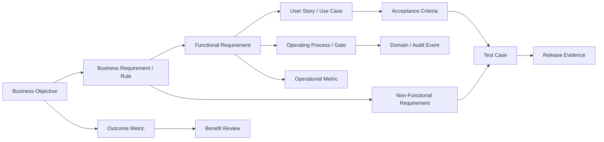
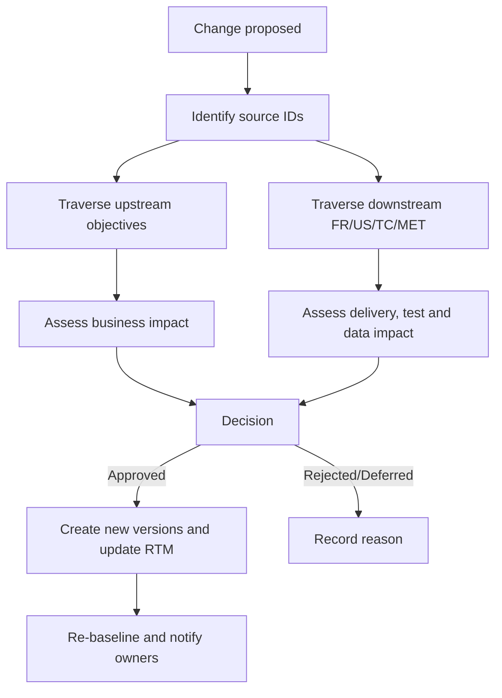

# Project Management Document Map & Traceability Model

> **Mục đích:** Quy định nguồn sự thật, ID, liên kết và kiểm soát thay đổi giữa mục tiêu kinh doanh, yêu cầu, workflow, metric và kiểm thử.  
> **RTM dữ liệu:** `../requirements/RTM.csv`  
> **Trạng thái:** Baseline Draft  
> **Phiên bản:** 1.0.0  
> **Ngày:** 2026-09-08

---

## 1. Bản đồ tài liệu

| Tài liệu | Vai trò | Source of truth cho | Owner đề xuất | Review |
| :--- | :--- | :--- | :--- | :--- |
| `requirements/BRD.md` | Business intent | Problem, objective, benefit, stakeholder, constraint | Business Owner / BA | Khi strategy/scope đổi |
| `requirements/VISION_AND_SCOPE.md` | Product boundary | In-scope, out-of-scope, release boundary | Product Owner / BA | Mỗi release |
| `requirements/REQUIREMENTS_ANALYSIS_FRD.md` | System requirements | FR, NFR, BR, user story, acceptance criteria | Product Owner / BA | Mỗi baseline |
| `business_logic/project_management_model.md` | Reference catalog | Khái niệm framework | PMO | 6–12 tháng |
| `business_logic/project_management_scope_levels.md` | Management levels | Phạm vi project/program/portfolio | PMO | 6–12 tháng |
| `business_logic/project_management_operating_model.md` | Operating model | Lifecycle, gate, workflow, artifact, cadence | PMO / Delivery Governance | Mỗi policy release |
| `business_logic/project_governance_raci.md` | Governance | RACI, decision rights, tolerance, escalation | Sponsor / PMO | Mỗi policy release |
| `business_logic/project_metrics.md` | Metric reference | Giải thích metric/framework tổng quan | PMO / HR Analytics | 6–12 tháng |
| `business_logic/project_metric_dictionary.md` | Metric contract | Công thức, cohort, source, direction, approval | Metric Owner / Data Owner | Mỗi metric version |
| `business_logic/project_management_traceability.md` | Traceability policy | ID, liên kết, gap và change impact | BA / PMO | Mỗi baseline |
| `requirements/RTM.csv` | Traceability data | Quan hệ OBJ → FR/NFR → US → TC → MET | BA / QA | Liên tục |

### 1.1 Thứ tự ưu tiên khi có xung đột

1. Luật/pháp lý và contract được phê duyệt.
2. Decision record/change request có hiệu lực.
3. BRD/Vision & Scope baseline.
4. FRD/SRS baseline.
5. Operating Model, Governance và Metric Contract có hiệu lực.
6. Reference catalog.

Xung đột không được xử lý bằng cách âm thầm sửa một tài liệu; phải tạo change record và cập nhật các artifact bị ảnh hưởng.

---

## 2. Chuỗi truy vết

### 2.1 Quan hệ bắt buộc

- Mỗi Objective có ít nhất một metric outcome và một owner.
- Mỗi FR truy vết đến Objective/Business Requirement và ít nhất một User Story/Use Case.
- Mỗi NFR có ít nhất một Test Case.
- Mỗi Acceptance Criterion có Test Case hoặc automated check.
- Mỗi metric có source event/data và requirement/decision sử dụng nó.
- Mỗi gate có evidence artifact và approver.
- Mỗi release item truy vết ngược được đến source requirement.

---

## 3. Quy ước ID

| Loại | Format | Ví dụ |
| :--- | :--- | :--- |
| Business Objective | `OB-NNN` | `OB-001` |
| Business Requirement | `BR-{DOMAIN}-NNN` | `BR-KPI-001` |
| Functional Requirement | `FR-{DOMAIN}-NNN` | `FR-PROJ-002` |
| Non-Functional Requirement | `NFR-NNN` | `NFR-009` |
| User Story | `US-NNN` | `US-006` |
| Acceptance Criterion | `AC-{US}-NN` | `AC-US006-01` |
| Test Case | `TC-{DOMAIN}-NNN` | `TC-KPI-001` |
| Process | `PROC-{DOMAIN}-NNN` | `PROC-CHG-001` |
| Metric | Theo metric dictionary | `PM-SCH-001` |
| Risk | `RSK-NNN` | `RSK-003` |
| Change Request | `CR-YYYY-NNNN` | `CR-2026-0001` |
| Decision | `DEC-YYYY-NNNN` | `DEC-2026-0001` |
| Gate Decision | `GD-{PROJECT}-{GATE}-{SEQ}` | `GD-OMNI-G3-001` |

ID không được tái sử dụng. Artifact bị hủy giữ ID và chuyển trạng thái `Retired/Rejected`.

---

## 4. Trạng thái và baseline

### 4.1 Trạng thái requirement

`Draft → In Review → Approved → Implemented → Verified → Released → Retired`

Các nhánh ngoại lệ:

- `Draft/In Review → Rejected`
- `Approved trở đi → Superseded`
- `Approved trở đi → Deferred`

### 4.2 Baseline rules

- Baseline có ID, version, approval date và approver.
- Change sau baseline phải đi qua Change Request.
- Liên kết RTM tham chiếu ID ổn định và version khi cần.
- Không xóa row để che mất gap; dùng `Status`, `Gap` và `Notes`.
- Release chỉ được sign-off khi mọi Must-Have có trạng thái `Verified` hoặc waiver được duyệt.

---

## 5. Truy vết business objective hiện tại

| Objective | Capability/FR liên quan | Metric xác nhận outcome | Owner | Tình trạng |
| :--- | :--- | :--- | :--- | :--- |
| `OB-01` Chat-to-task dưới 30 giây | `FR-CHAN-004`, `FR-AI-001`, `FR-AI-002` | `BIZ-AUTO-001` | Product Owner | Contract đã draft; cần baseline và test |
| `OB-02` Không bỏ sót request | `FR-CHAN-001`, `FR-CHAN-002`, `FR-CHAN-004` | `BIZ-CAP-001` | Channel Product Owner | Contract đã draft; cần phê duyệt “actionable” và sampling |
| `OB-03` Giảm 50% overhead PM | `FR-AI-004`, `FR-AI-005` | `BIZ-EFF-001` | Business Owner | Contract đã draft; cần time-study baseline |
| `OB-04` KPI tính tự động và kiểm chứng | `FR-KPI-001`, `FR-KPI-002`, `FR-KPI-003`, `NFR-009` | `BIZ-KPI-001` + audit/dispute metrics | HR / Metric Owner | Contract đã draft; fairness controls chưa baseline |
| `OB-05` HRM sync dưới 5 phút | `FR-KPI-004`, `FR-KPI-005` | `BIZ-HRM-001`, `BIZ-HRM-002` | HR Integration Owner | Contract đã draft; cần retry/idempotency test |

### 5.1 Điều chỉnh cần thiết cho objective

- `OB-02` với mục tiêu tuyệt đối 0% cần định nghĩa mẫu số và reconciliation source; nếu không sẽ không chứng minh được request chưa từng được nhận biết.
- `OB-04` không nên hứa “loại bỏ cảm tính/thiên lệch” chỉ bằng automation. Nên đo calculation accuracy, data provenance, override/dispute và fairness controls.
- `OB-05` bắt đầu thời gian từ lúc score cycle ở trạng thái `Approved`, không phải từ lúc task cuối cùng hoàn thành.

---

## 6. Gap register từ baseline hiện tại

### 6.1 Business Rule được tham chiếu nhưng chưa định nghĩa

Trong `REQUIREMENTS_ANALYSIS_FRD.md`, các ID sau đang được FR tham chiếu nhưng chưa xuất hiện trong BR Catalog:

- `BR-PROJ-05`
- `BR-CHAN-02`
- `BR-CHAN-03`
- `BR-AI-03`
- `BR-AI-04`
- `BR-KPI-02`
- `BR-KPI-03`
- `BR-HRM-02`

Các ID này phải được bổ sung hoặc thay bằng BR hợp lệ trước khi baseline tiếp theo được phê duyệt.

### 6.2 FR chưa có User Story trực tiếp

- `FR-PROJ-001`, `FR-PROJ-003`, `FR-PROJ-006`
- `FR-CHAN-001`, `FR-CHAN-002`, `FR-CHAN-003`
- `FR-AI-003`
- `FR-KPI-003`

Một User Story có thể bao phủ nhiều FR, nhưng RTM phải ghi liên kết rõ ràng thay vì suy diễn.

### 6.3 Test traceability

- Chưa có Test Case ID trong baseline.
- Acceptance Criteria đang nằm trong User Story nhưng chưa tách thành `AC-*`.
- NFR-001 đến NFR-010 chưa có performance/security/compatibility test mapping.
- Chưa có negative-path test cho HRM retry, duplicate webhook, partial batch và permission failure.
- Chưa có metric calculation test cho zero, missing, lower-is-better, cohort mismatch và retroactive baseline changes.

### 6.4 Governance gap

- Chưa gán owner/approver cụ thể cho từng BR/FR/NFR.
- Chưa có effective version cho scoring policy.
- Role `PM / Team Lead / Scrum Master` đang bị gộp trong user class; cần tách role capability.
- Chưa có waiver và exception traceability.

---

## 7. Definition of Traceability Complete

Một requirement được xem là trace-complete khi:

1. Có ID, version, status, priority và owner.
2. Có source objective/business need.
3. Có downstream design/process hoặc implementation item.
4. Có Acceptance Criteria kiểm chứng được.
5. Có Test Case và kết quả mới nhất.
6. Có release/baseline chứa requirement.
7. Có metric hoặc evidence xác nhận outcome nếu là business objective.
8. Không có link trỏ tới ID không tồn tại.

---

## 8. Change impact workflow

Change impact tối thiểu phải kiểm tra:

- Scope/release.
- Schedule/cost/resource.
- Security/privacy/compliance.
- Data schema/event/metric.
- User Story/Acceptance Criteria/Test Case.
- Training, operations và external integration.

---

## 9. Traceability quality checks

Chạy trước mỗi baseline/release:

- Orphan Objective: không có FR/metric.
- Orphan FR: không có source hoặc User Story/Test Case.
- Orphan Test: không trỏ về requirement.
- Broken ID: link đến ID không tồn tại.
- Version mismatch: implementation/test dùng requirement cũ.
- Missing owner/priority/status.
- Must-Have chưa Verified.
- Waiver hết hạn hoặc thiếu approver.
- Metric dùng source event chưa được triển khai.
- Objective đạt output nhưng chưa có benefit evidence.

---

## 10. Trách nhiệm cập nhật

- **BA/Product Owner:** Objective, BR, FR, User Story và RTM link.
- **QA Lead:** AC/Test Case/result/waiver link.
- **PM:** Baseline, release, change và gate link.
- **Data/Metric Owner:** Metric contract và source data link.
- **Tech Lead:** Implementation item/version link.
- **PMO:** Kiểm tra completeness và exception.

RTM là dữ liệu sống; không đợi cuối dự án mới cập nhật.

---
