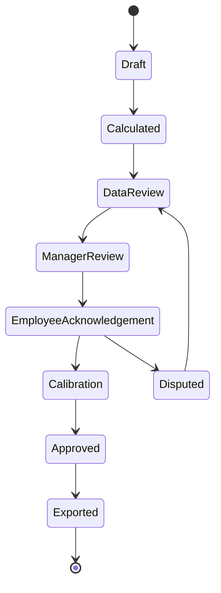

# OmniMer Project & People Metric Dictionary

> **Mục đích:** Định nghĩa hợp đồng dữ liệu, công thức và governance cho các chỉ số dùng trong OmniProject/OmniKPI.  
> **Phân biệt:** `project_metrics.md` là tài liệu kiến thức; tài liệu này là nguồn định nghĩa có version để triển khai.  
> **Trạng thái:** Baseline Draft  
> **Phiên bản:** 1.0.0  
> **Ngày:** 2026-09-08

---

## 1. Nguyên tắc đo lường

1. Chỉ số sức khỏe project và chỉ số đánh giá con người là hai bộ riêng.
2. Không chấm điểm từ dữ liệu chưa đủ chất lượng hoặc chưa có baseline.
3. Mỗi metric có mục đích cụ thể; không tái sử dụng sang mục đích lương thưởng nếu chưa được phê duyệt.
4. Không dùng story point, velocity, số commit, dòng code hoặc số giờ online để xếp hạng cá nhân.
5. Metric phải có cohort và cửa sổ đo; không trộn defect/release hoặc task khác kỳ.
6. Thay đổi due date, scope, weight hoặc target phải tạo version, không sửa lịch sử.
7. Score tự động chỉ là đầu vào đánh giá; score cuối cần review, calibration và approval.
8. `Missing/Not Applicable` khác `0`; không được thay dữ liệu thiếu bằng 0.
9. Mọi override cần actor, reason, evidence, delta và approver.
10. Benchmark mặc định chỉ để khởi tạo; target phải dựa trên loại project và dữ liệu lịch sử.

---

## 2. Metric contract

Mỗi metric phải có đầy đủ:

| Field | Bắt buộc | Ý nghĩa |
| :--- | :---: | :--- |
| `metric_id` | Có | ID ổn định, ví dụ `PM-SCH-001` |
| `version` | Có | Semantic version của định nghĩa |
| `name` | Có | Tên duy nhất, không mơ hồ |
| `purpose` | Có | Quyết định mà metric hỗ trợ |
| `entity_level` | Có | Portfolio, program, project, team hoặc individual |
| `owner` | Có | Chủ sở hữu nghiệp vụ |
| `data_owner` | Có | Chịu trách nhiệm nguồn và chất lượng dữ liệu |
| `direction` | Có | `HIGHER`, `LOWER`, `TARGET_RANGE`, `BOOLEAN`, `INFORMATIONAL` |
| `unit` | Có | %, ngày, giờ, VND, điểm hoặc count |
| `formula` | Có | Tử số, mẫu số và quy tắc làm tròn |
| `eligible_population` | Có | Bản ghi nào được tính hoặc loại trừ |
| `cohort_key` | Khi cần | Release/sprint/project/cycle liên kết tử và mẫu |
| `event_time` | Có | Timestamp nghiệp vụ dùng xếp kỳ |
| `window` | Có | Daily, rolling 30d, sprint, month, release... |
| `source` | Có | Event/table/API nguồn |
| `refresh` | Có | Near-real-time, daily, cycle-close... |
| `baseline/target` | Khi chấm điểm | Mốc so sánh được phê duyệt |
| `cap` | Khi chấm điểm | Trần achievement |
| `missing_data_rule` | Có | `EXCLUDE`, `BLOCK_SCORE`, `NOT_APPLICABLE` |
| `minimum_sample` | Khi là tỷ lệ | Cỡ mẫu tối thiểu để hiển thị/chấm |
| `effective_from/to` | Có | Hiệu lực của version |
| `approved_by` | Có | Người phê duyệt định nghĩa |
| `allowed_uses` | Có | Health, forecast, coaching, appraisal, compensation |

Metric thiếu contract không được đưa vào production scorecard.

---

## 3. Chuẩn hóa achievement

Gọi:

- \(A_i\): actual của metric \(i\).
- \(T_i\): target của metric \(i\).
- \(C_i\): cap, mặc định theo policy và không vượt 1.20 nếu dùng thang 120.
- \(r_i\): achievement ratio.

### 3.1 Higher is better

Áp dụng cho OTDR, acceptance rate, coverage hợp lệ:

$$r_i = \min\left(\frac{A_i}{T_i}, C_i\right), \quad T_i > 0$$

### 3.2 Lower is better

Áp dụng cho defect rate, cycle time, overtime, rework:

$$
r_i =
\begin{cases}
C_i, & A_i = 0 \land T_i > 0 \\
\min\left(\frac{T_i}{A_i}, C_i\right), & A_i > 0
\end{cases}
$$

Metric có target bằng 0 phải dùng rule riêng theo severity hoặc boolean; không thực hiện phép chia cho 0.

### 3.3 Target range

Nếu mức tốt nằm trong khoảng \([L_i, U_i]\):

- \(r_i = 1\) khi \(L_i \le A_i \le U_i\).
- Ngoài khoảng, metric contract phải định nghĩa hàm suy giảm và floor.
- Không tự suy ra chiều tốt/xấu khi chưa có rule.

### 3.4 Informational

Metric dùng để chẩn đoán/forecast nhưng không quy đổi thành điểm, ví dụ velocity và raw throughput.

---

## 4. Tổng hợp điểm

Chỉ tổng hợp các metric `eligible` trong cycle:

$$
\text{Base Score}
=
100 \times
\frac{\sum_{i \in E}(w_i \times r_i)}
{\sum_{i \in E}w_i}
$$

$$
\text{Final Score}
=
\operatorname{clamp}
\left(
\text{Base Score} - \text{Approved Penalties} + \text{Approved Bonuses},
0,
120
\right)
$$

### 4.1 Quy tắc trọng số

- Trọng số của metric set được phê duyệt phải cộng đúng 100%.
- Nếu metric là `NOT_APPLICABLE`, hệ thống chỉ normalize phần còn lại khi policy cho phép.
- Nếu metric là `BLOCK_SCORE`, cycle ở trạng thái `Data Incomplete`; không phát hành score.
- Không thay đổi weight sau khi cycle bắt đầu, trừ khi tạo metric-set version mới và có approval.

### 4.2 Penalty và bonus

- Không double-count: sự kiện đã làm giảm metric không bị phạt lần hai nếu policy không chỉ rõ.
- Penalty chỉ áp dụng cho hành vi nằm trong khả năng kiểm soát và có evidence.
- External dependency, approved leave, approved scope change và system outage phải có exclusion rule.
- Bonus mang tính discretionary phải qua calibration và bị giới hạn bởi policy.

---

## 5. Business outcome metric catalog

### BIZ-AUTO-001 — Confirmed Chat-to-Task Latency

- **Objective:** `OB-01`.
- **Direction:** `LOWER`.
- **Start event:** `channel.message_ingested`.
- **End event:** `task.confirmed` với cùng `correlation_id`.
- **Aggregation:** P50 và P95; mục tiêu áp dụng cho P95 phải được ghi rõ.
- **Exclude:** Message không actionable, duplicate và draft bị người dùng hủy; số lượng exclude vẫn phải hiển thị.

### BIZ-CAP-001 — Actionable Request Capture Rate

- **Objective:** `OB-02`.
- **Direction:** `HIGHER`.
- **Formula:** `Actionable messages được liên kết task/decision/acknowledgement trong SLA / actionable messages trong audited cohort × 100%`.
- **Source of truth:** Reconciled channel-message cohort, không dùng riêng task database làm mẫu số.
- **Control:** Tiêu chí “actionable” và phương pháp sampling/review phải được phê duyệt; báo cáo cả false positive và false negative.

### BIZ-EFF-001 — PM Administrative Time Reduction

- **Objective:** `OB-03`.
- **Direction:** `HIGHER`.
- **Formula:** `(Baseline admin hours - post-implementation admin hours) / baseline admin hours × 100%`.
- **Method:** Time study cùng role, loại project, mùa vụ và observation window trước/sau.
- **Control:** Không suy ra từ số click hoặc số message; cần mẫu đủ đại diện.

### BIZ-KPI-001 — KPI Calculation Reconciliation Accuracy

- **Objective:** `OB-04`.
- **Direction:** `HIGHER`.
- **Formula:** `Valid calculation scenarios khớp expected result theo tolerance / total valid scenarios × 100%`.
- **Source:** Versioned golden dataset và independent recomputation.
- **Control:** Theo dõi riêng audit completeness, override rate và dispute rate; calculation accuracy không chứng minh fairness.

### BIZ-HRM-001 — Approved-to-Accepted Export Latency

- **Objective:** `OB-05`.
- **Direction:** `LOWER`.
- **Start event:** `score_cycle.approved`.
- **End event:** HRM trả business acknowledgement cho batch tương ứng.
- **Aggregation:** P50/P95 theo integration và batch size.
- **Control:** Network acknowledgement không đồng nghĩa payroll đã áp dụng; cần reconciliation status.

### BIZ-HRM-002 — HRM Export Success Rate

- **Objective:** `OB-05`.
- **Direction:** `HIGHER`.
- **Formula:** `Approved batches được HRM chấp nhận và reconcile / approved batches due for export × 100%`.
- **Control:** Retry dùng cùng idempotency key; không đếm mỗi retry thành batch mới.

---

## 6. Project health metric catalog

### PM-SCH-001 — On-Time Milestone Delivery Rate

- **Purpose:** Theo dõi độ tin cậy của milestone commitment.
- **Level:** Project/Program.
- **Direction:** `HIGHER`.
- **Formula:**

$$
\text{OTDR}
=
\frac{\text{Milestone eligible hoàn tất trước/đúng baseline due}}
{\text{Tổng milestone eligible đến hạn trong kỳ}}
\times 100\%
$$

- **Eligible:** Milestone có baseline được duyệt trước kỳ freeze.
- **Exclude:** Cancelled scope, approved rebaseline có hiệu lực trước due date.
- **Event time:** Acceptance/completion timestamp.
- **Minimum sample:** Hiển thị count cùng tỷ lệ; không so sánh project chỉ có cỡ mẫu quá nhỏ.
- **Allowed uses:** Health, forecast, portfolio review; không gán toàn bộ trách nhiệm cho PM.

### PM-SCH-002 — Schedule Performance Index

- **Purpose:** Đo hiệu quả lịch theo EVM.
- **Level:** Project/Program.
- **Direction:** `HIGHER`, nhưng chủ yếu dùng `INFORMATIONAL` để forecast.
- **Formula:** \(\text{SPI} = EV / PV\), với \(PV > 0\).
- **Source:** Time-phased approved baseline và EV method.
- **Missing rule:** `BLOCK_SCORE` nếu không có EV/PV đáng tin cậy.
- **Note:** SPI gần cuối project mất giá trị dự báo; phải xem cùng forecast finish variance.

### PM-SCH-003 — Cycle Time

- **Purpose:** Theo dõi flow efficiency.
- **Level:** Team/Project.
- **Direction:** `LOWER`.
- **Formula:** `Done timestamp - first In Progress timestamp`.
- **Aggregation:** Median và P85; không chỉ dùng average.
- **Cohort:** Workflow class + task type + completed window.
- **Allowed uses:** Process improvement/forecast; không chấm cá nhân.

### PM-SCH-004 — Forecast Finish Variance

- **Purpose:** Cảnh báo sớm trễ tiến độ.
- **Direction:** `TARGET_RANGE` quanh 0 hoặc `LOWER` với absolute variance theo policy.
- **Formula:** `Current forecast finish - approved baseline finish`.
- **Unit:** Calendar day hoặc working day, phải khai báo.

### PM-COST-001 — Cost Performance Index

- **Purpose:** Đo hiệu quả chi phí theo EVM.
- **Direction:** `HIGHER`.
- **Formula:** \(\text{CPI} = EV / AC\), với \(AC > 0\).
- **Source:** EV ledger và actual cost đã đối soát.
- **Missing rule:** `BLOCK_SCORE` nếu AC hoặc EV chưa đóng kỳ.

### PM-COST-002 — Estimate at Completion Variance

- **Purpose:** Dự báo vượt ngân sách.
- **Direction:** `LOWER`.
- **Formula:** \((EAC - BAC) / BAC \times 100\%\), với \(BAC > 0\).
- **Interpretation:** Giá trị dương là forecast vượt ngân sách; âm là dưới ngân sách.

### PM-SCOPE-001 — Unapproved Scope Addition Rate

- **Purpose:** Đo scope creep thực sự, không phạt change đã được duyệt.
- **Direction:** `LOWER`.
- **Formula:**

$$
\frac{\text{Scope items thêm sau baseline không có approved CR}}
{\text{Scope items trong baseline đầu kỳ}}
\times 100\%
$$

- **Rule:** Scope item phải dùng cùng đơn vị; không trộn requirement, task và story point.

### PM-QUAL-001 — Defect Escape Rate

- **Purpose:** Đo defect lọt qua quality gate.
- **Direction:** `LOWER`.
- **Formula:**

$$
\frac{\text{Production defects thuộc release cohort}}
{\text{Pre-release + production defects thuộc cùng release cohort}}
\times 100\%
$$

- **Cohort:** Release/version; có observation window cố định.
- **Rule:** Severity, duplicate và invalid defect phải được chuẩn hóa.

### PM-QUAL-002 — Rework Effort Rate

- **Purpose:** Xác định effort sửa lại do defect hoặc requirement error.
- **Direction:** `LOWER`.
- **Formula:** `Approved rework hours / eligible delivery hours × 100%`.
- **Rule:** Không tính planned iteration/discovery là rework.

### PM-DEP-001 — Dependency Commitment Reliability

- **Purpose:** Đo độ tin cậy của dependency provider.
- **Direction:** `HIGHER`.
- **Formula:** `Dependencies delivered by needed-by date / dependencies due × 100%`.
- **Cohort:** Project/program + review period.
- **Evidence:** Dependency owner, consumer, needed-by date và fulfillment event.

### PM-RISK-001 — High-Risk Response Compliance

- **Purpose:** Theo dõi risk response quá hạn.
- **Direction:** `HIGHER`.
- **Formula:** `High/Critical risk actions completed by response due / due actions × 100%`.
- **Allowed uses:** Governance health, không dùng thay residual risk exposure.

### PM-VALUE-001 — First-Time Acceptance Rate

- **Purpose:** Đo deliverable được business chấp nhận ngay lần đầu.
- **Direction:** `HIGHER`.
- **Formula:** `Deliverables accepted without major rework / deliverables submitted × 100%`.
- **Rule:** `Major rework` phải có severity rule trong acceptance plan.

### PM-VALUE-002 — Benefit Realization Rate

- **Purpose:** Đo outcome đạt được so với business case.
- **Direction:** `HIGHER` hoặc metric-specific.
- **Formula:** `Actual verified benefit / planned benefit × 100%`.
- **Owner:** Business Owner, không phải PM sau closure.
- **Window:** Theo benefit plan, thường sau triển khai.

### PM-DATA-001 — Required Telemetry Completeness

- **Purpose:** Xác nhận dữ liệu đủ tin cậy trước khi tính health/score.
- **Direction:** `HIGHER`.
- **Formula:** `Eligible records đủ required fields/events / total eligible records × 100%`.
- **Rule:** Đạt data completeness không chứng minh dữ liệu đúng; cần anomaly controls riêng.

---

## 7. People metric catalog

People metric chỉ được kích hoạt sau khi HR, Legal/Privacy và đại diện người lao động (nếu áp dụng) phê duyệt mục đích sử dụng.

### PEO-DEL-001 — Commitment Reliability

- **Direction:** `HIGHER`.
- **Formula:** `Accepted commitments completed by approved due / eligible accepted commitments × 100%`.
- **Required controls:** Freeze time, approved change/leave/dependency exclusions, minimum sample.
- **Không dùng:** Task volume hoặc story point thô.

### PEO-QUAL-001 — First-Pass Quality Rate

- **Direction:** `HIGHER`.
- **Formula:** `Eligible deliverables accepted without material reopen / submitted deliverables × 100%`.
- **Required controls:** Cùng loại deliverable, severity và reviewer calibration.

### PEO-HYG-001 — Required Workflow Evidence Compliance

- **Direction:** `HIGHER`.
- **Formula:** `Required updates/evidence completed đúng policy / required updates × 100%`.
- **Giới hạn:** Trọng số thấp; không biến timesheet/status update thành thước đo năng suất chính.

### PEO-COL-001 — Structured Collaboration Contribution

- **Direction:** `TARGET_RANGE` hoặc rubric được duyệt.
- **Source:** Evidence-tagged contribution + calibrated review.
- **Rule:** Không dùng số comment/PR review thô; chống popularity bias và retaliation.

### 7.1 Metric bị cấm cho appraisal trực tiếp

- Story points hoặc velocity cá nhân.
- Số dòng code, commit count, online time.
- Số message, meeting attendance thô.
- Defect không gắn attribution/root cause đã review.
- Client satisfaction không kiểm soát account/context.
- Metric có cỡ mẫu dưới minimum sample.

---

## 8. Cycle và trạng thái phê duyệt

| Trạng thái | Có được export HRM? | Quy tắc |
| :--- | :---: | :--- |
| `Draft` | Không | Metric set/cycle chưa khóa |
| `Calculated` | Không | Kết quả máy, chưa xác nhận data |
| `DataReview` | Không | Kiểm tra missing/anomaly/cohort |
| `ManagerReview` | Không | Nhận xét và proposed adjustment |
| `EmployeeAcknowledgement` | Không | Nhân viên xem evidence và phản hồi |
| `Disputed` | Không | Đang xử lý khiếu nại |
| `Calibration` | Không | Kiểm tra consistency giữa team/manager |
| `Approved` | Có | HR/authority đã duyệt |
| `Exported` | Đã export | Lưu manifest, checksum và response |

---

## 9. Data quality controls

Trước khi tính hoặc phát hành:

- Kiểm tra duplicate event và idempotency key.
- Kiểm tra timestamp/timezone và late-arriving event.
- Khóa cohort và baseline version.
- Phát hiện due date/weight/scope bị sửa sát ngày hoàn thành.
- Phát hiện chia nhỏ/gộp task bất thường.
- Kiểm tra reviewer concentration và rating drift.
- Reconcile source event với aggregate.
- Gắn data quality status: `Valid`, `Incomplete`, `Anomalous`, `Excluded`.

Metric `Incomplete` hoặc `Anomalous` không được tự động chuyển thành điểm thấp.

---

## 10. Anti-gaming và fairness

1. Hiển thị cả outcome, quality và context; không tối ưu một metric duy nhất.
2. Không công khai bảng xếp hạng cá nhân mặc định.
3. Cho người bị đánh giá xem dữ liệu nguồn và gửi dispute.
4. Theo dõi tác động khác biệt giữa role/team/location khi pháp luật cho phép.
5. Không hồi tố metric version vào cycle đã đóng.
6. Mọi manual adjustment có giới hạn và cần lý do.
7. Compensation policy nằm ngoài scoring engine; OmniKPI chỉ export score đã duyệt và provenance.

---

## 11. Versioning và thay đổi metric

Metric change phải qua:

1. Change proposal nêu vấn đề và mục đích.
2. Impact analysis với dữ liệu lịch sử/sample calculation.
3. Review bởi Metric Owner, Data Owner, HR/PMO và Privacy/Security khi phù hợp.
4. Approval cùng `effective_from`.
5. Parallel run hoặc backtest trước production.
6. Thông báo người bị ảnh hưởng.
7. Không thay đổi kết quả cycle đã Approved; correction dùng adjustment record.

---

## 12. Điều kiện production-ready

Một metric chỉ được dùng chấm điểm khi:

- Contract đầy đủ và được phê duyệt.
- Có test cases cho happy path, boundary, zero, missing, duplicate và late event.
- Có minimum sample và exclusion policy.
- Backtest chứng minh công thức đúng.
- Dashboard hiển thị numerator, denominator, target, version và data freshness.
- Có owner xử lý dispute.
- Có retention, access control và audit log.

---
