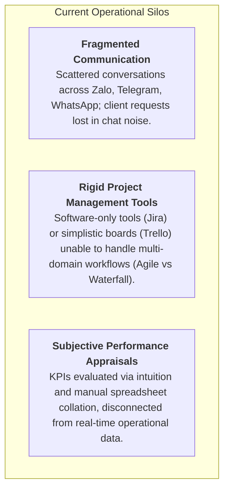
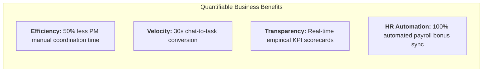

# Business Requirements Document (BRD)
## Project: OmniMer Team — Intelligent Multi-Domain Work & Performance Management Platform

> **Standard Reference:** IIBA BABOK® Guide v3 (Strategy Analysis & Requirements Life Cycle Management)  
> **Document Status:** Baseline Draft  
> **Version:** 1.0.0  
> **Date:** 2026-09-06  
> **Author:** Business & Solution Architecture Team (BDA)  

---

## 1. Project Information

* **Project Name:** OmniMer Team
* **Target Release:** Version 1.0 (MVP) through Version 4.0 (Enterprise Suite)
* **Document Version:** 1.0.0
* **Primary Stakeholders:** Executive Leadership, Project Managers, Cross-functional Execution Teams, HR & People Operations.

---

## 2. Business Context & Problem Statement

### 2.1 The Current Situation (As-Is State)
Modern organizations operating in fast-paced environments (technology, marketing agencies, construction, commerce) suffer from severe fragmentation across three disconnected operational silos:

1. **Lost & Untracked Customer Directives:** Client and stakeholder requests arrive continuously through messaging platforms (Zalo OA, personal Zalo, Telegram groups). Because these communication channels are isolated from project management boards, tasks are frequently forgotten, delayed, or transcribed manually with high error rates.
2. **Methodological Inflexibility:** Non-technical departments (Marketing, Creative, Sales, Operations) struggle with engineering-centric tools like Jira, while linear projects (Construction, Events) lack dependency tracking (Gantt/Critical Path) in lightweight Kanban tools like Trello.
3. **High Administrative Burden on Leadership:** Project Managers spend an estimated 25% to 35% of their daily bandwidth chasing team members for status updates, compiling meeting notes, and running prolonged daily standups.
4. **Subjective & Delayed Performance Reviews:** Human Resources and Department Heads lack objective, empirical execution data when calculating monthly bonuses and KPIs, leading to friction, employee dissatisfaction, and delayed payroll processing.

### 2.2 Root Cause Analysis (5-Whys)
* *Why are project deadlines missed?* Because priorities shift and updates get lost in chat groups.
* *Why are chat requests lost?* Because there is no automated bridge between messaging apps and project task systems.
* *Why isn't there a bridge?* Communication tools and project management systems operate as closed, distinct software stacks.
* *Why are performance reviews disputed?* Because KPI evaluations rely on retrospective memory and manual manager spreadsheets rather than timestamped task telemetry.

---

## 3. Business Objectives (SMART)

* **OB-01 (Task Capture Velocity):** Reduce average time required to convert a client communication into an actionable, assigned project task from **15 minutes to under 30 seconds** (a 95% reduction) via OmniChannel and OPAgent.
* **OB-02 (Elimination of Dropped Requests):** Reduce uncaptured or dropped client requests from external messaging channels (Zalo/Telegram) to **0%**.
* **OB-03 (Administrative Overhead Reduction):** Reduce daily project management overhead (standup facilitation, deadline reminders, manual follow-ups) by **at least 50%** through autonomous AI orchestrations.
* **OB-04 (Objective Performance Telemetry):** Achieve **100% automated, empirical KPI score calculation** directly tied to verifiable project delivery data (on-time rate, task volume, quality review scores).
* **OB-05 (HRM Synchronization Latency):** Reduce monthly HR performance evaluation collation and payroll synchronization time from **3-5 business days to real-time (< 5 minutes)** via automated API integration.

---

## 4. Stakeholder Matrix

| Stakeholder Persona | Representative Roles | Core Business Needs | Influence / Impact |
| :--- | :--- | :--- | :--- |
| **Project Manager / Team Lead** | Engineering PMs, Marketing Leads, Delivery Managers | Multi-project oversight, rapid assignment, blocker identification, dependency controls. | **High / High** (Primary Daily User) |
| **Team Member / Individual Contributor** | Developers, Designers, Content Marketers, Operations Staff | Clear task descriptions, unambiguous acceptance criteria, unified notifications, zero context switching. | **Medium / High** (Core Execution User) |
| **HR & People Operations** | HR Directors, Compensation & Benefits Specialists | Objective performance scorecards, automated timesheet sync, seamless integration with external HRM. | **High / Medium** (Governance & Payroll) |
| **Executive Leadership / Sponsors** | C-Suite (CEO, COO, CTO), External Enterprise Clients | High-level portfolio visibility, budget variance alerts, project health forecasting, strategic ROI. | **High / High** (Budget Sponsor & Approver) |

---

## 5. Expected Benefits & ROI Analysis

### 5.1 Quantitative Benefits
* **Direct Labor Savings:** Saving ~1.5 hours per PM per day in status tracking, standup coordination, and manual task generation. For an organization with 10 PMs, this equates to ~300 productive hours recovered monthly.
* **Reduction in SLA Penalties:** Eliminates missed client deadlines caused by dropped communications in Telegram/Zalo, preserving contractual revenue.
* **Zero Payroll Dispute Costs:** Fully auditable scoring logs eliminate dispute resolution cycles during monthly performance appraisals.

### 5.2 Qualitative Benefits
* **Reduced Cognitive Load:** Team members work from a unified interface rather than toggling between chat applications and multiple project tools.
* **Psychological Safety & Fairness:** Transparent, deterministic KPI algorithms remove manager bias and promote high performance.
* **Cross-Departmental Synergy:** Technical and non-technical departments collaborate within the same ecosystem using views tailored to their operational habits.

---

## 6. High-Level Solution Scope

The OmniMer Team solution consists of four integrated modules:

1. **OmniProject (Multi-Domain Work Management):** Dynamic workflow engine supporting Kanban, Scrum, Gantt Timeline (Dependencies/Critical Path), and Table/Grid views with custom fields.
2. **OmniChannel (Unified Communications Gateway):** Real-time webhook aggregation for Telegram Bot and Zalo OA, providing a Unified Inbox and 1-click conversation-to-task creation.
3. **OPAgent (AI Workflow Engine):** Intelligent assistant performing Natural Language/Voice to Task conversion, automated subtask/acceptance criteria generation, proactive deadline risk monitoring, and automated daily standup summaries.
4. **OmniKPI & HRM Integration (Performance & People Ops):** Multi-variable performance scoring engine ($\text{On-Time Delivery} + \text{Quality} + \text{Discipline} - \text{Penalties}$) connected via bidirectional REST APIs/Webhooks to external HRM platforms (Odoo, Base, custom ERPs).

---

## 7. Business Constraints & Assumptions

### 7.1 Constraints
* **C-01 (Third-Party API Limits):** Subject to rate limits, message formatting rules, and webhook availability imposed by Zalo Open API and Telegram Bot API.
* **C-02 (Data Privacy & Compliance):** Employee performance data and proprietary client chats must adhere to strict enterprise RBAC and data encryption standards (both in transit and at rest).
* **C-03 (LLM Cost & Latency):** AI prompt execution through OPAgent must maintain latency under 3 seconds per extraction while remaining cost-effective under high-volume operations.

### 7.2 Assumptions
* **A-01:** Organizations possess or can provision official Zalo Official Accounts (OA) and Telegram Bots for workplace integration.
* **A-02:** Target corporate HRM platforms support standard RESTful APIs or Webhook ingestion for employee roster and compensation telemetry sync.
* **A-03:** Users have modern web browsers (Chrome, Edge, Safari, Firefox) with stable internet connectivity.

---

## 8. High-Level Risks & Mitigation Strategies

| Risk ID | Risk Description | Likelihood | Impact | Mitigation Strategy |
| :--- | :--- | :--- | :--- | :--- |
| **RSK-01** | Third-party messaging platforms (Zalo/Telegram) experience API outages or breaking changes. | Medium | High | Decouple ingestion via an asynchronous Message Queue (RabbitMQ/Redis Streams) with exponential retry mechanisms. |
| **RSK-02** | AI hallucination in task extraction (incorrect assignee, distorted deadline or budget). | Medium | Medium | Implement an explicit "Review & Confirm" confirmation preview dialog before committing AI-generated tasks to the board. |
| **RSK-03** | Employee resistance to automated KPI scoring due to fear of unfair penalties. | Medium | High | Transparent scoring formula, real-time scorecard access, and an explicit formal dispute/appeal workflow with manager override capabilities. |
| **RSK-04** | Data leaks of confidential salary and KPI calculations. | Low | Critical | Strict RBAC isolation; salary and KPI sync endpoints restricted to authorized HR Directors and Direct Managers only. |

---

## 9. Formal Sign-Off & Approvals

| Role | Name | Title | Date | Signature / Status |
| :--- | :--- | :--- | :--- | :--- |
| **Product Sponsor** | Executive Committee | Head of Digital Transformation | 2026-09-06 | *Pending Baseline Review* |
| **Lead Business Analyst** | BDA Architect | Principal Business Analyst | 2026-09-06 | **Approved** |
| **Technical Delivery Lead** | System Architect | Chief Technology Architect | 2026-09-06 | *Pending Technical Verification* |

---
