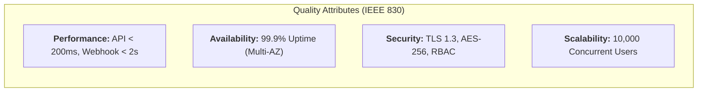
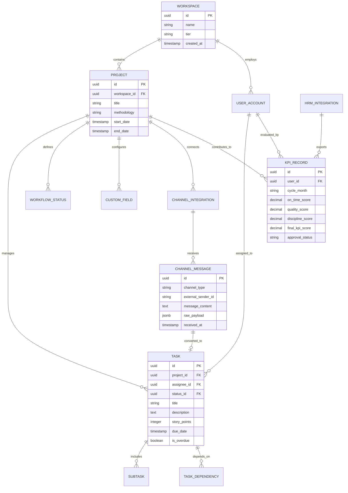
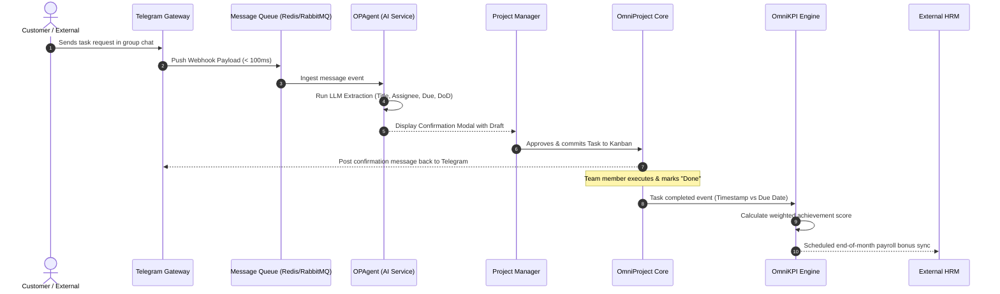

# Software Requirements Specification (SRS) & Functional Requirements Document (FRD)
## Project: OmniMer Team — System Requirements & Specifications

> **Standard Reference:** IEEE Std 830-1998 & Agile Alliance (INVEST Standard)  
> **Document Status:** Baseline Specifications  
> **Version:** 1.0.0  
> **Date:** 2026-09-06  

---

## 1. System Overview & User Classes

### 1.1 Document Purpose
This document provides the definitive, verifiable functional and non-functional specifications for engineering teams implementing the **OmniMer Team** platform. Each requirement contains an explicit, testable criteria threshold, unique identifiers, and traceability anchors.

### 1.2 User Classes & Authorization Matrix

| User Role | Characteristics & Responsibilities | System Access Permissions |
| :--- | :--- | :--- |
| **Workspace Admin** | Organization owner, CTO, or Operations Director | Full system privileges: billing, workspace settings, integrations, global RBAC assignment. |
| **Project Manager (PM) / Team Lead** | Project planners, delivery leads, scrum masters | Project creation, workflow & custom field customization, sprint planning, task assignment, KPI review. |
| **Team Member / Contributor** | Developers, designers, marketers, QA engineers | View assigned boards, update task states, comment, log timesheets, view personal KPI scorecard. |
| **HR Specialist / Director** | People operations, payroll administrators | Read-only access to task execution boards; full access to OmniKPI scorecards and HRM sync endpoints. |
| **Executive / Guest Stakeholder** | C-suite leaders, external clients, sponsors | Read-only access to executive status dashboards, Gantt timelines, and high-level milestones. |

---

## 2. Global Use Case Diagram

```mermaid
graph TD
    PM([Project Manager / Lead])
    TM([Team Member / Contributor])
    HR([HR & Operations])
    EX([Executive / Client])
    AI([OPAgent AI Assistant])

    subgraph OmniProject["Module 1: OmniProject"]
        UC1["Configure Workflows & Custom Fields"]
        UC2["Manage Boards (Kanban, Scrum, Gantt, Table)"]
        UC3["Update Task Status & Log Work"]
        UC4["Manage Dependencies & Critical Path"]
    end

    subgraph OmniChannel["Module 2: OmniChannel"]
        UC5["View & Reply in Unified Inbox"]
        UC6["1-Click Convert Message to Task"]
    end

    subgraph OPAgent_Mod["Module 3: OPAgent"]
        UC7["Natural Language / Voice to Task Extraction"]
        UC8["Proactive Deadline & Risk Alerting"]
        UC9["Automated Daily Standup Summarization"]
    end

    subgraph OmniKPI_Mod["Module 4: OmniKPI & HRM"]
        UC10["Automated Multi-Variable KPI Scoring"]
        UC11["View Real-Time Personal Scorecard"]
        UC12["Bidirectional HRM Roster & Payroll Sync"]
    end

    PM --> UC1
    PM --> UC2
    PM --> UC4
    PM --> UC6
    
    TM --> UC2
    TM --> UC3
    TM --> UC5
    TM --> UC11

    HR --> UC10
    HR --> UC12

    EX --> UC2
    EX --> UC4

    AI --> UC7
    AI --> UC8
    AI --> UC9
```



---

## 3. Functional Requirements by Module

### 3.1 Module 1: OmniProject (Multi-Domain Work Management)

| FR ID | Requirement Description | Input Data | Output / System Behavior | Associated Business Rule | Priority |
| :--- | :--- | :--- | :--- | :--- | :--- |
| **FR-PROJ-001** | Multi-View Board Engine | User view selector (Kanban, Scrum, Gantt, Table) | Render task data in selected view mode without data loss within $< 1\text{s}$. | BR-PROJ-01 | **Must-Have (P0)** |
| **FR-PROJ-002** | Dynamic Workflow Customization | Custom column names, stage sequences, WIP limits | Persist custom status pipeline per board; enforce WIP limit constraints. | BR-PROJ-02 | **Must-Have (P0)** |
| **FR-PROJ-003** | Dynamic Custom Fields | Field name, field type (Number, Dropdown, Date, Checklist) | Attach custom metadata attributes to all tasks in target project. | BR-PROJ-03 | **Must-Have (P0)** |
| **FR-PROJ-004** | Interactive Gantt Scheduling | Drag-and-drop timeline dates, link connector between tasks | Draw Finish-to-Start dependency arrows; auto-recalculate dependent start dates. | BR-PROJ-04 | **Should-Have (P1)** |
| **FR-PROJ-005** | Critical Path Identification | Project task list with duration & dependencies | Highlight critical path tasks in red; calculate total project float. | BR-PROJ-04 | **Should-Have (P1)** |
| **FR-PROJ-006** | Scrum Sprint Cycle Management | Sprint name, start/end dates, commitment backlog items | Create Sprint container; lock scope; compute burndown velocity metrics. | BR-PROJ-05 | **Should-Have (P1)** |

---

### 3.2 Module 2: OmniChannel (Unified Communication Gateway)

| FR ID | Requirement Description | Input Data | Output / System Behavior | Associated Business Rule | Priority |
| :--- | :--- | :--- | :--- | :--- | :--- |
| **FR-CHAN-001** | Telegram Ingestion Gateway | Telegram Webhook payload (message text, sender, group ID) | Enqueue message to message broker; forward to Unified Inbox in $< 2\text{s}$. | BR-CHAN-01 | **Should-Have (P1)** |
| **FR-CHAN-002** | Zalo OA Ingestion Gateway | Zalo Open API webhook (text, media, sender info) | Route message to project-bound thread; notify assigned PM/responders. | BR-CHAN-01 | **Could-Have (P2)** |
| **FR-CHAN-003** | Unified Inbox UI & Reply | Outbound reply text, attachments | Dispatch message back to original channel (Zalo/Telegram) via outbound API. | BR-CHAN-02 | **Should-Have (P1)** |
| **FR-CHAN-004** | 1-Click Message-to-Task Conversion | User click on message action "Create Task" | Open task modal pre-filled with raw chat content; create deep-link back to thread. | BR-CHAN-03 | **Should-Have (P1)** |

---

### 3.3 Module 3: OPAgent (AI Workflow Engine)

| FR ID | Requirement Description | Input Data | Output / System Behavior | Associated Business Rule | Priority |
| :--- | :--- | :--- | :--- | :--- | :--- |
| **FR-AI-001** | Text-to-Task NLP Extraction | Conversational text prompt | Output JSON schema: Title, Markdown Description, Subtasks, Assignee, Deadline. | BR-AI-01 | **Must-Have (P0)** |
| **FR-AI-002** | Task Extraction Confirmation Modal | Structured AI draft | Interactive modal allowing user to modify fields before persisting to database. | BR-AI-02 | **Must-Have (P0)** |
| **FR-AI-003** | Voice-to-Task Transcription | Audio file / voice note stream | Transcribe speech to text via Whisper model; route text to `FR-AI-001`. | BR-AI-01 | **Could-Have (P2)** |
| **FR-AI-004** | Proactive Bottleneck & Risk Monitor | Scheduled cron check (hourly) | Evaluate task progress vs deadline; send warning alert if progress $< 30\%$ with $< 48\text{h}$ left. | BR-AI-03 | **Could-Have (P2)** |
| **FR-AI-005** | Daily Standup Auto-Summary | Board telemetry & chat logs | Aggregate daily accomplishments, in-progress items, and blockers; publish to chat at 18:00. | BR-AI-04 | **Could-Have (P2)** |

---

### 3.4 Module 4: OmniKPI & HRM Integration

| FR ID | Requirement Description | Input Data | Output / System Behavior | Associated Business Rule | Priority |
| :--- | :--- | :--- | :--- | :--- | :--- |
| **FR-KPI-001** | Automated Score Computation | Completed task telemetry, due dates, review ratings | Calculate weighted score using standardized formula; log audit event. | BR-KPI-01 | **Should-Have (P1)** |
| **FR-KPI-002** | Real-Time Personal Scorecard | User ID | Render monthly progress score, category breakdowns, and historical bands. | BR-KPI-02 | **Should-Have (P1)** |
| **FR-KPI-003** | Manager KPI Review & Adjustment | Manual adjustment delta, reason justification | Recalculate score with approved override; flag as "Manager Adjusted" in audit trail. | BR-KPI-03 | **Should-Have (P1)** |
| **FR-KPI-004** | Inbound HRM Employee Sync | HRM Webhook / API payload | Create or deactivate user accounts, department assignments, and job titles. | BR-HRM-01 | **Could-Have (P2)** |
| **FR-KPI-005** | Outbound HRM Score Export | End-of-cycle trigger / cron | Securely dispatch validated monthly scores to external HRM payroll endpoint. | BR-HRM-02 | **Could-Have (P2)** |

---

## 4. Invariant Business Rules (BR Catalog)

* **BR-PROJ-01 (View State Parity):** All views (Kanban, Scrum, Gantt, Table) must operate on the exact same underlying task entities. Updating a state in Kanban must reflect immediately on Gantt and Table views.
* **BR-PROJ-02 (WIP Limit Enforcement):** When a Kanban column exceeds its configured WIP limit, the UI must visually flag the column in amber/red and log a warning; drag actions may be constrained based on project settings.
* **BR-PROJ-03 (Custom Field Type Safety):** Values entered into custom fields must strictly conform to their defined data type (e.g., numeric validation for Budget fields).
* **BR-PROJ-04 (Dependency Integrity):** A task cannot have a `Finish-to-Start` dependency on itself, nor can circular dependency loops ($A \rightarrow B \rightarrow C \rightarrow A$) be created.
* **BR-CHAN-01 (Channel Ingestion Queueing):** Inbound webhooks from Zalo and Telegram must be placed immediately into an asynchronous message queue within $100\text{ms}$ of receipt before business processing.
* **BR-AI-01 (Deterministic Output Schema):** LLM extraction calls must strictly conform to a predefined JSON schema. Invalid schema responses must trigger an automatic retry or fallback to raw text.
* **BR-AI-02 (Human-in-the-Loop Confirmation):** No AI-extracted task may be silently committed to a live project board without an explicit confirmation action from a human user.
* **BR-KPI-01 (Mathematical Score Range):** Individual monthly performance scores are bounded between $0.00$ and $120.00$ points (inclusive of overachievement caps and penalties).
* **BR-HRM-01 (RBAC Isolation):** Only users with role `Workspace Admin` or `HR Specialist` are permitted to configure HRM API keys and trigger payroll data synchronization.

---

## 5. Non-Functional Requirements (NFRs per IEEE 830)



| NFR ID | Attribute | Specification & Measurable Threshold | Reference Standard |
| :--- | :--- | :--- | :--- |
| **NFR-001** | **API Latency** | Core REST API endpoints must respond in $\le 200\text{ms}$ at the 95th percentile under normal load. | IEEE 830 §3.1 |
| **NFR-002** | **Webhook Processing** | Incoming Telegram/Zalo webhooks must reflect in the Unified Inbox UI within $< 2.0\text{s}$. | IEEE 830 §3.1 |
| **NFR-003** | **Board Render Time** | Board views with up to 1,000 tasks must complete initial client rendering in $< 1.0\text{s}$. | Web Vitals / FCP |
| **NFR-004** | **System Availability** | Core platform services must achieve $\ge 99.9\%$ uptime, excluding scheduled maintenance windows. | High-Availability SLA |
| **NFR-005** | **Data Encryption** | All data in transit must enforce TLS 1.3; sensitive tokens and HRM secrets encrypted at rest via AES-256-GCM. | OWASP ASVS v4.0 |
| **NFR-006** | **RBAC Security** | Access control tokens (JWT) must expire in $\le 60$ minutes; permissions evaluated server-side per request. | NIST SP 800-63B |
| **NFR-007** | **System Scalability** | Architecture must horizontally scale to support at least 10,000 active concurrent users and 500k monthly tasks. | Enterprise Cloud Scale |
| **NFR-008** | **Browser Compatibility** | Full functional parity across Chrome ($\ge v110$), Edge ($\ge v110$), Safari ($\ge v16$), Firefox ($\ge v115$). | W3C Standards |
| **NFR-009** | **Audit Logging** | All task creations, status transitions, KPI adjustments, and HRM exports must generate immutable audit logs. | SOC2 / ISO 27001 |
| **NFR-010** | **AI Processing Latency** | Natural language task extraction by OPAgent must return the structured modal draft within $< 3.5\text{s}$. | User Experience SLA |

---

## 6. System Architecture & Entity-Relationship Model (ERD)



---

## 7. End-to-End Sequence Flow

The following sequence illustrates the end-to-end lifecycle: an incoming customer request via Telegram processed by OPAgent, committed to OmniProject, and evaluated in OmniKPI.



---

## 8. Detailed User Stories with Gherkin Acceptance Criteria

### 8.1 US-001: Dynamic Workflow & Custom Column Configuration
* **User Story:**  
  As a **Project Manager / Team Lead**,  
  I want to **create custom status columns and define Work-In-Progress (WIP) limits per stage**,  
  So that **the board accurately reflects our department's specific operational process (e.g., Marketing: Idea $\rightarrow$ Draft $\rightarrow$ Review $\rightarrow$ Published) without overloading team bandwidth**.  
* **Traceability Links:** `FR-PROJ-002`, `BR-PROJ-02`, `US-001`  
* **Acceptance Criteria (Gherkin):**
  ```gherkin
  Scenario: Successfully configuring custom workflow statuses
    Given I am logged in as a Project Manager on an active project board
    When I access "Board Settings" and add a new status column "In Review" with WIP limit = 3
    Then the new column appears on the Kanban Board immediately
    And the system prevents moving more than 3 active tasks into "In Review" without a supervisor warning

  Scenario: Attempting to create duplicate status names
    Given a status column named "Done" already exists on the board
    When I attempt to create another column with the name "Done"
    Then the system rejects the action with error "Column name already exists"
  ```
* **Priority:** Must-Have (P0)

---

### 8.2 US-002: Interactive Gantt Dependency & Critical Path Scheduling
* **User Story:**  
  As a **Project Manager**,  
  I want to **link tasks with Finish-to-Start dependencies on a visual Gantt chart**,  
  So that **delaying a predecessor task automatically adjusts the schedules of all downstream dependent tasks along the Critical Path**.  
* **Traceability Links:** `FR-PROJ-004`, `FR-PROJ-005`, `BR-PROJ-04`, `US-002`  
* **Acceptance Criteria (Gherkin):**
  ```gherkin
  Scenario: Cascading schedule adjustment on dependent tasks
    Given Task B has a "Finish-to-Start" dependency on Task A
    And Task A is scheduled to finish on 2026-10-15 while Task B starts on 2026-10-16
    When I extend the due date of Task A to 2026-10-18 on the Gantt chart
    Then the start date of Task B automatically shifts forward to 2026-10-19
    And the system highlights the affected critical path links in red

  Scenario: Preventing circular dependency loops
    Given Task A depends on Task B, and Task B depends on Task C
    When I attempt to create a dependency where Task C depends on Task A
    Then the system blocks the connection and displays "Circular dependency detected"
  ```
* **Priority:** Should-Have (P1)

---

### 8.3 US-003: Unified Messaging & 1-Click Task Creation
* **User Story:**  
  As a **Project Manager**,  
  I want to **convert a client message received via Telegram or Zalo directly into a project task with 1-click**,  
  So that **action items are captured into the project backlog instantly without copy-pasting or losing conversation context**.  
* **Traceability Links:** `FR-CHAN-004`, `BR-CHAN-03`, `US-003`  
* **Acceptance Criteria (Gherkin):**
  ```gherkin
  Scenario: 1-Click message-to-task creation from chat
    Given I receive a client message on the Unified Inbox from a connected Telegram group
    When I click the "Create Task" action button on the message card
    Then a task creation dialog opens with the message text pre-populated in the Description field
    And the new task automatically stores a deep link referencing the original Telegram message ID

  Scenario: Handling media attachments from chat in task creation
    Given the client message includes an attached PDF specification
    When I convert the message to a task
    Then the PDF attachment is automatically associated with the newly created task entity
  ```
* **Priority:** Should-Have (P1)

---

### 8.4 US-004: Natural Language Text-to-Task Extraction via OPAgent
* **User Story:**  
  As a **busy Team Lead**,  
  I want to **submit an unstructured natural language command (e.g., "Assign Lan to design the promotion banner by Friday")**,  
  So that **OPAgent automatically extracts the Title, Assignee, Due Date, Checklist, and Definition of Done into a verified task**.  
* **Traceability Links:** `FR-AI-001`, `FR-AI-002`, `BR-AI-01`, `BR-AI-02`, `US-004`  
* **Acceptance Criteria (Gherkin):**
  ```gherkin
  Scenario: Accurate extraction of structured metadata from prompt
    Given I input "Build the Facebook Ads campaign for Lan, budget 15M, deadline next Friday"
    When OPAgent processes the natural language command
    Then the generated draft sets Title = "Build Facebook Ads Campaign"
    And the Assignee is matched to team member "Lan"
    And the custom field "Budget" is set to 15,000,000 VND
    And the system displays a confirmation preview dialog within 3.5 seconds

  Scenario: Unambiguous fallback when assignee cannot be resolved
    Given I input "Prepare financial audit report by Monday" without specifying a member
    When OPAgent generates the task draft
    Then the Assignee field remains "Unassigned" with a prompt suggesting available finance members
  ```
* **Priority:** Must-Have (P0)

---

### 8.5 US-005: Proactive Standup Telemetry & Blocker Alerts
* **User Story:**  
  As a **Team Contributor**,  
  I want to **receive proactive, personalized risk alerts on Telegram when my task is at risk of falling behind**,  
  So that **I can address impediments early without waiting for the PM to intervene**.  
* **Traceability Links:** `FR-AI-004`, `FR-AI-005`, `BR-AI-03`, `US-005`  
* **Acceptance Criteria (Gherkin):**
  ```gherkin
  Scenario: Proactive task delay warning
    Given I have a task with a due date within 36 hours
    And the task progress is currently recorded at under 30%
    When the OPAgent hourly monitoring cron executes
    Then OPAgent sends a friendly direct message to my Telegram: "Your task X is due in 36h. Are there any blockers?"
    And provides 1-click quick-reply options: "On Track", "Need Help", "Blocked"

  Scenario: Publishing automated daily standup summary
    Given it is 18:00 on an active working day
    When OPAgent aggregates all board transitions and blocker flags
    Then a formatted daily digest is published to the project's Telegram channel summarizing Done, In Progress, and Blocked items
  ```
* **Priority:** Could-Have (P2)

---

### 8.6 US-006: Automated Empirical KPI Scoring & Scorecard Visibility
* **User Story:**  
  As an **Employee / Contributor**,  
  I want to **view my real-time KPI scorecard computed from objective task completion, on-time rates, and quality scores**,  
  So that **my performance review is completely transparent, mathematically verified, and free from personal bias**.  
* **Traceability Links:** `FR-KPI-001`, `FR-KPI-002`, `BR-KPI-01`, `US-006`  
* **Acceptance Criteria (Gherkin):**
  ```gherkin
  Scenario: Automated score calculation on task completion
    Given a monthly evaluation cycle with weights: On-Time (45%), Quality (35%), Hygiene (20%)
    When I complete 95% of my sprint tasks on time with zero QA re-opens and 90% daily log hygiene
    Then my calculated monthly score reflects: (0.95*45) + (1.00*35) + (0.90*20) = 95.75 / 100
    And the score is rendered instantly on my Personal Performance Scorecard

  Scenario: Applying overdue penalty deductions
    Given a task is completed 3 days past the committed deadline without an approved extension
    When the KPI scoring engine evaluates the delivery
    Then a weighted overdue penalty is deducted from the monthly achievement subtotal
  ```
* **Priority:** Should-Have (P1)

---

### 8.7 US-007: Secure Bidirectional HRM API & Payroll Synchronization
* **User Story:**  
  As an **HR Specialist / Director**,  
  I want to **connect OmniMer with our enterprise HRM system (e.g., Odoo, Base) via secure REST APIs**,  
  So that **new hires are automatically onboarded into projects and monthly finalized KPI scores export directly to the payroll calculation engine**.  
* **Traceability Links:** `FR-KPI-004`, `FR-KPI-005`, `BR-HRM-01`, `BR-HRM-02`, `US-007`  
* **Acceptance Criteria (Gherkin):**
  ```gherkin
  Scenario: Inbound employee synchronization from HRM
    Given a new employee record is created in the external HRM system
    When the HRM dispatches an employee.created webhook to OmniMer API
    Then a corresponding user profile is provisioned in OmniMer with matched email, department, and role

  Scenario: Outbound monthly KPI score export to payroll
    Given the monthly performance appraisal cycle is approved by the Department Head
    When the HR Specialist clicks "Export to Payroll"
    Then OmniMer dispatches an encrypted payload containing employee IDs, scores, and grade bands to the HRM payroll endpoint
    And receives a "200 OK — Batch Ingested" response within 5 seconds
  ```
* **Priority:** Could-Have (P2)

---
