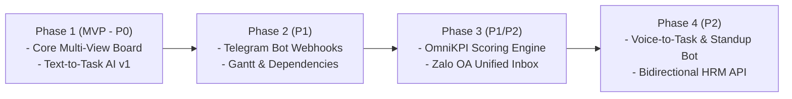
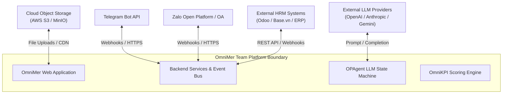

# Vision and Scope Document
## Project: OmniMer Team Platform

> **Standard Reference:** IIBA BABOK® Guide v3  
> **Purpose:** Establish explicit operational boundaries, scope demarcations, and interface parameters to eliminate ambiguity and prevent scope creep during development.

---

## 1. Vision Statement

> **For** cross-functional project managers, delivery teams, and human resource leaders **who** struggle with fragmented communications, rigid project tools, and subjective performance evaluations,  
> **OmniMer Team** is an **intelligent, multi-domain work orchestration and performance management platform**  
> **that** unifies popular messaging channels (Zalo, Telegram) with flexible project boards (Kanban, Scrum, Gantt) and leverages autonomous AI (OPAgent) to convert natural dialogue into verified tasks while calculating automated, empirical KPIs.  
> **Unlike** traditional software-centric issue trackers (Jira) or disconnected chat and spreadsheet systems,  
> **our product** converges real-time omnichannel communication, cross-industry workflow adaptability, proactive AI assistance, and automated HRM payroll synchronization into a single, cohesive ecosystem.

---

## 2. In-Scope Requirements (By Release Phase)

### 2.1 Phase 1: Core Foundation & Work Management (MVP - Priority P0)
- **Core Workspace & RBAC Engine:** Multi-tenant workspace creation, user authentication, role-based access control (Admin, PM, Member, Guest).
- **OmniProject Core Views:**
  - Dynamic Kanban Board with customizable columns and WIP limits.
  - Interactive Table/List View with rapid sorting, filtering, and mass editing.
- **Dynamic Field System:** Custom fields supporting text, numeric budget values, dropdowns, attachments, and sub-checklists.
- **OPAgent v1 (Text-to-Task):** NLP prompt-based task extraction (Title, Markdown Description, Subtasks/Checklists, Suggested Assignee, and Deadline) with an interactive preview/confirmation modal.

### 2.2 Phase 2: Advanced Visualization & Channel Ingestion (Priority P1)
- **OmniProject Advanced Scheduling:**
  - Interactive Gantt Timeline with dependency linking (Finish-to-Start, Start-to-Start).
  - Critical Path calculation and automatic cascading date recalculations.
- **Scrum / Sprint Module:** Backlog management, Sprint planning, Story Point tracking, and Sprint burndown charts.
- **OmniChannel v1 (Telegram Gateway):**
  - Telegram Bot integration via real-time Webhooks.
  - Project-bound topic threading.
  - 1-Click "Convert Message to Project Task".

### 2.3 Phase 3: Performance Intelligence & Full Omnichannel (Priority P1 / P2)
- **OmniKPI Scoring Engine:**
  - Automated calculation based on On-Time Delivery Rate, Task Weight/Points, Reopen Rates, and Overdue Penalties.
  - Real-time personal performance scorecards for team members.
  - Manager review, adjustment, and dispute approval workflows.
- **OmniChannel v2 (Zalo Integration):**
  - Official Zalo OA & Zalo Bot webhook ingestion.
  - Two-way Unified Inbox supporting rich text, images, and file attachments with $< 2\text{s}$ message delivery latency.

### 2.4 Phase 4: Autonomous Operations & Enterprise HR Sync (Priority P2)
- **OPAgent v2 (Autonomous Proactive PM):**
  - Speech-to-Text (Voice-to-Task) processing for meeting recordings and audio notes.
  - Automated risk detection (warning triggers on tasks approaching deadline with $< 30\%$ progress).
  - Daily Standup AI Summarizer aggregating daily board events and blocker telemetry at 18:00 daily.
- **HRM Integration Suite:**
  - Bidirectional REST APIs and Webhook dispatchers connecting to external HRM platforms (Odoo, Base HRM, custom ERPs).
  - Inbound user onboarding synchronization.
  - Outbound monthly KPI score export directly into HRM payroll and bonus modules.

---

## 3. Explicitly Out-of-Scope (To Prevent Scope Creep)

To ensure razor-sharp delivery focus, the following features are **explicitly excluded** from the current project roadmap:

1. **Proprietary Mobile Chat Client:** OmniMer Team will NOT develop its own standalone instant messaging protocol or proprietary native chat application. It integrates directly with existing enterprise channels (Zalo, Telegram, Webhook).
2. **Direct Banking / Payroll Disbursement Processing:** OmniMer Team calculates objective KPI performance scores and exports them to HRM/ERP systems. It does NOT process direct bank transfers, payroll tax withholdings, or salary disbursements.
3. **Biometric Hardware Integration:** The system will not interface directly with physical fingerprint, card, or facial recognition timekeeping hardware. Time logs are ingested purely via software timesheets or HRM inbound APIs.
4. **General-Purpose Accounting / Bookkeeping:** The platform tracks project budgets and financial variances (CPI/CV) at the project level, but does NOT serve as an audited general ledger or tax accounting platform.
5. **Full Video Conferencing Hosting:** OmniMer provides meeting scheduling and minutes tracking, but will not host proprietary WebRTC video calls (teams utilize existing Zoom, Google Meet, or MS Teams links).

---

## 4. System Boundary & External Integrations

| External System | Integration Protocol | Data Exchanged | Responsibility Boundary |
| :--- | :--- | :--- | :--- |
| **Telegram Bot API** | HTTPS Webhooks & REST API | Incoming chat messages, outgoing notifications, inline bot commands | OmniMer manages bot tokens and message parsing; Telegram delivers network packets. |
| **Zalo Open Platform (OA)** | Official OpenAPI & Webhooks | Customer/Internal Zalo messages, attachments, status callbacks | OmniMer processes webhooks via queue; Zalo handles user identity authentication on Zalo. |
| **LLM Provider API** | HTTPS REST API / SDK | Text/audio prompts, JSON structured extraction outputs | OmniMer manages context window and schema validation; LLM processes natural language reasoning. |
| **External HRM Platform** | RESTful JSON API / Webhooks | Employee rosters, departmental hierarchy, monthly KPI scores | External HRM owns official employment records; OmniMer delivers empirical performance scores. |
| **Cloud Object Storage (S3)** | S3 Presigned URLs | Task attachments, design assets, voice audio notes | S3 stores binary blobs; OmniMer manages access permissions and metadata. |

---

## 5. Key Assumptions

1. **API Stability:** Third-party APIs (Zalo, Telegram, LLM vendors) maintain backward compatibility and high availability ($> 99.5\%$).
2. **Organizational Readiness:** Participating teams are willing to consolidate external task requests through designated Telegram and Zalo bot groups.
3. **Connectivity:** Execution team members maintain stable web access to load the React/Next.js interface.

---

## 6. Project Constraints

* **Technical Constraints:**
  * Modern Web Standards: Must render fluidly across Chrome, Firefox, Safari, Edge without requiring browser extensions.
  * Realtime Latency: Webhook message forwarding to the Unified Inbox must execute in under $2$ seconds under normal load ($100$ req/sec).
* **Budget & Schedule Constraints:**
  * Phased release cadence spanning 4 sequential milestones over a 6 to 9-month development cycle.
* **Security & Regulatory Constraints:**
  * Zero unauthorized access to performance appraisals (GDPR / ISO 27001 data isolation principles).
  * Storage of API credentials (Zalo App Secrets, Bot Tokens) in encrypted secret vaults.

---

## 7. Project Success & Acceptance Criteria

The delivery of OmniMer Team will be considered formally successful and accepted upon satisfying the following verifiable criteria:

1. **System Throughput:** Ability to handle at least 50 concurrent projects with 1,000 active tasks without UI lag or degradation ($< 1\text{s}$ board load time).
2. **Channel-to-Task Accuracy:** OPAgent accurately extracts Title, Assignee, and Deadline from unstructured conversational text with an accuracy rate of $\ge 90\%$.
3. **Scoring Integrity:** Automated KPI calculations match verified manual baseline calculations with $100\%$ mathematical precision across all defined scoring rules.
4. **End-to-End HRM Pipeline:** Successful demonstration of:
   - Inbound sync: Creating an employee in the mock HRM automatically generates their OmniMer user account.
   - Outbound sync: Finalizing a monthly KPI evaluation successfully triggers an API dispatch that populates the HRM salary review table.

---
